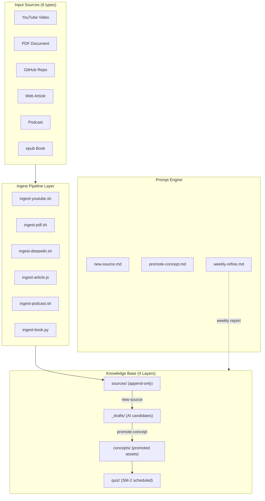
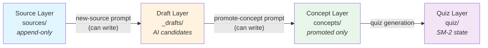
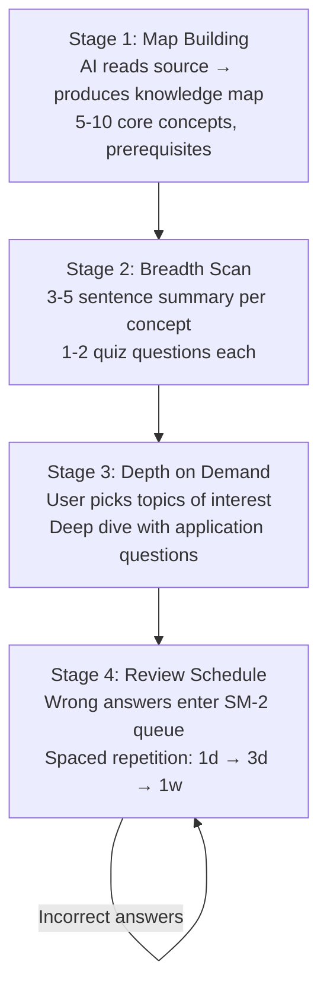
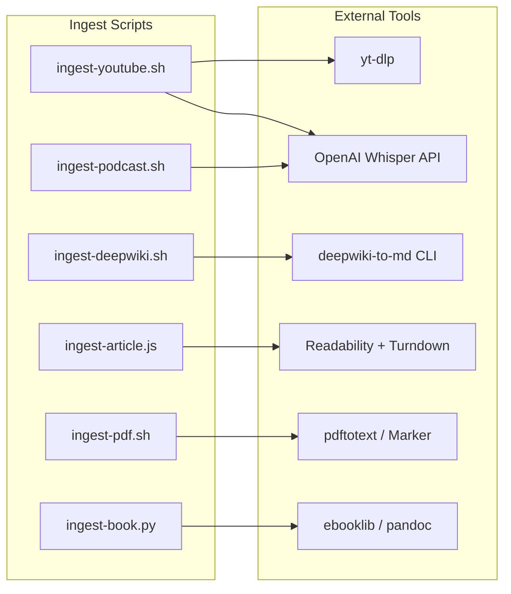

# Architecture: Exobrain Knowledge Base System

## System Architecture

Exobrain follows a **pipeline architecture** with strict layer separation. External learning materials flow through an ingest pipeline, get refined by AI agents, and become quizzable knowledge assets.

### High-Level Architecture

## Design Decisions

| Decision | Choice | Rationale |
|----------|--------|-----------|
| Speech-to-text | OpenAI Whisper API only | No local GPU dependency; $0.006/min cost |
| Version control | Git + GitHub Free | Only refined text tracked; large files excluded via .gitignore |
| Script languages | Bash + Python + Node.js | Bash for pipeline orchestration, Python for complex logic, Node.js for HTML conversion |
| Data format | Markdown + YAML + JSON | Git-friendly, AI-readable, exportable to Obsidian/Logseq |
| Concept management | Draft-then-promote | User retains final review authority; AI never writes directly to concepts/ |

## Layer Separation

The system enforces four strict layers with controlled write access:

**Write access constraints:**
- `new-source` → writes to `sources/` and `_drafts/` only
- `promote-concept` → writes to `concepts/`, `quiz/`, `_index/`
- `weekly-refine` → writes to `_inbox/` (reports), `quiz/`, `_index/`; **cannot modify `concepts/`**

## Four-Stage Learning Flow

Every new topic follows this progression:

## External Service Integration

