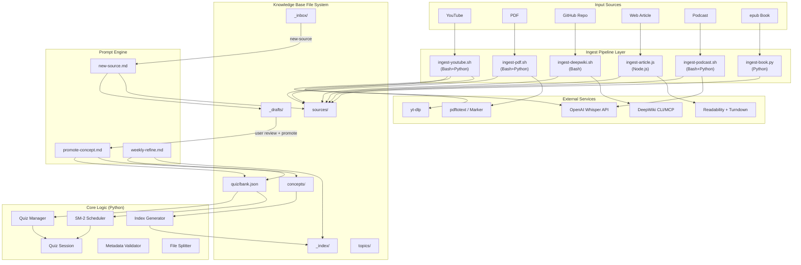
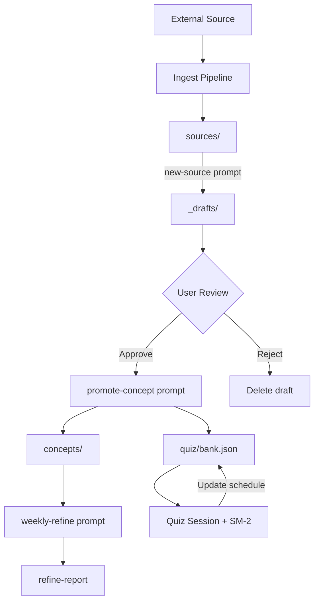
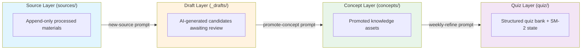

# Codebase Information: Exobrain (study-vault)

## Project Status

**Phase: Design / Pre-implementation**
No implementation code exists yet. The repository contains specification documents only.

## Project Description

Exobrain is a personal knowledge base system that ingests learning materials from multiple sources (YouTube, PDF, GitHub repos, web articles, podcasts, epub books), converts them to unified Markdown format, and uses AI Agents to continuously refine the content into reviewable, quizzable personal knowledge assets.

Core flow: **Multiple sources → Ingest Pipeline → Unified Markdown → AI Agent refine → Reviewable & quizzable assets**

## Language

All specification documents are written in **Traditional Chinese (zh-TW)**.

## Technology Stack

| Layer | Technology | Purpose |
|-------|-----------|---------|
| Pipeline orchestration | Bash | Simple ingest pipeline scripts |
| Core logic | Python | Whisper API, SM-2 scheduling, quiz management, metadata validation, PDF conversion |
| Web content | Node.js | HTML → Markdown conversion (Readability + Turndown) |
| Data format | Markdown + YAML frontmatter + JSON | Git-friendly, AI-readable, exportable to Obsidian/Logseq |
| Speech-to-text | OpenAI Whisper API | Audio/video transcription ($0.006/min) |
| Video tools | yt-dlp | Subtitle/audio download |
| PDF tools | pdftotext / Marker | PDF to text conversion |
| Repo knowledge | DeepWiki (deepwiki-to-md CLI) | GitHub repo wiki generation |
| Version control | Git + GitHub Free | Only refined text files tracked |

## File Inventory

| File | Purpose |
|------|---------|
| `personal-knowledge-base-design-v2.md` | Original design spec v2 (standalone, comprehensive) |
| `.kiro/specs/personal-knowledge-base/requirements.md` | Formal requirements (22 requirements with acceptance criteria) |
| `.kiro/specs/personal-knowledge-base/design.md` | Detailed design document (architecture, components, interfaces, data models) |
| `.kiro/specs/personal-knowledge-base/tasks.md` | Implementation plan (11 task groups with sub-tasks) |
| `.gitignore` | Excludes `.kiro`, `.claude`, `.codex`, `.copilot`, `.gemini` directories |

## Planned Directory Structure

```
my-kb/
├── _inbox/          # Staging area for new sources
├── _drafts/         # AI-generated draft concepts awaiting review
├── concepts/        # Promoted knowledge assets (by category)
├── sources/         # Processed source materials
│   ├── repos/       # GitHub repositories
│   ├── videos/      # YouTube videos
│   ├── books/       # epub books
│   ├── articles/    # Web articles
│   ├── podcasts/    # Podcast episodes
│   └── papers/      # Academic papers
├── quiz/            # Quiz bank (bank.json)
├── _index/          # Auto-generated indexes
├── topics/          # Cross-concept learning paths
└── _scripts/        # All automation scripts + prompts
    └── prompts/     # 3 core AI prompts
```

## Architecture Overview



## Data Flow



## Layer Separation Principle

The system enforces strict layer separation:



Key constraints:
- `new-source` prompt can only write to `sources/` and `_drafts/`, never directly to `concepts/`
- `weekly-refine` prompt cannot modify any files in `concepts/`
- All writes to `concepts/` must go through `promote-concept` prompt

## Planned Scripts

### Bash Scripts
- `init-kb.sh` — Initialize knowledge base directory skeleton
- `ingest-youtube.sh` — YouTube video ingestion (yt-dlp + Whisper fallback)
- `ingest-pdf.sh` — PDF document ingestion (pdftotext/Marker)
- `ingest-deepwiki.sh` — GitHub repo ingestion via DeepWiki
- `ingest-podcast.sh` — Podcast audio ingestion (Whisper API)

### Python Modules
- `whisper_transcribe.py` — OpenAI Whisper API wrapper + SRT→Markdown conversion
- `sm2_scheduler.py` — SM-2 spaced repetition algorithm
- `metadata_validator.py` — YAML/JSON schema validation
- `quiz_manager.py` — Quiz bank CRUD operations
- `quiz_session.py` — Stateless quiz session logic (no I/O)
- `quiz_cli.py` — Terminal-based quiz interface
- `file_splitter.py` — Markdown file splitting (≤1MB per chunk)
- `index_generator.py` — Auto-generate concept/topic/tag indexes

### Node.js
- `ingest-article.js` — Web article ingestion (Readability + Turndown)

### Prompt Files
- `_scripts/prompts/new-source.md` — Process new source → drafts
- `_scripts/prompts/promote-concept.md` — Draft → formal concept + quiz
- `_scripts/prompts/weekly-refine.md` — Weekly maintenance report

## Design Patterns

- **Draft-then-promote**: AI never writes directly to `concepts/`; all AI output goes to `_drafts/` first for human review
- **Stateless quiz logic**: `quiz_session.py` has no I/O, enabling reuse across CLI, Discord, Telegram
- **SM-2 spaced repetition**: Standard algorithm with ease_factor ≥ 1.3 floor
- **Bidirectional linking**: Concepts link to sources and vice versa via frontmatter fields
- **Feynman Technique**: Concept summaries written in plain language with examples
