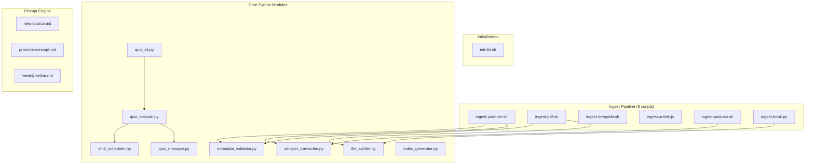

# Components: Exobrain Knowledge Base System

## Component Overview

## Initialization

### init-kb.sh
- **Purpose**: One-command setup of the entire knowledge base directory skeleton
- **Output**: All directories, README.md, example files (source, concept, quiz), index files, .gitignore
- **Interface**: `./init-kb.sh [target-dir]`

## Ingest Pipeline Scripts

Each script handles one source type, producing standardized output in `sources/`.

### ingest-youtube.sh (Bash + Python)
- **Input**: YouTube URL
- **Output**: `sources/videos/<slug>/` (meta.yaml, transcript.md, highlights.md)
- **Dependencies**: yt-dlp, whisper_transcribe.py
- **Flow**: Try CC subtitles → fallback to auto-generated → fallback to Whisper API transcription

### ingest-pdf.sh (Bash + Python)
- **Input**: PDF file path + source type (papers/books/articles)
- **Output**: `sources/<type>/<slug>/` (meta.yaml, notes.md)
- **Dependencies**: pdftotext or Marker, file_splitter.py
- **Note**: Splits output if >1MB

### ingest-deepwiki.sh (Bash)
- **Input**: GitHub repo URL or DeepWiki URL
- **Output**: `sources/repos/<slug>/` (meta.yaml, notes.md, deepwiki-snapshot/)
- **Dependencies**: deepwiki-to-md CLI
- **Error handling**: Prompts user if wiki not yet built; errors on private repos

### ingest-article.js (Node.js)
- **Input**: Web page URL
- **Output**: `sources/articles/<slug>/` (meta.yaml, notes.md)
- **Dependencies**: @mozilla/readability, turndown

### ingest-podcast.sh (Bash + Python)
- **Input**: Audio file path or URL
- **Output**: `sources/podcasts/<slug>/` (meta.yaml, transcript.md, highlights.md)
- **Dependencies**: whisper_transcribe.py

### ingest-book.py (Python)
- **Input**: epub file path
- **Output**: `sources/books/<slug>/` (meta.yaml, chapter-01.md, chapter-02.md, ...)
- **Dependencies**: ebooklib or pandoc

## Core Python Modules

### whisper_transcribe.py
- `transcribe(audio_path, language="auto")` → calls OpenAI Whisper API
- `srt_to_markdown(srt_path)` → converts SRT subtitles to clean Markdown
- Requires `OPENAI_API_KEY` environment variable

### sm2_scheduler.py
- `update_on_correct(question)` → interval_days *= ease_factor
- `update_on_incorrect(question)` → interval_days = 1, ease_factor = max(1.3, ease_factor - 0.2)
- `get_due_questions(bank_path, today)` → returns questions where next_review ≤ today
- `update_bank(bank_path, question_id, correct)` → persists schedule updates
- Default ease_factor: 2.5, minimum: 1.3

### metadata_validator.py
- `validate_source_meta(meta_path)` → validates source meta.yaml required fields
- `validate_concept_frontmatter(concept_path)` → validates concept YAML frontmatter
- `validate_quiz_entry(entry)` → validates quiz question required fields

### quiz_manager.py
- `add_questions(bank_path, questions)` → appends questions to bank.json
- `get_review_pack(bank_path, count=10, today=None)` → selects due questions, prioritizing earliest

### quiz_session.py (Stateless, no I/O)
- `start_session(bank_path, kb_root, count, concept_id, today)` → creates session with review materials
- `get_next_question(session_id)` → returns next question without answer
- `submit_answer(session_id, question_id, answer, self_eval)` → evaluates answer, updates SM-2
- `get_session_summary(session_id)` → returns session statistics
- All inputs/outputs are dict/JSON — designed for reuse by CLI, Discord, Telegram bots

### quiz_cli.py (CLI interface)
- Terminal-based interactive quiz runner
- CLI args: `--count`, `--concept`, `--bank`
- Calls quiz_session.py API for all logic

### file_splitter.py
- `split_markdown(content, max_bytes=1_000_000)` → splits at heading/paragraph boundaries
- Ensures no chunk exceeds 1MB for GitHub compatibility

### index_generator.py
- `generate_concepts_index(kb_root)` → scans concepts/ and _drafts/
- `generate_topics_index(kb_root)` → scans topics/
- `generate_tags_index(kb_root)` → aggregates tags from concept frontmatter

## Prompt Engine

### new-source.md
- **Trigger**: New source enters `_inbox/`
- **Writes to**: `sources/`, `_drafts/`, `_index/`
- **Cannot write to**: `concepts/`
- **Behavior**: Identifies 5-10 core concepts, cross-references existing concepts, marks merge candidates

### promote-concept.md
- **Trigger**: User approves a draft concept
- **Writes to**: `concepts/`, `quiz/bank.json`, `_index/`
- **Behavior**: Feynman-style summary, ≥1 example, depth=2 default, bidirectional links, ≥2 quiz questions

### weekly-refine.md
- **Trigger**: Manual or scheduled weekly run
- **Writes to**: `_inbox/` (report), `quiz/bank.json`, `_index/`
- **Cannot modify**: `concepts/`
- **Output**: Refine report with overdue concepts, contradictions, stale drafts, review quiz pack
