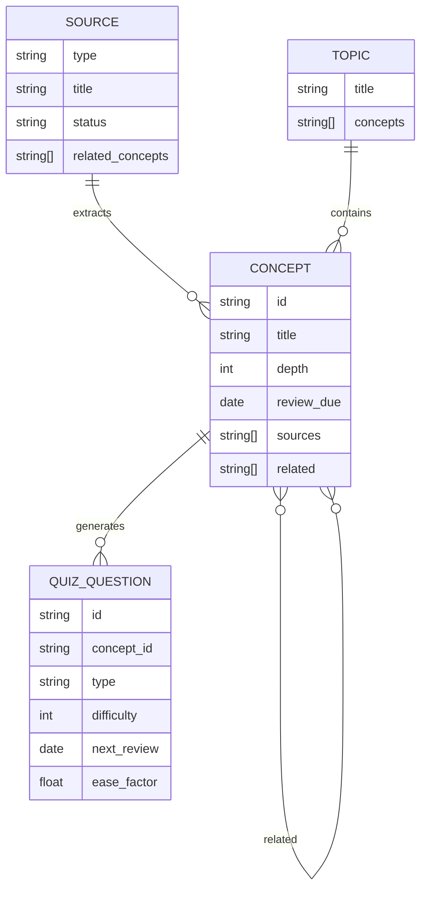

# Data Models: Exobrain Knowledge Base System

## Source meta.yaml

Every source directory contains a `meta.yaml` with this schema:

```yaml
type: video | repo | book | article | podcast | paper  # Required
title: string                                            # Required
url: string                                              # Optional (local files may lack URL)
authors: [string]                                        # Optional
language: string                                         # Required (e.g., "en", "zh-TW")
date_consumed: YYYY-MM-DD                                # Required
date_added: YYYY-MM-DD                                   # Required (auto-filled)
estimated_time: string                                   # Optional (e.g., "90min")
quality: 1-5                                             # Optional (user rating)
status: ingesting | processed | refined | archived       # Required
related_concepts: [string]                               # Optional (concept ID list)
tags: [string]                                           # Optional
```

## Concept Frontmatter

Every concept file starts with YAML frontmatter:

```yaml
---
id: string              # Required, unique (e.g., "cap-theorem")
title: string           # Required
depth: 1 | 2 | 3 | 4   # Required (1=surface, 2=can explain, 3=can apply, 4=can teach)
last_reviewed: YYYY-MM-DD  # Optional
review_due: YYYY-MM-DD     # Required (set to today + 3 days on promote)
sources: [string]          # Required (source path list)
related: [string]          # Optional (related concept IDs)
tags: [string]             # Optional
---
```

## Concept File Body Structure

```markdown
# {title}

- **一句話定義**：...
- **為什麼存在 / 解決什麼問題**：...
- **關鍵字**：...
- **相關概念**：[[concept-id-1]], [[concept-id-2]]
- **深度等級**：1/2/3/4
- **最後更新**：YYYY-MM-DD
- **來源**：...

## 摘要
（3-5 sentences）

## 範例
（Code or scenario）

## 我的疑問
（User-added questions for future deep dives）
```

## Draft Concept (_drafts/)

```yaml
---
id: string
title: string
source: string              # Source path
merge_candidate: string     # Optional — existing concept ID if duplicate detected
status: draft
created_at: YYYY-MM-DD
---
```

Body:
```markdown
- **一句話定義**：...
- **為什麼存在**：...
- **與既有概念的關聯**：...
```

## Quiz Bank (quiz/bank.json)

```json
{
  "questions": [
    {
      "id": "q-<concept-id>-<seq>",
      "concept_id": "string",
      "type": "multiple_choice | short_answer | application",
      "difficulty": 1-5,
      "question": "string",
      "options": ["string"],
      "answer": "string",
      "explanation": "string",
      "created_at": "YYYY-MM-DD",
      "last_attempted": "YYYY-MM-DD",
      "next_review": "YYYY-MM-DD",
      "interval_days": 1,
      "ease_factor": 2.5,
      "history": [
        { "date": "YYYY-MM-DD", "result": "correct | incorrect" }
      ]
    }
  ]
}
```

### SM-2 Schedule Fields
- `interval_days`: Days until next review (default: 1)
- `ease_factor`: Multiplier for interval on correct answer (default: 2.5, minimum: 1.3)
- `next_review`: Computed date for next review
- `history`: Append-only log of all attempts

## Topic File (topics/)

```yaml
---
title: string
---
```

```markdown
# {topic title}

## 涵蓋概念
1. [[concept-id-1]] - Description
2. [[concept-id-2]] - Description

## 建議學習順序
1. concept-id-1 (prerequisite)
2. concept-id-2 (core)
3. concept-id-3 (advanced)
```

## Index Files (_index/)

### concepts.md
```markdown
# 概念索引

## Active
- [cap-theorem](../concepts/distributed-systems/cap-theorem.md) - CAP Theorem [distributed-systems]

## Draft
- [new-concept](../_drafts/new-concept.md) - New concept [draft]
```

### topics.md
```markdown
# 主題索引
- [system-design-interview](../topics/system-design-interview.md) - Covers 5 concepts
```

### tags.md
```markdown
# 標籤索引

## distributed-systems
- [cap-theorem](../concepts/distributed-systems/cap-theorem.md)
```

## Entity Relationships


