# Dependencies: Exobrain Knowledge Base System

## External Tools (CLI)

| Tool | Used By | Purpose |
|------|---------|---------|
| yt-dlp | ingest-youtube.sh | Download YouTube subtitles and audio |
| pdftotext / Marker | ingest-pdf.sh | PDF to text extraction |
| deepwiki-to-md | ingest-deepwiki.sh | Download DeepWiki wiki content for GitHub repos |
| pandoc (alternative) | ingest-book.py | epub conversion fallback |

## Python Dependencies (requirements.txt)

| Package | Used By | Purpose |
|---------|---------|---------|
| openai | whisper_transcribe.py | Whisper API for speech-to-text |
| pyyaml | metadata_validator.py, ingest scripts | YAML parsing for meta.yaml and frontmatter |
| ebooklib | ingest-book.py | epub parsing and chapter extraction |
| hypothesis | Property-based tests | Random input generation for correctness properties |
| pytest | All tests | Test runner |

## Node.js Dependencies (package.json)

| Package | Used By | Purpose |
|---------|---------|---------|
| @mozilla/readability | ingest-article.js | Extract article content from HTML |
| turndown | ingest-article.js | Convert HTML to Markdown |
| fast-check | Property-based tests (JS) | Random input generation |
| vitest | JS tests | Test runner |

## External APIs

| Service | Used By | Cost | Auth |
|---------|---------|------|------|
| OpenAI Whisper API | whisper_transcribe.py | $0.006/min | `OPENAI_API_KEY` env var |

## MCP Integration

| Server | Config | Purpose |
|--------|--------|---------|
| DeepWiki MCP | `.mcp.json` | AI Agent real-time queries to DeepWiki for GitHub repos |

## Environment Variables

| Variable | Required By | Purpose |
|----------|------------|---------|
| `OPENAI_API_KEY` | whisper_transcribe.py | Authentication for Whisper API |

## Dependency Graph

```mermaid
graph TD
    subgraph Bash["Bash Scripts"]
        IY[ingest-youtube.sh]
        IP[ingest-pdf.sh]
        ID[ingest-deepwiki.sh]
        IPO[ingest-podcast.sh]
    end

    subgraph Python["Python Modules"]
        WT[whisper_transcribe.py]
        SM2[sm2_scheduler.py]
        MV[metadata_validator.py]
        QM[quiz_manager.py]
        QS[quiz_session.py]
        QC[quiz_cli.py]
        FS[file_splitter.py]
        IG[index_generator.py]
        IB[ingest-book.py]
    end

    subgraph Node["Node.js"]
        IA[ingest-article.js]
    end

    subgraph ExtTools["External Tools"]
        YTDLP[yt-dlp]
        PDFT[pdftotext/Marker]
        DWCLI[deepwiki-to-md]
    end

    subgraph ExtAPI["External APIs"]
        WHISPER[OpenAI Whisper API]
    end

    subgraph PyPkg["Python Packages"]
        OPENAI[openai]
        PYYAML[pyyaml]
        EBOOK[ebooklib]
    end

    subgraph NodePkg["Node.js Packages"]
        READ["@mozilla/readability"]
        TD[turndown]
    end

    IY --> YTDLP
    IY --> WT
    IP --> PDFT
    IP --> FS
    ID --> DWCLI
    IPO --> WT
    IB --> EBOOK

    WT --> OPENAI
    WT --> WHISPER
    MV --> PYYAML
    IA --> READ
    IA --> TD

    QC --> QS
    QS --> QM
    QS --> SM2
```

