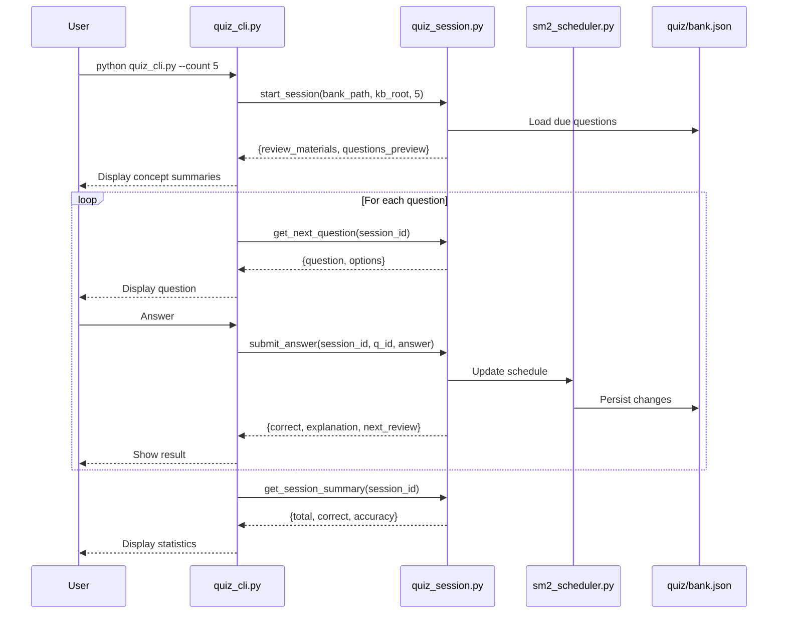

# Interfaces: Exobrain Knowledge Base System

## Script Interfaces

### init-kb.sh
```bash
./init-kb.sh [target-dir]
# Default: current directory
# Creates full KB skeleton with examples
```

### Ingest Pipeline Scripts
```bash
# YouTube video
./ingest-youtube.sh <youtube-url>

# PDF document
./ingest-pdf.sh <pdf-path> [type]
# type: papers | books | articles (default: papers)

# GitHub repo via DeepWiki
./ingest-deepwiki.sh <github-url-or-deepwiki-url>

# Web article
node ingest-article.js <web-url>

# Podcast
./ingest-podcast.sh <audio-path-or-url>

# epub book
python ingest-book.py <epub-path>
```

### Quiz CLI
```bash
python quiz_cli.py                          # Default: 10 due questions
python quiz_cli.py --count 5               # 5 questions
python quiz_cli.py --concept cap-theorem   # Specific concept
python quiz_cli.py --bank quiz/bank.json   # Custom bank path
```

## Python Module Interfaces

### whisper_transcribe.py
```python
def transcribe(audio_path: str, language: str = "auto") -> str:
    """Call OpenAI Whisper API. Requires OPENAI_API_KEY env var."""

def srt_to_markdown(srt_path: str) -> str:
    """Convert SRT subtitles to clean Markdown (removes timestamps, merges paragraphs)."""
```

### sm2_scheduler.py
```python
def update_on_correct(question: dict) -> dict:
    """Correct: interval_days *= ease_factor, ease_factor unchanged."""

def update_on_incorrect(question: dict) -> dict:
    """Incorrect: interval_days = 1, ease_factor = max(1.3, ease_factor - 0.2)."""

def get_due_questions(bank_path: str, today: str = None) -> list:
    """Return questions where next_review <= today."""

def update_bank(bank_path: str, question_id: str, correct: bool) -> None:
    """Persist SM-2 schedule update to bank.json."""
```

### metadata_validator.py
```python
def validate_source_meta(meta_path: str) -> list[str]:
    """Validate source meta.yaml. Returns list of error messages (empty = valid)."""

def validate_concept_frontmatter(concept_path: str) -> list[str]:
    """Validate concept YAML frontmatter. Returns list of error messages."""

def validate_quiz_entry(entry: dict) -> list[str]:
    """Validate single quiz question dict. Returns list of error messages."""
```

### quiz_manager.py
```python
def add_questions(bank_path: str, questions: list[dict]) -> None:
    """Append questions to bank.json."""

def get_review_pack(bank_path: str, count: int = 10, today: str = None) -> list:
    """Select due questions, prioritizing earliest next_review."""
```

### quiz_session.py (Stateless — no I/O)
```python
def start_session(bank_path: str, kb_root: str, count: int = 10,
                  concept_id: str = None, today: str = None) -> dict:
    """Create quiz session. Returns review_materials + questions_preview."""

def get_next_question(session_id: str) -> dict | None:
    """Next question without answer. Returns None when done."""

def submit_answer(session_id: str, question_id: str,
                  answer: str, self_eval: bool = None) -> dict:
    """Submit answer. MC auto-graded; SA/App requires self_eval."""

def get_session_summary(session_id: str) -> dict:
    """Session stats: total, correct, incorrect, accuracy, concepts_reviewed."""
```

### file_splitter.py
```python
def split_markdown(content: str, max_bytes: int = 1_000_000) -> list[str]:
    """Split Markdown at heading/paragraph boundaries. Each chunk ≤ max_bytes."""
```

### index_generator.py
```python
def generate_concepts_index(kb_root: str) -> str:
    """Scan concepts/ and _drafts/, produce concepts.md index content."""

def generate_topics_index(kb_root: str) -> str:
    """Scan topics/, produce topics.md index content."""

def generate_tags_index(kb_root: str) -> str:
    """Aggregate tags from concept frontmatter, produce tags.md index content."""
```

## Prompt Interfaces

Each prompt file defines inputs, outputs, and constraints for AI agent execution.

### new-source.md
- **Input**: `_inbox/` source content + basic metadata
- **Output**: `sources/<type>/<slug>/` structure + `_drafts/` candidates + `_index/` updates
- **Constraint**: Cannot write to `concepts/`

### promote-concept.md
- **Input**: `_drafts/<concept>.md` + corresponding source + existing `concepts/` structure
- **Output**: `concepts/<category>/<concept-id>.md` + `quiz/bank.json` entries + `_index/` updates
- **Constraint**: Feynman style, ≥1 example, depth=2 default, bidirectional links

### weekly-refine.md
- **Input**: Entire KB state + last execution timestamp
- **Output**: `_inbox/refine-report-<date>.md` + `quiz/bank.json` updates + `_index/` regeneration
- **Constraint**: Cannot modify `concepts/`

## Quiz Session Interaction Flow


