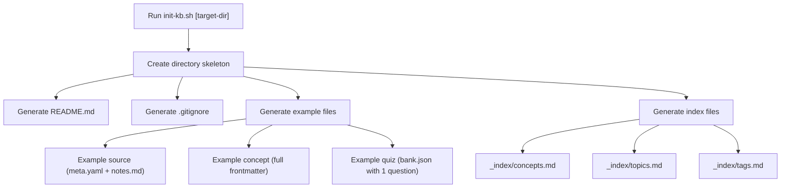
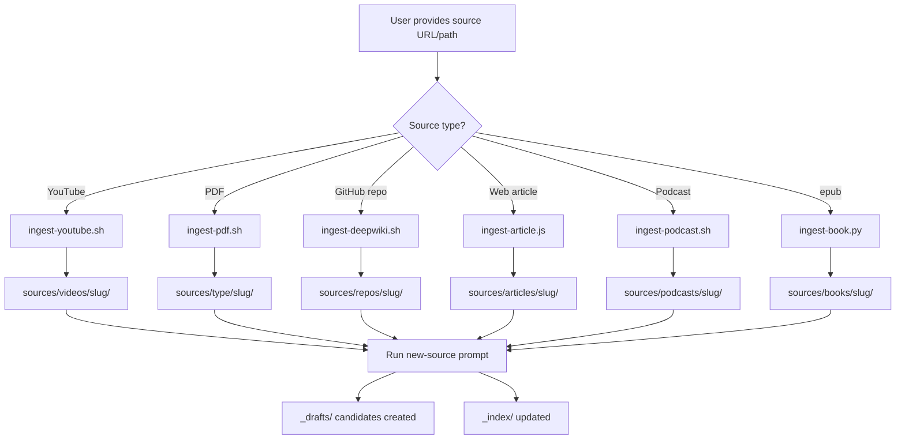
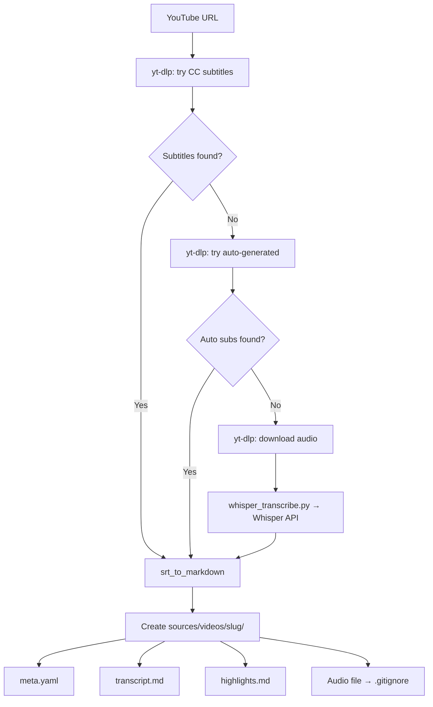
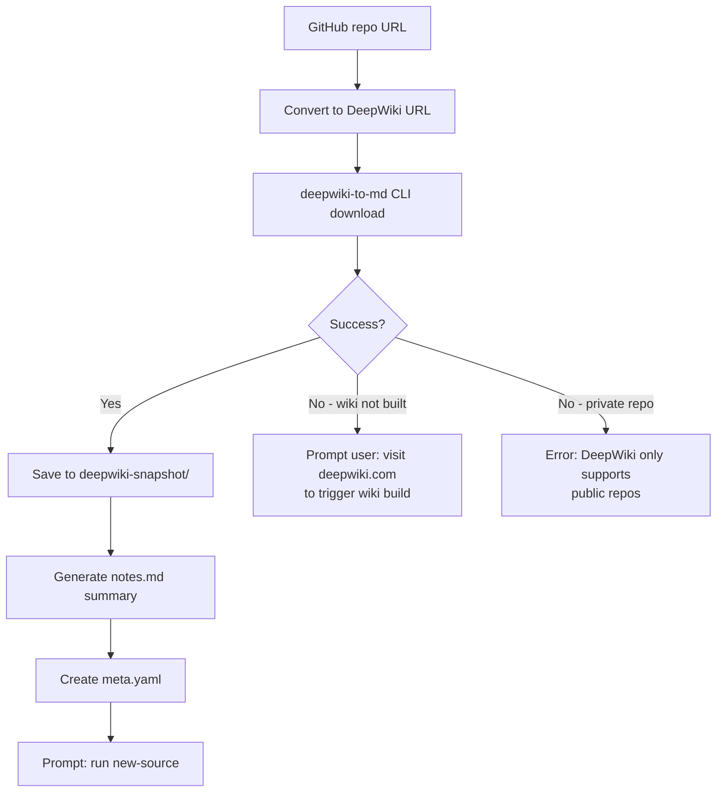
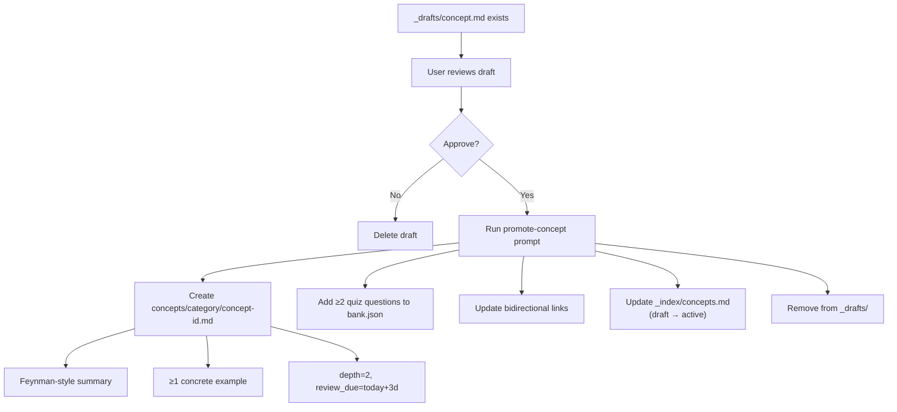
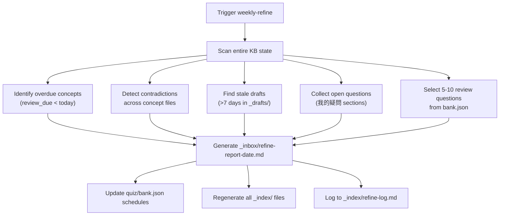
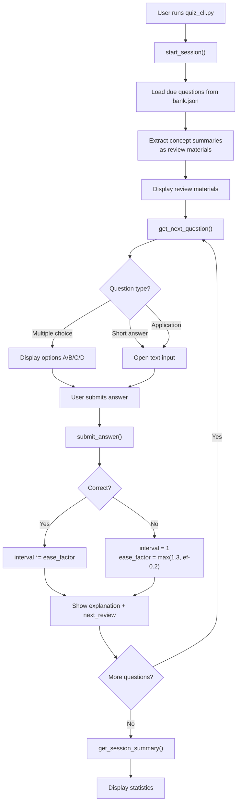
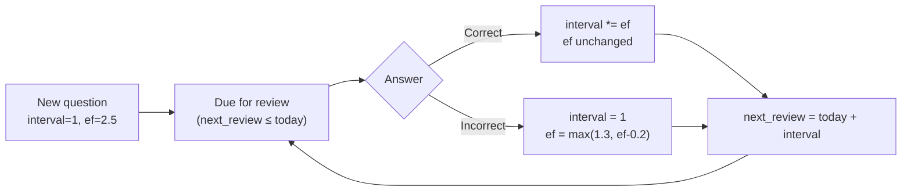

# Workflows: Exobrain Knowledge Base System

## 1. Knowledge Base Initialization

## 2. Source Ingestion (General Flow)

## 3. YouTube Ingestion (Detailed)

## 4. DeepWiki Ingestion (Detailed)

## 5. Draft-to-Concept Promotion

## 6. Weekly Refine

## 7. Quiz Session

## 8. SM-2 Spaced Repetition Cycle

