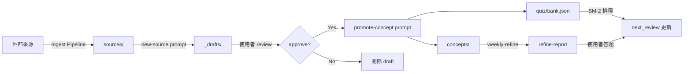

# 設計文件：個人知識庫系統（Exobrain）

## 概覽

本設計文件描述一套以 Markdown 為核心的個人知識庫系統（Exobrain），支援多種來源輸入（YouTube 影片、PDF、GitHub repo、網頁文章、Podcast、epub 書籍），透過三個核心 Prompt 驅動 AI Agent 持續 refine，將原始材料轉化為可搜尋、可複習、可考試的個人知識資產。

核心流程：**多種來源輸入 → Ingest Pipeline 統一轉 Markdown → AI Agent 持續 refine → 可複習可考試的個人資產**

### 設計決策

| 決策 | 選擇 | 理由 |
|------|------|------|
| 語音轉文字 | 僅 OpenAI Whisper API | 免本機 GPU 依賴，$0.006/分鐘成本可控 |
| 版本控制 | Git + GitHub Free | 僅追蹤 refined 的純文字檔，大型檔案透過 .gitignore 排除 |
| 腳本語言 | Bash + Python + Node.js | Bash 處理簡單 pipeline、Python 處理複雜邏輯（Whisper API、SM-2）、Node.js 處理 HTML 轉換 |
| 資料格式 | Markdown + YAML frontmatter + JSON | Git 友善、AI Agent 可讀寫、可匯出至 Obsidian/Logseq |
| 概念管理 | 先進 _drafts/ 再 promote | 避免 AI 自動寫壞知識庫，使用者保有最終審核權 |

### 技術棧

- **Bash scripts**：`ingest-youtube.sh`、`ingest-pdf.sh`、`ingest-deepwiki.sh` — 簡單的 ingest pipeline 編排
- **Python**：Whisper API 呼叫、PDF 轉換、SM-2 排程計算、quiz bank 管理、metadata 驗證
- **Node.js**：HTML → Markdown 轉換（Readability + Turndown）、網頁擷取
- **外部工具**：yt-dlp（字幕/音訊下載）、pdftotext/Marker（PDF 轉文字）、deepwiki-to-md CLI（DeepWiki 下載）

---

## 架構

### 系統架構圖

```mermaid
graph TB
    subgraph 輸入來源
        YT[YouTube 影片]
        PDF[PDF 文件]
        GH[GitHub Repo]
        WEB[網頁文章]
        POD[Podcast]
        EPUB[epub 書籍]
    end

    subgraph Ingest Pipeline Layer
        IY[ingest-youtube.sh<br/>Bash + Python]
        IP[ingest-pdf.sh<br/>Bash + Python]
        ID[ingest-deepwiki.sh<br/>Bash]
        IA[ingest-article.js<br/>Node.js]
        IPO[ingest-podcast.sh<br/>Bash + Python]
        IB[ingest-book.py<br/>Python]
    end

    subgraph 外部服務
        YTDLP[yt-dlp]
        WHISPER[OpenAI Whisper API]
        DW[DeepWiki CLI/MCP]
        PDFTOOL[pdftotext / Marker]
        RD[Readability + Turndown]
    end

    subgraph Knowledge Base 檔案系統
        INBOX[_inbox/]
        DRAFTS[_drafts/]
        SOURCES[sources/]
        CONCEPTS[concepts/]
        QUIZ[quiz/bank.json]
        INDEX[_index/]
        TOPICS[topics/]
    end

    subgraph Prompt Engine
        NS[new-source.md]
        PC[promote-concept.md]
        WR[weekly-refine.md]
    end

    subgraph 核心邏輯 Python
        SM2[SM-2 Scheduler]
        MV[Metadata Validator]
        QM[Quiz Manager]
        FS[File Splitter]
    end

    YT --> IY
    PDF --> IP
    GH --> ID
    WEB --> IA
    POD --> IPO
    EPUB --> IB

    IY --> YTDLP
    IY --> WHISPER
    IP --> PDFTOOL
    ID --> DW
    IA --> RD
    IPO --> WHISPER
    IB --> PDFTOOL

    IY --> SOURCES
    IP --> SOURCES
    ID --> SOURCES
    IA --> SOURCES
    IPO --> SOURCES
    IB --> SOURCES

    SOURCES --> NS
    NS --> DRAFTS
    NS --> INDEX
    DRAFTS --> PC
    PC --> CONCEPTS
    PC --> QUIZ
    PC --> INDEX

    WR --> INBOX
    WR --> QUIZ
    WR --> INDEX
    SM2 --> QUIZ
    MV --> SOURCES
    MV --> CONCEPTS
    QM --> QUIZ
    FS --> SOURCES
end
```

### 資料流程



### 層級分離原則

系統嚴格分為四層：

1. **來源層（sources/）**：原始材料的處理結果，只增不改
2. **草稿層（_drafts/）**：AI 產出的候選概念，等待使用者審核
3. **概念層（concepts/）**：正式的知識資產，只透過 promote-concept 寫入
4. **測驗層（quiz/）**：結構化題庫 + SM-2 排程狀態

關鍵約束：
- `new-source` prompt 只能寫入 `sources/` 和 `_drafts/`，不能直接寫入 `concepts/`
- `weekly-refine` prompt 不能修改 `concepts/` 中的任何檔案內容
- 所有寫入 `concepts/` 的操作必須經過 `promote-concept` prompt

---

## 元件與介面

### 1. 初始化腳本（init-kb.sh / init-kb.py）

負責建立完整的知識庫目錄骨架。

```
輸入：目標目錄路徑（預設為當前目錄）
輸出：完整目錄結構 + README.md + 範例檔案 + .gitignore + 索引檔
```

**介面**：
```bash
./init-kb.sh [target-dir]
```

**行為**：
- 建立所有必要目錄（_inbox/, _drafts/, concepts/, sources/ 含子目錄, quiz/, _index/, topics/, _scripts/prompts/）
- 產生 README.md（使用說明）
- 產生範例 source（含 meta.yaml + notes.md）
- 產生範例 concept（含完整 frontmatter）
- 產生範例 quiz（bank.json 含至少 1 題）
- 產生三個索引檔（concepts.md, topics.md, tags.md）
- 產生 .gitignore（排除音訊、影片、大型 PDF、cloned repo、>1MB 二進位檔）

### 2. Ingest Pipeline 腳本

#### 2.1 ingest-youtube.sh

```
輸入：YouTube URL
輸出：sources/videos/<slug>/（meta.yaml, transcript.md, highlights.md）
依賴：yt-dlp, Python (whisper_transcribe.py)
```

**流程**：
1. 使用 yt-dlp 嘗試下載字幕（優先人工 CC → 自動生成）
2. 若無字幕或品質不佳 → 下載音訊 → 呼叫 Whisper API
3. 將 SRT 轉為清理後的 Markdown transcript
4. 建立 meta.yaml（所有欄位完整）
5. 建立 highlights.md（空模板，待 new-source prompt 填充）
6. 確保音訊檔列入 .gitignore

#### 2.2 ingest-pdf.sh

```
輸入：PDF 檔案路徑, 來源類型（papers/books/articles，預設 papers）
輸出：sources/<type>/<slug>/（meta.yaml, notes.md）
依賴：pdftotext 或 Marker, Python (file_splitter.py)
```

**流程**：
1. 使用 pdftotext 或 Marker 將 PDF 轉為 Markdown
2. 若轉換後超過 1 MB → 呼叫 file_splitter.py 拆分
3. 建立 meta.yaml
4. 原始 PDF 列入 .gitignore

#### 2.3 ingest-deepwiki.sh

```
輸入：GitHub repo URL 或 DeepWiki URL
輸出：sources/repos/<slug>/（meta.yaml, notes.md, deepwiki-snapshot/）
依賴：deepwiki-to-md CLI
```

#### 2.4 ingest-article.js

```
輸入：網頁 URL
輸出：sources/articles/<slug>/（meta.yaml, notes.md）
依賴：@mozilla/readability, turndown
```

#### 2.5 ingest-podcast.sh

```
輸入：Podcast 音訊檔案路徑或 URL
輸出：sources/podcasts/<slug>/（meta.yaml, transcript.md, highlights.md）
依賴：Python (whisper_transcribe.py)
```

#### 2.6 ingest-book.py

```
輸入：epub 檔案路徑
輸出：sources/books/<slug>/（meta.yaml, chapter-01.md, chapter-02.md, ...）
依賴：ebooklib 或 pandoc
```

### 3. 核心 Python 模組

#### 3.1 whisper_transcribe.py

```python
# 介面
def transcribe(audio_path: str, language: str = "auto") -> str:
    """呼叫 OpenAI Whisper API 將音訊轉為文字"""

def srt_to_markdown(srt_path: str) -> str:
    """將 SRT 字幕轉為清理後的 Markdown"""
```

- 透過環境變數 `OPENAI_API_KEY` 取得 API key
- 失敗時記錄錯誤訊息並提示使用者
- 支援輸出 SRT 或 Markdown 格式

#### 3.2 sm2_scheduler.py

```python
# 介面
def update_on_correct(question: dict) -> dict:
    """答對：interval_days *= ease_factor，ease_factor 不變"""

def update_on_incorrect(question: dict) -> dict:
    """答錯：interval_days = 1，ease_factor = max(1.3, ease_factor - 0.2)"""

def get_due_questions(bank_path: str, today: str = None) -> list:
    """取得所有 next_review <= today 的題目"""

def update_bank(bank_path: str, question_id: str, correct: bool) -> None:
    """更新 bank.json 中指定題目的排程欄位"""
```

- 預設 ease_factor = 2.5
- 更新 next_review、interval_days、ease_factor、history 欄位

#### 3.3 metadata_validator.py

```python
# 介面
def validate_source_meta(meta_path: str) -> list[str]:
    """驗證 source meta.yaml 欄位完整性，回傳錯誤清單"""

def validate_concept_frontmatter(concept_path: str) -> list[str]:
    """驗證 concept frontmatter 欄位完整性，回傳錯誤清單"""

def validate_quiz_entry(entry: dict) -> list[str]:
    """驗證單一 quiz 題目欄位完整性，回傳錯誤清單"""
```

#### 3.4 quiz_manager.py

```python
# 介面
def add_questions(bank_path: str, questions: list[dict]) -> None:
    """新增題目到 bank.json"""

def get_review_pack(bank_path: str, count: int = 10, today: str = None) -> list:
    """取得本週複習題包，優先 next_review <= today"""
```

#### 3.5 file_splitter.py

```python
# 介面
def split_markdown(content: str, max_bytes: int = 1_000_000) -> list[str]:
    """將超過 max_bytes 的 Markdown 內容拆分為多個檔案"""
```

- 以段落或標題為邊界拆分，避免切斷句子
- 每個拆分檔案加上 part 編號

#### 3.6 index_generator.py

```python
# 介面
def generate_concepts_index(kb_root: str) -> str:
    """掃描 concepts/ 和 _drafts/，產生 concepts.md 索引"""

def generate_topics_index(kb_root: str) -> str:
    """掃描 topics/，產生 topics.md 索引"""

def generate_tags_index(kb_root: str) -> str:
    """掃描所有 concept frontmatter 的 tags，產生 tags.md 索引"""
```

### 4. Prompt Engine（三個核心 Prompt 檔案）

三個 Markdown 格式的 prompt 檔案，放在 `_scripts/prompts/`，供 AI Agent（如 Claude Code、Cursor）讀取並執行。

#### 4.1 new-source.md

- 輸入：_inbox/ 中的來源內容 + 基本 metadata
- 輸出：sources/<type>/<slug>/ 完整結構 + _drafts/ 候選概念 + _index 更新
- 約束：不能直接寫入 concepts/

#### 4.2 promote-concept.md

- 輸入：_drafts/<concept>.md + 對應來源 + 既有 concepts/ 結構
- 輸出：concepts/<category>/<concept-id>.md + quiz/bank.json 新題 + _index 更新
- 約束：Feynman 風格、至少 1 範例、depth=2 預設、反向連結

#### 4.3 weekly-refine.md

- 輸入：整個知識庫狀態 + 上次執行時間戳
- 輸出：_inbox/refine-report-<date>.md + quiz/bank.json 更新 + _index 重新產生
- 約束：不能修改 concepts/ 中的任何檔案

---

## 資料模型

### Source meta.yaml 結構

```yaml
type: video | repo | book | article | podcast | paper  # 必填
title: string                                            # 必填
url: string                                              # 選填（本機檔案可能無 URL）
authors: [string]                                        # 選填
language: string                                         # 必填（如 en, zh-TW）
date_consumed: YYYY-MM-DD                                # 必填
date_added: YYYY-MM-DD                                   # 必填（自動填入）
estimated_time: string                                   # 選填（如 "90min"）
quality: 1-5                                             # 選填（使用者評分）
status: ingesting | processed | refined | archived       # 必填
related_concepts: [string]                               # 選填（概念 ID 清單）
tags: [string]                                           # 選填
```

### Concept frontmatter 結構

```yaml
---
id: string              # 必填，唯一識別碼（如 cap-theorem）
title: string           # 必填
depth: 1 | 2 | 3 | 4   # 必填（1=表面, 2=能解釋, 3=能應用, 4=能教）
last_reviewed: YYYY-MM-DD  # 選填
review_due: YYYY-MM-DD     # 必填（promote 時設定為 today + 3 天）
sources: [string]          # 必填（來源路徑清單）
related: [string]          # 選填（相關概念 ID 清單）
tags: [string]             # 選填
---
```

### Concept 檔案內文結構

```markdown
# {title}

- **一句話定義**：...
- **為什麼存在 / 解決什麼問題**：...
- **關鍵字**：...
- **相關概念**：[[concept-id-1]], [[concept-id-2]]
- **深度等級**：1/2/3/4
- **最後更新**：YYYY-MM-DD
- **來源**：...

## 摘要
（3-5 句）

## 範例
（程式碼或場景）

## 我的疑問
（自己補，Agent 下次來深入）
```

### Quiz Bank JSON 結構（quiz/bank.json）

```json
{
  "questions": [
    {
      "id": "string",                    // 必填，格式 q-<concept-id>-<序號>
      "concept_id": "string",            // 必填，對應 concept id
      "type": "multiple_choice | short_answer | application",  // 必填
      "difficulty": 1-5,                 // 必填
      "question": "string",             // 必填
      "options": ["string"],            // 選填（僅 multiple_choice 需要）
      "answer": "string",              // 必填
      "explanation": "string",          // 必填
      "created_at": "YYYY-MM-DD",      // 必填
      "last_attempted": "YYYY-MM-DD",  // 選填
      "next_review": "YYYY-MM-DD",     // 必填
      "interval_days": "number",       // 必填，預設 1
      "ease_factor": "number",         // 必填，預設 2.5
      "history": [                     // 必填，初始為空陣列
        {
          "date": "YYYY-MM-DD",
          "result": "correct | incorrect"
        }
      ]
    }
  ]
}
```

### Draft 概念檔結構（_drafts/<concept>.md）

```yaml
---
id: string
title: string
source: string              # 來源路徑
merge_candidate: string     # 選填，若與既有概念重複則填入 existing concept id
status: draft
created_at: YYYY-MM-DD
---
```

```markdown
- **一句話定義**：...
- **為什麼存在**：...
- **與既有概念的關聯**：...
```

### 主題檔結構（topics/<topic>.md）

```markdown
---
title: string
---

# {topic title}

## 涵蓋概念
1. [[concept-id-1]] - 簡述
2. [[concept-id-2]] - 簡述

## 建議學習順序
1. concept-id-1（前置知識）
2. concept-id-2（核心）
3. concept-id-3（進階）
```

### 索引檔結構

**_index/concepts.md**：
```markdown
# 概念索引

## Active
- [cap-theorem](../concepts/distributed-systems/cap-theorem.md) - CAP Theorem [distributed-systems]

## Draft
- [new-concept](../_drafts/new-concept.md) - 新概念 [draft]
```

**_index/topics.md**：
```markdown
# 主題索引

- [system-design-interview](../topics/system-design-interview.md) - 涵蓋 5 個概念
```

**_index/tags.md**：
```markdown
# 標籤索引

## distributed-systems
- [cap-theorem](../concepts/distributed-systems/cap-theorem.md)
- [consistency-patterns](../concepts/distributed-systems/consistency-patterns.md)
```

### .gitignore 規則

```gitignore
# 音訊檔
*.mp3
*.wav
*.m4a
*.ogg
*.flac

# 影片檔
*.mp4
*.mkv
*.webm
*.avi

# 大型原始檔
*.pdf
*.epub

# Cloned repos
sources/repos/*/clone/

# 環境與暫存
.env
__pycache__/
node_modules/
*.pyc
```

### 目錄結構總覽

```
my-kb/
├── README.md
├── .gitignore
├── .mcp.json                        # DeepWiki MCP server 設定
├── _inbox/                          # 暫存區
├── _drafts/                         # AI 草稿，待 review
├── concepts/                        # 正式概念（按分類子目錄）
│   └── <category>/
│       └── <concept-id>.md
├── sources/                         # 來源處理結果
│   ├── repos/<slug>/
│   │   ├── meta.yaml
│   │   ├── notes.md
│   │   └── deepwiki-snapshot/
│   ├── videos/<slug>/
│   │   ├── meta.yaml
│   │   ├── transcript.md
│   │   └── highlights.md
│   ├── books/<slug>/
│   │   ├── meta.yaml
│   │   └── chapter-*.md
│   ├── articles/<slug>/
│   │   ├── meta.yaml
│   │   └── notes.md
│   ├── podcasts/<slug>/
│   │   ├── meta.yaml
│   │   ├── transcript.md
│   │   └── highlights.md
│   └── papers/<slug>/
│       ├── meta.yaml
│       └── notes.md
├── quiz/
│   └── bank.json
├── _index/
│   ├── concepts.md
│   ├── topics.md
│   ├── tags.md
│   └── refine-log.md
├── topics/
│   └── <topic>.md
└── _scripts/
    ├── init-kb.sh
    ├── ingest-youtube.sh
    ├── ingest-pdf.sh
    ├── ingest-deepwiki.sh
    ├── ingest-article.js
    ├── ingest-podcast.sh
    ├── ingest-book.py
    ├── whisper_transcribe.py
    ├── sm2_scheduler.py
    ├── metadata_validator.py
    ├── quiz_manager.py
    ├── file_splitter.py
    ├── index_generator.py
    └── prompts/
        ├── new-source.md
        ├── promote-concept.md
        └── weekly-refine.md
```

---

## 正確性屬性（Correctness Properties）

*正確性屬性是一種在系統所有合法執行中都應成立的特徵或行為——本質上是對系統應做之事的形式化陳述。屬性是人類可讀規格與機器可驗證正確性保證之間的橋樑。*

### Property 1：檔案拆分大小不變量

*For any* Markdown 內容字串，若其大小超過 1 MB，經 `file_splitter.split_markdown()` 拆分後，每個產出的片段大小都應 ≤ 1 MB，且所有片段串接後的文字內容應與原始內容一致（不遺失任何文字）。

**Validates: Requirements 2.4, 4.4**

### Property 2：SRT 轉 Markdown 內容保留

*For any* 合法的 SRT 字幕內容（含編號、時間戳、文字），經 `srt_to_markdown()` 轉換後，原始 SRT 中的所有文字段落都應出現在產出的 Markdown 中（時間戳格式可移除，但文字內容不可遺失）。

**Validates: Requirements 3.2**

### Property 3：Metadata Schema 驗證

*For any* 隨機產生的 source meta.yaml（含所有必填欄位：type、title、language、date_consumed、date_added、status），`validate_source_meta()` 應回傳空的錯誤清單。*For any* 缺少任一必填欄位的 meta.yaml，驗證應回傳包含該欄位名稱的錯誤。同理適用於 concept frontmatter（必填：id、title、depth、review_due、sources）與 quiz entry（必填：id、concept_id、type、difficulty、question、answer、explanation、created_at、next_review、interval_days、ease_factor、history）。

**Validates: Requirements 3.5, 9.1, 9.2, 9.3, 9.4, 14.1, 14.2**

### Property 4：非 promote 操作不修改 concepts/

*For any* 知識庫狀態，執行 `new-source` 或 `weekly-refine` prompt 後，`concepts/` 目錄中所有檔案的內容與數量應與執行前完全一致。

**Validates: Requirements 10.6, 12.7**

### Property 5：雙向連結一致性

*For any* 概念 C 的 frontmatter 中 `sources` 欄位列出的來源路徑 S，該來源的 `meta.yaml` 中 `related_concepts` 欄位應包含 C 的 id。反之亦然：*for any* 來源 S 的 `related_concepts` 中列出的概念 id C，該概念的 `sources` 欄位應包含 S 的路徑。同理，*for any* 概念 A 的 `related` 欄位中列出的概念 B，概念 B 的 `related` 欄位也應包含概念 A。

**Validates: Requirements 11.6, 21.2, 21.3, 21.4**

### Property 6：過期概念偵測準確性

*For any* 概念集合（每個概念有不同的 `review_due` 日期）與給定的今日日期，過期概念偵測函式應回傳恰好那些 `review_due < today` 的概念，不多不少。

**Validates: Requirements 12.2, 14.3**

### Property 7：過期草稿偵測準確性

*For any* 草稿集合（每個草稿有不同的 `created_at` 日期）與給定的今日日期，過期草稿偵測函式應回傳恰好那些 `created_at + 7 天 < today` 的草稿，不多不少。

**Validates: Requirements 12.4**

### Property 8：複習題包優先排序與數量

*For any* quiz bank（含多題不同 `next_review` 日期的題目），`get_review_pack()` 回傳的題目數量應在 5-10 之間（若可用題目不足 5 題則回傳全部），且回傳的題目應優先包含 `next_review <= today` 的題目。若有超過 10 題到期，應選取 `next_review` 最早的 10 題。

**Validates: Requirements 12.6**

### Property 9：SM-2 排程計算正確性

*For any* 題目（具有任意正數 `interval_days` 與 `ease_factor >= 1.3`）：
- 答對時：新的 `interval_days` 應等於 `舊 interval_days * ease_factor`，`ease_factor` 不變
- 答錯時：新的 `interval_days` 應等於 1，新的 `ease_factor` 應等於 `max(1.3, 舊 ease_factor - 0.2)`
- 無論答對或答錯，`ease_factor` 永遠 >= 1.3（下限不變量）
- 每次更新後，`history` 陣列應新增一筆記錄

**Validates: Requirements 13.1, 13.2, 13.3, 13.4, 15.4**

### Property 10：Git 安全檔案約束

*For any* 知識庫中被 Git 追蹤的檔案，其副檔名應為純文字格式之一（.md、.yaml、.yml、.json、.sh、.py、.js），且單一 Markdown 檔案大小不超過 1 MB。

**Validates: Requirements 2.1, 2.3**

### Property 11：主題檔結構驗證

*For any* 主題檔案，其內容應包含：主題名稱（title in frontmatter）、涵蓋的概念清單（含連結至 concepts/）、建議學習順序。

**Validates: Requirements 20.2**

### Property 12：「我的疑問」擷取完整性

*For any* 概念檔集合，若某概念檔的「我的疑問」段落包含非空內容，則 weekly-refine 報告的疑問彙整段落中應包含該概念的疑問內容。

**Validates: Requirements 12.5**

---

## 錯誤處理

### Ingest Pipeline 錯誤處理

| 錯誤情境 | 處理方式 |
|----------|----------|
| yt-dlp 無法下載字幕 | 自動 fallback 到下載音訊 + Whisper API |
| yt-dlp 無法下載音訊 | 記錄錯誤，提示使用者檢查 URL 是否有效 |
| OpenAI Whisper API 呼叫失敗 | 記錄錯誤訊息（含 HTTP status），提示檢查 OPENAI_API_KEY 或網路連線 |
| OPENAI_API_KEY 未設定 | 腳本啟動時即檢查，未設定則立即報錯退出 |
| PDF 轉換失敗（檔案損壞） | 記錄錯誤，提示使用者檢查 PDF 檔案完整性 |
| pdftotext/Marker 未安裝 | 腳本啟動時檢查依賴，未安裝則提示安裝指令 |
| DeepWiki CLI 未安裝 | 提示 `pip install deepwiki-to-md` |
| DeepWiki 無法存取（repo 為 private） | 記錄錯誤，提示 DeepWiki 僅支援 public repo |
| epub 解析失敗 | 記錄錯誤，提示檢查 epub 檔案格式 |
| 網頁擷取失敗（403/404） | 記錄 HTTP 狀態碼，提示使用者檢查 URL |
| 檔案拆分後仍有片段 > 1 MB | 以更小的邊界重新拆分（段落 → 句子） |

### Metadata 驗證錯誤

| 錯誤情境 | 處理方式 |
|----------|----------|
| meta.yaml 缺少必填欄位 | 列出缺少的欄位名稱，不中斷流程但在報告中標記 |
| depth 值不在 1-4 範圍 | 記錄警告，預設為 2 |
| date 格式不正確 | 記錄警告，嘗試解析或標記為需手動修正 |
| concept id 重複 | 在 _drafts/ 中標記 merge_candidate |
| quiz bank JSON 格式錯誤 | 記錄錯誤，嘗試從備份恢復或提示手動修復 |

### SM-2 排程錯誤

| 錯誤情境 | 處理方式 |
|----------|----------|
| ease_factor < 1.3 | 強制設為 1.3（下限保護） |
| interval_days <= 0 | 強制設為 1 |
| history 欄位缺失 | 初始化為空陣列 |

### 通用錯誤處理原則

1. 所有腳本在執行前檢查必要依賴（外部工具、環境變數）
2. 錯誤訊息包含具體的修復建議（不只說「失敗」，要說「怎麼修」）
3. 不因單一來源處理失敗而中斷整個 pipeline
4. 所有寫入操作先寫入暫存位置，成功後再移至目標位置（避免半成品）
5. quiz/bank.json 寫入前先備份（`bank.json.bak`）

---

## 測試策略

### 測試方法

本系統採用雙軌測試策略：

1. **單元測試（Unit Tests）**：驗證特定範例、邊界條件、錯誤處理
2. **屬性測試（Property-Based Tests）**：驗證跨所有輸入的通用屬性

兩者互補：單元測試捕捉具體 bug，屬性測試驗證通用正確性。

### 測試框架選擇

| 語言 | 測試框架 | 屬性測試庫 |
|------|---------|-----------|
| Python | pytest | Hypothesis |
| Node.js | Jest / Vitest | fast-check |
| Bash | bats-core | N/A（Bash 腳本以整合測試為主） |

### 屬性測試配置

- 每個屬性測試最少執行 **100 次迭代**
- 每個屬性測試必須以註解標記對應的設計文件屬性
- 標記格式：**Feature: personal-knowledge-base, Property {number}: {property_text}**
- 每個正確性屬性由**單一**屬性測試實作

### 單元測試範圍

| 模組 | 測試重點 |
|------|---------|
| init-kb | 目錄結構完整性、範例檔案內容、.gitignore 內容 |
| ingest-youtube | yt-dlp 字幕 fallback 邏輯、SRT 清理、meta.yaml 產出 |
| ingest-pdf | PDF 轉換輸出、大檔拆分觸發 |
| ingest-article | HTML → Markdown 轉換品質 |
| whisper_transcribe | API 呼叫成功/失敗處理、SRT 格式輸出 |
| sm2_scheduler | 預設值、邊界值（ease_factor 下限）、history 記錄 |
| metadata_validator | 各種缺欄位組合、無效值 |
| quiz_manager | 新增題目、取得複習題包 |
| file_splitter | 空內容、剛好 1 MB、遠超 1 MB |
| index_generator | 空知識庫、有 draft + active 混合 |

### 屬性測試範圍

| Property | 測試模組 | 產生器策略 |
|----------|---------|-----------|
| Property 1（檔案拆分） | file_splitter | 產生隨機長度的 Markdown 字串（含標題、段落） |
| Property 2（SRT 轉換） | whisper_transcribe | 產生隨機 SRT 內容（隨機編號、時間戳、文字） |
| Property 3（Metadata 驗證） | metadata_validator | 產生隨機 meta.yaml / frontmatter / quiz entry，隨機移除欄位 |
| Property 5（雙向連結） | index_generator | 產生隨機的概念-來源圖結構 |
| Property 6（過期概念） | weekly-refine 邏輯 | 產生隨機日期的概念集合 |
| Property 7（過期草稿） | weekly-refine 邏輯 | 產生隨機日期的草稿集合 |
| Property 8（複習題包） | quiz_manager | 產生隨機 quiz bank（不同 next_review 日期） |
| Property 9（SM-2 排程） | sm2_scheduler | 產生隨機 interval_days（正數）和 ease_factor（>= 1.3） |
| Property 10（Git 安全） | 整合測試 | 掃描實際知識庫檔案 |
| Property 11（主題檔結構） | metadata_validator | 產生隨機主題檔內容 |
| Property 12（疑問擷取） | weekly-refine 邏輯 | 產生隨機概念檔（含/不含「我的疑問」段落） |

### 整合測試

Bash 腳本（ingest-youtube.sh、ingest-pdf.sh、ingest-deepwiki.sh）以整合測試為主，使用 bats-core 框架：

- 使用 mock/stub 替代外部服務（yt-dlp、Whisper API、DeepWiki CLI）
- 驗證完整 pipeline 的輸入→輸出正確性
- 驗證錯誤處理路徑（API 失敗、檔案不存在等）
