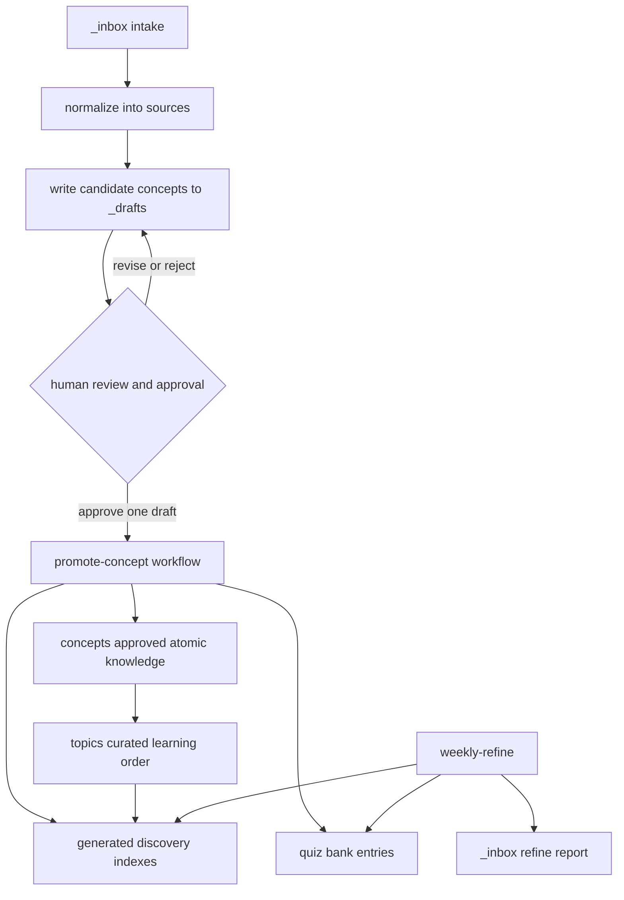

# Approved Knowledge and Write Boundaries

## The authority model

The repository deliberately separates **knowledge authority** from supporting workflow data. `concepts/` is the canonical layer for approved, atomic knowledge: a concept's frontmatter carries its stable identity and metadata, and its `related` entries are explicit relationships rather than relationships inferred from prose. `topics/` is the canonical layer for a **curated learning sequence** over concepts. Read a topic when deciding what to learn next; read a concept when learning the approved unit itself.

`_index/` is different: it is a derived discovery surface. Its files are regenerated from the directories they index and may be replaced wholesale, so use them to find records, then follow their links back to the canonical concept or topic. In particular, the concepts and tags generators also expose drafts; a draft's presence in an index is not approval.

| Layer | Reader meaning | Authority / safe handling |
| --- | --- | --- |
| `concepts/` | Approved atomic knowledge and explicit `related` graph | Authoritative content. Change only through the reviewed promotion workflow or a deliberately authorized canonical edit. |
| `topics/` | Curated learning paths and recommended order | Authoritative curriculum/navigation. Maintain it from approved concepts, not from candidate material. |
| `_index/` | Generated concept, topic, and tag discovery lists | Disposable derivative. Regenerate rather than curate it as a source of truth. |
| `_inbox/`, `sources/`, `_drafts/` | Intake, normalized evidence, and candidate concepts | Workflow inputs and review artifacts; never treat them as approved knowledge. |
| `quiz/` and excluded lab artifacts | Scheduling/assessment state, learner output, or private/generated material | Do not use them to establish knowledge authority or to reconstruct canonical content. |

The OpenWiki layer follows the same boundary. It is a derived orientation and navigation layer over approved concepts, topics, and eligible lab specifications; it neither replaces canonical files nor grants permission to modify `concepts/`, `topics/`, `quiz/`, or labs.

## Promotion is the approval gate

The safe path is draft-first, with a human decision between candidate creation and canonical mutation. Intake material is staged in `_inbox/`; the new-source process normalizes it under `sources/` and creates one to ten independently reviewable candidates in `_drafts/`. It may read existing concepts to detect overlap but must not modify `concepts/`, and it must not create quiz questions. A potential duplicate is marked with `merge_candidate` rather than silently becoming an additional approved concept.



This is the intended content lifecycle and write boundary: candidate material cannot become authoritative merely because it is normalized, indexed, or scheduled for review.

Promotion handles one user-approved draft at a time. It creates or updates the formal concept (or conservatively updates the existing `merge_candidate` when the user has not asked for a separate concept), adds required concept metadata, maintains backlinks for its explicit `related` relationships, creates at least two quiz entries, updates indexes as needed, and removes the draft **only after** the formal outputs and backlinks succeed. Thus a failed or incomplete promotion retains its candidate rather than losing review context.

> **Operational caveat:** the boundary is specified by the agent prompts, not enforced by a filesystem sandbox in `_scripts/pipeline.py`. The runner selects a configured agent, interpolates the prompt, runs it in `kb_root`, and treats a zero exit status as success. Reviewers must therefore keep the approval decision explicit and review the resulting diff; do not assume that executing the default pipeline itself proves that approval occurred.

The configured full pipeline runs `ingest`, `review`, `promote`, then `topics`; `lab` is manual-only and weekly refinement is separate. The configured review instruction asks for an APPROVE, REVISE, or REJECT assessment, while promotion is instructed to act on approved drafts. For a sensitive change, prefer the single-step invocation and inspect the review outcome before running promotion.

```bash
.venv/bin/python3 _scripts/pipeline.py sources/repos/my-repo --step promote
```

The command only dispatches the configured role; it does not add an authorization mechanism beyond the process and prompt contract.

## Generated indexes: regeneration, not governance

`_scripts/index_generator.py` is the owner of the basic index rendering behavior:

- `generate_concepts_index` scans `concepts/` as `active` and `_drafts/` as `draft`, sorts by title and id, and emits a table with links relative to the repository root.
- `generate_topics_index` scans Markdown under `topics/` and emits a linked list.
- `generate_tags_index` groups tags from both `concepts/` and `_drafts/` and emits linked entries.

Every generator overwrites its target under `_index/`. It tolerates missing input directories and produces an explicit empty-state entry instead. Frontmatter is optional for discovery: a display title falls back to an H1, then a filename-derived title; a malformed, absent, or non-mapping frontmatter block is treated as empty metadata. This makes discovery resilient, but it is precisely why an index cannot validate, approve, or supersede its source records.

Regenerate discovery after a canonical concept or topic change rather than repairing index links by hand. The focused tests exercise active-and-draft concept listing, topic listing, and tag grouping, including draft tags; they are useful regression checks for the distinction between catalog visibility and approval.

## Maintenance without silent canonical changes

`weekly-refine` is intentionally a maintenance and reporting workflow, not a promotion route. It reads concepts, drafts, sources, topics, quiz data, and existing indexes; it may write a dated refine report in `_inbox/`, update `quiz/bank.json`, regenerate indexes, and append `_index/refine-log.md`. It must not create, modify, delete, move, or directly promote content in `concepts/`. If it detects an inconsistency or a needed concept correction, the required output is a specific recommendation for human review, not an applied change.

That separation also limits what maintenance-derived data means. Quiz scheduling and answer history can support a review session, but they do not establish a new concept or rewrite an existing one. Likewise, stale drafts and source-to-concept comparison can identify work to review, never bypass the promotion gate.

## Scope exclusions and review checklist

`.openwikiignore` excludes `_drafts/`, `_inbox/`, `sources/`, and `quiz/`, as well as learner predictions, expected answers, usage logs, generated lab runs, review sites, and generated lab pages. For this wiki, those exclusions are an epistemic boundary: do not infer approved knowledge from any of them, even if a generated index or report references them. Private answer keys and learner output must remain out of documentation-based claims.

Before accepting a change to the knowledge base, verify:

1. **Authority:** Is the proposition being added or changed in `concepts/`, and are its `related` links intentionally maintained? If it changes learning order, is `topics/` updated deliberately?
2. **Gate:** Did a person approve the specific draft, including the resolution of any `merge_candidate`? Is the draft retained if promotion did not complete?
3. **Derived surfaces:** Were `_index/` files regenerated from canonical inputs rather than edited as a substitute for them? Do not confuse a listed draft with active knowledge.
4. **Writer scope:** Did new-source avoid `concepts/` and quiz creation? Did weekly refinement avoid canonical concept mutation? Did promotion touch only the selected draft and necessary related backlinks?
5. **Validation:** Run the narrow index tests after generator changes and the broader script suite when changing workflow contracts:

```bash
.venv/bin/python3 -m pytest _scripts/tests/test_index_generator.py -v
.venv/bin/python3 -m pytest _scripts/tests/ -v
```

## Related guides

- [Knowledge lifecycle](../workflows/knowledge-lifecycle.md) for the end-to-end learner-facing flow.
- [Review and retention](../workflows/review-and-retention.md) for review scheduling and retention practices.
- [Automation and validation](../operations/automation-and-validation.md) for script-level operation and checks.
- [Quickstart](../quickstart.md) for the shortest route into the repository.
