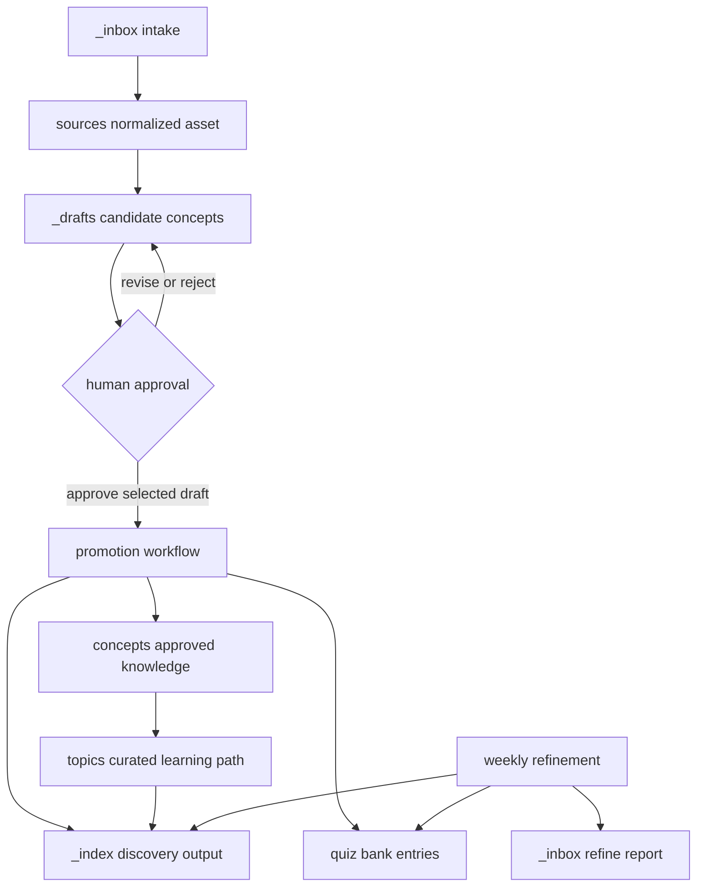

# Approved Knowledge and Write Boundaries

## Authority is separate from discovery and workflow state

`concepts/` and `topics/` are the canonical knowledge surfaces. A concept is the approved, atomic learning unit; its frontmatter supplies stable identity and explicit `related` relationships. A topic is a curated cross-concept learning path: use it for intended order and prerequisites, then open the linked concept for the approved explanation.

Everything else supports that canonical layer without becoming it. `_index/` is generated discovery output, not authority. The concept and tag indexes intentionally include `_drafts/`, so an index entry can mean either `active` or `draft`; follow its link and status instead of treating visibility as approval. Source assets, inbox material, and drafts are traceable inputs and review artifacts. `quiz/` is learner/assessment state, not a publication channel.

| Layer | Reader meaning | Authority and safe handling |
| --- | --- | --- |
| `concepts/` | Approved, atomic knowledge and explicit relationship graph | Canonical content. Change through a reviewed promotion or a deliberately authorized canonical edit. |
| `topics/` | Curated learning paths, order, and prerequisites | Canonical curriculum/navigation. Build paths from approved concepts, never from draft visibility. |
| `_index/` | Concept, topic, and tag discovery lists | Derived output. Regenerate; do not curate it as the source of truth. |
| `_inbox/`, `sources/`, `_drafts/` | Intake, normalized evidence, and candidate concepts | Inputs and review material, not approved knowledge. |
| `quiz/` | Questions, answer history, and review scheduling | Learner state. It may support review but cannot establish or revise a concept. |
| `labs/*/spec.md` | Recovery-capsule learning intent and acceptance criteria | A canonical lab specification where present; it is separate from concept/topic authority and does not authorize canonical knowledge edits. |

OpenWiki follows, rather than changes, this model. It is derived navigation over approved concepts, topics, and eligible lab specifications; it does not replace canonical files and does not authorize edits to concepts, topics, quiz data, or labs. Repository guidance normally says not to hand-edit generated OpenWiki pages unless explicitly asked. During the pilot, create or reconcile the wiki with the documented manual commands; automated OpenWiki updates are deliberately not configured.

## Draft first; promote only after a human decision

The intended route makes candidate creation and canonical mutation distinct. New material is staged in `_inbox/`. The `new-source` prompt normalizes it into `sources/`, writes one to ten independently reviewable candidates in `_drafts/`, and can update the discovery index. It may read `concepts/` to find overlap, but it may not change that directory or create quiz questions. A likely duplicate is marked `merge_candidate` rather than silently becoming a second approved concept.



*Candidate creation, review, and promotion are separate states; indexes and retention outputs may follow them but cannot make a candidate canonical.*

The promotion prompt is a per-draft contract: it requires a user-approved, selected `_drafts/<concept>.md`. It creates or updates the formal concept, or conservatively updates the existing `merge_candidate` when separate creation was not explicitly requested. A first promotion defaults to `depth: 2`, `lab_status: not-started`, and a review date three days later; it also requires a plain-language explanation, a concrete example, reciprocal `related` backlinks, and at least two quiz entries. It removes the selected draft only after the concept, quiz, indexes, and necessary backlinks are complete. If a required output cannot be completed, the draft remains so review context is not lost.

### The dispatcher is not the approval mechanism

`pipeline.py` loads configuration, substitutes `source_dir` and `kb_root` into the configured prompt, chooses the first agent for a role, and runs its command in `kb_root`. A normal invocation dispatches `ingest`, `review`, `promote`, then `topics`, stopping on missing configuration or a nonzero agent exit; `lab` is available only as an explicit step. The runner does not record a human decision, inspect the agent’s writes, or enforce prompt restrictions with a filesystem sandbox. Its success result means only that the agent process exited successfully.

This limitation is material because the bundled `pipeline.yml` review prompt requests `APPROVE`, `REVISE`, or `REJECT`, while its promotion template says to promote all approved drafts. That convenience must not override the stricter promotion prompt’s selected-draft and user-approval contract. Run review separately, inspect its verdict and the diff, make the approval explicit, and then promote only the intended candidate. Treat `pipeline.yml` as trusted execution configuration: commands are executed through a shell, and the bundled commands include permission-bypassing flags.

```bash
.venv/bin/python3 _scripts/pipeline.py --step review
.venv/bin/python3 _scripts/pipeline.py sources/repos/my-repo --step promote
```

Use `--dry-run` to inspect dispatch configuration before execution. The promotion command dispatches a role; it does not itself supply approval or a write boundary.

## Indexes are regenerated discovery output

`_scripts/index_generator.py` owns the basic rendering behavior:

- `generate_concepts_index` recursively scans `concepts/` as `active` and `_drafts/` as `draft`, sorting by display title and id.
- `generate_topics_index` recursively scans Markdown under `topics/`.
- `generate_tags_index` groups tags from both concepts and drafts.

Each function overwrites its target under `_index/` and creates the target directory when needed. Missing input directories produce an explicit empty state. Discovery is deliberately tolerant: frontmatter may be absent, malformed, or non-mapping, and a display title falls back from frontmatter to an H1 and then a filename-derived label. That resilience makes indexes useful for finding records, but it also means they cannot validate, approve, or supersede their inputs.

Regenerate affected indexes after changing a canonical concept or topic rather than repairing generated links by hand. The focused index tests cover active and draft concept listing, topic listing, and tag grouping, including draft tags—the regression boundary that prevents catalog visibility from being mistaken for approval.

```bash
.venv/bin/python3 - <<'PY'
from _scripts.index_generator import (
    generate_concepts_index,
    generate_tags_index,
    generate_topics_index,
)

root = "."
generate_concepts_index(root)
generate_topics_index(root)
generate_tags_index(root)
PY

.venv/bin/python3 -m pytest _scripts/tests/test_index_generator.py -v
```

## Maintenance may report or reschedule; it may not publish knowledge

`weekly-refine` reads concepts, drafts, sources, topics, quiz data, and indexes to identify overdue concepts, stale drafts, contradictions, questions, and possible missing concepts. Its allowed writes are a dated refine report in `_inbox/`, `quiz/bank.json`, the three discovery indexes, and an appended `_index/refine-log.md` record. It must not create, modify, delete, move, or directly promote `concepts/` material. A potential correction, merge, split, or addition therefore belongs in the report as a concrete recommendation for human review.

Quiz results and refinement observations are useful signals, not approved knowledge. The refinement prompt permits scheduling updates only for actual answer results and preserves existing history; simply scanning the bank is not a reason to reschedule unrelated questions. As with promotion, these boundaries are prompt contracts: inspect the diff because the runner does not enforce them.

## Scope and privacy boundary

`.openwikiignore` excludes drafts, inbox material, normalized sources, and `quiz/`. It also excludes learner predictions, expected answers, usage logs, generated lab runs, review sites, and generated lab pages. Do not infer approved knowledge from any excluded material, even when an index or report links to it. In particular, do not use private answer keys, learner output, quiz state, raw sources, or generated artifacts to reconstruct canonical content in OpenWiki.

The lab recovery capsules deliberately retain only `manifest.yaml` and `spec.md` in this repository; runnable workspaces, generated code, learner files, answer keys, and review HTML live outside it. A lab specification may guide practice, but OpenWiki navigation over that specification neither promotes a draft nor authorizes a change to canonical knowledge or the lab.

## Safe-change checklist

1. **Authority:** Put approved atomic content and its explicit graph in `concepts/`; put learning order in `topics/`. Do not elevate an index, draft, source, quiz record, or excluded artifact.
2. **Approval:** Confirm a person approved the particular reviewed draft and resolved any `merge_candidate` before promotion. Retain the draft when promotion is incomplete.
3. **Writer scope:** Ensure `new-source` did not mutate concepts or create quizzes; ensure refinement did not mutate/promote concepts; constrain promotion to the selected draft, necessary backlinks, quiz state, and indexes.
4. **Derived surfaces:** Regenerate `_index/` from its source trees and inspect its diff. A draft listed there remains a draft.
5. **Operations:** Treat agent configuration and commands as trusted; preview with `--dry-run`, then review the result because exit status is not governance.
6. **Privacy:** Keep excluded workflow material and private/generated lab artifacts out of OpenWiki claims and navigation.
7. **Validation:** Run narrow index tests for generator changes and broaden to the script suite only when the workflow contract changes:

```bash
.venv/bin/python3 -m pytest _scripts/tests/test_index_generator.py -v
.venv/bin/python3 -m pytest _scripts/tests/ -v
```

## Related guides

- [Knowledge lifecycle](../workflows/knowledge-lifecycle.md) for the end-to-end learner-facing flow.
- [Review and retention](../workflows/review-and-retention.md) for quiz and maintenance boundaries.
- [Automation and validation](../operations/automation-and-validation.md) for dispatcher behavior and focused checks.
- [Quickstart](../quickstart.md) for the shortest route into the repository.
