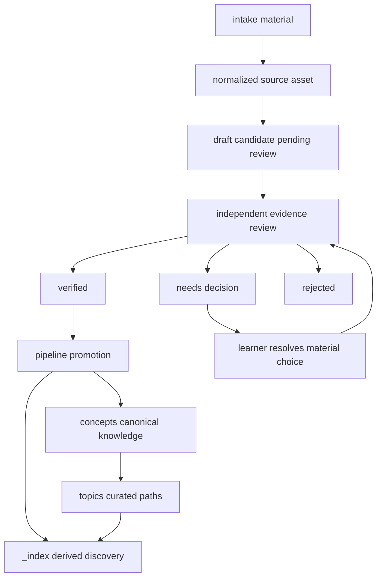

# Approved Knowledge and Write Boundaries

## Authority, discovery, and workflow state are different things

`concepts/` is the canonical store for approved, atomic knowledge and its explicit relationship graph. `topics/` is canonical too, but has a different job: it curates cross-concept learning paths, prerequisite order, and intended progression. Change either only through an authorized canonical change.

`_index/` is generated discovery output, not an authoring or approval surface. The concept index deliberately labels material gathered from `concepts/` as `active` and material gathered from `_drafts/` as `draft`; a listing is therefore a link to inspect, not proof of authority. Regenerate indexes from their inputs rather than repairing generated links by hand.

| Surface | Role | Governance rule |
| --- | --- | --- |
| `concepts/` | Approved, reusable knowledge | Canonical source for concept content and relationships. |
| `topics/` | Curated learning paths | Canonical source for order and prerequisites; build paths from approved concepts. |
| `_index/` | Concept, topic, and tag discovery | Derived output; draft visibility does not promote a draft. |
| Intake, source, draft, and quiz paths | Evidence, candidate, or learning workflow state | Useful to their workflow, but never an alternative publication route. |
| Lab recovery capsules | Canonical lab learning contracts | Separate from concept/topic authority and from runnable external workspaces. |

OpenWiki is also derived navigation. It may orient readers to approved concepts, topics, and eligible lab specifications, but it neither replaces the canonical files nor authorizes edits to concepts, topics, quiz data, or labs. During the pilot, refresh OpenWiki manually with the documented `--init` or `--update` command after canonical changes; no scheduled OpenWiki workflow is configured.

## Verified drafts can promote automatically; material exceptions go to the learner

Drafting and promotion are deliberately separate. The `new-source` role can normalize a source, create one to ten candidate files in `_drafts/`, and regenerate the concept index, but it must not modify `concepts/` or create quiz questions. A candidate that substantially overlaps an existing concept is marked with `merge_candidate` instead of silently becoming a second concept.

The independent reviewer is the approval gate for factual and reusable candidates. It reviews only drafts whose `source` matches the supplied source path, writes only those draft files, and persists exactly one `review_status` plus evidence and notes:

- **`verified`** means the claims are supported, the concept is reusable, and merge intent is clear. The pipeline may promote it automatically; the learner need not fact-check unfamiliar technical material.
- **`needs-decision`** means evidence leaves more than one materially different merge, scope, or learning-priority choice. The reviewer must state one concise question for the learner.
- **`rejected`** means the draft is unsupported, trivial, or a non-distinct duplicate. It stays as a reviewed record with its reason.



*Only independently verified drafts form the automatic pipeline route; material exceptions return to the learner instead of being guessed or auto-promoted.*

In a full run, `pipeline.py` executes ingestion and review, groups only drafts matching that source, and passes the exact `verified` paths to promotion. It does not invoke promotion or topics when the verified group is empty. Pending and `needs-decision` drafts are reported as exceptions, while rejected drafts are retained with their notes. Unknown review values are conservatively classified as `needs-decision`. The focused pipeline test verifies source scoping and this conservative grouping behavior.

Promotion has two modes. Pipeline mode must process only the exact supplied list, one draft at a time, and each must remain `review_status: verified`; it may not scan or promote other drafts. Manual mode accepts one explicitly selected draft, which is the documented manual override boundary. A verified `merge_candidate` with a clear reviewer rationale updates the existing concept while retaining its id; an unclear merge direction is changed back to `needs-decision` and not promoted.

## Promotion is the controlled canonical writer

For an eligible draft, `promote-concept.md` may create or update the formal concept, update the quiz bank and generated indexes, add only necessary backlinks to related concepts, and remove the selected draft after success. First promotion defaults to `depth: 2`, `lab_status: not-started`, and a review date three days ahead; it requires a plain-language explanation, a concrete example, valid related references, reciprocal backlinks, and at least two quiz entries. If any required output cannot be completed, the draft must remain and the blocker must be reported.

This gives a safe extension rule: add a new review status only when its pipeline treatment is defined in `REVIEW_STATUSES`, `reviewed_drafts`, the reviewer contract, and promotion policy. Otherwise the current grouping safely turns it into an exception rather than silently widening the automatic write path.

## The dispatcher enforces status selection, not every writer boundary

The default dispatcher roles are `ingest`, `review`, `promote`, and `topics`; `lab` is available only as an explicit step. In full-pipeline mode, promotion and topic generation are conditional on at least one verified draft, rather than an unconditional sequential authorization. Weekly refinement remains a separate workflow.

The runner loads YAML, expands environment-variable references in strings, selects the first configured agent for each role, interpolates the prompt, and runs the configured command with `shell=True` in `kb_root`. A nonzero process exit stops the relevant run; a zero exit says that the agent process completed, not that every file change obeyed a prompt. The runner does not provide a filesystem sandbox or inspect output diffs, so prompt-level scopes still require operational review.

The bundled promotion template reinforces the automated boundary by naming exact verified drafts rather than asking the role to discover candidates. Treat `pipeline.yml`, its commands, `kb_root`, and environment input as trusted execution configuration: the bundled commands include permission-bypassing flags. Use `--dry-run` to inspect selected agents and rendered prompts, and inspect the resulting diff before accepting a run.

```bash
.venv/bin/python3 _scripts/pipeline.py sources/repos/my-repo --dry-run
.venv/bin/python3 _scripts/pipeline.py sources/repos/my-repo
```

## Derived indexes tolerate imperfect input but cannot validate it

`generate_concepts_index` recursively scans `concepts/` and `_drafts/`; `generate_topics_index` scans `topics/`; and `generate_tags_index` groups tags from concepts and drafts. Each overwrites its target below `_index/` and creates its parent directory as needed. Missing trees produce an explicit empty state. Title display falls back from frontmatter to an H1 and then a filename-derived label, so indexes remain useful for discovery even with incomplete metadata.

That tolerance is specifically not validation or promotion. The focused index tests cover active and draft entries, topic listing, and tags contributed by both canonical concepts and drafts.

```bash
.venv/bin/python3 -m pytest _scripts/tests/test_pipeline.py -v
.venv/bin/python3 -m pytest _scripts/tests/test_index_generator.py -v
```

## Refinement, privacy, and lab boundaries

Weekly refinement is a maintenance workflow outside the source dispatcher. It reads the vault state—concepts, drafts, normalized sources, topics, quiz bank, generated indexes, and the last refine-log entry—and uses one `YYYY-MM-DD` current date for overdue checks, report naming, rescheduling, and its new log record. It may write only a dated `_inbox/refine-report-<YYYY-MM-DD>.md`, `quiz/bank.json`, the three discovery indexes, and an appended `_index/refine-log.md` entry.

Its report turns maintenance signals into a review queue: overdue concepts and one suggested review question each, stale drafts, possible inconsistencies, unresolved concept questions, a due-first weekly quiz pack, candidate concepts from sources, and a follow-up verification pack. It cannot create, change, move, delete, or promote a concept. A possible correction, merge, split, contradiction, or missing concept is instead a concrete recommendation for later independent review and promotion—not an automatic canonical edit. Insufficient evidence must be identified as needing more evidence; `needs-decision` is reserved for a materially different choice and carries one learner question.

Quiz maintenance is similarly bounded. The workflow may update only questions with actual answer results, preserving all existing history and leaving unrelated scheduling fields alone. For a result it initializes missing SM-2 defaults, appends the outcome, updates the attempt date and next-review date, and uses a one-day reset plus an ease-factor reduction (floor `1.3`) for an incorrect answer. A report-only run may check the bank format but must not reschedule questions merely because it scanned them. These are prompt-level restrictions, so review the diff; the dispatcher does not sandbox weekly-refinement writes.

The OpenWiki ignore policy excludes workflow and private material, including drafts, inbox and source material, quiz data, learner predictions and expected answers, usage logs, and generated lab artifacts. Do not use excluded material as an OpenWiki source or reconstruct it in wiki prose. The repository’s lab directories retain recovery metadata and a `spec.md` learning contract; runnable scaffolds, learner files, answer keys, generated code, runs, and review HTML remain outside the repository. A lab specification can guide practice but cannot authorize canonical knowledge changes.

## Safe-change checklist

1. Put approved explanations and relationships in `concepts/`, and learning order in `topics/`; never elevate a generated index or workflow record.
2. Let independently verified drafts promote through the scoped pipeline list. Send material merge, scope, contradiction, and priority choices to the learner as `needs-decision`.
3. Keep promotion scoped to the selected verified draft or explicit manual override, required backlinks, quiz additions, and regenerated indexes. Retain the draft if completion fails.
4. Treat prompt scopes as policy, not sandboxing. Preview trusted agent dispatches with `--dry-run` and inspect their diffs.
5. Regenerate `_index/` from source trees and run focused pipeline and index tests when changing this lifecycle.
6. Keep OpenWiki refresh manual during the pilot, and keep private/excluded workflow and generated lab material out of OpenWiki.

## Related guides

- [Knowledge lifecycle](../workflows/knowledge-lifecycle.md) for the end-to-end learner-facing route.
- [Review and retention](../workflows/review-and-retention.md) for quiz and maintenance boundaries.
- [Automation and validation](../operations/automation-and-validation.md) for dispatcher operation and focused checks.
- [Quickstart](../quickstart.md) for the shortest route into the repository.
