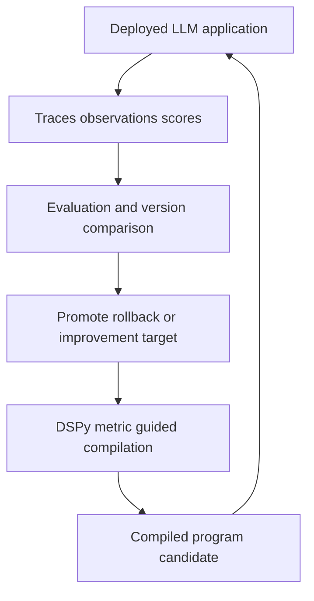

# LLM Engineering Domain Map

Production LLM engineering is a set of connected control loops, not a single framework. An application needs a way to make behavior visible and judge it, a runtime that can carry state and pause safely, a method for improving behavior, an interoperable tool boundary, and operational controls when an agent can affect real systems. The repository organizes those concerns into focused topic paths as well as the broader [Production LLM Engineering](../../topics/production-llm-engineering.md) path.

## Choose an entrypoint

| If you need to… | Start here | Continue when… |
| --- | --- | --- |
| Explain a bad, slow, or expensive LLM result and measure regressions | [LLM Observability](../../concepts/llm-engineering/llm-observability.md) | you need a full quality loop in [Production LLM Engineering](../../topics/production-llm-engineering.md) |
| Build a stateful, tool-using application with durable execution or review stops | [LangGraph Application Development](../../topics/langgraph-application-development.md) | you need a framework-agnostic deployment shape in [Production Agent Runtime](../../topics/production-agent-runtime.md) |
| Replace hand-tuned prompts with scored program improvement | [LLM Program Optimization with DSPy](../../topics/llm-program-optimization-dspy.md) | the compiled behavior must be observed in production |
| Implement an MCP client or server | [MCP Protocol Foundations](../../topics/mcp-protocol-foundations.md) | an integration needs regression protection in [MCP Record-Replay Testing](../../topics/mcp-record-replay-testing.md) |
| Operate an agent that can inspect releases and incidents in real environments | [AWS DevOps Agent Operations](../../topics/aws-devops-agent-operations.md) | protocol and runtime details are needed for a particular integration |

These paths overlap deliberately. The links below describe the handoffs so that a reader can choose an owner for each concern instead of duplicating a concept into every agent design.

## The production feedback loop

[LLM Observability](../../concepts/llm-engineering/llm-observability.md) is the measurement plane: it represents a request or workflow as a trace, its work as observations, and feedback or evaluation as scores. [Prompt Version Management](../../concepts/llm-engineering/prompt-version-management.md) and [LLM-as-Judge Evaluation](../../concepts/llm-engineering/llm-as-judge-evaluation.md) turn that record into an attributable change loop: compare scored traces by version, then decide whether to promote or roll back a behavior change.

DSPy occupies the development-time improvement plane. A [Signature](../../concepts/llm-engineering/dspy-signatures.md) declares a task contract; composed [Modules](../../concepts/llm-engineering/dspy-module-composition.md) make a multi-step program inspectable; and a metric guides compilation toward better instructions, demonstrations, or rules. The resulting compiled artifact is a candidate to deploy and observe—not evidence that production quality is permanently solved. [Actionable Side Information](../../concepts/llm-engineering/actionable-side-information.md), [Few-Shot Bootstrapping](../../concepts/llm-engineering/few-shot-bootstrapping.md), and the rest of the [DSPy path](../../topics/llm-program-optimization-dspy.md) refine that optimization workflow.

This is the repository's measurement-to-improvement loop: production telemetry informs evaluation and optimization, while deployed candidates create the next evidence.

### Boundary: measurement is not orchestration

Observability can describe a tool trajectory, a checkpointed run, or a human approval, but it does not define the agent's state transitions. Conversely, an optimized program or a correct graph run is not automatically observable: instrumentation and evaluation must be designed at the application boundary. For portable telemetry foundations—context propagation, semantic conventions, collectors, sampling, and GenAI spans—use the dedicated [Observability map](observability-map.md) and [OpenTelemetry Foundations](../../topics/opentelemetry-foundations.md).

## Stateful application and runtime route

LangGraph is appropriate when the workflow needs explicit state, routing, concurrency semantics, persistence, or reviewable pauses. Its `StateGraph` schema defines shared state; the Pregel runtime plans runnable nodes, executes a superstep concurrently, and makes writes visible together afterward. Reducers therefore matter where parallel branches update the same field. Checkpoints persist execution state for resume, history, replay, and forks; human-in-the-loop interrupts build on that persistence. A dynamic `interrupt()` resumes by re-executing its node from the beginning, so code around it needs idempotent side-effect handling.

The [LangGraph Application Development](../../topics/langgraph-application-development.md) path is the canonical route for those runtime mechanics: model and message primitives, tool contracts, state and routing, checkpointing, interrupts, cross-thread memory, and server deployment. Do not use it as the sole production-runtime guide. [Production Agent Runtime](../../topics/production-agent-runtime.md) owns the framework-independent deployment concerns: a selectively exposed tool surface, client gateways, durable sessions, context compression, scheduled work, retained skills, and varied tool availability for evaluation.

### Boundary: graph state, session state, and long-term knowledge

A LangGraph checkpoint is per-thread execution state, while its store is cross-thread persistent memory. A production agent may additionally restore client sessions and maintain learned operational knowledge. Treat these as different lifecycle and ownership choices; follow [LangGraph Store Long-Term Memory](../../concepts/llm-engineering/langgraph-store-long-term-memory.md), [Persistent Agent Session Restoration](../../concepts/llm-engineering/persistent-agent-session-restoration.md), and [Learned Operational Knowledge Files](../../concepts/llm-engineering/learned-operational-knowledge-files.md) rather than collapsing them into one “memory” feature.

## MCP: protocol first, then contract tests

MCP is an integration protocol, not the agent runtime. It uses a bidirectional JSON-RPC substrate; client and server begin with an `initialize` capability exchange, and normal requests begin after `notifications/initialized`. Transport is a separate deployment choice, while roots are advisory scope hints rather than an enforcement mechanism. Follow [MCP Protocol Foundations](../../topics/mcp-protocol-foundations.md) for the handshake, transport, roots, elicitation, OAuth discovery, schema maintenance, and extension negotiation.

After protocol behavior is known, use [MCP Record-Replay Testing](../../topics/mcp-record-replay-testing.md) to protect the boundary. A cassette captures a known-good session; replay gives deterministic offline client tests; verification sends recorded requests to a live server and compares responses while allowing only specified volatile differences. Scrubbing must remove secrets without breaking the identity needed for replay matching, and declarative scenarios plus pytest fixtures make the workflow repeatable in CI.

### Boundary: negotiated capability is not authorization

Capability negotiation says which optional protocol features a peer supports. It does not itself grant filesystem, account, or production-action permissions. Keep server and host enforcement separate from advisory roots, and route system-scoped access decisions to the agent-runtime and governance material below.

## Governed agent operations

A production operations agent combines the preceding layers with a safety and operations boundary. [Agent Space Access Boundary](../../concepts/llm-engineering/agent-space-access-boundary.md) scopes the accounts, integrations, identities, and permissions that the agent can use. Inside that boundary, topology context and retained operational knowledge turn raw alerts, deployments, logs, and metrics into release or incident context. The [AWS DevOps Agent Operations](../../topics/aws-devops-agent-operations.md) path then follows release blast-radius review and change-specific tests into autonomous investigation and prevention recommendations.

This is the operational loop: an alert or ticket can trigger evidence gathering and a mitigation proposal; investigation evidence can become a prevention recommendation; recurring lessons can become retained knowledge. Human approval remains a design decision for risky actions—use a runtime pause such as a LangGraph interrupt where the workflow requires it, and preserve the access boundary regardless of which entrypoint started the work.

[Protocol-Based Agent Access Surface](../../concepts/llm-engineering/protocol-based-agent-access-surface.md) joins these domains: MCP, A2A, ACP, webhooks, and EventBridge can expose the same operational capability to clients, alerts, event workflows, or other agents. A coherent scoped tool surface is required behind those interfaces; [Toolsets and MCP Unified Tool Surface](../../concepts/llm-engineering/toolsets-and-mcp-unified-tool-surface.md) is the canonical connection between native tools, MCP-provided tools, and configurable toolsets.

## How the maps relate

- Use [Observability map](observability-map.md) for the general telemetry architecture beneath LLM-specific tracing and evaluation.
- Use [System Design map](system-design-map.md) when LLM workloads raise broader questions about queues, durability, caching, databases, and distributed reliability.
- Use the [Lab catalog](../labs/catalog.md) to find hands-on practice rather than treating a topic path as an implementation recipe.
- Use the [Quickstart](../quickstart.md) to understand how approved concepts, topics, labs, and review fit into this knowledge base.

The practical ordering is: make behavior observable before trusting a quality claim; make state and tool access explicit before scaling an agent; test an external protocol at its boundary; and scope identity, permissions, approval, and entrypoints before allowing an agent to operate against production systems.
