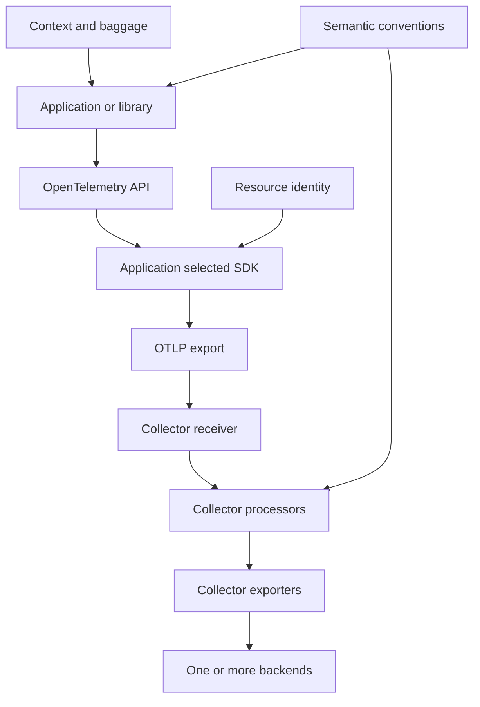

# Observability and Telemetry Domain Map

Observability in this repository is a chain of compatible responsibilities rather than a backend feature: applications describe work through portable APIs; context, resource identity, and semantic conventions make that evidence correlatable and interpretable; OTLP and the Collector move and govern it; domain conventions model GenAI work; and LLM observability applies the resulting records to cost, quality, and regression questions. The canonical learning sequence is [OpenTelemetry Foundations](../../topics/opentelemetry-foundations.md); this page is a cross-domain guide, not a replacement for its concepts.

## Choose an entrypoint

| If you need to… | Start here | Then follow |
| --- | --- | --- |
| Decide whether a question needs a trace, metric, log, or propagated metadata | [Telemetry Signal Model](../../concepts/observability/telemetry-signal-model.md) | [OpenTelemetry API-SDK Separation](../../concepts/observability/opentelemetry-api-sdk-separation.md), [Resource-Bound Telemetry Identity](../../concepts/observability/resource-bound-telemetry-identity.md), and [Context Propagation with Carriers](../../concepts/observability/context-propagation-with-carriers.md) |
| Instrument a library or service without selecting a telemetry vendor | [OpenTelemetry API-SDK Separation](../../concepts/observability/opentelemetry-api-sdk-separation.md) | [OTLP as a Vendor-Neutral Telemetry Protocol](../../concepts/observability/otlp-vendor-neutral-telemetry-protocol.md) and [Collector Pipeline Architecture](../../concepts/observability/collector-pipeline-architecture.md) |
| Make a query, dashboard, or cross-service alert survive different emitters | [Semantic Conventions as Telemetry Schema](../../concepts/observability/semantic-conventions-as-telemetry-schema.md) | the [semantic-convention evolution route](#semantic-convention-evolution) |
| Operate delivery, routing, redaction, or downstream resilience without rewriting every application | [OpenTelemetry Collector Pipeline Architecture](../../concepts/observability/collector-pipeline-architecture.md) | the [Collector operations route](#collector-operations-route) |
| Diagnose an LLM or agent workflow | [LLM Observability](../../concepts/llm-engineering/llm-observability.md) | the [GenAI and agent route](#genai-and-agent-route) |

## The handoff: instrumentation to operations

The application owns *describing* its request-local work: an API-created trace, metric, or log, its parent context, and domain-relevant attributes. The SDK is selected by the application and decides processing, sampling, and export; a missing SDK can leave API instrumentation as a no-op. Resource attributes identify the emitting deployment rather than the request, while propagation injects and extracts request context across a transport boundary. These distinctions prevent a trace from becoming disconnected and prevent request attributes from being mistaken for service identity.

*Application instrumentation creates portable evidence; the Collector is the configurable operational path that receives, processes, and exports it.*

OTLP standardizes the delivery encoding and transport, whereas semantic conventions standardize the meaning of fields. Therefore, a successful OTLP connection alone does not make telemetry portable to queries: producers and consumers also need a shared schema. The Collector boundary is where operators can independently change routing, transformations, authentication, batching, durability, and destinations. Keep business meaning and safe domain instrumentation in the application; put fleet-wide delivery policy and backend integration in Collector configuration.

### Invariants and common failure modes

- A distributed trace is only coherent when downstream services recover the upstream context before creating their work. Propagate sampling state with that context as well: independent sampling can retain misleading partial traces.
- Resource identity is producer-scoped and belongs with every signal; request or tenant details are request-scoped. Baggage can cross network and trust boundaries, so treat its contents as deliberately limited rather than as a free-form metadata channel.
- A Collector pipeline is signal-specific and routes receiver output through optional processors to one or more exporters. Fan-out, transformations, queues, retries, and backend failures are operational concerns; use the dedicated Collector concepts before changing those controls.

## Collector operations route

Start with [Collector Pipeline Architecture](../../concepts/observability/collector-pipeline-architecture.md) to understand the data path. Its adjacent concepts split responsibility instead of treating “the Collector” as one opaque process:

- **Build and lifecycle:** [Collector Component Factory and Lifecycle](../../concepts/observability/collector-component-factory-lifecycle.md), [Collector Configuration Providers and Resolution](../../concepts/observability/collector-configuration-providers.md), and [Custom Distributions with the OpenTelemetry Collector Builder](../../concepts/observability/opentelemetry-collector-builder-distributions.md).
- **Data-path correctness and policy:** [Collector pdata Ownership at Fan-Out](../../concepts/observability/collector-pdata-ownership-at-fanout.md), [Collector Connectors](../../concepts/observability/collector-connectors.md), [OTTL Declarative Telemetry Transformation](../../concepts/observability/ottl-declarative-telemetry-transformation.md), and [Collector Exporter Resilience](../../concepts/observability/collector-exporter-resilience.md).
- **Operational services and placement:** [Collector Extensions](../../concepts/observability/collector-extensions.md), [Collector Authentication Extensions](../../concepts/observability/collector-authentication-extensions.md), [Collector Storage Extensions](../../concepts/observability/collector-storage-extensions.md), [Kubernetes Collector Placement Modes](../../concepts/observability/kubernetes-collector-placement-modes.md), and [OpAMP-Supervised Collector Fleet Management](../../concepts/observability/opamp-supervised-collector-fleet-management.md).

This is the primary handoff from instrumentation to operations: applications should not need a code release when an operator changes a destination or applies centrally governed filtering. Conversely, Collector policy cannot reconstruct domain detail that was never instrumented, and it must not silently turn sensitive prompt or customer content into a fleet-wide export.

## Semantic-convention evolution

Semantic conventions are a shared schema for attribute, event, and metric meaning. They make generic dashboards possible while leaving room for application-specific fields. Do not confuse a convention’s **stability** with an attribute’s **requirement level**: stability describes the compatibility expectation of the definition; requirement level describes when an implementation should send a field.

The evolution route is [Semantic Convention Model as Source of Truth](../../concepts/observability/semantic-convention-model-as-source-of-truth.md) → [Semantic Attribute Registry Reuse](../../concepts/observability/semantic-attribute-registry-reuse.md) → [Telemetry Attribute Requirement Levels](../../concepts/observability/telemetry-attribute-requirement-levels.md) → [Semantic Convention Stability Lifecycle](../../concepts/observability/semantic-convention-stability-lifecycle.md). When names or metric definitions change, use [Telemetry Schema Migration Mappings](../../concepts/observability/telemetry-schema-migration-mappings.md) so producers, Collector transformations, storage, and dashboards can upgrade at different times. [Semantic Convention Validation and Generation](../../concepts/observability/semantic-convention-validation-and-generation.md) and [Domain-Owned Semantic Conventions](../../concepts/observability/domain-owned-semantic-conventions.md) cover how the contract is kept consistent and governed.

## GenAI and agent route

GenAI telemetry is not a separate transport stack. It uses the same trace context, resource identity, schema, OTLP, sampling, and Collector pipeline, then adds operation-level meaning. [GenAI Operation Span Taxonomy](../../concepts/observability/genai-operation-span-taxonomy.md) separates inference, embeddings, retrieval, memory, and tool execution so a trace can attribute latency, failure, or cost to the relevant step. [Agentic Workflow Span Hierarchy](../../concepts/observability/agentic-workflow-span-hierarchy.md) provides the causal nesting for workflow, agent, plan, and operation work; [MCP Client-Server Trace Correlation](../../concepts/observability/mcp-client-server-trace-correlation.md) carries that causal story across a JSON-RPC client/server boundary.

Streaming is a lifecycle boundary: [GenAI Streaming Telemetry Lifecycle](../../concepts/observability/genai-streaming-telemetry-lifecycle.md) keeps one inference span open from request through final chunk, retaining both time-to-first-output and final usage or completion facts. [Cross-Provider GenAI Telemetry Refinements](../../concepts/observability/cross-provider-genai-telemetry-refinements.md) keeps the shared `gen_ai.*` core for comparison while allowing genuine provider-specific additions.

[LLM Observability](../../concepts/llm-engineering/llm-observability.md) is the application-level destination for this route: it uses traces and step observations as the evidence on which quality scores, prompt comparisons, latency analysis, and cost analysis depend. Content capture is an explicit privacy and payload-size decision, not a prerequisite for useful operational telemetry. That page links onward to prompt versioning and evaluation; use [LLM Engineering Domain Map](llm-engineering-map.md) for the broader production feedback loop.

## Focused change checks

When changing telemetry design, test the boundary that could break the investigative story:

1. **Instrumentation:** verify a representative request creates the intended signal and domain spans, attaches resource identity, and remains safe if no SDK is configured.
2. **Distributed boundary:** verify inject/extract behavior on the real carrier; assert the receiving span joins the existing trace rather than starting a second one.
3. **Schema rollout:** validate required versus optional fields and run compatibility checks or mappings for old and new emitters before changing dashboards.
4. **Collector path:** send representative data through the configured signal pipeline and exercise redaction, fan-out, retry/queue behavior, and a temporarily unavailable exporter.
5. **GenAI lifecycle:** cover ordinary completion, first output, cancellation, provider failure, tool failure, and content-disabled operation; assert that final usage and status remain associated with the operation span.

## Related maps and practice

- [LLM Engineering Domain Map](llm-engineering-map.md) places LLM observability inside evaluation, runtime, protocol, and governed-agent loops.
- [System Design Map](system-design-map.md) is the next map for broader durability, queues, caching, and distributed-reliability decisions around telemetry-producing systems.
- [Lab Catalog](../labs/catalog.md) lists hands-on practice; [Quickstart](../quickstart.md) explains how approved concepts, topics, and labs fit this knowledge base.
