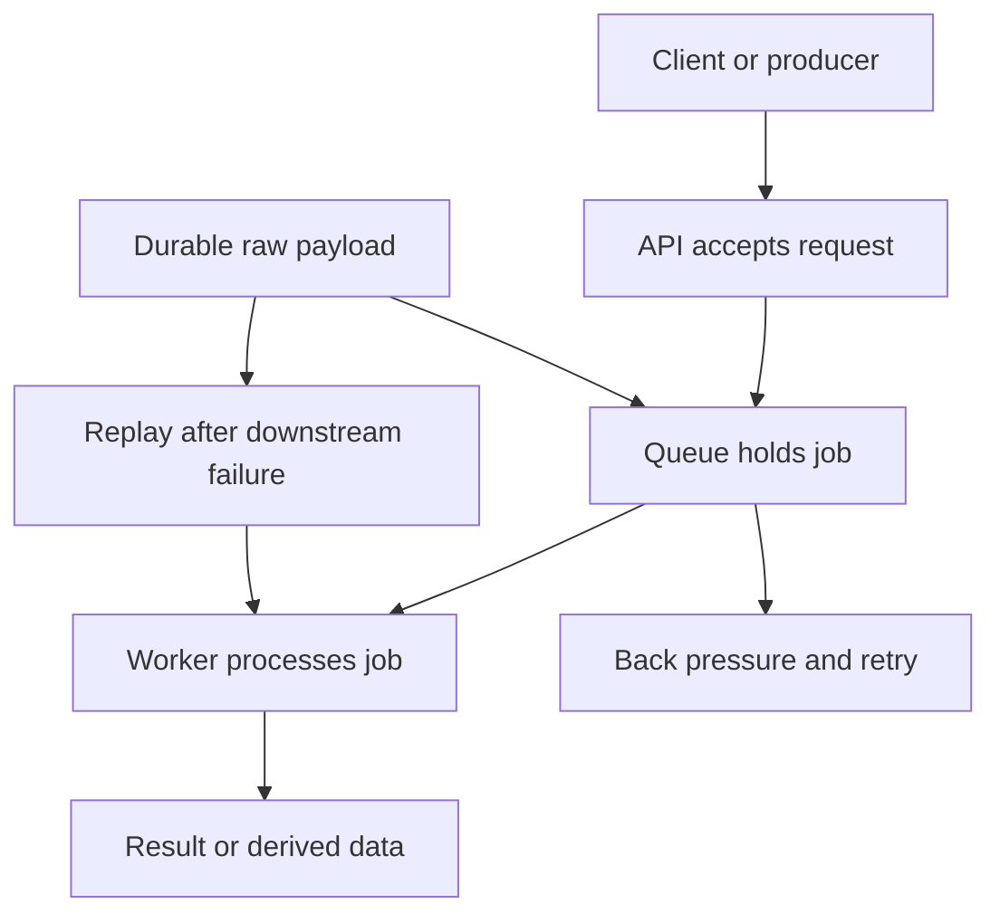
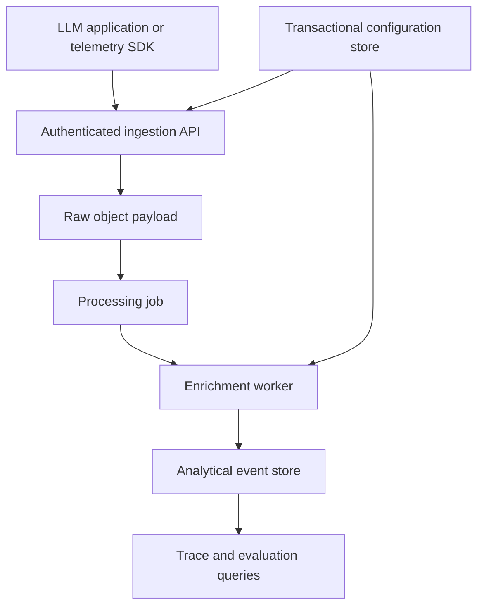

# System Design Foundations Map

System design here is a set of problem-specific choices, not a fixed target architecture. Start with the bottleneck or failure mode: capacity, hot reads, write/data size, a component that can fail, a partition, or work that cannot complete on the request path. The canonical broad sequence is [System Design Fundamentals](../../topics/system-design-fundamentals.md); [Web Scalability](../../topics/web-scalability.md) tells the growth story, while [Distributed Systems Foundations](../../topics/distributed-systems-foundations.md) provides the consistency and messaging reasoning.

## Choose an entrypoint

| If the immediate problem is… | Start with | Follow with |
| --- | --- | --- |
| One machine has reached its CPU, memory, or disk limit | [Vertical Scaling](../../concepts/system-design/vertical-scaling.md), then [Horizontal Scaling](../../concepts/system-design/horizontal-scaling.md) | [Load Balancing](../../concepts/system-design/load-balancing.md) and [Sticky Sessions](../../concepts/system-design/sticky-sessions.md) when requests can land on any instance |
| Reads overload the data store or need lower latency | [Caching Strategies](../../concepts/system-design/caching-strategies.md) | [Database Replication](../../concepts/system-design/database-replication.md) if replicas and read scale are required |
| Writes or total data no longer fit one database | [Database Sharding](../../concepts/system-design/database-sharding.md) | [CAP Theorem](../../concepts/system-design/cap-theorem.md) and [Eventual Consistency](../../concepts/system-design/eventual-consistency.md) for the resulting distributed-data trade-offs |
| A component or site failure can stop the service | [Single Point of Failure](../../concepts/system-design/single-point-of-failure.md) | [High Availability](../../concepts/system-design/high-availability.md), [Database Replication](../../concepts/system-design/database-replication.md), and [RAID Storage](../../concepts/system-design/raid-storage.md) at their respective layers |
| Work is slow, bursty, or should be retried outside HTTP | [Asynchronous Processing](../../concepts/system-design/async-processing.md) | [Eventual Consistency](../../concepts/system-design/eventual-consistency.md); for recoverable telemetry ingestion, [S3-First Durability](../../concepts/llm-engineering/s3-first-durability.md) |
| The application has transactional configuration and high-volume analytics | [OLTP/OLAP Database Split](../../concepts/llm-engineering/oltp-olap-split.md) | [LLM Observability](../../concepts/llm-engineering/llm-observability.md) for the event model and [Asynchronous Processing](../../concepts/system-design/async-processing.md) for its delivery path |

## Capacity and data access

Scale up before adding distribution when a larger single machine is sufficient; scale out when one machine’s ceiling or availability risk is the limiting factor. Horizontal application scaling requires request handlers not to rely on server-local session state, so state must be externalized or routed deliberately. A load balancer then selects healthy backends and may apply transport- or application-layer routing. This adds capacity, but does not by itself remove every failure domain: the balancer and its dependencies also need review.

Caching is the read-path lever, not a substitute for write capacity. Cache-aside trades a miss and possible staleness for selective fast reads; write-through makes the persistence write synchronous, while write-behind asynchronously flushes cached writes and can lose unflushed data if the cache fails. Use replication to copy a dataset for read scale and failover; use sharding to partition one workload when write volume or dataset size exceeds a single primary. These are distinct from an [OLTP/OLAP split](../../concepts/llm-engineering/oltp-olap-split.md), which assigns transactional metadata and analytical events to stores optimized for different access patterns.

## Async work is an acceptance-to-materialization lifecycle

*The queue separates acceptance from processing; a durable pre-queue payload can additionally provide recovery and replay.*

Asynchronous processing decouples accepting a request from performing slow work, allowing producers and workers to scale independently. It also changes the contract: the result may require polling or another completion path, standard queues do not guarantee ordering, and queue or worker failures must be handled with back pressure, retries, and an explicit dead-letter or recovery policy. Treat every asynchronous output as delayed visibility rather than an immediate postcondition.

For high-value event streams, [S3-First Durability](../../concepts/llm-engineering/s3-first-durability.md) strengthens this lifecycle: authenticate and validate the request, persist the raw payload to object storage, then enqueue a reference for a worker to transform and index. The object copy is the recovery source when a worker or analytical destination fails; the queue is no longer the only record of accepted data. Define replay identity and deduplication before enabling replay, because durable input alone does not make repeated materialization safe.

## Consistency is a product contract under failure

CAP is relevant when a network partition separates distributed nodes: a design cannot guarantee both that every read observes the latest write and that every request receives a response during that partition. The choice is not an abstract database label. It governs whether a critical operation rejects or waits to preserve correctness, or remains available and reconciles later.

[Eventual Consistency](../../concepts/system-design/eventual-consistency.md) is the expected visibility model for asynchronous workers, cache invalidation, and asynchronously replicated read replicas: replicas or derived stores converge, but reads in the propagation window can be stale. Make that window explicit at the API and UI boundary—especially for a user reading immediately after their own write—and reserve stronger coordination for operations where stale state is unacceptable. Microservices add the same cost at service boundaries: independent deployment and data ownership replace in-process calls and cross-service transactions with network failure and observability concerns.

## Availability is systematic failure-domain removal

Start reliability work with a topology review: a web instance, load balancer, session store, database primary, switch, power path, or data center can each be a single point of failure. High availability answers a selected SPOF with redundancy plus automatic failover. In active-active configurations both units serve traffic and must remain coordinated; in active-passive configurations a standby monitors the active unit and promotes after failure detection. Health checks and heartbeats are therefore control inputs to the failover lifecycle, not merely dashboards.

Apply this analysis independently to each tier. Replication can add read capacity and a database failover target, RAID protects individual-disk failure within a node, and multi-zone or multi-region placement addresses larger failure domains. None of these guarantees availability for another dependency, so an HA claim should name the protected component, detection method, promotion behavior, recovery objective, and the new dependency it creates.

## LLM and telemetry systems: where the foundations meet

LLM backends turn familiar infrastructure choices into a pipeline. Slow inference, automated evaluations, and batch embeddings belong on an asynchronous path rather than holding an HTTP request open. [LLM Observability](../../concepts/llm-engineering/llm-observability.md) supplies the high-volume trace, observation, and score records; object-first persistence protects those records before background processing; workers can materialize them into analytical storage. [OLTP/OLAP Database Split](../../concepts/llm-engineering/oltp-olap-split.md) keeps project, user, API-key, prompt, and evaluator configuration in the transactional store while assigning large observability scans and aggregations to the analytical store.

*This maps the approved S3-first and OLTP/OLAP patterns onto an LLM observability ingestion path; configuration and analytical events have separate owners.*

The [LLM Engineering Domain Map](llm-engineering-map.md) owns the feedback loop from telemetry to evaluation and behavior improvement. The [Observability and Telemetry Domain Map](observability-map.md) owns portable instrumentation, context, Collector delivery, and semantic conventions. Use this map when those systems expose a broader systems question—capacity, durable acceptance, materialization lag, store selection, a partition trade-off, or an unprotected dependency—rather than duplicating their canonical concepts.

## Focused design and failure checks

Before changing a system boundary, test the observable contract rather than only the happy path:

1. **Scale path:** route representative traffic across multiple stateless instances; fail a backend health check and verify it receives no new traffic. Exercise session behavior if affinity is used.
2. **Data path:** verify cache miss, invalidation or TTL expiry, replica-lag reads, and the shard-routing or cross-shard behavior the application permits. Test the transactional and analytical stores with their own expected query shapes.
3. **Async path:** cover accepted-but-not-complete work, bounded overload, retry, worker failure, and duplicate delivery. For durable ingestion, fail the analytical write after persistence and prove that an identified payload can be replayed without duplicate derived data.
4. **Failure and consistency path:** simulate the loss of each chosen active component and its detection signal; assert failover and recovery behavior. During a partition or propagation window, assert the documented reject, stale-read, or reconciliation outcome rather than assuming immediate global visibility.

For canonical explanations and the explicit `related` connections among these concepts, follow the linked concept pages and topic paths rather than treating this navigation layer as a replacement for them.
