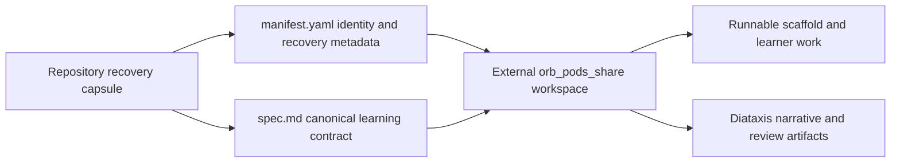

# Hands-On Lab Catalog

This is a navigation page for the repository's **three recovery capsules**. A capsule preserves a lab's identity, approved concept links, recovery location, and canonical learning contract; it is not the runnable lab. Read the linked `spec.md` to understand a lab's goal, core task, intentional failure or comparison, prerequisites, and acceptance criteria. OpenWiki is derived navigation: it neither replaces those canonical files nor authorizes edits to the capsules, concepts, or external lab workspace.

## Catalog

| Lab | Setup and time box | Approved concepts | Canonical specification |
| --- | --- | --- | --- |
| **Kiro CLI + Langfuse for Evaluation** | `real-tool`; 90–120 min | [LLM Observability](../../concepts/llm-engineering/llm-observability.md); [LLM-as-Judge Evaluation](../../concepts/llm-engineering/llm-as-judge-evaluation.md); `acp-agent-backend-for-ides` | [`labs/kiro-langfuse-eval/spec.md`](../../labs/kiro-langfuse-eval/spec.md) |
| **LangGraph State Flow — Reducer vs. Overwrite** | `local-mock`; 20–30 min | [LangGraph StateGraph State Schema](../../concepts/llm-engineering/langgraph-stategraph-state-schema.md); [LangGraph Channels and Reducers](../../concepts/llm-engineering/langgraph-channels-and-reducers.md) | [`labs/langgraph-state-flow/spec.md`](../../labs/langgraph-state-flow/spec.md) |
| **OpenTelemetry Positioning — Where the Collector Sits** | `local-mock`; 45–75 min | [Telemetry Signal Model](../../concepts/observability/telemetry-signal-model.md); [OpenTelemetry Collector Pipeline Architecture](../../concepts/observability/collector-pipeline-architecture.md); `otlp-vendor-neutral-telemetry-protocol`; `opentelemetry-api-sdk-separation` | [`labs/otel-collector-positioning/spec.md`](../../labs/otel-collector-positioning/spec.md) |

The concept links above are the approved starting points for theory. The canonical specification is the entrypoint for the corresponding exercise; it is not a completed implementation or a record of any learner run.

## What the repository preserves

Each lab directory contains two recovery-contract files:

- **`manifest.yaml`** identifies the capsule, its `status`, concept IDs, external `workspace_path`, canonical-spec filename, generator prompt, review URLs, and the artifact categories to regenerate. Its `spec_sha256` records the canonical specification's SHA-256 value for damage detection.
- **`spec.md`** is the repository-resident canonical learning contract. It defines the learning intent and the behavior a recovered lab must preserve, including the scaffold boundary, learner-owned core, failure or comparison case, prerequisites, and acceptance criteria.

The current manifests mark all three capsules `scaffolded`. Their `canonical_spec` is `spec.md`, and their recovery workspace is under `~/orb_pods_share/<lab-id>/`.

*The repository retains the recovery contract; the external workspace holds reconstructed runnable and presentation artifacts.*

## Recovery and ownership boundary

To recover a lost lab, provide its `manifest.yaml` and `spec.md` to an agent and follow [`_scripts/prompts/lab-design.md`](../../_scripts/prompts/lab-design.md). Recovery targets equivalent learning behavior and acceptance criteria, not byte-for-byte reproduction. The design workflow places the complete lab in the external workspace and only then creates the minimal repository capsule.

The follow-on review workflow is also external and happens after a learner attempt. [`lab-review.md`](../../_scripts/prompts/lab-review.md) reads the external specification, learner predictions, learner-owned core, and private answer key; it must stop rather than grade when the attempt is empty. It is feedback and retention support, not catalog content.

### Deliberately outside this repository

Do not treat a manifest's regeneration list or review URLs as proof that these files are present here. Runnable scaffolds and fixtures, learner work, `predictions.md`, answer keys, Diátaxis narratives, review sites and pages, deployment material, generated runs, usage logs, and credentials belong outside this repository. The repository ignore policy also excludes private learner state and generated lab artifacts from its canonical knowledge surface.

This boundary prevents a catalog from exposing solutions, predictions, credentials, operational output, or review evidence. It also preserves the draft-then-promote rule: discovering a lab through OpenWiki does not authorize a change to canonical knowledge or lab content.

## Choosing a lab

- Choose **Kiro CLI + Langfuse for Evaluation** to practice a real-tool evaluation and observability integration, including a separately configured judge provider and real operational prerequisites. Read the specification before deciding whether its cost and access requirements are appropriate.
- Choose **LangGraph State Flow — Reducer vs. Overwrite** for a compact local exercise on how a `StateGraph` state schema and reducer semantics affect accumulated versus replaced state.
- Choose **OpenTelemetry Positioning — Where the Collector Sits** for a local exercise on separating telemetry signal types and routing them through Collector pipelines to appropriate backends.

For broader orientation before selecting a capsule, use the [LLM Engineering Domain Map](../concepts/llm-engineering-map.md) or the [Observability and Telemetry Domain Map](../concepts/observability-map.md). The [Study Vault Quickstart](../quickstart.md) and [From Source to Learning Path](../workflows/knowledge-lifecycle.md) explain the repository's authority and learning lifecycle boundaries.
