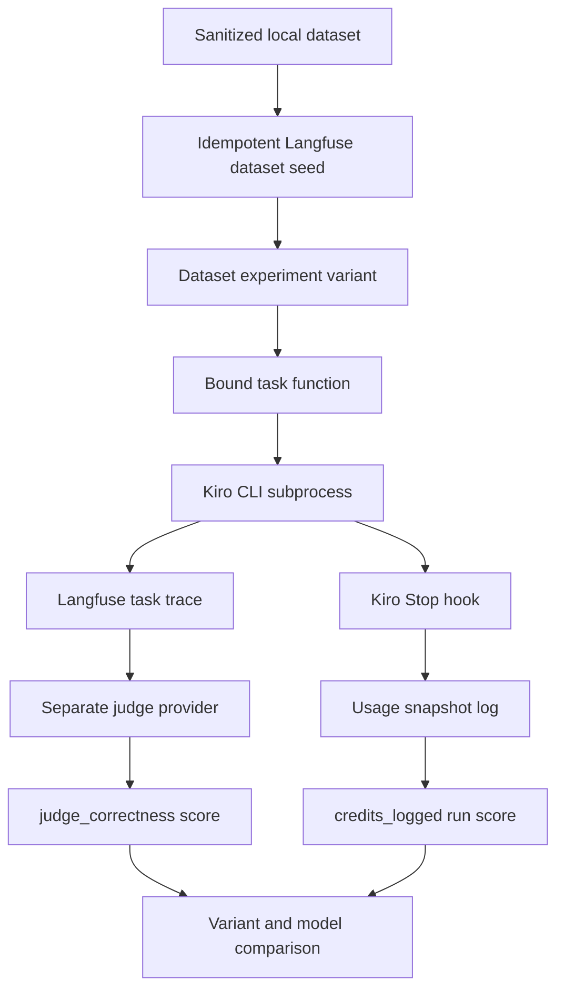

# Hands-On Lab Catalog

Labs are guided practice, not replacement specifications or authorization to alter their source material. Use a catalog entry to choose a learning exercise, then read the lab's canonical specification and follow the repository's concept maps for the underlying theory.

## Current catalog

| Lab | Practice focus | Setup | Time box | Canonical entrypoint |
| --- | --- | --- | --- | --- |
| **Kiro CLI + Langfuse for Evaluation** | Turn non-interactive Kiro CLI answers into scored, comparable Langfuse dataset runs; compare prompt variants and a small model subset while keeping task cost separate from judge cost. | `real-tool` | 90–120 minutes | [`labs/kiro-langfuse-eval/spec.md`](../../labs/kiro-langfuse-eval/spec.md) |

This lab has **no** `labs/kiro-langfuse-eval/spec.diataxis.md`. Although the lab-design workflow normally restructures a completed specification into that human learning narrative, use `spec.md` above as the canonical specification for this lab. Do not infer a second narrative, a completed learner solution, or verified run results from the catalog.

## Kiro CLI + Langfuse for Evaluation

### What it teaches

The exercise is an integration boundary, rather than native Kiro telemetry: the harness surrounds each Kiro CLI subprocess task call with the Langfuse dataset-experiment workflow. The learner implements only the `judge_score()` evaluator; the scaffold provides dataset seeding, task construction, CLI wrapping, provider dispatch, usage collection, and comparison tooling. This deliberately small ownership boundary makes the learning objective concrete: define a rubric that evaluates outputs—including an intentionally ambiguous item—without crashing an entire run when a judge reply cannot be parsed.

The task model and judge are intentionally separate. Kiro CLI produces the answer under test; `judge_client.call_judge()` sends the rubric to a separately configured provider. The separation prevents judge-side calls from appearing in Kiro credit snapshots and avoids grading a model family with itself. Provider choice alone is not sufficient: the learner must confirm that the chosen judge model family does not overlap the Kiro task model family.

*The harness traces and scores task answers through Langfuse while the hook-based usage path records only Kiro-side activity.*

### Entrypoints and control boundaries

- `scripts/setup.sh` is the operational gate. It checks for `kiro-cli`, creates or reuses a virtual environment, installs requirements, requires the Kiro, judge-provider, and Langfuse configuration variables, tests Langfuse health, performs a live Kiro stdin-shape smoke test, and invokes the usage logger once. It stops on missing prerequisites rather than offering a mock fallback.
- `scripts/run_variant.py --variant baseline` and `scripts/run_variant.py --variant improved` seed the dataset, bind the chosen system prompt and optional model to a task, and call `dataset.run_experiment()` with the learner evaluator and the run-level credit evaluator. They write local summaries for the comparison step; these summaries are run artifacts, not catalog content.
- The baseline and improved prompts are the controlled variable. The improved prompt asks for concise, direct policy or steps and for missing context rather than guessing; the runner records variant and model metadata so the resulting dataset runs can be compared.
- `scripts/model_compare.py` holds the improved prompt constant while iterating a deliberately small three-item subset over selected Kiro models. It records the judge score and measured task latency per model-item pair, leaving the learner to weigh those results against model cost.
- `scripts/compare_report.py` is the runnable acceptance check. It requires both local variant summaries and `judge_correctness` evaluations, reports their mean and count alongside logged-credit counts, and returns failure when a baseline has usage snapshots but the improved run has none.

### Data and lifecycle invariants

Dataset seeding is safe to repeat: the Langfuse dataset is created by name and items are upserted by ID. `make_kiro_task()` builds one task function for a chosen prompt/model; the experiment invokes it once per item, so each task call is a separate Kiro invocation and Langfuse trace. The lab dataset contains eight sanitized support-FAQ items, including one intentionally ambiguous item that must be judged for acknowledgement of ambiguity or missing policy context rather than textual agreement with a single answer.

The judge evaluator must return `Evaluation(name="judge_correctness", ...)` with a 1–5 value, or `-1` and the judge text when parsing fails. Returning an evaluation lets `run_experiment()` attach it; the evaluator should not create Langfuse scores itself. A provider configuration error is intentionally loud—there is no fallback from the judge client to Kiro CLI.

The usage path has a different lifecycle. A Kiro `Stop` hook invokes `scripts/log_usage.sh`, which runs `/usage`, extracts the first two numbers from the usage block, and appends a JSON snapshot. The run evaluator reads available snapshots, skips malformed JSON lines, sums recorded credits, and returns their count as `credits_logged`. For an eight-item healthy dataset run, that count should be eight because judge calls do not traverse Kiro CLI. The parser is deliberately tolerant of Kiro CLI output variation, so validate its interpretation during setup when using a different CLI version.

### Deliberate failure cases

1. **Ambiguous-item judge miscalibration.** A rubric that merely asks whether output matches an expected answer is unsuitable for the deliberately ambiguous dataset item. Treat this as an evaluation-design signal: inspect the judge rationale and revise the rubric to reward recognition of ambiguity or missing context, not string matching.
2. **Inert credit hook.** The shipped hook uses `PostStop`, while the expected Kiro hook trigger is `Stop`. The configuration can therefore look installed while producing no snapshots. Run the comparison after the prescribed baseline/improved sequence; a baseline with snapshots and an improved run with none is the focused diagnostic signal. Fix the trigger and rerun the improved variant before treating cost data as trustworthy.

### Prerequisites and safe operation

This is a real-tool exercise with separate costs for task-side Kiro calls and judge-provider calls. It requires an installed, authenticated Kiro CLI; credentials for a distinct judge provider; a Langfuse project and reachable Langfuse endpoint; and Python dependencies from `requirements.txt`. The repository does not supply a mock mode, because real CLI behavior, tracing, and the Langfuse interface are the subject of the exercise. The exact Kiro non-interactive model-selection input shape is version-sensitive, so use the setup smoke test and adjust `call_kiro()` only if the installed CLI behaves differently.

Before running, copy `.env.example` to a private `.env` and supply values locally; never place credentials in lab outputs or documentation. Do not rely on the scaffold to validate cross-family model separation—the setup script validates a supported judge provider name and non-empty configuration, but leaves that semantic compatibility check to the operator.

### Learning sequence and completion signals

1. Read the canonical `spec.md` and the scaffold, then make predictions privately before execution.
2. Run `./scripts/setup.sh`; resolve environment or CLI-shape issues before a dataset experiment.
3. Implement `judge_score()` using `call_judge()`, with an ambiguity-aware rubric and parse-failure handling.
4. Run baseline and improved variants in the specified sequence, investigate the intentional hook failure, then rerun after correcting it.
5. Run `python scripts/compare_report.py`, inspect the Langfuse dataset-run comparison, and run the model comparison.
6. Use the lab review workflow only after making the learner attempt.

A completed healthy exercise has two eight-item scored dataset runs, a passing comparison report after the hook correction, and model-comparison records with a score and latency for every selected model-item pair. The intended interpretation is more important than a preordained winner: compare quality, latency, and separately attributable costs, and explain why the ambiguous item and a missing hook signal require different responses.

## Related navigation

- [LLM Engineering Domain Map](../concepts/llm-engineering-map.md) situates evaluation, observability, and prompt comparison in the production feedback loop.
- [Observability and Telemetry Domain Map](../concepts/observability-map.md) separates application instrumentation from telemetry delivery and operations.

## What this catalog excludes

This page intentionally does not publish learner predictions, expected answers, completed evaluator implementations, run summaries or outputs, usage logs, credentials, generated review HTML, deployment/account details, or other lab artifacts. Those materials either belong to the learner's private work, are operationally sensitive, or are generated evidence—not stable catalog navigation.
