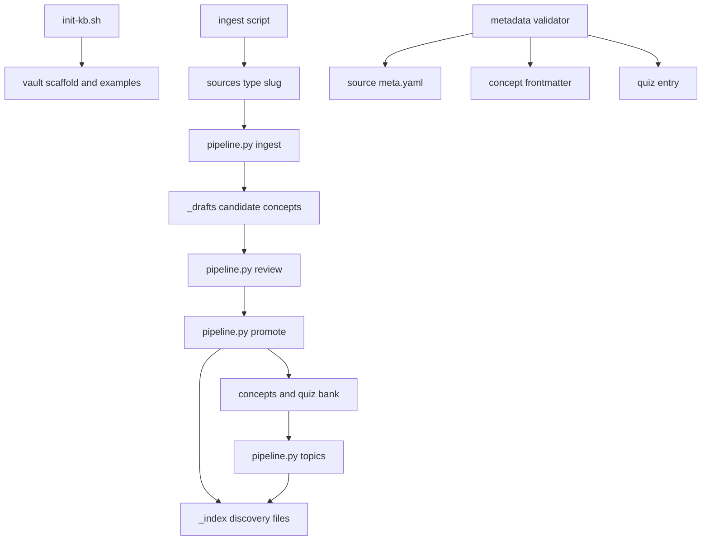

# Automation, Validation, and Safe Change Surfaces

The repository provides automation around a deliberately staged knowledge lifecycle: initialize a vault, normalize a source, draft and review candidate concepts, promote approved work, then maintain derived discovery surfaces. Automation coordinates these steps but does **not** make a draft authoritative. For the governing distinction between canonical concepts, topics, drafts, sources, and indexes, see [Approved Knowledge and Write Boundaries](../architecture/knowledge-governance.md).

## Operational map



*The pipeline dispatches configured agents through the staged lifecycle; metadata checks and regenerated indexes are supporting controls, not approval mechanisms.*

## Initialize once, rerun safely

Run the initializer against the intended vault root; it defaults to the current directory.

```bash
./_scripts/init-kb.sh /path/to/vault
```

`init-kb.sh` creates the staging, draft, concept, source-type, quiz, index, topic, and prompt directories. It seeds a README, example source and concepts, a quiz bank, placeholder index files, the new-source prompt, and `.gitignore` rules for raw media, documents, and cloned/binary artifacts. Each seeded file is written only when missing, while directory creation is repeatable, so rerunning initialization preserves an existing file rather than replacing it. This makes it suitable for completing a partially initialized vault, but it is not a reset or repair tool. [Knowledge lifecycle](../workflows/knowledge-lifecycle.md) (when available) is the user-facing companion to this operational setup.

The seed content is illustrative. In particular, initial `_index/` files are placeholders; regenerate them after adding concepts or topics rather than editing the placeholder wording.

## Ingestion and pipeline dispatch

### Normalize before agent processing

Use the source-specific ingest script first. For example, PDF ingestion rejects a missing input or an unsupported source type, requires either `pdftotext` or `marker`, rejects empty conversion output, writes normalized content and `meta.yaml` under `sources/<type>/<slug>/`, and splits content larger than 1 MiB into `notes-partNN.md` files. It also avoids adding an outside-the-vault PDF to the vault's `.gitignore`. The integration suite covers representative YouTube subtitle and Whisper fallback paths, PDF conversion/splitting, and DeepWiki success and failure paths with external programs replaced by PATH mocks.

```bash
./_scripts/ingest-pdf.sh /path/to/document.pdf papers
```

Ingest scripts are the boundary for raw material and external tools. Do not treat content under `_inbox/`, `sources/`, or `_drafts/` as approved knowledge, and do not use those excluded paths as evidence for OpenWiki claims.

### Run the configured roles

`pipeline.py` loads YAML configuration (expanding `${NAME}` environment-variable references in strings), chooses the first configured agent for a requested role, substitutes `{source_dir}` and `{kb_root}` in the corresponding prompt, and launches the configured command in `kb_root`. A normal run with a source directory executes `ingest`, `review`, `promote`, and `topics` in that order; it stops at the first missing configuration or nonzero agent exit. Single-step mode permits any one of those roles, plus the manual-only `lab` role. `--dry-run` prints selected agent/command/prompt information without invoking the agent.

```bash
# Preview the standard per-source sequence.
.venv/bin/python3 _scripts/pipeline.py sources/papers/my-paper --dry-run

# Dispatch only a review. No source directory is required for this role.
.venv/bin/python3 _scripts/pipeline.py --step review

# Dispatch only ingestion. A source directory is required for this role.
.venv/bin/python3 _scripts/pipeline.py sources/papers/my-paper --step ingest

# Use a separately maintained configuration.
.venv/bin/python3 _scripts/pipeline.py sources/papers/my-paper --config my-pipeline.yml
```

The bundled `pipeline.yml` maps role names to commands, concurrency declarations, optional environment overrides, and prompt templates. The runner currently selects one matching agent and does not consume `max_concurrent`; this setting is configuration metadata rather than an enforced parallelism limit. The full pipeline also does not include quiz activity, the manual lab workflow, or weekly refinement.

### Treat the runner and configuration as trusted execution surfaces

Agent commands are assembled with the prompt and executed with `shell=True`, from the configured `kb_root`. The default configuration includes permission-bypassing flags such as `--yolo` and `--dangerously-skip-permissions`. Consequently, review changes to `pipeline.yml` as executable operational changes, keep its commands and environment input trusted, and use `--dry-run` to inspect a dispatch before running it. A zero exit code means only that the selected agent command succeeded; the runner does not verify that its files obey the prompt's write constraints or that a human actually approved a draft.

That limitation matters at the promotion boundary. The configured review prompt requests APPROVE, REVISE, or REJECT outcomes, and the promotion prompt is intended for approved drafts; however, the enforcement is a process and prompt contract, not a sandbox. Prefer separately reviewing the resulting diff and review decision before dispatching `--step promote`. The promotion prompt limits canonical mutation to the selected draft, necessary related-concept backlinks, quiz data, and indexes; it retains the draft if required promotion outputs cannot be completed.

`lab` is deliberately available only as an explicit step and excluded from the normal sequence. Consult the [Hands-On Lab Catalog](../labs/catalog.md) for the separate learner and publication boundaries; do not surface private lab material or completed learner work through this operations page.

## Metadata validation: a required-field gate, not a schema system

`_scripts/metadata_validator.py` exposes three callable validation helpers:

- `validate_source_meta(path)` reads YAML and requires `type`, `title`, `language`, `date_consumed`, `date_added`, and `status`.
- `validate_concept_frontmatter(path)` requires opening `---` YAML frontmatter and the fields `id`, `title`, `depth`, `review_due`, and `sources`.
- `validate_quiz_entry(entry)` requires a mapping with identity, question/answer/explanation, scheduling, ease, and history fields.

All three return a list of diagnostic strings; an empty list is success. File readers distinguish unreadable files, YAML parsing errors, non-mapping YAML, and missing or incomplete concept frontmatter. The checks deliberately validate field presence, not value types, date formats, allowed values, cross-record references, uniqueness, or semantic correctness. Use them as a fast structural gate, then retain review and focused behavior tests for the stronger guarantees.

For an immediate check of a changed source file, invoke the helper from the repository environment:

```bash
.venv/bin/python3 - <<'PY'
from _scripts.metadata_validator import validate_source_meta

errors = validate_source_meta("sources/papers/my-paper/meta.yaml")
raise SystemExit("\n".join(errors) if errors else 0)
PY
```

The YouTube ingester demonstrates the intended failure behavior: after writing source metadata, it calls `validate_source_meta` and exits nonzero if diagnostics are returned. Other writers should follow the same pattern when they own metadata output.

## Regenerate derived discovery indexes

`index_generator.py` exposes Python functions rather than a command-line `main` entrypoint. Run all three after a concept or topic change:

```bash
.venv/bin/python3 - <<'PY'
from _scripts.index_generator import (
    generate_concepts_index,
    generate_tags_index,
    generate_topics_index,
)

root = "."
generate_concepts_index(root)
generate_topics_index(root)
generate_tags_index(root)
PY
```

Each function recursively scans its input Markdown trees and overwrites its target in `_index/`, creating the target parent when needed. The concept index lists `concepts/` as `active` and `_drafts/` as `draft`; the tag index likewise includes both trees, while the topic index scans `topics/`. These indexes are therefore useful discovery surfaces but cannot signal approval—draft visibility is intentional. Frontmatter supplies titles, ids, and tags when present; title display falls back to an H1 or a filename-derived label. Missing directories yield explicit empty states.

Do not hand-edit generated indexes as a substitute for changing their source records. Regenerate them after the canonical edit and inspect the diff, especially when a tag or draft appears unexpectedly. See [Approved Knowledge and Write Boundaries](../architecture/knowledge-governance.md) for the authority rationale.

## Choose the narrowest relevant test

The Python test suite uses `pytest`; Bash integration tests use Bats. Run the suite closest to the change first, then widen only when the change crosses a workflow boundary.

| Change surface | Focused validation | What it guards |
| --- | --- | --- |
| Required metadata fields or reader error handling | `.venv/bin/python3 -m pytest _scripts/tests/test_metadata_validator.py -v` | Property-based complete and single-missing-field payload checks for source metadata, concept frontmatter, and quiz entries. |
| Index scanning, ordering, links, or empty behavior | `.venv/bin/python3 -m pytest _scripts/tests/test_index_generator.py -v` | Active/draft concept entries, topic listing, and tag grouping. |
| Vault bootstrap or idempotence | `.venv/bin/python3 -m pytest _scripts/tests/test_init_kb.py -v` | Directory scaffold, seed validity, ignored artifact rules, and preservation on a second run. |
| Shell bootstrap contract | `bats _scripts/tests/test_init_kb.bats` | Expected scaffold, seeds, and `.gitignore` entries through the shell interface. |
| External ingestion behavior | `bats _scripts/tests/test_ingest_pipeline.bats` | Mocked tool success/failure paths for YouTube, PDFs, and DeepWiki. |
| Cross-boundary state | `.venv/bin/python3 -m pytest _scripts/tests/test_e2e_flow.py -v` | Initialize → mocked PDF ingest → metadata checks → promoted concept/quiz state → scheduled quiz updates. |

The end-to-end test intentionally supplies promoted concept and quiz fixtures itself; it is valuable for state compatibility across components, but it does not execute the AI pipeline or prove that an agent complied with a prompt. There is currently no direct automated test of `pipeline.py`, so changes to runner semantics or `pipeline.yml` deserve manual `--dry-run` inspection and a deliberately safe test configuration in addition to nearby tests.

For broad regression coverage after a change that spans multiple helpers, run:

```bash
.venv/bin/python3 -m pytest _scripts/tests/ -v
```

Bats tests depend on the `bats` executable, and ingestion tests mock external dependencies instead of contacting their services. Preserve that isolation when extending the suite: exercise integration contracts and error paths without making CI depend on API credentials, network access, media downloads, or a real DeepWiki instance.

## Safe change checklist

1. Initialize only the intended target and remember that rerunning it preserves existing seed files.
2. Normalize raw input with the appropriate ingester; resolve dependency and conversion errors before dispatching agents.
3. Treat `pipeline.yml`, `kb_root`, agent commands, and prompt changes as trusted-execution changes. Preview with `--dry-run`.
4. Keep human approval explicit between draft review and promotion; inspect the file diff because the runner cannot enforce prompt-based write boundaries.
5. Validate newly written metadata, then run the narrow test suite for the modified component.
6. Regenerate all affected `_index/` files from their canonical inputs; never use index presence as evidence of approval.
7. Run the end-to-end or broad suite only when the modification crosses those focused boundaries.

For periodic content and retention work, follow [Review and Retention](../workflows/review-and-retention.md) when available; that workflow remains distinct from the default agent pipeline.
