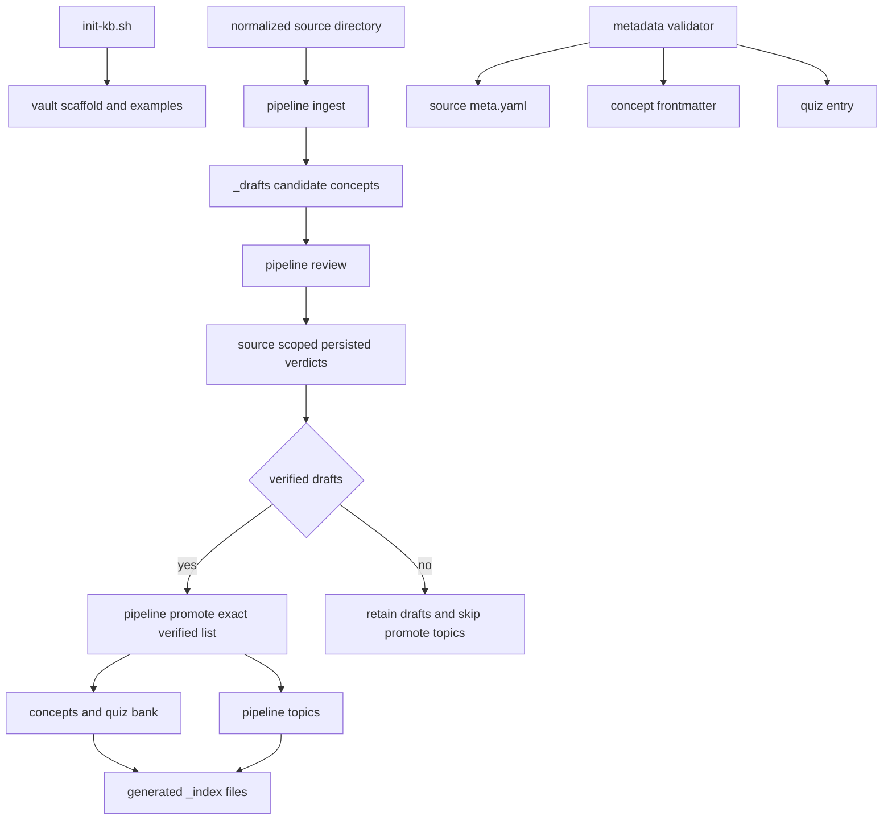

# Automation, Validation, and Safe Change Surfaces

The repository automates a deliberately staged knowledge lifecycle: initialize a vault, normalize a source, create and independently review drafts, promote only eligible drafts, and maintain derived discovery surfaces. The dispatcher coordinates agent commands; it does not make a draft authoritative or enforce an agent's prompt-level write restrictions. For the authority boundary among sources, drafts, canonical concepts, topics, and indexes, see [Approved Knowledge and Write Boundaries](../architecture/knowledge-governance.md).

## Operational map



*The full source run gates promotion and topics on persisted verified verdicts for that source. Metadata checks and generated indexes support the lifecycle but do not approve content.*

## Initialize once, rerun safely

Run the initializer against the intended vault root; it defaults to the current directory.

```bash
./_scripts/init-kb.sh /path/to/vault
```

`init-kb.sh` creates the staging, draft, concept, source-type, quiz, index, topic, and prompt directories. It seeds a README, example source and concepts, a quiz bank, placeholder index files, the new-source prompt, and `.gitignore` rules for raw media, documents, and cloned/binary artifacts. Each seeded file is written only when missing, while directory creation is repeatable, so rerunning initialization preserves an existing file rather than replacing it. It can complete a partially initialized vault, but it is not a reset or repair tool.

The seed indexes are placeholders. Regenerate them after changing concepts or topics rather than editing their placeholder text.

## Dispatcher entrypoints and lifecycle

Normalize raw material into a source directory before starting the source pipeline. The dispatcher treats its positional argument as a required target for **every** single step, including `review`, `promote`, `topics`, and manual-only `lab`; a full run also requires it. In practice, use a normalized source directory for `ingest`, `review`, and `topics`, an explicit draft path for manual `promote`, and a concept path or concrete request for `lab`.

```bash
# Preview the per-source run.
.venv/bin/python3 _scripts/pipeline.py sources/papers/my-paper --dry-run

# Dispatch review for one source.
.venv/bin/python3 _scripts/pipeline.py sources/papers/my-paper --step review

# Explicitly promote one draft.
.venv/bin/python3 _scripts/pipeline.py _drafts/my-concept.md --step promote

# Dispatch the manual-only lab role for a target or request.
.venv/bin/python3 _scripts/pipeline.py concepts/category/my-concept.md --step lab
```

`pipeline.py` loads the selected YAML config, recursively expands `${NAME}` references in string values from the environment, selects the first configured agent whose `role` matches the step, fills `{source_dir}`, `{kb_root}`, and supplied prompt variables, and runs the command with `kb_root` as its current working directory. Missing agent or prompt configuration, a missing target, or a nonzero command exit makes a step fail.

A normal source run first dispatches `ingest` and `review`. It then reads `_drafts/*.md`, normalizes source paths relative to `kb_root`, and groups only matching drafts by persisted `review_status`. Missing status is `pending`; an unrecognized status becomes `needs-decision`. Only a nonempty `verified` group causes the runner to dispatch `promote`, with an exact newline list of those draft paths, followed by `topics`. If no matching verified draft exists, both promotion and topics are skipped. Pending and needs-decision drafts are warned about, while rejected drafts are retained and reported; any failed dispatched step stops the run.

Single-step dispatch does not perform that grouping: `--step promote` passes its target as `{verified_drafts}`. Use it only for a deliberately selected draft and inspect the result. The review and promotion prompts define the intended record: review writes a verdict and evidence in matching drafts, and pipeline-mode promotion must not scan or promote drafts outside the provided verified list. Those are agent instructions; the runner's source-scoped grouping is the actual programmatic gate in a full run.

`--dry-run` does not call an agent. For a single step it prints the selected agent, its configured command, and a substituted prompt; for a full run it prints the selected agent for each standard step plus the verified-draft condition. It does not validate a target, resolve all runtime prerequisites, or construct the eventual verified list.

The default sequence excludes quiz work, the `lab` role, weekly refinement, and OpenWiki refresh. During this pilot, refresh OpenWiki manually after reviewing a canonical batch; do not add a scheduled OpenWiki workflow.

## Trusted execution surfaces

`pipeline.yml`, `kb_root`, environment input, prompt templates, and agent command strings are trusted execution surfaces. The runner merges configured agent environment values into its inherited environment, appends a shell-quoted prompt to the configured command, and executes the resulting string with `shell=True` from `kb_root`. The bundled commands include permission-bypassing flags such as `--yolo` and `--dangerously-skip-permissions`.

Accordingly, review config and prompt changes as executable operational changes, and inspect dispatches with `--dry-run` before a real run. A successful exit means the process returned zero; it does not show that an agent limited its writes, promoted correctly, or recorded a human decision. There is no filesystem sandbox in this runner. Review the resulting diff and persisted verdicts before relying on canonical changes.

Although agents declare `max_concurrent` in `pipeline.yml`, the runner selects the first matching agent and invokes one process per step; it does not consume or enforce `max_concurrent`. Treat the field as configuration metadata, not a concurrency control.

## Metadata validation: required fields, not semantic approval

`_scripts/metadata_validator.py` exposes three callable helpers:

- `validate_source_meta(path)` reads YAML and requires `type`, `title`, `language`, `date_consumed`, `date_added`, and `status`.
- `validate_concept_frontmatter(path)` requires opening YAML frontmatter and `id`, `title`, `depth`, `review_due`, and `sources`.
- `validate_quiz_entry(entry)` requires a mapping with identity, question/answer/explanation, scheduling, ease, and history fields.

Each returns a list of diagnostic strings, with an empty list denoting success. File helpers distinguish unreadable files, malformed YAML, non-mapping YAML, and missing or incomplete concept frontmatter. They check field presence, not types, date formats, allowed values, reference integrity, uniqueness, or factual correctness. Use them as a quick structural gate alongside review and behavior tests.

```bash
.venv/bin/python3 - <<'PY'
from _scripts.metadata_validator import validate_source_meta

errors = validate_source_meta("sources/papers/my-paper/meta.yaml")
raise SystemExit("\n".join(errors) if errors else 0)
PY
```

## Regenerate derived discovery indexes

`index_generator.py` supplies Python functions rather than a command-line `main` entrypoint. Run all affected generators after changing their canonical inputs:

```bash
.venv/bin/python3 - <<'PY'
from _scripts.index_generator import (
    generate_concepts_index,
    generate_tags_index,
    generate_topics_index,
)

root = "."
generate_concepts_index(root)
generate_topics_index(root)
generate_tags_index(root)
PY
```

Each function recursively scans its input Markdown tree and overwrites its `_index/` target, creating the parent directory as needed. The concepts index includes `concepts/` as `active` and `_drafts/` as `draft`; the tags index also includes both trees, while the topics index scans `topics/`. Frontmatter supplies titles, IDs, and tags when present, with title fallback to an H1 or filename-derived label. Missing inputs render explicit empty states.

Indexes are discovery output, not canonical approval: deliberate draft visibility means index presence cannot prove that a concept is approved. Do not hand-edit a generated index instead of changing its source records; regenerate and inspect the diff.

## Focused-test-first validation

Run the narrowest test suite for the changed surface before widening scope.

| Change surface | Focused validation | What it guards |
| --- | --- | --- |
| Dispatcher source scoping and review-status grouping | `.venv/bin/python3 -m pytest _scripts/tests/test_pipeline.py -v` | Only drafts matching the normalized source are grouped; verified, pending, and unrecognized verdict behavior is separated. |
| Required metadata fields and reader errors | `.venv/bin/python3 -m pytest _scripts/tests/test_metadata_validator.py -v` | Required-field checks for source metadata, concept frontmatter, and quiz entries. |
| Index scanning, ordering, links, or empty behavior | `.venv/bin/python3 -m pytest _scripts/tests/test_index_generator.py -v` | Active/draft concept entries, topic listing, and tag grouping. |
| Vault bootstrap or idempotence | `.venv/bin/python3 -m pytest _scripts/tests/test_init_kb.py -v` | Scaffold, valid seed data, ignore rules, and preservation on repeat initialization. |
| Cross-boundary persisted state | `.venv/bin/python3 -m pytest _scripts/tests/test_e2e_flow.py -v` | Initialization, mocked PDF ingestion, metadata validation, fixture-backed promoted state, and quiz scheduling updates. |

The focused pipeline test covers `reviewed_drafts`; it does not execute agents, shell commands, or every CLI branch. For dispatcher or configuration changes, pair it with a `--dry-run` using a safe configuration and inspect the expected command and prompt. The end-to-end test creates promoted concept and quiz fixtures itself, so it checks state compatibility rather than agent compliance or full pipeline promotion.

For changes spanning helpers, widen after focused tests pass:

```bash
.venv/bin/python3 -m pytest _scripts/tests/ -v
```

## Safe change checklist

1. Initialize only the intended target; reruns preserve existing seeded files.
2. Normalize raw input before a source pipeline run and pass an explicit target for every dispatcher step.
3. Treat `pipeline.yml`, `kb_root`, environment values, commands, and prompts as trusted execution surfaces. Preview with `--dry-run`.
4. In a full run, rely on persisted source-scoped `review_status: verified` only for dispatch gating—not as proof that agent writes were constrained or a human decision was recorded.
5. Validate changed metadata and run the narrowest relevant test first; run `test_pipeline.py` for source-grouping behavior.
6. Regenerate affected indexes from canonical inputs. Never infer approval from an index entry.
7. Refresh OpenWiki manually only after the reviewed canonical batch is ready.

For periodic content and retention work, follow [Review and Retention](../workflows/review-and-retention.md).
