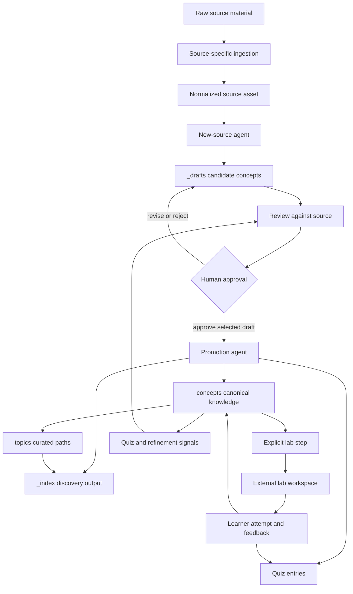

# From Source to Learning Path

This workflow turns a normalized learning source into approved concepts, curated topic paths, practice, and review without conflating those stages. The governing boundary is **draft first, then human-approved promotion**: `_drafts/`, source material, reports, quiz state, and indexes can inform work, but only `concepts/` and `topics/` are canonical knowledge surfaces. OpenWiki is derived navigation over eligible material; it does not approve a draft or authorize a change to canonical knowledge or labs.

For the authority model, see [Approved Knowledge and Write Boundaries](../architecture/knowledge-governance.md). For operational commands and validation details, see [Automation, Validation, and Safe Change Surfaces](../operations/automation-and-validation.md).

## Lifecycle at a glance



*The lifecycle separates source-derived candidates from human-authorized canonical content; practice and retention can feed review but cannot become a promotion route.*

## 1. Normalize and draft a reviewable candidate

Begin with the source-specific ingestion command appropriate to the material. The guide provides commands for video, PDF, repository via DeepWiki, web article, podcast, and EPUB inputs. The resulting source asset is organized under `sources/<type>/<slug>/`; `new-source.md` calls for `meta.yaml`, `notes.md`, and `highlights.md`, with highlights retaining a source location when available.

```bash
./_scripts/ingest-pdf.sh /path/to/document.pdf papers
```

The new-source role reads the material as well as existing `concepts/`, `_drafts/`, and the concept index before it proposes one to ten independently reviewable drafts. A candidate contains its id, source, status, and a definition, rationale, and relationship discussion. A likely duplicate or substantial overlap is marked `merge_candidate` rather than silently asserted as a separate concept.

This is a write boundary, not an authority decision. `new-source.md` allows writes to the normalized source, `_drafts/`, and `_index/concepts.md`, but prohibits writes to `concepts/` and quiz creation. Thus neither a source reference nor a draft index listing means that the proposed knowledge is approved.

## 2. Review, explicitly approve, then promote one draft

Review checks the candidate's definition, significance, and relationships against the source and reports `APPROVE`, `REVISE`, or `REJECT`. That verdict is advice: a person must inspect it and the resulting diff, resolve any `merge_candidate`, and explicitly authorize promotion of the particular draft. A rejected or revision-needed draft leaves canonical knowledge unchanged.

The configured full dispatcher does not provide this approval. It runs `ingest`, `review`, `promote`, and `topics` consecutively, so use separate review and promotion invocations when preserving the approval boundary matters:

```bash
.venv/bin/python3 _scripts/pipeline.py --step review
.venv/bin/python3 _scripts/pipeline.py sources/papers/my-paper --step promote
```

The promotion contract is deliberately narrower than the bundled pipeline prompt: it accepts a user-approved, selected `_drafts/<concept>.md` and must not sweep unrelated drafts. For a `merge_candidate`, it conservatively updates the existing concept and adds the new source unless the user explicitly requests a separate concept.

On first promotion, the prompt defaults to `depth: 2`, `lab_status: not-started`, and `review_due` three days later. It requires a plain-language explanation, at least one concrete example, valid related-concept references and reciprocal backlinks. It adds at least two quiz entries, normally three, and moves the entry from Draft to Active in discovery output. The selected draft is removed only after the formal concept, quiz entries, indexes, and required backlinks are complete; otherwise it remains in `_drafts/` with the blocker reported.

## 3. Curate canonical paths; regenerate discovery output

`topics/` represents curated learning paths: prerequisites and an intended study order over approved concepts. The topics role may update a path that fits recently promoted concepts and creates a new path only when no existing path covers the domain. It updates `_index/topics.md` as a consequence.

`_index/` is discovery output, never an approval or authoring surface. The index generator scans `concepts/` as active and `_drafts/` as draft, scans `topics/`, and groups tags from both concepts and drafts. Its generators overwrite their targets. Regenerate and inspect affected indexes after changing a concept or topic; do not hand-edit an index as a substitute for changing its canonical input, and never infer approval merely from index visibility.

## 4. Practice is an explicit external-lab branch

`lab` is available only as an explicit dispatcher step, not in the default source pipeline. It accepts a concept, several concepts, or a concrete integration request. The lab-design contract resolves matching canonical concepts and uses `depth` and `lab_status` to tune a fading scaffold, not as a mastery gate: the learner only needs to recognize the main term and state its problem or expected input/output. A missing minimum triggers a short primer and a more guided lab rather than blocking practice.

A complete runnable lab lives outside this repository at `~/orb_pods_share/<lab-id>/`. The designer creates its source `spec.md`, then restructures it into `spec.diataxis.md`, builds the review HTML, and only then deploys the public review page. The repository retains a recovery capsule at `labs/<lab-id>/` containing `manifest.yaml` and the canonical `spec.md`; its manifest links concepts, external workspace, review URLs, regeneration artifacts, and a SHA-256 for the spec. Recovery targets equivalent learning behavior and acceptance criteria, not byte-for-byte reproduction.

The external boundary protects learner and generated artifacts. Runnable scaffolds, fixtures, predictions, private expected answers, completed cores, generated HTML, output, and secrets belong in the external workspace, not the repository or public page. A real-tool lab states credential, account, cost, and infrastructure prerequisites without embedding secrets and supplies a mock fallback when it preserves the learning goal. A deployment failure retains the local HTML and records the blocker and retry commands rather than inventing a URL.

## 5. Attempt first; review feeds retention

The learner must fill `predictions.md` before running and implement the `TODO: YOUR CORE` portion before asking for review. `lab-review.md` stops on blank predictions or an unfilled core. It reviews and corrects the existing attempt rather than replacing it; wrong or weak predictions receive questions before an answer is disclosed when possible, while core errors receive a minimal corrective explanation.

For every observed prediction or core gap, lab review adds an `application` question to `quiz/bank.json` with `next_review` set to tomorrow. A completely correct attempt needs no new cards. After prediction review and a correctly filled core, the included concepts become `completed`; a sound layperson explain-back permits `explained` and may justify raising `depth` to 3. The next lab should reduce scaffolding after a strong attempt, or retain more scaffold or use the lighter fallback after a struggle.

These status and quiz updates are learning feedback, not evidence for new canonical knowledge. They do not authorize changes to unrelated concepts, sources, drafts, topics, or labs.

## 6. Retention and maintenance return questions to review

Quiz sessions supply spaced-repetition practice. Weekly refinement reads concepts, drafts, sources, topics, quiz data, and indexes; it identifies overdue concepts, stale drafts, contradictions, questions, and possible missing concepts. Its permitted writes are a dated report in `_inbox/`, `quiz/bank.json`, the three discovery indexes, and an appended `_index/refine-log.md` entry. It may reschedule questions only for actual answer results and must preserve their history.

Refinement cannot create, modify, move, delete, or directly promote a concept. A correction, merge, split, or missing concept is a concrete recommendation in the report for later human review. Treat the report, raw material, drafts, and quiz state as signals—not as approved knowledge and not as evidence for OpenWiki. During the pilot, OpenWiki updates remain manual; there is no scheduled OpenWiki workflow.

## Dispatcher and validation limits

`pipeline.py` expands environment references in YAML strings, chooses the first configured agent for a role, substitutes `{source_dir}` and `{kb_root}` in its prompt, and executes the configured command through a shell in `kb_root`. It stops the sequence on absent configuration or a nonzero process exit. `--dry-run` prints the selected dispatch without execution, and `--config` permits a controlled configuration. `max_concurrent` is declared in the bundled configuration but is not enforced by the runner.

```bash
.venv/bin/python3 _scripts/pipeline.py sources/papers/my-paper --dry-run
.venv/bin/python3 _scripts/pipeline.py sources/papers/my-paper --config my-pipeline.yml
```

Treat `pipeline.yml`, agent commands, `kb_root`, and environment input as trusted execution surfaces. The bundled commands include permission-bypassing flags; the runner has no filesystem sandbox, does not record human approval, and does not check whether an agent honored a prompt's write limits. A zero exit status means only that the invoked agent succeeded. Preview dispatches and inspect every agent diff, especially around promotion.

The metadata helpers are also narrow safeguards. `validate_source_meta`, `validate_concept_frontmatter`, and `validate_quiz_entry` report unreadable/malformed inputs and missing required fields, but do not validate types, dates, allowed values, unique ids, cross-record links, or factual correctness. Use them with source review and relationship inspection, not instead of them.

```bash
.venv/bin/python3 -m pytest _scripts/tests/test_metadata_validator.py -v
.venv/bin/python3 -m pytest _scripts/tests/test_index_generator.py -v
.venv/bin/python3 -m pytest _scripts/tests/test_e2e_flow.py -v
```

The end-to-end test initializes a temporary vault, mocks PDF conversion, validates source metadata, supplies promoted-concept and quiz fixtures, and verifies quiz-session scheduling updates. It checks persisted-state compatibility but does not run AI drafting, review, promotion, labs, or the pipeline dispatcher. There is no direct `pipeline.py` test, so use `--dry-run` and a safe custom configuration when changing dispatch behavior.

## Completion checklist

1. Normalize the source and retain enough location information to review it.
2. Keep all candidates in `_drafts/` until a person has reviewed, approved, and resolved merge intent for the selected draft.
3. Verify that promotion completed the concept, reciprocal relationships, quiz entries, and discovery updates before draft removal.
4. Curate `topics/` from approved concepts only, then regenerate `_index/` as derived discovery output.
5. Keep runnable labs and all learner/private/generated artifacts in their external workspace; retain only the recovery capsule in `labs/`.
6. Ensure a learner attempted predictions and the core before lab review, and treat resulting cards/statuses as retention feedback rather than canonical authority.
7. Treat refinement reports, raw sources, drafts, quiz state, and OpenWiki navigation as non-authoritative workflow artifacts. Review diffs and keep OpenWiki updates manual during the pilot.
