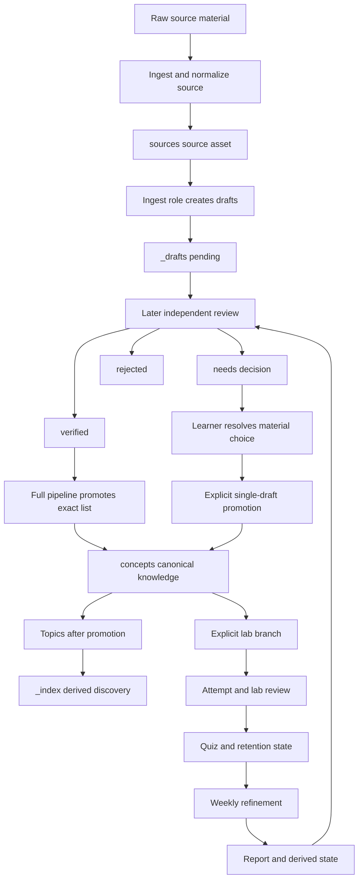

# From Source to Learning Path

This lifecycle turns source material into canonical concepts and learning paths without treating every workflow artifact as published knowledge. The automatic route is narrow: an independent reviewer persists a source-scoped verdict on each draft, and the full dispatcher sends **only** drafts marked `review_status: verified` to promotion. `needs-decision` and `rejected` drafts remain records in `_drafts/`; the learner resolves only material exceptions rather than being asked to fact-check every technical claim.

`concepts/` holds approved, reusable concept content and relationships. `topics/` curates study order over those concepts. Raw intake, normalized sources, drafts, discovery indexes, quiz state, learner predictions, answer keys, generated lab artifacts, and review reports may inform their own workflows, but they are not approval or publication paths. See [Approved Knowledge and Write Boundaries](../architecture/knowledge-governance.md) for the authority model and [Review, Quiz, and Maintenance Loop](review-and-retention.md) for retention details.

## Lifecycle and decision gate



*The full pipeline has an enforced verified-draft selection gate. Learner decisions, practice, and retention can provide signals for later independent review, but none independently publishes knowledge.*

## 1. Normalize a source and create candidates

Run an appropriate ingestion script to place material under `sources/<type>/<slug>/`; the guide lists video, PDF, repository, article, podcast, and EPUB inputs. The new-source role preserves an existing normalized source rather than duplicating it, or completes one from `_inbox/`. A source asset contains `meta.yaml`, `notes.md`, and `highlights.md`; highlights retain a timestamp, page, line, section, or paragraph location where possible.

```bash
./_scripts/ingest-pdf.sh /path/to/document.pdf papers
```

Before drafting, the role reads existing concepts, existing drafts, and the concepts index. It creates between one and ten independently reviewable files in `_drafts/`, each initially `review_status: pending`, with a definition, rationale, and relationship discussion. A likely duplicate or substantial overlap with a canonical concept is recorded as an optional `merge_candidate`; merely related material is not a merge.

This role has a meaningful write boundary: it may write the normalized source, drafts, and regenerate `_index/concepts.md`, but it must not create, modify, or delete `concepts/` files or create quiz questions. Consequently, a source reference, draft, or `[draft]` index entry is not approved knowledge.

## 2. Persist a review verdict and handle exceptions

The reviewer considers only drafts whose frontmatter `source` matches the supplied source path. It may correct unambiguous wording, but may edit no sources, concepts, topics, quiz data, indexes, or unrelated drafts. For every matching draft it records `reviewed_at` and replaces the verification section with evidence and notes alongside exactly one outcome:

| Persisted outcome | Meaning and next action |
| --- | --- |
| `verified` | Material claims are supported, the idea is reusable, and merge intent is clear. It is eligible for the automatic pipeline route. |
| `needs-decision` | Evidence leaves a materially different merge, scope, or learning-priority choice. The reviewer asks the learner one concise question; it is not auto-promoted. |
| `rejected` | The candidate is unsupported, trivial, or a non-distinct duplicate. It stays in `_drafts/` with its reason. |

Review is the factual gate: the learner is not expected to approve unfamiliar technical facts. The learner's role is limited to a genuine material exception. After resolving one, use the explicit single-draft promotion path rather than turning an entire source batch into an override:

```bash
.venv/bin/python3 _scripts/pipeline.py _drafts/<concept-id>.md --step promote
```

Manual promotion is an explicit-user-selection boundary. Pipeline promotion, by contrast, must receive the dispatcher’s exact list and each listed draft must still be `verified`; the prompt prohibits it from scanning `_drafts/` or promoting `pending`, `needs-decision`, or `rejected` drafts.

## 3. Promotion writes the canonical outputs

Promotion reads the selected draft, its source evidence, relevant existing concepts, quiz bank, and indexes. It either creates a formal concept or, when a verified `merge_candidate` has clear reviewer rationale, updates the existing concept while retaining its id. An unclear merge direction returns the draft to `needs-decision` and stops that draft.

A first promotion defaults to `depth: 2`, `lab_status: not-started`, and `review_due` three days from the current date. The formal concept must explain the idea in plain language, include a concrete example, reference valid related concepts, and establish reciprocal backlinks. Promotion also adds at least two quiz entries, normally three, and updates the concept, tag, and applicable topic indexes. It removes the selected draft only after the concept, quiz, index, and backlink work all succeeds; on an incomplete output, the draft remains and the blocker is reported.

The configured full run executes `ingest`, then `review`, then groups matching draft files by their persisted status. If one or more are verified, it passes only their paths to `promote` and calls `topics` only after that promotion succeeds. If none is verified, it skips both steps; `pending` and `needs-decision` drafts are warned as exceptions and rejected drafts are retained with their review notes. An unknown status is conservatively treated as `needs-decision`.

## 4. Curate topics only from promoted concepts

Topics are curated paths with prerequisites and a recommended order. In the normal full lifecycle, topic generation runs only after a successful verified-draft promotion; it should reuse a relevant existing path and create a new topic only when no path covers the domain. Direct `--step topics` remains a dispatcher capability, so this ordering is a workflow rule rather than a general filesystem enforcement mechanism.

`_index/` is derived discovery output. The index generator overwrites its concept, topic, and tag targets: concept and tag discovery intentionally include both canonical concepts and drafts, while the concepts index labels them `active` or `draft`. Regenerate an index from its inputs rather than hand-editing it, and never use index visibility as an approval signal.

## 5. Practice and retention are feedback branches

Labs are excluded from the default source pipeline and require the explicit `lab` step. A lab can use one or more canonical concepts or a concrete integration request. A learner needs only to recognize the main term and state its problem or expected input/output; `depth` and `lab_status` tune the amount of scaffold rather than block practice. If that minimum is absent, the designer adds a brief primer and continues with a more guided lab.

A complete runnable lab belongs in `~/orb_pods_share/<lab-id>/`. The design sequence is `spec.md`, then `spec.diataxis.md`, then a human-review HTML artifact, then a dedicated Cloudflare Pages deployment. The repository recovery capsule at `labs/<lab-id>/` contains only `manifest.yaml` and the canonical `spec.md`; the manifest records identity, linked concepts, external workspace, review URLs, the spec hash, and artifacts to regenerate. Scaffolds, fixtures, `spec.diataxis.md`, predictions, answer keys, generated HTML, output, and secrets remain external. Recovery targets equivalent learning behavior and acceptance criteria, not byte-for-byte artifacts. If deployment is blocked by Wrangler or authentication, retain the local HTML, record the blocker and retry commands, and do not invent a URL.

The learner fills `predictions.md` before running and completes `TODO: YOUR CORE` before review. Lab review stops if either is missing, gives feedback on the existing attempt rather than replacing it, and adds next-day `application` quiz cards for wrong or weak predictions or core work. It may mark included concepts `completed`, or `explained` after a sound layperson explain-back, and may raise depth when mastery is clear. These statuses and cards calibrate subsequent practice and retention; they do not establish new facts, approve drafts, or authorize unrelated canonical changes.

Weekly refinement is a periodic feedback-and-derived-state maintenance workflow, not a promotion route and not an automatic correction mechanism. It reads the vault, the previous refine-log entry, and one consistent current date to identify overdue concepts, stale drafts, possible contradictions, unresolved concept questions, and candidate concepts not yet extracted from sources. The dated report also carries the recommended verification pack: an evidence gap is marked for more evidence, while only materially different alternatives become a single `needs-decision` question.

Its writable surface is closed to `_inbox/refine-report-<YYYY-MM-DD>.md`, `quiz/bank.json`, `_index/concepts.md`, `_index/topics.md`, `_index/tags.md`, and an appended `_index/refine-log.md` entry. It may select a five-to-ten-question weekly review pack when available, regenerate those discovery indexes, and apply SM-2 changes only for questions with actual new answer results or that require rescheduling. A report-only run may validate bank shape, but must not alter schedules merely because it scanned them; history is retained and unrelated questions are not overwritten.

It must not create, modify, move, delete, or promote concepts, and it cannot write drafts or topics. A suspected canonical correction, merge, split, or addition remains a report recommendation for later independent evidence verification and the normal draft-then-promote path. Treat the report, raw sources, drafts, quiz state, and learner artifacts as review signals rather than canonical knowledge.

## Operating the dispatcher safely

```bash
.venv/bin/python3 _scripts/pipeline.py sources/repos/<owner>-<repo> --dry-run
.venv/bin/python3 _scripts/pipeline.py sources/repos/<owner>-<repo>
.venv/bin/python3 -m pytest _scripts/tests/test_pipeline.py -v
.venv/bin/python3 -m pytest _scripts/tests/test_e2e_flow.py -v
```

The runner loads YAML, expands environment variables in strings, selects the first configured agent for a role, renders prompt placeholders, and executes the assembled command through a shell in `kb_root`. A nonzero agent exit stops the active run; a zero exit only reports process success. The runner does not sandbox agent filesystem access, inspect diffs, record a learner decision, or enforce the prompt-level write boundaries. The bundled commands use permission-bypassing flags, so treat the configuration, commands, `kb_root`, and environment as trusted execution input. Use `--dry-run` to inspect dispatch and inspect every resulting diff.

The focused pipeline test verifies source scoping plus the conservative treatment of missing and unknown review statuses. The end-to-end test covers temporary-vault initialization, mocked PDF conversion, metadata validation, promoted-concept and quiz fixtures, and persisted quiz scheduling; it does not execute AI drafting, reviewer decisions, promotion, lab generation, or the dispatcher.

OpenWiki is derived navigation, not an approval mechanism. During the pilot, refresh it manually after reviewing a canonical batch; no scheduled OpenWiki workflow is part of this lifecycle.

## Completion checklist

1. Preserve traceable normalized source material and keep candidates in `_drafts/`.
2. Persist a source-scoped review outcome; automatically promote only `verified` drafts.
3. Send merge, scope, contradiction, and learning-priority exceptions to the learner, and use explicit single-draft selection after a decision.
4. Confirm promotion completed canonical content, reciprocal links, quiz additions, and indexes before its draft is removed.
5. Generate or revise topic paths after promotion and treat indexes as derived discovery only.
6. Keep complete labs and review artifacts external; retain only manifests and canonical specs in repository recovery capsules.
7. Treat lab results and retention reports as feedback, not evidence of approved knowledge, and refresh OpenWiki manually during the pilot.
