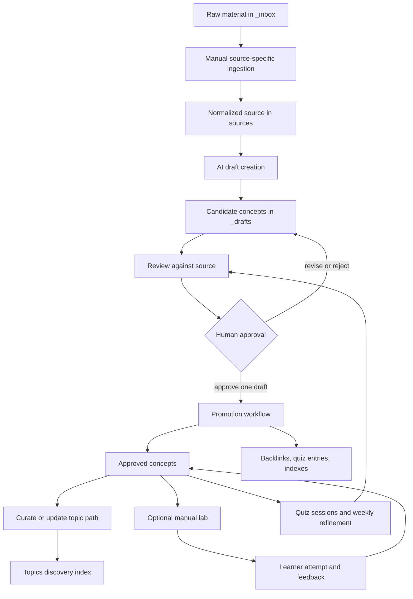

# From Source to Learning Path

The vault turns source material into durable learning in stages, not in one automated write. Raw material is normalized for traceability, an agent proposes candidate concepts, a person decides whether a candidate may become canonical knowledge, and only then do concept relationships, quiz material, discovery indexes, and topic curation make it easier to learn and revisit that knowledge. The key invariant is simple: **an AI-generated candidate belongs in `_drafts/`; a concept in `concepts/` requires human approval.**

For the authority model behind this workflow, see [Approved Knowledge and Write Boundaries](../architecture/knowledge-governance.md). For script operation and structural validation, see [Automation, Validation, and Safe Change Surfaces](../operations/automation-and-validation.md).

## Lifecycle at a glance



*The path separates candidate creation from human-approved promotion, then connects approved knowledge to curriculum, practice, and recurring review.*

## 1. Ingest: normalize the source before asking for concepts

Start with raw material in `_inbox/` and run the appropriate source-specific script. The workflow guide supplies entrypoints for video, PDF, repository, article, podcast, and EPUB inputs; an ingester places normalized material under a typed `sources/` directory. For example, PDF ingestion validates the file and requested destination type, requires `pdftotext` or `marker`, rejects empty conversion output, derives a slug, writes `meta.yaml` and notes, and splits content over 1 MiB into note parts. Resolve these failures before drafting: a successful agent run cannot compensate for missing or unusable source text.

```bash
./_scripts/ingest-pdf.sh /path/to/document.pdf papers
```

The source-processing prompt then turns normalized material into a reviewable source asset. It requires a `sources/<type>/<slug>/` directory with `meta.yaml`, `notes.md`, and `highlights.md`; highlights retain a timestamp, page, line, section, or paragraph reference so a reviewer can return to the source. Before proposing concepts, the agent reads existing concepts, existing drafts, and the concept index. That comparison is intended to avoid duplicate candidates and to mark a likely overlap as `merge_candidate` rather than silently creating another concept.

## 2. Draft: AI may propose knowledge, but it may not publish it

The draft agent selects durable, independently reviewable ideas rather than summarizing every passage. It writes between one and ten candidate files to `_drafts/<concept-id>.md`, each with identity, title, source reference, draft status, creation date, and a short definition, rationale, and relationship discussion. It also adds draft entries to `_index/concepts.md` and records the new or related identifiers in the source metadata.

This is a deliberately constrained write boundary. The new-source prompt permits writes to `sources/`, `_drafts/`, and the draft index, but expressly forbids creating, changing, or deleting `concepts/` and forbids quiz creation. An index may display a draft, and a source may list it as related, but neither makes it approved knowledge.

## 3. Review and approval: preserve the human decision point

Review checks each candidate against the original source: its one-sentence definition, why it matters, relationships, factual errors, omissions, and misleading simplifications. The configured review instruction produces an `APPROVE`, `REVISE`, or `REJECT` assessment; revisions can be corrected manually or by a subsequent agent pass. **Only a person should decide that a particular reviewed draft is approved for promotion.** Rejection or revision leaves the canonical concept layer unchanged.

The default pipeline can dispatch review and promotion consecutively, but that convenience is not authorization. `pipeline.py` only interpolates a role prompt, launches the configured command in `kb_root`, and interprets the agent process exit status. It neither records a human approval nor verifies that resulting files respect prompt-level write restrictions. In particular, the bundled commands use permission-bypassing flags. Run review as a separate step, inspect its verdict and resulting diff, make the human approval explicit, and then dispatch promotion for the selected draft.

```bash
.venv/bin/python3 _scripts/pipeline.py --step review
.venv/bin/python3 _scripts/pipeline.py sources/papers/my-paper --step promote
```

## 4. Promote: make one approved candidate canonical and connected

Promotion is a per-draft operation, not a reason to sweep every file in `_drafts/`. The promotion prompt reads the selected candidate, its source, current concepts, quiz bank, and indexes. It either creates `concepts/<category>/<concept-id>.md` or resolves an explicit `merge_candidate`; absent a user instruction to create a separate duplicate, its conservative default is to update the existing concept and add the source.

A newly promoted concept has a stable id, source list, related ids, tags, depth, review date, and hands-on `lab_status`. The prompt defaults first promotion to `depth: 2`, `lab_status: not-started`, and `review_due` three days after promotion. It also requires a plain-language explanation and at least one concrete example. Each related concept must gain the reciprocal frontmatter/body link, so the approved concept graph remains navigable in both directions.

Promotion also turns the concept into learning material: it adds at least two quiz entries (normally three) with answers, explanations, and initial spaced-repetition fields, moves the concept from Draft to Active in the concept index, updates tags and applicable topic navigation, and then removes the selected draft. Draft deletion is intentionally last: if the formal concept, quiz entries, indexes, or necessary backlinks cannot be completed, the candidate must remain in `_drafts/` and the blocker should be reported.

## 5. Curate topics and regenerate discovery surfaces

A topic is not merely a tag. `topics/` holds curated learning paths that link approved concepts in a recommended study order and include prerequisites. After promotion, the topics role examines recently promoted concepts from the source, updates a path where the concepts fit, and creates a new topic only when no existing path covers the domain. It then updates `_index/topics.md`.

Treat `_index/` as regenerated discovery output rather than the source of truth. `index_generator.py` scans `concepts/` as active and `_drafts/` as draft, scans `topics/` for topic entries, and groups tags from both concepts and drafts; every generator overwrites its target. Regenerate all affected indexes after a canonical or topic change. Because indexes intentionally include drafts and tolerate sparse metadata, index visibility must never be read as evidence of approval.

## 6. Learn by building, then feed feedback into retention

Labs are an optional, manual-only branch from an approved concept or a concrete integration request; they are not part of the default source pipeline. The lab agent can create a fading-scaffold exercise under `labs/<lab-id>/` and a sanitized review site, but the learner manually reviews the exercise, records predictions before execution, fills the stubbed core, and compares the work with the expected result. Sensitive predictions, answer keys, completed cores, credentials, and generated review artifacts must not be published.

The separate lab-review workflow starts only after a learner attempt. It stops on blank predictions or an unfilled core, provides feedback rather than replacing the learner's work, adds next-day application cards for demonstrated gaps, and can advance each included concept's `lab_status` to `completed` or `explained`. A strong explain-back may justify raising `depth`; a struggling attempt calls for more scaffold or a smaller lab. The [Hands-On Lab Catalog](../labs/catalog.md) lists the available canonical lab entrypoints and their operational constraints.

Quiz sessions and weekly refinement close the loop. The refinement prompt reads concepts, drafts, sources, topics, quiz data, and indexes, identifies overdue concepts, stale drafts, contradictions, questions, and potential missing concepts, and writes a dated report plus a refine log. It may update quiz scheduling and regenerate indexes, but it may not edit concepts or directly promote drafts; any canonical correction remains a recommendation for human review. This makes retention signals and maintenance reports inputs to the next review decision, not an alternate promotion route.

## Automated versus manual responsibilities

| Activity | Primary mechanism | Automation boundary | Human responsibility |
| --- | --- | --- | --- |
| Intake and normalization | Source-specific ingest scripts | Converts and stores source artifacts; external-tool failures stop this stage. | Choose source, run the applicable script, resolve conversion/dependency failures. |
| Candidate creation | `new-source.md` through the ingest role | Produces source assets and `_drafts/` candidates only. | Inspect candidate quality and duplicates. |
| Accuracy review | Review role/prompt | Produces a proposed `APPROVE`, `REVISE`, or `REJECT` verdict. | Verify against the source and explicitly approve or withhold promotion. |
| Canonical promotion | `promote-concept.md` | Writes the selected concept and connected learning records; retains draft on incomplete outputs. | Select the approved draft and resolve merge intent. |
| Curriculum curation | Topics role plus `topics/` | Suggests/updates paths and indexes. | Decide whether the sequence and prerequisites teach the intended path. |
| Practice and feedback | Explicit `--step lab` and lab review | Generates a scaffold; review can add targeted cards and update included learning status. | Attempt the exercise first, keep private artifacts private, judge readiness. |
| Maintenance | `weekly-refine.md` | Reports issues, adjusts quiz state, and regenerates indexes. | Review proposed canonical changes; never treat maintenance as promotion. |

## Operating the dispatcher safely

The default full run is `ingest → review → promote → topics`; it excludes quiz sessions, labs, and weekly refinement. The runner obtains each role's first matching agent and prompt from `pipeline.yml`, expands environment references in configuration strings, substitutes `{source_dir}` and `{kb_root}`, and stops the sequence on a missing agent/prompt or nonzero process exit. `--dry-run` prints the chosen dispatch without executing it. `max_concurrent` appears in the bundled configuration but the runner does not enforce it.

```bash
# Inspect the configured normal sequence before execution.
.venv/bin/python3 _scripts/pipeline.py sources/papers/my-paper --dry-run

# Use a controlled configuration when changing agents or prompts.
.venv/bin/python3 _scripts/pipeline.py sources/papers/my-paper --config my-pipeline.yml
```

`pipeline.yml` is therefore a trusted execution surface: agent commands run through a shell in `kb_root`, with configured environment overrides. Keep configuration and its environment inputs trusted, preview changes, and inspect the working-tree diff after every agent step. The strongest safety control remains the process boundary—human approval before promotion—not the dispatcher.

## Checks and failure boundaries

Structural validation is useful but intentionally narrow. `validate_source_meta`, `validate_concept_frontmatter`, and `validate_quiz_entry` return diagnostics for unreadable or malformed inputs and missing required fields. They do not validate types, dates, allowed values, unique ids, cross-record links, or factual correctness. Use them as a fast gate alongside source review and relationship inspection.

Focused regression tests make the boundaries executable:

```bash
.venv/bin/python3 -m pytest _scripts/tests/test_metadata_validator.py -v
.venv/bin/python3 -m pytest _scripts/tests/test_index_generator.py -v
.venv/bin/python3 -m pytest _scripts/tests/test_e2e_flow.py -v
```

The end-to-end test initializes a temporary vault, uses a mocked PDF converter to exercise ingestion, validates normalized source metadata, supplies a promoted concept and quiz bank fixture, and verifies quiz-session scheduling updates. It checks compatibility across those persisted states, but does **not** run AI drafting/review/promotion or demonstrate that agents obey prompt restrictions. There is likewise no direct test of `pipeline.py`; use `--dry-run` and a safe custom configuration when changing dispatch behavior.

## Completion checklist

Before calling a source complete, confirm:

1. The normalized source has traceable metadata and notes/highlights, and ingestion failures were resolved.
2. Candidate concepts exist only in `_drafts/` until a person has reviewed and approved each one.
3. Any `merge_candidate` has an explicit human resolution.
4. Promotion completed its concept, reciprocal relationship, quiz, and index work before draft removal.
5. Topic changes describe a real learning order over approved concepts, not a path assembled from draft visibility.
6. Generated indexes were regenerated and inspected rather than hand-edited as canonical records.
7. Labs and weekly refinement have not bypassed approval, exposed private learner material, or silently rewritten canonical concepts.
