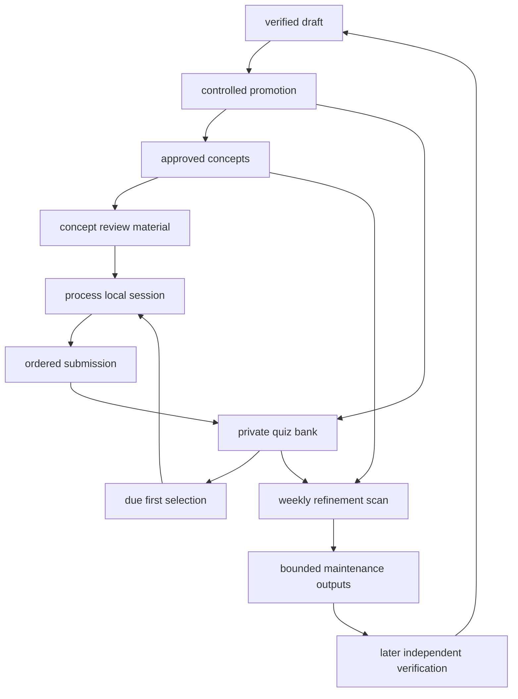

# Review, Quiz, and Maintenance Loop

Review is a private learning loop around approved concepts, not a second publication path. Promotion is the controlled workflow that may create canonical concept content and initialize related private quiz entries. A quiz session can read limited context from canonical concepts and update retention state in the quiz bank, while weekly refinement can identify maintenance work and recommend later action. Neither workflow can establish, alter, merge, split, or promote approved knowledge.

`quiz/`, `_drafts/`, `_inbox/`, and `sources/` are excluded from OpenWiki inputs. This page therefore documents interfaces, boundaries, and operational behavior only. It does not disclose private quiz prompts, expected answers, response records, learner predictions, or refinement-report content. For canonical ownership, see [Approved Knowledge and Write Boundaries](../architecture/knowledge-governance.md); for the wider publication lifecycle, see [From Source to Learning Path](knowledge-lifecycle.md).

## Entry points and ownership

The interactive entry point is:

```bash
.venv/bin/python3 -m _scripts.quiz_cli --count 10
```

`_scripts/quiz_cli.py` accepts `--count`, `--concept`, `--bank`, and `--kb-root`, then delegates session startup, sequential retrieval and submission, and final aggregation to `_scripts/quiz_session.py`. It is a terminal adapter, not a separate scoring or persistence implementation. Other interfaces can use `start_session(bank_path, kb_root, count, concept_id, today)` directly.

A full source pipeline only supplies source-scoped drafts whose persisted `review_status` is `verified` to promotion. The promotion contract may update the quiz bank as part of completing promoted-concept work, but quiz state does not make a draft eligible or authorize a canonical edit. A manual promotion is likewise an explicit single-draft selection boundary.



*Promotion establishes the canonical and private inputs. Sessions update retention state, while weekly refinement returns only recommendations to the verification path.*

## Selection and concept context

Session startup selects up to the requested count. It partitions bank entries by `next_review` against the effective ISO date, sorts due and future groups by date and id, and takes due entries before future entries. A concept filter is applied before that limit. A non-positive count returns no entries. The selection logic assumes zero-padded `YYYY-MM-DD` values; missing `next_review` is treated as due by the review-pack helpers, while the standalone scheduler skips a missing date and parses present dates strictly.

For each selected `concept_id`, the session first looks for `concepts/<concept_id>.md`, then searches canonical concept frontmatter for a matching `id`. It constructs review material from the concept title, summary, relationships, and source references. Both `related_concepts` and canonical `related` are supported. A missing concept does not abort the session: it produces empty fallback material tied to the requested id. This is a read-only use of canonical knowledge.

The bank helpers accept either a top-level list or an object containing `questions` and preserve that shape on session writes. The standalone scheduler requires the object form. `add_questions` checks only that required fields exist before appending; it is not semantic, referential, date-format, or uniqueness validation.

## Session lifecycle and privacy boundary

`SESSION_STORE` is a module-level, in-memory store keyed by generated session ids. It holds the selected snapshot, cursor, session-local result metadata, and review materials only for the current Python process. A restart or another worker cannot resume a session; durable or multi-client use needs an explicit session-store extension.

The question-facing API exposes a public representation without the stored expected answer, and retrieval does not advance the cursor. Submission is accepted only for the next pending id; an out-of-order id or a submission after completion raises `ValueError`. Multiple-choice evaluation uses normalized equality, while short-answer and application entries require caller-supplied self-evaluation. This is intentionally a workflow policy rather than automated free-text grading.

On a successful submission, the service applies the scheduling update to the selected session entry, advances the cursor, reloads the bank, replaces the matching id, and writes it back. If the entry disappears from the reloaded bank, it raises rather than changing another entry. This is an unlocked read-modify-write sequence, so concurrent sessions or external writers can lose updates; atomic persistence or coordination is required before supporting them.

## Scheduling behavior

The simplified scheduler normalizes an entry with a one-day default interval, a default ease factor of `2.5`, and an ease floor of `1.3`. A correct result multiplies the interval by ease; an incorrect result resets the interval to one day and reduces ease by `0.2` without crossing the floor. It then derives the next review date from the resulting interval.

The session persistence path rounds the resulting interval to a positive integer and recalculates `next_review`. The direct scheduler helper can retain a fractional interval, so these two update APIs have observably different persistence behavior. Preserve that distinction, or intentionally unify it with tests, when changing scheduling.

## Weekly refinement: bounded maintenance, not promotion

`_scripts/prompts/weekly-refine.md` defines a periodic agent workflow, separate from the source dispatcher. It reads the complete specified vault state: `concepts/**/*.md`, `_drafts/**/*.md`, source metadata and Markdown, `topics/**/*.md`, `quiz/bank.json`, and the three discovery indexes. It also reads the final entry of `_index/refine-log.md` when present. One `YYYY-MM-DD` current date must be used consistently for overdue checks, output naming, scheduling updates, and the appended log record.

The scan identifies maintenance signals across those inputs, including overdue concepts, stale drafts, possible inconsistencies, unresolved concept questions, and source-derived candidates. It may select a due-first weekly review pack of five to ten entries when available, choosing the earliest due entries when there are too many and flagging an undersized pool. Its dated private report may recommend later independent verification or a decision; insufficient evidence is marked for further evidence, and `needs-decision` is reserved for materially different alternatives. These recommendations are not canonical changes.

Its prompt-authorized write surface is closed to a dated `_inbox/refine-report-<YYYY-MM-DD>.md`, `quiz/bank.json`, `_index/concepts.md`, `_index/topics.md`, `_index/tags.md`, and an appended `_index/refine-log.md` record. It must not create, modify, delete, move, or promote anything in `concepts/`, nor directly promote a draft. A suspected correction, merge, split, or new concept must remain a recommendation for later independent evidence verification and the normal promotion path.

Quiz maintenance is conditional on actual new answer results. For a relevant entry, the prompt requires the simplified scheduling update while retaining existing private records and leaving unrelated entries' scheduling fields alone. A report-only scan may check bank format, but it must not reschedule entries merely because they were scanned. This no-rescheduling-without-results rule prevents maintenance activity from fabricating learning evidence.

The restriction is prompt policy, not a filesystem sandbox. `pipeline.py` renders configured prompts and runs the configured command through `shell=True` in `kb_root`; a zero exit indicates process completion, not that output changes were inspected or validated against the prompt. Treat agent commands, configuration, environment, and root path as trusted execution inputs, use `--dry-run` where applicable, and inspect the resulting diff.

## Change and validation guide

Use focused tests when modifying this loop:

```bash
.venv/bin/python3 -m pytest _scripts/tests/test_quiz_session.py -v
.venv/bin/python3 -m pytest _scripts/tests/test_sm2_scheduler.py -v
.venv/bin/python3 -m pytest _scripts/tests/test_quiz_manager.py -v
.venv/bin/python3 -m pytest _scripts/tests/test_quiz_cli.py -v
.venv/bin/python3 -m pytest _scripts/tests/test_metadata_validator.py -v
```

The session tests cover due-first selection, concept filtering, concept-context fallback, ordered API use, scheduling persistence, and aggregate accounting. Scheduler tests cover both update branches, the ease floor, due-date filtering, persistence, and an unknown id. Manager tests cover bounded deterministic selection and validated appends; CLI tests ensure the adapter delegates to the session API. Metadata validation is a companion for required bank fields, not proof of scheduling correctness or concurrent-write safety.

When extending the loop:

1. Keep transport-specific interaction in the CLI or a new adapter and call the session API rather than duplicating selection, evaluation, or scheduling behavior.
2. Add durable, scoped session storage and atomic bank updates before allowing restart recovery or parallel clients.
3. Treat automated free-text assessment as a new grading capability; do not silently replace explicit self-evaluation.
4. Send refinement signals through independent verification and promotion; never make retention activity a canonical mutation path.
5. Keep private assessment data and refinement reports excluded from OpenWiki, even when they inform operational work.

For dispatcher invocation and safe-change limits, see [Automation, Validation, and Safe Change Surfaces](../operations/automation-and-validation.md). The [Hands-On Lab Catalog](../labs/catalog.md) is a separate practice workflow and is not required to run or complete a quiz session.
