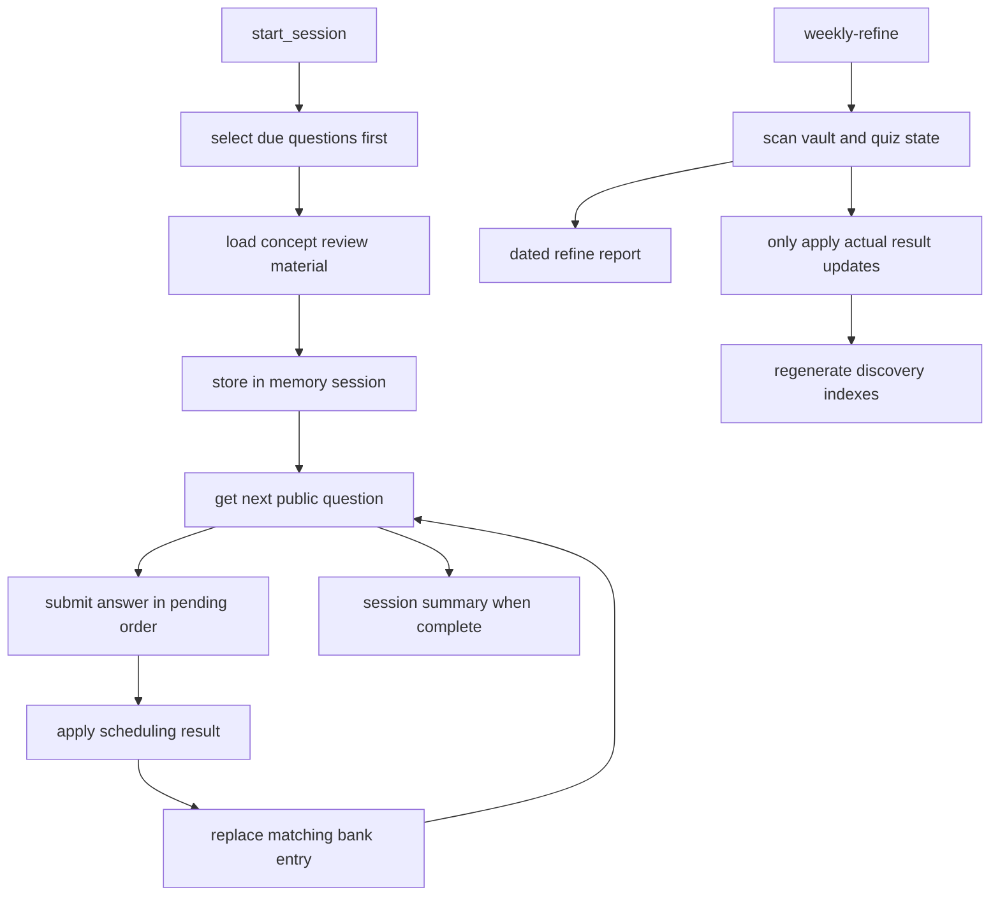

# Review, Quiz, and Maintenance Loop

Review is a supporting learning loop around approved concepts, not a second publication path. A session selects questions from a private quiz bank, loads lightweight context from the corresponding canonical concept files, records a result in the bank, and schedules the next encounter. Periodic refinement examines broader vault state and produces recommendations, but cannot change approved concept content. In OpenWiki, `quiz/` is excluded input: this page documents interfaces and invariants only—never question content, answer keys, attempt history, or learner predictions.

For the ownership boundary, see [Approved Knowledge and Write Boundaries](../architecture/knowledge-governance.md); for the wider draft-to-promotion lifecycle, see [From Source to Learning Path](knowledge-lifecycle.md).

## Responsibilities and entrypoints

The terminal entrypoint is:

```bash
.venv/bin/python3 -m _scripts.quiz_cli --count 10
```

`_scripts/quiz_cli.py` parses `--count`, `--concept`, `--bank`, and `--kb-root`, starts a session, presents concept review material, iterates over pending questions, submits each result, and prints an aggregate summary. The CLI is deliberately a presentation adapter: it delegates selection, sequencing, scoring, scheduling, and bank persistence to `_scripts/quiz_session.py`. This separation makes the core callable by another interface, while the current session implementation is still an in-process service rather than a durable multi-client backend.

`start_session(bank_path, kb_root, count, concept_id, today)` is the programmatic start point. It returns an opaque session id, concept materials, total count, and a metadata-only question preview. A `--concept` value filters the bank before limiting the result set. Without that filter, selection is delegated to `get_review_pack`; both paths prioritize due entries and use future entries only to fill the requested count. Non-positive counts yield no questions.



*The interactive path selects and evaluates one question at a time, while weekly refinement reports and maintains derived state without publishing quiz content.*

## Concept context and question selection

A selected question identifies a concept by `concept_id`. The session resolves a matching Markdown file in `concepts/`: it first tries `concepts/<concept_id>.md`, then recursively looks for frontmatter with the same `id`. It exposes only a concept-oriented review material object: title, a summary extracted from a `## Summary` or `## 摘要` section (falling back to the first body paragraph), related concepts, and source references. It accepts either `related_concepts` or the canonical `related` frontmatter spelling. If the concept file is missing, the session preserves the question's concept id with empty supporting fields instead of rejecting the session.

The review-pack policy partitions questions by `next_review` relative to the supplied/current ISO date, sorts each partition by date and id, and takes due entries before future ones. This works correctly only when `next_review` follows zero-padded `YYYY-MM-DD` ordering; the pack helper treats absent values as empty strings, effectively placing them in the due partition. The standalone scheduler is stricter for its due query: it ignores a missing `next_review` but parses present values as dates.

The bank reader accepts either a top-level list or an object containing `questions`, preserving that outer shape when the session writes. In contrast, the standalone scheduler's file operations require the object-with-`questions` form. `add_questions` validates required fields before appending, but neither it nor the metadata validator verifies semantic validity such as date formats, allowed question types, unique ids, or whether `concept_id` resolves to an approved concept. Treat structural validation as a fast precondition, not as content or referential integrity assurance.

## Session state, ordering, and disclosure boundary

Despite being independent of terminal and network I/O for interaction, quiz sessions are **not stateless across process lifetime**. `SESSION_STORE` is a module-level in-memory dictionary keyed by UUID-like ids. It retains a snapshot of selected questions, a cursor, per-question result metadata, and review materials only while that Python process remains alive; a restart or a different worker cannot recover a session. Callers must therefore keep the session id and complete the session in the same process, or provide a persistence/session-service layer as an extension.

The question-facing API enforces a narrower disclosure surface. `get_next_question` returns only the current question's identifying and presentation metadata, prompt, and optional choices; it does not include the stored answer. It neither advances the cursor nor skips a question. `submit_answer` accepts only the id of that next pending question: a completed session or an out-of-order/mismatched id raises `ValueError`, preventing duplicate or reordered submissions through the normal API. Multiple-choice evaluation compares normalized submitted text to the stored expected value; short-answer and application questions require an explicit caller-supplied self-evaluation. This is a workflow policy, not automated natural-language grading.

A successful submission updates the session copy, advances the cursor, reloads the bank, replaces the matching entry by id, and writes the bank back. If that id is no longer in the reloaded file, it raises rather than writing an unrelated record. There is no locking, transaction, or compare-and-swap protection around that read-modify-write cycle, so concurrent sessions or external edits to the same bank require a future synchronization boundary to avoid lost updates.

## Simplified SM-2 retention update

Scheduling belongs to `_scripts/sm2_scheduler.py`. It copies and normalizes a question before each update: the default interval is one day, the default ease factor is 2.5, the ease factor cannot be below 1.3, and history must be list-shaped. A correct result multiplies the current interval by ease without lowering ease. An incorrect result resets the interval to one day and lowers ease by 0.2, subject to the 1.3 floor. Both outcomes stamp the attempt date, append one result record, and derive `next_review` from the resulting interval.

The session path deliberately adds a persistence-friendly normalization after invoking that helper: it rounds the interval to an integer and clamps it to at least one before recalculating `next_review`. The direct scheduler update path does not round first, so the two APIs can differ for fractional intervals. Preserve this distinction—or unify it intentionally with updated tests—when changing scheduling behavior.

The resulting session summary is aggregate session data: total selected, counts by outcome, accuracy, covered concept ids, and the next-review date for submitted entries. It is useful to the active caller but is not canonical learning knowledge and must not be copied into OpenWiki.

## Weekly refinement: maintenance, not promotion

`_scripts/prompts/weekly-refine.md` defines a periodic agent workflow over concepts, drafts, sources, topics, indexes, and the quiz bank. It reads the previous refinement log and uses one consistent `YYYY-MM-DD` current date for overdue detection, report naming, rescheduling, and logging. It identifies overdue concepts, stale drafts, possible contradictions, unanswered concept questions, and candidate topics; it also selects a weekly review pack of five to ten when available, prioritizing the earliest due items and flagging an undersized pool.

Its write scope is intentionally narrow: a dated report in `_inbox/`, `quiz/bank.json`, the three generated discovery indexes, and an appended `_index/refine-log.md` record. It must not create, change, move, delete, or promote `concepts/` content. A detected canonical inconsistency therefore becomes a concrete recommendation for human review, never an automatic correction. Likewise, a scan without new answer results may check the bank's format but must not arbitrarily reschedule questions.

The prompt specifies that a result update preserves existing history and changes only the relevant question's schedule fields. In a production-safe refinement run, review the diff for adherence to that prompt contract: as with other configured agents, the repository's orchestration does not itself provide a filesystem sandbox that enforces every stated writer restriction. Keep quiz material and reports excluded from OpenWiki even when the report is used operationally.

## Change and validation guide

Use focused tests when modifying this loop:

```bash
.venv/bin/python3 -m pytest _scripts/tests/test_quiz_session.py -v
.venv/bin/python3 -m pytest _scripts/tests/test_sm2_scheduler.py -v
.venv/bin/python3 -m pytest _scripts/tests/test_quiz_manager.py -v
.venv/bin/python3 -m pytest _scripts/tests/test_quiz_cli.py -v
.venv/bin/python3 -m pytest _scripts/tests/test_metadata_validator.py -v
```

The session tests exercise end-to-end selection, concept filtering, metadata-only public questions, history/schedule updates, and aggregate accounting across generated question sets. Scheduler tests cover both outcomes, the ease floor, due-date filtering, persistence, and unknown ids. Manager tests cover due-first ordering, deterministic truncation, and appending valid entries; CLI tests ensure the adapter drives the session API. The metadata tests are the right companion when altering required bank fields, but they cannot establish scheduling correctness or protect against concurrent writers.

When extending the system, preserve these boundaries:

1. **UI adapter:** keep input/output policy in the CLI or a new transport and call the session API rather than duplicating scoring or update rules.
2. **Durability and concurrency:** replace or wrap `SESSION_STORE` with an explicit persistent, scoped store and make bank updates atomic before supporting restarts or parallel clients.
3. **Assessment policy:** automated free-text evaluation is an intentional new grading capability; do not silently substitute it for the current self-evaluation requirement.
4. **Canonical governance:** use refinement signals to request review, and keep promotion/approved-concept mutation on the human-approved path described in [knowledge governance](../architecture/knowledge-governance.md).
5. **Documentation privacy:** do not add bank contents, answer material, histories, predictions, or reports to canonical OpenWiki inputs; `.openwikiignore` explicitly excludes `quiz/` along with other noncanonical workflow data.

For script invocation and the limits of validation and agent enforcement, see [Automation, Validation, and Safe Change Surfaces](../operations/automation-and-validation.md). The [Hands-On Lab Catalog](../labs/catalog.md) is a separate practice workflow; it is not required to start or complete a quiz session.
