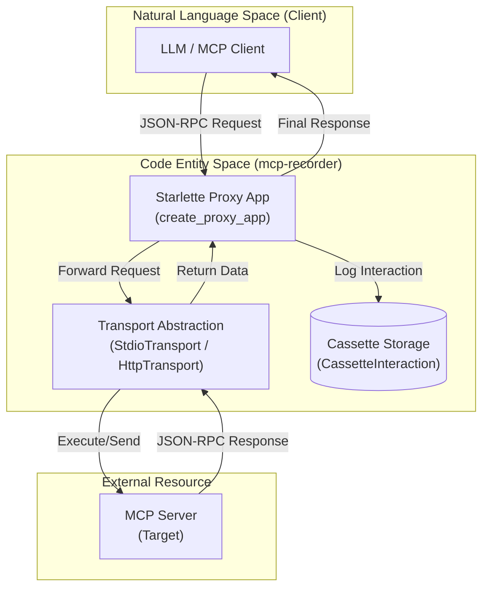
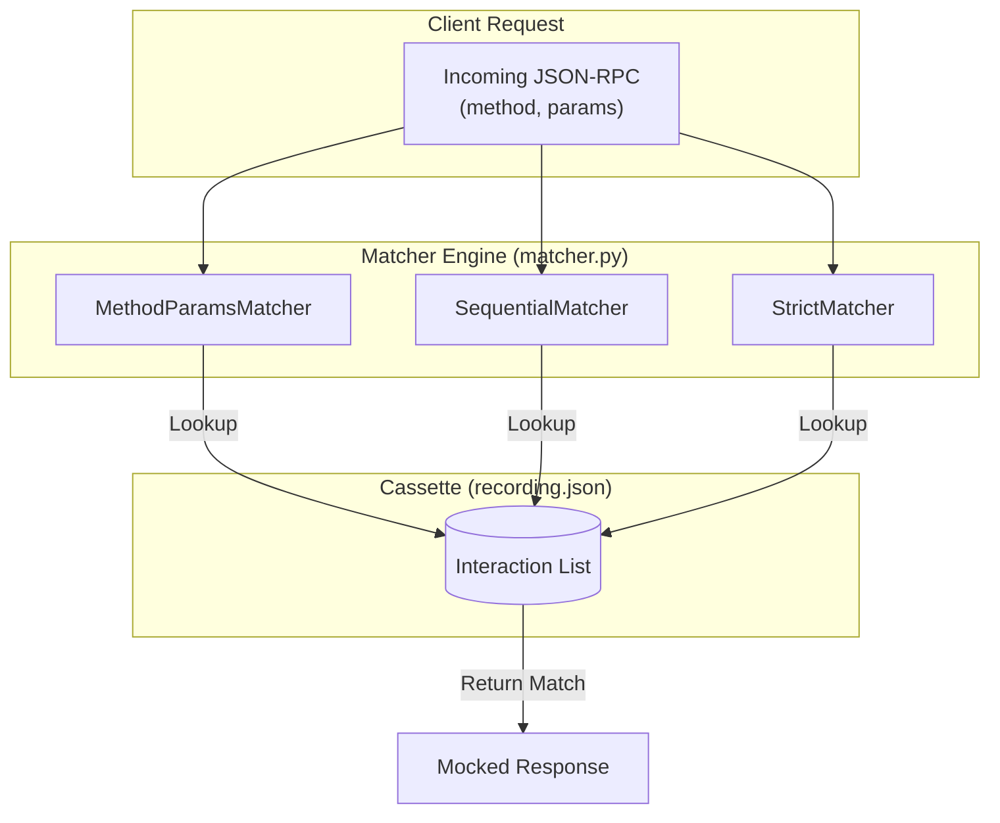

The `mcp-recorder` system is designed as a modular interceptor for the Model Context Protocol (MCP). It functions by placing a programmable proxy or a controlled client between an MCP client (like an LLM interface) and an MCP server.

The architecture is built around four primary subsystems that handle the lifecycle of an MCP interaction: **Transport**, **Proxy**, **Matcher**, and **Verifier**.

### System Overview and Data Flow

The following diagram illustrates how these components interact during a recording session. The `RecordSession` [src/mcp_recorder/mcp_client.py:204-210]() orchestrates the lifecycle, while `create_proxy_app` [src/mcp_recorder/proxy.py:34-40]() handles the data flow.

#### Logic Flow: Recording Mode

**Sources:** [src/mcp_recorder/proxy.py:34-150](), [src/mcp_recorder/transport.py:16-30](), [src/mcp_recorder/_types.py:75-95]()

---

### Transport Layer
The **Transport Layer** provides a unified interface for communicating with MCP servers, regardless of whether they are remote HTTP/SSE services or local subprocesses. All communication is abstracted through the `Transport` base class [src/mcp_recorder/transport.py:16-30]().

*   **`HttpTransport`**: Manages Server-Sent Events (SSE) connections and handles `mcp-session-id` headers for session persistence [src/mcp_recorder/transport.py:133-145]().
*   **`StdioTransport`**: Spawns the MCP server as a subprocess using `asyncio.create_subprocess_exec` and manages `stdin`/`stdout` streams [src/mcp_recorder/transport.py:33-50]().

For details, see [Transport Layer](#2.1).

**Sources:** [src/mcp_recorder/transport.py:16-160]()

---

### Proxy (Recording Engine)
The **Proxy** is the core of the `record` command. It uses `create_proxy_app` to build a Starlette-based ASGI application that acts as a reverse proxy [src/mcp_recorder/proxy.py:34-50]().

It intercepts incoming JSON-RPC traffic, classifies it into `InteractionType` (e.g., `JSONRPC_REQUEST`, `NOTIFICATION`) [src/mcp_recorder/_types.py:17-25](), and captures both the request and response into a `Cassette` object. It also handles the complexities of SSE stream capturing, ensuring that asynchronous events from the server are recorded in sequence.

For details, see [Proxy (Recording Engine)](#2.2).

**Sources:** [src/mcp_recorder/proxy.py:34-150](), [src/mcp_recorder/_types.py:17-25]()

---

### Replay Engine and Matcher
During replay, the system does not contact the real server. Instead, `create_replay_app` [src/mcp_recorder/replayer.py:17-30]() uses a `BaseMatcher` to find the most appropriate response in a loaded `Cassette`.

#### Logic Flow: Replay Matching

**Sources:** [src/mcp_recorder/matcher.py:12-110](), [src/mcp_recorder/replayer.py:17-80]()

The `Matcher` engine supports multiple strategies, including `MethodParamsMatcher` for flexible lookups and `SequentialMatcher` for strict ordering of identical calls [src/mcp_recorder/matcher.py:46-110]().

For details, see [Replay Engine and Matcher](#2.3).

**Sources:** [src/mcp_recorder/matcher.py:12-110](), [src/mcp_recorder/replayer.py:17-80]()

---

### Verifier and Scrubber
The **Verifier** is used for regression testing. The `run_verify` function [src/mcp_recorder/verifier.py:133-150]() executes the same sequence of calls found in a cassette against a live server and compares the results.

The **Scrubber** [src/mcp_recorder/scrubber.py:11-25]() is a post-processing utility that runs after recording. It uses `scrub_cassette` to remove volatile data (like timestamps) or sensitive information (like API keys) based on regex patterns or environment variables before the cassette is saved to disk [src/mcp_recorder/scrubber.py:80-100]().

For details, see [Verifier and Scrubber](#2.4).

**Sources:** [src/mcp_recorder/verifier.py:133-180](), [src/mcp_recorder/scrubber.py:11-100]()