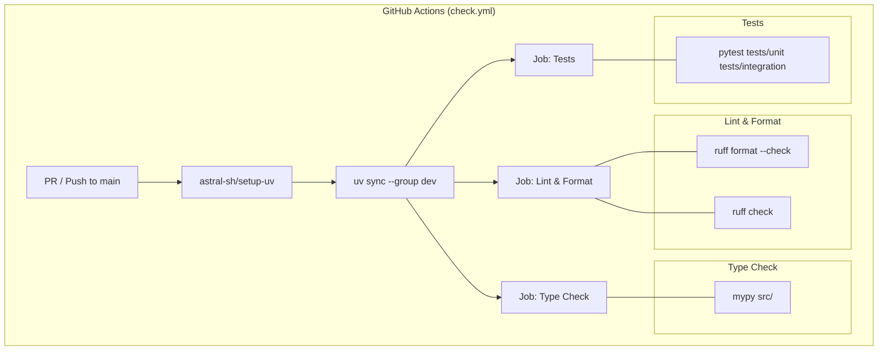
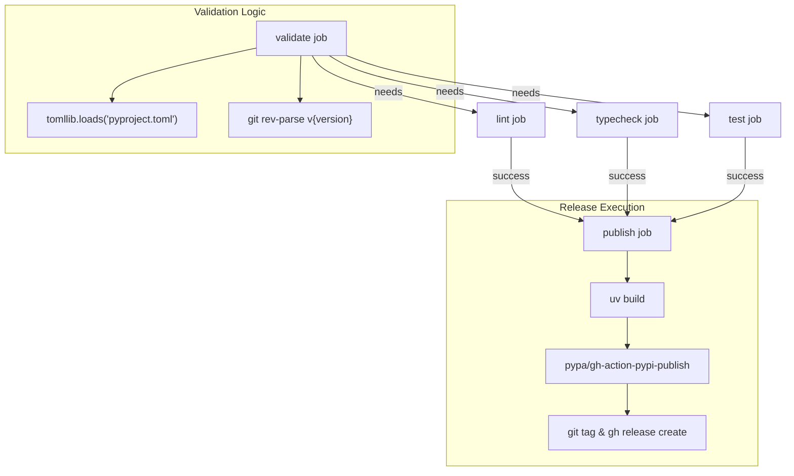

The `mcp-recorder` project utilizes GitHub Actions to automate code quality enforcement, testing, and distribution. The pipeline ensures that every contribution adheres to formatting standards, passes type safety checks, and maintains functional integrity through unit and integration tests.

## Continuous Integration (Check Workflow)

The `check.yml` workflow is the primary CI gatekeeper. It executes on every `pull_request` and every `push` to the `main` branch [.github/workflows/check.yml:3-6]().

### Concurrency Management
To optimize resource usage and provide faster feedback, the workflow employs a concurrency group based on the workflow name and the git reference [.github/workflows/check.yml:8-9](). If a new commit is pushed to the same PR while a previous run is still active, the older run is automatically canceled [.github/workflows/check.yml:10]().

### Job Structure
The CI pipeline is divided into three parallel jobs, all running on `ubuntu-latest` and utilizing `astral-sh/setup-uv` for dependency management [.github/workflows/check.yml:12-63]().

| Job | Purpose | Command |
| :--- | :--- | :--- |
| **Lint & Format** | Verifies code style using Ruff. | `uv run ruff format --check` & `uv run ruff check` [.github/workflows/check.yml:26-30]() |
| **Type Check** | Enforces static typing via mypy. | `uv run mypy src/` [.github/workflows/check.yml:46]() |
| **Tests** | Executes the full test suite. | `uv run pytest tests/unit tests/integration -v` [.github/workflows/check.yml:62]() |

### CI Execution Flow
The following diagram illustrates the flow of the `check.yml` workflow and its interaction with the development environment managed by `uv`.

**CI Pipeline Data Flow**

**Sources:** [.github/workflows/check.yml:1-63]()

---

## Continuous Deployment (Publish Workflow)

The `publish.yml` workflow automates the release process to PyPI. It is triggered manually via `workflow_dispatch` and requires a `version` input (e.g., `0.2.0`) [.github/workflows/publish.yml:3-9]().

### Validation Phase
Before building the package, the workflow performs critical safety checks:
1.  **Version Match**: Extracts the version from `pyproject.toml` using `tomllib` and ensures it matches the manual input [.github/workflows/publish.yml:20-28]().
2.  **Tag Collision**: Checks if a git tag for the specified version already exists to prevent overwriting releases [.github/workflows/publish.yml:30-35]().

### Release Sequence
Once validated, the workflow re-runs the full CI suite (`lint`, `typecheck`, `test`) to ensure the release candidate is stable [.github/workflows/publish.yml:37-90](). Upon success, the `publish` job proceeds with the following steps:
1.  **Build**: Generates distribution archives using `uv build` [.github/workflows/publish.yml:107]().
2.  **PyPI Upload**: Publishes the package to PyPI using Trusted Publishing (OIDC) [.github/workflows/publish.yml:110]().
3.  **GitHub Release**: Creates a new git tag (e.g., `v0.2.0`) and a GitHub Release with auto-generated release notes and the build artifacts [.github/workflows/publish.yml:116-121]().

**Publishing Pipeline and Code Entities**

**Sources:** [.github/workflows/publish.yml:1-122]()

---

## Maintenance and Security

### Dependency Management
`mcp-recorder` uses Dependabot to keep dependencies up to date. The configuration is split into two ecosystems [.github/dependabot.yml:1-21]():

*   **pip**: Checks for updates to Python packages defined in `pyproject.toml` weekly. Commits are prefixed with `deps` [.github/dependabot.yml:3-10]().
*   **github-actions**: Checks for updates to GitHub Actions (e.g., `actions/checkout`) weekly. Commits are prefixed with `ci` [.github/dependabot.yml:12-20]().

### Security Policy
Security vulnerabilities are handled through a dedicated policy. Users are encouraged to report issues via GitHub's private vulnerability reporting or by emailing the support address defined in the policy [.github/SECURITY.md:5-7](). The project maintainers aim to respond within 72 hours [.github/SECURITY.md:9]().

**Sources:** [.github/dependabot.yml:1-21](), [.github/SECURITY.md:1-10]()