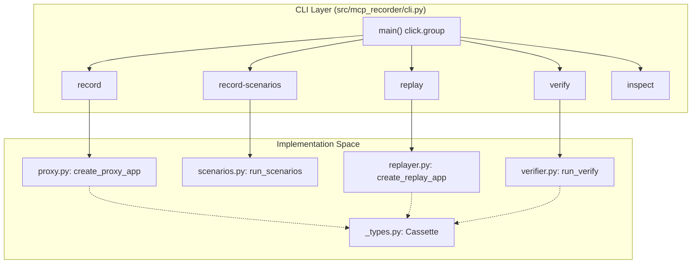
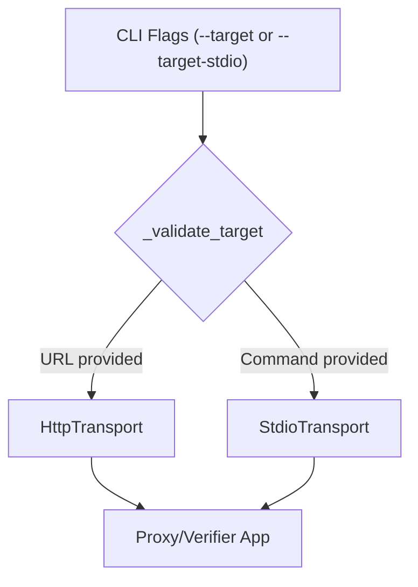

The `mcp-recorder` command-line interface provides a suite of tools to capture, simulate, and validate Model Context Protocol (MCP) server behavior. It acts as a bridge between live MCP servers and static "cassette" files, supporting both HTTP (SSE) and stdio transports.

The CLI is built using the `click` library and organized into functional groups for recording, replaying, and verifying protocol interactions [src/mcp_recorder/cli.py:10-27]().

### Command Hierarchy

The following diagram maps the CLI command structure to the internal implementation modules and key classes.

**CLI to Code Mapping**

Sources: [src/mcp_recorder/cli.py:25-27](), [src/mcp_recorder/cli.py:83-121](), [src/mcp_recorder/cli.py:162-181](), [src/mcp_recorder/cli.py:228-243](), [src/mcp_recorder/cli.py:279-301](), [src/mcp_recorder/cli.py:350-362]().

---

## Recording Commands

Recording is the process of intercepting traffic between an MCP client and a server to generate a JSON cassette. The CLI supports two modes: interactive proxying and batch scenario execution.

### `record`
The `record` command starts a local HTTP proxy server (using `uvicorn`) that forwards requests to a target MCP server [src/mcp_recorder/cli.py:144-149](). It captures all `JSONRPC_REQUEST` and `NOTIFICATION` interactions [src/mcp_recorder/_types.py:19-25]().

### `record-scenarios`
For automated capture, `record-scenarios` reads a YAML configuration file to execute a predefined list of actions (e.g., `list_tools`, `call_tool`) against a target and saves each as a separate cassette [src/mcp_recorder/cli.py:185-198]().

For details, see [record and record-scenarios Commands](#3.1).

Sources: [src/mcp_recorder/cli.py:83-121](), [src/mcp_recorder/cli.py:162-181](), [src/mcp_recorder/scenarios.py:222-240]().

---

## Replay, Verify, and Inspect Commands

Once a cassette is recorded, it can be used to simulate a server or validate the behavior of a real one.

### `replay`
The `replay` command transforms a cassette into a mock MCP server. It uses a `Matcher` strategy (such as `StrictMatcher` or `MethodParamsMatcher`) to find the recorded response that best fits an incoming request [src/mcp_recorder/cli.py:253-261]().

### `verify`
The `verify` command acts as a regression tester. It reads a cassette, sends the recorded requests to a live target server, and performs a deep structural comparison of the new response against the recorded one [src/mcp_recorder/cli.py:317-327]().

### `inspect`
A utility command to view the contents and metadata of a cassette file, including the server URL, transport type, and a summary of recorded interactions [src/mcp_recorder/cli.py:350-375]().

For details, see [replay, verify, and inspect Commands](#3.2).

Sources: [src/mcp_recorder/cli.py:228-243](), [src/mcp_recorder/cli.py:279-301](), [src/mcp_recorder/cli.py:350-362](), [src/mcp_recorder/matcher.py:100-115]().

---

## Transport Configuration

All CLI commands that interact with a "target" server support two transport types. The transport is determined by which flag is provided:

| Flag | Transport Type | Implementation |
| :--- | :--- | :--- |
| `--target` | HTTP (SSE) | `HttpTransport` via `httpx` |
| `--target-stdio` | Subprocess | `StdioTransport` via `asyncio.create_subprocess_exec` |

**Transport Selection Logic**

Sources: [src/mcp_recorder/cli.py:70-76](), [src/mcp_recorder/cli.py:125-139](), [src/mcp_recorder/transport.py:113-130](), [src/mcp_recorder/transport.py:215-235]().