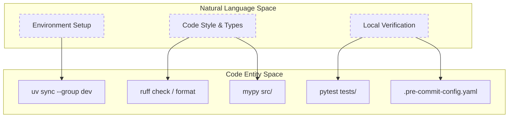
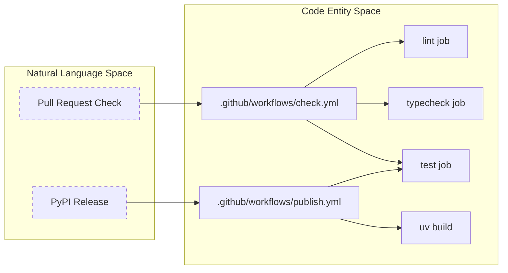

This page provides a high-level overview of the development standards, contribution workflows, and automated pipelines for `mcp-recorder`. The project maintains high code quality through strict typing, automated linting, and a comprehensive suite of unit and integration tests.

### Development Standards

The project relies on `uv` for dependency management and environment isolation. All contributions are expected to adhere to the following technical standards:

*   **Type Safety**: The codebase uses `mypy` in strict mode. All public and private functions must have type annotations [[.pre-commit-config.yaml:22-24](), [CONTRIBUTING.md:45-53]()].
*   **Linting & Formatting**: `Ruff` is used for both linting and code formatting to ensure a consistent style across the `src/` and `tests/` directories [[.pre-commit-config.yaml:2-7](), [CONTRIBUTING.md:49-51]()].
*   **Testing**: New features or bug fixes must include corresponding tests using `pytest`. The suite is divided into `tests/unit` and `tests/integration` [[.github/workflows/check.yml:61-62](), [CONTRIBUTING.md:62-64]()].

For a step-by-step guide on setting up your local environment, see [Development Setup](#8.1).

**Sources:**
- [.pre-commit-config.yaml:2-24]()
- [CONTRIBUTING.md:43-64]()
- [.github/workflows/check.yml:61-62]()

---

### Contribution Workflow

Contributors should follow a standard fork-and-branch workflow. The project uses a Pull Request (PR) template to ensure all necessary checks are completed before review.

| Step | Action | Description |
| :--- | :--- | :--- |
| 1 | **Branching** | Create a branch from `main` using prefixes like `feat/`, `fix/`, or `refactor/` [[CONTRIBUTING.md:29-33](), [CONTRIBUTING.md:71-79]()]. |
| 2 | **Development** | Implement changes and run local checks (`ruff`, `mypy`, `pytest`) [[CONTRIBUTING.md:49-64]()]. |
| 3 | **Validation** | Use the PR checklist to verify formatting, type safety, and test coverage [[.github/pull_request_template.md:9-14](), [CONTRIBUTING.md:80-89]()]. |
| 4 | **CI Check** | Ensure the GitHub Actions "Check" workflow passes on the PR [[.github/workflows/check.yml:1-6]()]. |

**Sources:**
- [CONTRIBUTING.md:27-42]()
- [CONTRIBUTING.md:71-89]()
- [.github/pull_request_template.md:1-14]()

---

### CI/CD Infrastructure

The project utilizes GitHub Actions for continuous integration and delivery. This ensures that every commit is validated and that releases to PyPI are automated and secure.

#### Validation Pipeline (`check.yml`)
This workflow triggers on every push to `main` and all pull requests. It utilizes concurrency groups to cancel outdated runs on the same branch [[.github/workflows/check.yml:3-10]()].

#### Release Pipeline (`publish.yml`)
Automated publishing is handled via `workflow_dispatch`. It performs a multi-stage validation, including version matching against `pyproject.toml`, full lint/test suites, and finally, a Trusted Publisher release to PyPI using OpenID Connect (OIDC) [[.github/workflows/publish.yml:3-10](), [.github/workflows/publish.yml:91-110]()].

For detailed documentation on the individual jobs and security policies, see [CI/CD Pipeline](#8.2).

**Sources:**
- [.github/workflows/check.yml:1-63]()
- [.github/workflows/publish.yml:1-122]()
- [.github/SECURITY.md:1-10]()

---

### Mapping Natural Language to Code Entities

The following diagrams illustrate how the contribution and testing concepts translate to specific files and tools in the repository.

#### Developer Workflow to Code Tools
"The local development lifecycle maps directly to the tools configured in the repository."

**Sources:**
- [CONTRIBUTING.md:15-25]()
- [CONTRIBUTING.md:49-64]()
- [.pre-commit-config.yaml:1-25]()

#### CI/CD Pipeline to Action Jobs
"The GitHub Actions workflows automate the verification steps defined in the contribution guide."

**Sources:**
- [.github/workflows/check.yml:12-63]()
- [.github/workflows/publish.yml:11-122]()

---

### Child Pages

*   **[Development Setup](#8.1)**: Step-by-step guide to forking, cloning, installing dependencies with `uv`, setting up pre-commit hooks, and running the test suite locally.
*   **[CI/CD Pipeline](#8.2)**: Documents the GitHub Actions workflows (`check.yml` and `publish.yml`), Dependabot configuration, and the project security policy.