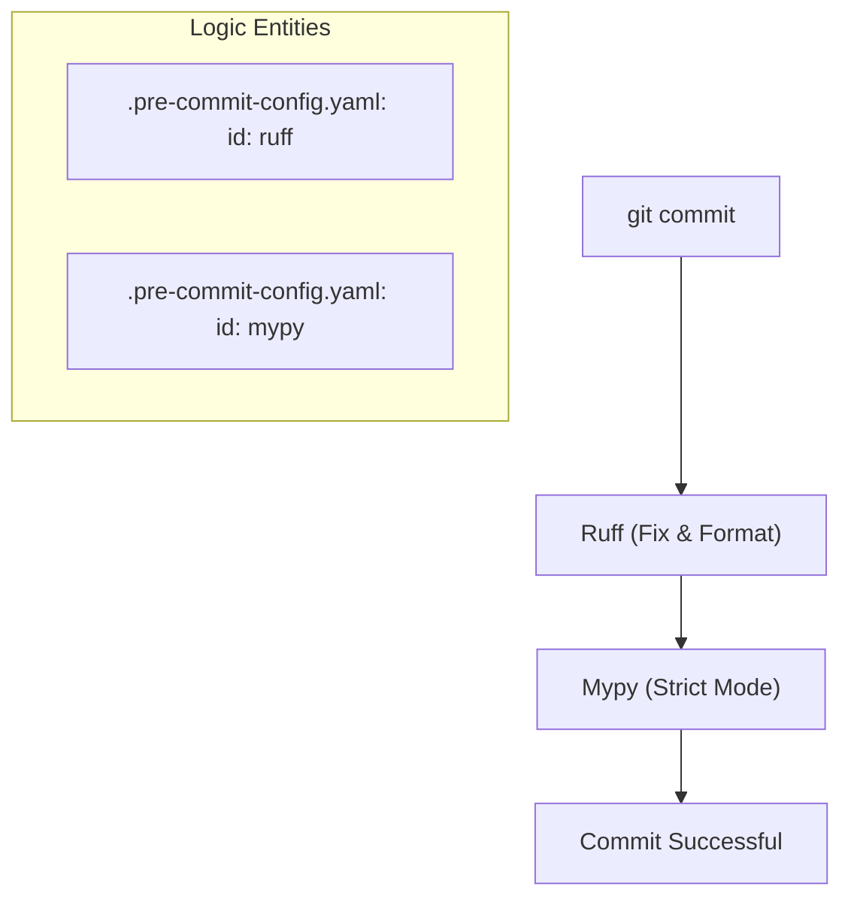
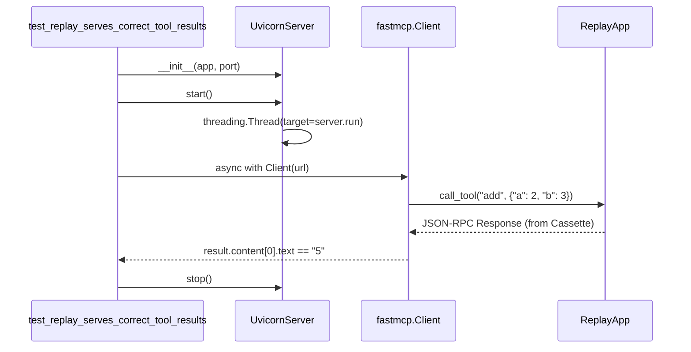

This page provides a comprehensive guide for setting up a local development environment for `mcp-recorder`. The project uses `uv` for dependency management and follows strict linting and typing standards to ensure high code quality.

## Prerequisites

Before beginning, ensure you have the following installed:
*   **Python 3.11+**: The project supports Python 3.11, 3.12, and 3.13 [pyproject.toml:15-18]().
*   **uv**: A fast Python package installer and resolver.

## Initial Setup

To begin contributing, follow these steps to clone the repository and prepare the environment:

1.  **Fork and Clone**:
    ```bash
    git clone https://github.com/<your-user>/mcp-recorder.git
    cd mcp-recorder
    ```
    [CONTRIBUTING.md:8-12]()

2.  **Install Dependencies**:
    Use `uv` to create a virtual environment and install the development group dependencies.
    ```bash
    uv sync --group dev
    ```
    [CONTRIBUTING.md:15-19]()

3.  **Configure Pre-commit Hooks**:
    The project uses `pre-commit` to ensure code quality before every commit.
    ```bash
    uv run pre-commit install
    ```
    [CONTRIBUTING.md:21-25]()

### Dependency Structure
The project divides dependencies into core runtime requirements and development tools.

| Group | Key Packages | Purpose |
| :--- | :--- | :--- |
| **Runtime** | `starlette`, `uvicorn`, `httpx`, `pydantic` | Web server, proxying, and data validation. |
| **Dev** | `pytest`, `ruff`, `mypy`, `fastmcp` | Testing, linting, typing, and mock server creation. |

**Sources:** [pyproject.toml:23-30](), [pyproject.toml:43-52]()

## Code Quality Toolchain

`mcp-recorder` enforces strict code standards using `Ruff` for formatting/linting and `mypy` for static type analysis.

### Linting and Formatting
The project uses `Ruff` with a target version of Python 3.11 and a line length of 100 characters [tool.ruff:60-62]().

*   **Format code**: `uv run ruff format src/ tests/`
*   **Lint code**: `uv run ruff check src/ tests/`
[CONTRIBUTING.md:49-51]()

### Type Checking
Static typing is enforced in `strict` mode using `mypy`.

*   **Run type check**: `uv run mypy src/`
[CONTRIBUTING.md:52-52]()

The configuration includes `warn_return_any = true` and `warn_unused_configs = true` to catch subtle typing issues [tool.mypy:71-77]().

### Pre-commit Workflow
The pre-commit configuration automates these checks to prevent regressions.

**Pre-commit Execution Flow**

**Sources:** [.pre-commit-config.yaml:1-25](), [CONTRIBUTING.md:43-56]()

## Running the Test Suite

The test suite is divided into `unit` and `integration` tests, utilizing `pytest` and `pytest-asyncio`.

### Execution
To run all tests with verbose output:
```bash
uv run pytest tests/unit tests/integration -v
```
[CONTRIBUTING.md:62-64]()

### Integration Test Infrastructure
Integration tests often require spawning a live server. The project provides a `UvicornServer` utility class that manages a server in a background daemon thread [src/mcp_recorder/_utils.py:54-64]().

**Test Lifecycle: Replay Pipeline**

**Sources:** [tests/integration/test_replay.py:27-46](), [src/mcp_recorder/_utils.py:54-81]()

## Development Workflow Summary

| Action | Command | Code Reference |
| :--- | :--- | :--- |
| **Sync Environment** | `uv sync --group dev` | [CONTRIBUTING.md:18]() |
| **Create Branch** | `git checkout -b feat/name` | [CONTRIBUTING.md:32]() |
| **Verify Types** | `uv run mypy src/` | [tool.mypy:76]() |
| **Auto-fix Linting** | `uv run ruff check --fix .` | [.pre-commit-config.yaml:6]() |
| **Run Tests** | `uv run pytest` | [tool.pytest.ini_options:78-81]() |

**Sources:** [CONTRIBUTING.md:27-42](), [pyproject.toml:78-81]()