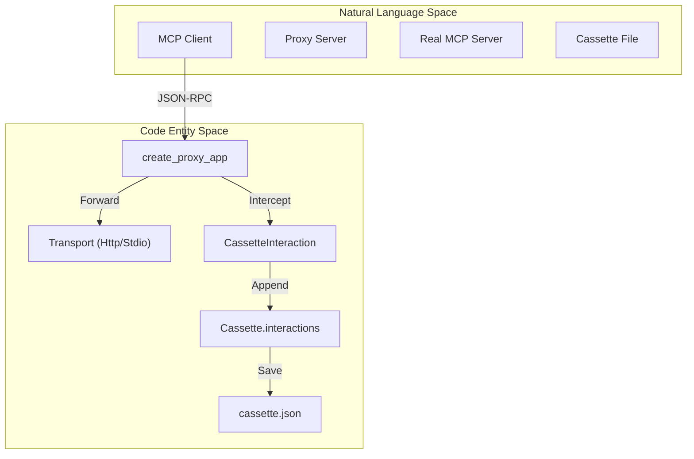
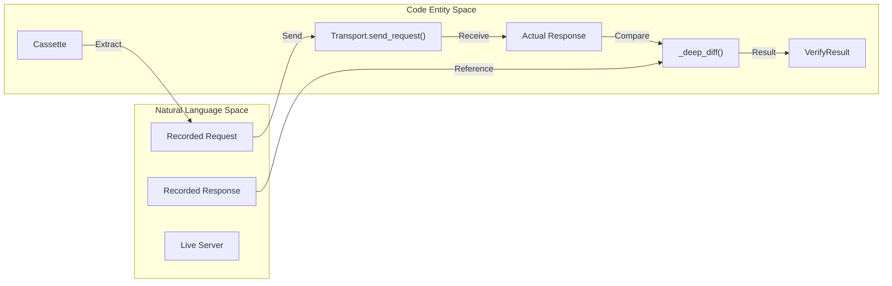
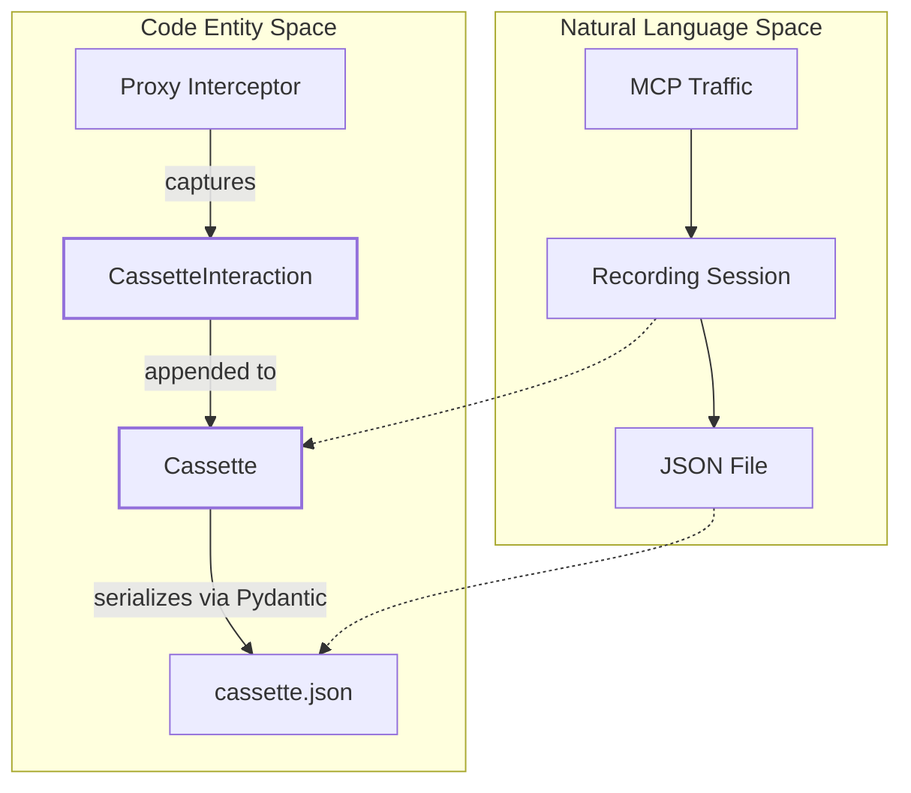
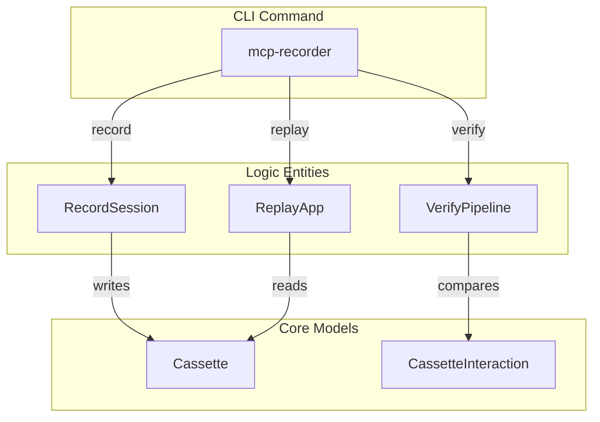

uv sync --group dev
```
Sources: [README.md:58-68](), [CONTRIBUTING.md:15-19](), [pyproject.toml:43-52]()

## Project Setup

When setting up a project to use `mcp-recorder`, you typically organize your test artifacts in a `cassettes/` directory. If you are developing the `mcp-recorder` codebase itself, the project uses `uv_build` as the build backend [pyproject.toml:54-56]().

### Development Environment
1. **Clone**: `git clone https://github.com/devhelmhq/mcp-recorder.git` [CONTRIBUTING.md:8-13]()
2. **Sync**: `uv sync --group dev` [CONTRIBUTING.md:18-19]()
3. **Lint/Typecheck**:
   - `uv run ruff check src/` [CONTRIBUTING.md:51]()
   - `uv run mypy src/` [CONTRIBUTING.md:52]()

## Quick-Start Workflows

The system operates in three primary modes: **Record**, **Replay**, and **Verify**. These modes are accessible via the CLI entry point `mcp-recorder`, which maps to `mcp_recorder.cli:main` [pyproject.toml:37-38]().

### 1. Record
Recording captures interactions between an MCP client and a server. You can record interactively by proxying traffic or via a `scenarios.yml` file for automated capture.

**Interactive Example (HTTP):**
```bash
mcp-recorder record \
  --target http://localhost:8000 \
  --port 5555 \
  --output cassettes/search_flow.json
```
This starts a `UvicornServer` running a proxy app created by `create_proxy_app` [README.md:208-215]().

**Scenario-based Example:**
Define a `scenarios.yml` to automate the `McpClient` actions [README.md:90-118]():
```yaml
target: http://localhost:3000
scenarios:
  list_and_search:
    actions:
      - list_tools
      - call_tool:
          name: search
          arguments: { query: "test" }
```
Run: `mcp-recorder record-scenarios scenarios.yml` [README.md:24]().

### 2. Replay
Replay mode starts a mock server that serves responses from a cassette, allowing you to test clients without a live backend.

```bash
mcp-recorder replay --cassette cassettes/search_flow.json --port 5555
```
This utilizes `create_replay_app` to match incoming `JSONRPC_REQUEST` objects against the `CassetteInteraction` entries stored in the file [README.md:34](), [README.md:78]().

### 3. Verify
Verification acts as a regression test for the server. It reads requests from a cassette, sends them to a live target, and compares the new response against the recorded one.

```bash
mcp-recorder verify --cassette cassettes/search_flow.json --target http://localhost:8000
```
The verifier performs a `_deep_diff` while respecting `_strip_volatile` logic to ignore fields like timestamps or dynamic IDs [README.md:30]().

Sources: [README.md:16-41](), [README.md:70-85]()

## Data Flow and Architecture

The following diagrams illustrate how the high-level workflows map to specific code entities and how data flows through the system.

### Interaction Capture Flow (Record)
This diagram shows how `create_proxy_app` intercepts traffic and persists it via `Cassette`.


Sources: [README.md:74-75](), [pyproject.toml:37-38]()

### Verification Pipeline (Verify)
This diagram details the regression testing flow using the `verify` command logic.


Sources: [README.md:79-84](), [README.md:30-31]()

## Key Components Summary

| Component | Code Entity | Purpose |
| :--- | :--- | :--- |
| **CLI Entry** | `mcp_recorder.cli:main` | Handles command parsing for `record`, `replay`, `verify`. |
| **Proxy Engine** | `create_proxy_app` | Starlette app that intercepts and logs traffic. |
| **Replay Engine** | `create_replay_app` | Starlette app that simulates a server using cassettes. |
| **Transport** | `Transport` (Base Class) | Abstract interface for `HttpTransport` and `StdioTransport`. |
| **Client** | `McpClient` | Programmatic client used in `record-scenarios`. |
| **Persistence** | `Cassette` | Data structure representing the recorded session. |

Sources: [pyproject.toml:37-38](), [README.md:70-85](), [README.md:193-203]()

# Core Concepts


This page details the foundational abstractions and data structures that power `mcp-recorder`. It explains how Model Context Protocol (MCP) traffic is modeled, stored, and utilized across different operational modes.

## Foundational Abstractions

The system is built around the concept of a "Cassette"—a portable, versioned JSON file that captures the complete wire-level exchange between an MCP client and server.

### Cassette Format and Versioning
A `Cassette` represents a single recorded session. It includes metadata about the environment and an ordered list of interactions.

*   **Versioning**: The `version` field (currently "1.0") ensures compatibility. The `Cassette` model uses a `model_validator` to enforce major version matching, requiring re-recording if the format undergoes breaking changes `[src/mcp_recorder/_types.py:82-99]()`.
*   **Metadata**: The `CassetteMetadata` class captures the `recorded_at` timestamp, the `server_url`, the `transport_type` (e.g., HTTP or stdio), and server capabilities discovered during the handshake `[src/mcp_recorder/_types.py:72-80]()`.
*   **Interactions**: The core of the cassette is a list of `CassetteInteraction` objects `[src/mcp_recorder/_types.py:87-87]()`.

### InteractionType Enum
Every interaction in a cassette is classified into one of three types via the `InteractionType` enum `[src/mcp_recorder/_types.py:14-19]()`:

| Type | Description |
| :--- | :--- |
| `JSONRPC_REQUEST` | A standard MCP request (e.g., `tools/call`) that expects a matching response. |
| `NOTIFICATION` | A one-way message (e.g., `notifications/initialized`) with no response. |
| `LIFECYCLE` | HTTP-specific operations like the initial SSE connection `GET` or session `DELETE` `[src/mcp_recorder/_types.py:37-39]()`. |

### Cassette Data Flow (Natural Language to Code)

The following diagram bridges the conceptual "Recording" process to the specific Python entities that handle the data.

**Data Entity Mapping: Recording Pipeline**

Sources: `[src/mcp_recorder/_types.py:22-108]()`

---

## Operational Modes

`mcp-recorder` operates in three distinct modes, all sharing the same `Cassette` format.

### 1. Record Mode
In this mode, `mcp-recorder` acts as a transparent proxy. It intercepts JSON-RPC messages, measures `latency_ms`, and extracts metadata from the `initialize` response to populate the cassette `[src/mcp_recorder/_types.py:101-108]()`.

### 2. Replay Mode
The system acts as a mock server. It loads a `Cassette` and uses a Matcher engine to find the appropriate `CassetteInteraction` for an incoming request based on method and parameters. It supports SSE response wrapping to simulate real server behavior `[src/mcp_recorder/_types.py:33-33]()`.

### 3. Verify Mode
The system acts as a client. It iterates through the `interactions` in a `Cassette`, sends the recorded requests to a live "target" server, and compares the new responses against the recorded ones using a deep-diff algorithm.

**System Mode Mapping: Code Execution Paths**

Sources: `[README.md:74-85]()`, `[src/mcp_recorder/_types.py:22-88]()`

---

## JSON Cassette Structure

The physical storage is a JSON file structured according to the `Cassette` Pydantic model.

### Annotated Example
Below is a simplified structure of a cassette capturing a tool discovery and execution.

```json
{
  "version": "1.0",
  "metadata": {
    "recorded_at": "2026-02-17T20:25:23.855390+00:00",
    "server_url": "http://127.0.0.1:8000",
    "protocol_version": "2025-11-25",
    "server_info": { "name": "Test Calculator", "version": "2.14.5" }
  },
  "interactions": [
    {
      "type": "jsonrpc_request",
      "request": {
        "method": "tools/list",
        "jsonrpc": "2.0",
        "id": 1
      },
      "response": {
        "jsonrpc": "2.0",
        "id": 1,
        "result": { "tools": [...] }
      },
      "response_is_sse": true,
      "response_status": 200,
      "latency_ms": 22
    },
    {
      "type": "notification",
      "request": {
        "method": "notifications/initialized",
        "jsonrpc": "2.0"
      },
      "response": null,
      "response_status": 202
    }
  ]
}
```
Sources: `[tests/cassettes/mock_session.json:1-234]()`, `[src/mcp_recorder/_types.py:22-88]()`

### Key Fields in CassetteInteraction
*   **`request` / `response`**: These hold the raw JSON-RPC dictionaries. For `NOTIFICATION` types, `response` is `null` `[src/mcp_recorder/_types.py:25-32]()`.
*   **`response_is_sse`**: A boolean flag indicating if the original response was delivered over an Server-Sent Events stream, which is critical for the Replay engine to correctly emulate the transport `[src/mcp_recorder/_types.py:33-33]()`.
*   **`http_method` / `http_path`**: These are populated only for `LIFECYCLE` interactions to track the underlying transport handshake `[src/mcp_recorder/_types.py:37-39]()`.
*   **`jsonrpc_method` / `tool_name`**: Computed properties used by the Matcher and CLI to identify and filter interactions `[src/mcp_recorder/_types.py:41-55]()`.

Sources: `[src/mcp_recorder/_types.py:1-108]()`, `[tests/cassettes/mock_session.json:1-234]()`