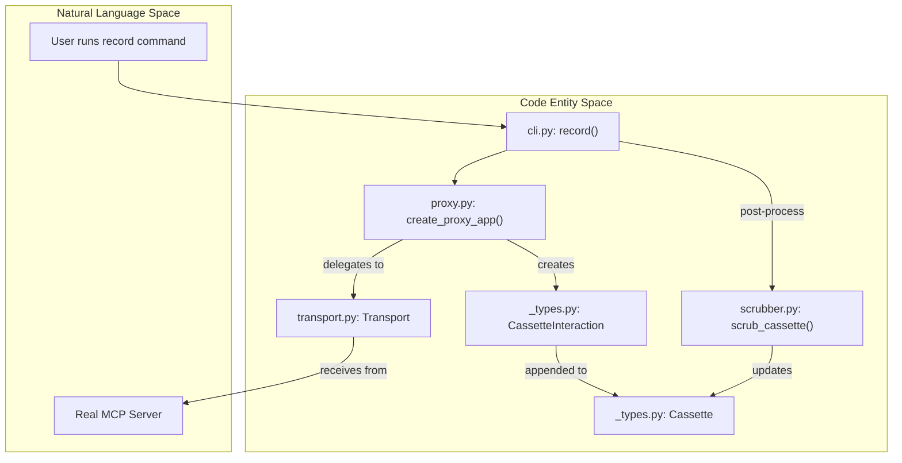
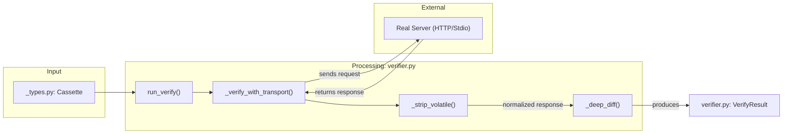

This glossary defines technical terms, domain-specific concepts, and key code entities within the `mcp-recorder` codebase. It serves as a reference for developers to understand the relationship between Model Context Protocol (MCP) concepts and their implementation in Python.

## Core Concepts

### Cassette
A JSON file representing a complete recorded session of MCP interactions. It contains metadata about the server and a sequential list of all protocol exchanges.
*   **Implementation**: Defined by the `Cassette` class [src/mcp_recorder/_types.py:82-101]().
*   **Structure**: Composed of `CassetteMetadata` [src/mcp_recorder/_types.py:72-80]() and a list of `CassetteInteraction` objects [src/mcp_recorder/_types.py:22-70]().
*   **Versioning**: The `version` field [src/mcp_recorder/_types.py:85-85]() ensures compatibility, currently defaulting to `CASSETTE_FORMAT_VERSION` "1.0" [src/mcp_recorder/_types.py:11-11]().

### Interaction
A single exchange between a client and a server. In `mcp-recorder`, this is unified across different protocol message types.
*   **Implementation**: `CassetteInteraction` [src/mcp_recorder/_types.py:22-40]().
*   **Types**: Defined by the `InteractionType` enum [src/mcp_recorder/_types.py:14-19]():
    *   `JSONRPC_REQUEST`: A standard call requiring a response (e.g., `tools/call`).
    *   `NOTIFICATION`: A one-way message (e.g., `notifications/initialized`).
    *   `LIFECYCLE`: HTTP-specific operations like session creation (SSE `GET`) or teardown (`DELETE`).

### Transport
The communication layer abstraction that allows `mcp-recorder` to interact with MCP servers regardless of their underlying protocol (HTTP vs. Stdio).
*   **Base Class**: `Transport` [src/mcp_recorder/transport.py:30-55]().
*   **Implementations**:
    *   `HttpTransport`: Uses `httpx.AsyncClient` to communicate with SSE-based servers [src/mcp_recorder/transport.py:62-129]().
    *   `StdioTransport`: Spawns a subprocess and communicates via `stdin`/`stdout` [src/mcp_recorder/transport.py:136-248]().

### Sources
*   [src/mcp_recorder/_types.py:11-101]()
*   [src/mcp_recorder/transport.py:30-248]()

---

## Technical Terms

| Term | Definition | Code Pointer |
| :--- | :--- | :--- |
| **Matcher** | Strategy for finding a recorded response for a given incoming request during replay. | [src/mcp_recorder/matcher.py:41-70]() |
| **Scrubber** | Logic for redacting sensitive information (API keys, URLs) from cassettes. | [src/mcp_recorder/scrubber.py:86-144]() |
| **Proxy** | A Starlette-based server that intercepts traffic to record it into a cassette. | [src/mcp_recorder/proxy.py:92-116]() |
| **Scenario** | A declarative definition of MCP actions to be recorded as a single cassette. | [src/mcp_recorder/scenarios.py:91-94]() |
| **SSE** | Server-Sent Events, the standard streaming transport for HTTP-based MCP. | [src/mcp_recorder/_utils.py:44-66]() |

---

## Architecture Diagrams

### From Natural Language to Code Entities: Recording Flow
This diagram maps the conceptual "Recording" process to the specific classes and functions that execute it.

**Sources:**
*   [src/mcp_recorder/cli.py:83-160]()
*   [src/mcp_recorder/proxy.py:92-116]()
*   [src/mcp_recorder/scrubber.py:86-144]()

### Verification Pipeline: Data Flow
This diagram shows how the `verifier` uses `Transport` to validate a server against a recorded `Cassette`.

**Sources:**
*   [src/mcp_recorder/verifier.py:35-41]()
*   [src/mcp_recorder/verifier.py:44-71]()
*   [src/mcp_recorder/verifier.py:74-123]()
*   [src/mcp_recorder/verifier.py:126-224]()

---

## Detailed Component Definitions

### Matcher Strategies
Replay behavior depends on the chosen `Matcher` implementation:
*   `MethodParamsMatcher`: Matches by JSON-RPC method and a stable hash of parameters (ignoring volatile fields like `_meta`) [src/mcp_recorder/matcher.py:71-93]().
*   `SequentialMatcher`: Ignores request content and returns the next recorded interaction in strict FIFO order [src/mcp_recorder/matcher.py:96-110]().
*   `StrictMatcher`: Matches by full JSON-RPC body equality, including volatile fields [src/mcp_recorder/matcher.py:113-140]().

### Scenarios System
The scenarios system allows batch recording via a YAML configuration.
*   **Execution**: `run_scenarios` iterates through defined scenarios, spawning a proxy for each [src/mcp_recorder/scenarios.py:225-249]().
*   **Action Dispatcher**: `_execute_action` maps YAML strings (e.g., `list_tools`) to `McpClient` method calls [src/mcp_recorder/scenarios.py:134-163]().
*   **Environment Interpolation**: `_expand_env_vars` resolves `${VAR}` syntax within the YAML file using `os.environ` [src/mcp_recorder/scenarios.py:34-54]().

### Stdio Routing
In `StdioTransport`, requests and responses are routed asynchronously.
*   **Routing**: The `_pending` dictionary maps JSON-RPC `id` to an `asyncio.Future` [src/mcp_recorder/transport.py:158-158]().
*   **Reader Task**: `_read_stdout` continuously parses the server's output and completes the corresponding future [src/mcp_recorder/transport.py:218-237]().

### Sources
*   [src/mcp_recorder/matcher.py:1-153]()
*   [src/mcp_recorder/scenarios.py:1-249]()
*   [src/mcp_recorder/transport.py:136-248]()