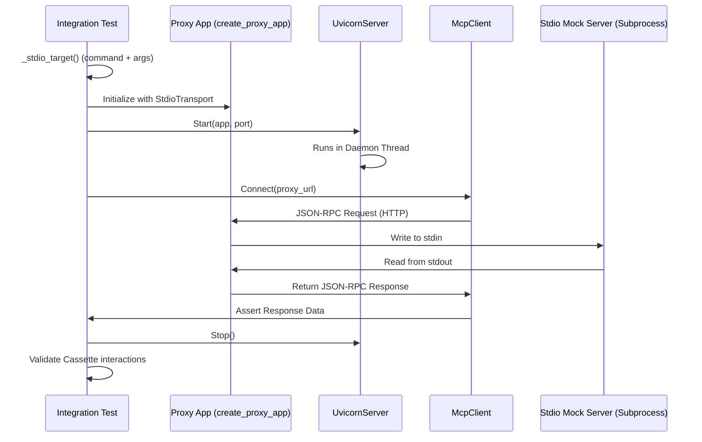
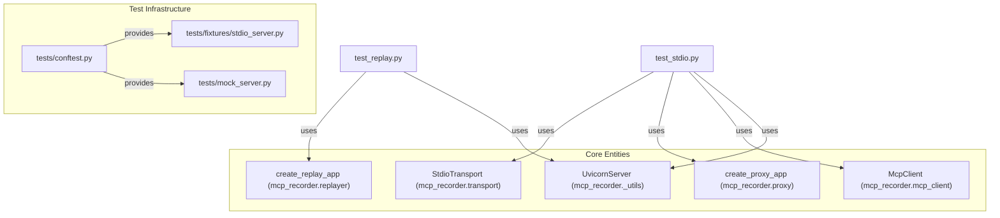

This section details the integration testing infrastructure for `mcp-recorder`. The test suite ensures that the proxy, replayer, and transport layers function correctly across both HTTP (SSE) and Stdio transports. It relies on a set of shared fixtures and mock servers to simulate real-world Model Context Protocol (MCP) environments.

### Overview of Integration Testing

Integration tests verify the end-to-end flow of MCP interactions, ensuring that:
1.  **Replay Pipeline**: The replayer correctly serves responses from a JSON cassette, matching incoming requests to recorded interactions using the `Matcher` engine [tests/integration/test_replay.py:26-56]().
2.  **Stdio Transport**: The `StdioTransport` correctly handles subprocess lifecycles, stdin/stdout communication, and JSON-RPC message routing [tests/integration/test_stdio.py:1-174]().
3.  **CLI Operations**: Command-line interfaces like `inspect` produce accurate summaries of cassette metadata and interaction counts [tests/integration/test_replay.py:58-75]().

### Shared Fixtures (`conftest.py`)

The `tests/conftest.py` file provides shared resources for all tests, including paths to fixture files and pre-loaded `Cassette` objects.

| Fixture | Return Type | Purpose |
| :--- | :--- | :--- |
| `cassettes_dir` | `Path` | Returns the directory containing pre-recorded test cassettes [tests/conftest.py:17-18](). |
| `mock_session_path` | `Path` | Returns the path to `mock_session.json`, a standard calculator test cassette [tests/conftest.py:22-23](). |
| `mock_session_cassette` | `Cassette` | Loads and validates the `mock_session.json` into a Pydantic `Cassette` model [tests/conftest.py:27-31](). |
| `stdio_server_command` | `list[str]` | Generates the command list required to spawn the `stdio_server.py` fixture using the current Python executable [tests/conftest.py:35-37](). |

**Sources:** [tests/conftest.py:1-38]()

### Mock Servers

The suite includes two minimal `FastMCP` servers used as targets for recording and verification.

#### 1. HTTP Mock Server (`mock_server.py`)
A `FastMCP` instance named "Test Calculator" configured for HTTP transport [tests/mock_server.py:7](). It exposes tools for `add`, `multiply`, `echo`, and `get_weather` [tests/mock_server.py:10-31](). It is used for manual testing and SSE-based integration scenarios [tests/mock_server.py:35]().

#### 2. Stdio Mock Server (`stdio_server.py`)
A identical "Test Calculator" server configured for `stdio` transport [tests/fixtures/stdio_server.py:11-39](). This server communicates via JSON-RPC over `stdin` and `stdout` and is the primary target for `StdioTransport` integration tests [tests/integration/test_stdio.py:21-25]().

**Sources:** [tests/mock_server.py:1-36](), [tests/fixtures/stdio_server.py:1-40]()

### Integration Pipeline Data Flow

The following diagram illustrates how the integration tests orchestrate the `UvicornServer`, `McpClient`, and `StdioTransport` to verify system behavior.

**Integration Test Orchestration**

**Sources:** [tests/integration/test_stdio.py:136-174](), [mcp_recorder/_utils.py:54-81]()

### Key Integration Test Modules

#### Replay Pipeline (`test_replay.py`)
This module tests the `create_replay_app` factory. It uses a helper function `_start_replay` to:
1.  Initialize a `MethodParamsMatcher` with cassette interactions [tests/integration/test_replay.py:18]().
2.  Spin up a `UvicornServer` hosting the replay application [tests/integration/test_replay.py:21-22]().
3.  Use a `fastmcp.Client` to call tools against the replay server and assert that the returned values match the "recorded" data in the cassette [tests/integration/test_replay.py:27-45]().

#### Stdio Integration (`test_stdio.py`)
This module validates the system's ability to handle non-HTTP transports.
*   **Scenario Recording**: Uses `_run_single_scenario` to drive a `StdioTransport` and verify that the resulting `Cassette` contains the correct `transport_type` ("stdio") and lacks HTTP-specific lifecycle interactions [tests/integration/test_stdio.py:34-75]().
*   **Verification**: Uses `verify_cassette` with a `StdioTransport` to perform regression testing against a live `stdio_server.py` process [tests/integration/test_stdio.py:82-108]().
*   **Proxy Logic**: Verifies that `create_proxy_app` can wrap a `StdioTransport`, allowing standard HTTP-based MCP clients to communicate with a subprocess-based server [tests/integration/test_stdio.py:137-174]().

**Sources:** [tests/integration/test_replay.py:1-75](), [tests/integration/test_stdio.py:1-174]()

### Code Entity Association

The following diagram maps the logical test components to the specific classes and functions implemented in the codebase.

**Test Component Mapping**

**Sources:** [tests/conftest.py:12-13](), [tests/integration/test_replay.py:17-23](), [tests/integration/test_stdio.py:139-153](), [mcp_recorder/_utils.py:54-58]()