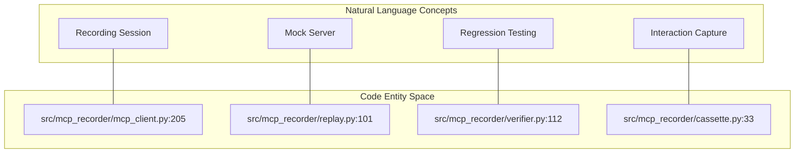
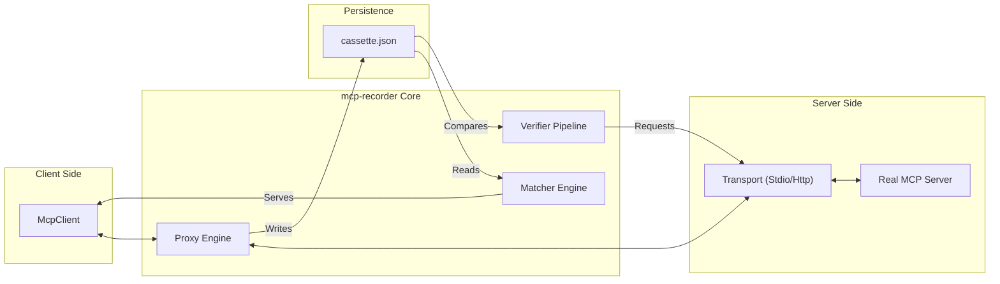

`mcp-recorder` is a testing utility for the **Model Context Protocol (MCP)**, functioning similarly to VCR.py but tailored for the unique challenges of MCP's wire-level exchanges [README.md:5-7](). It enables developers to capture interactions between an MCP client and server into "cassette" files, which can then be used for deterministic replaying or regression verification [README.md:14-16]().

The tool is designed to solve the problem of silent regressions in MCP servers—such as drifting tool schemas or shifting prompt responses—by providing a stable, wire-level source of truth [README.md:14-14]().

### Natural Language to Code Entity Mapping

The following diagram bridges high-level testing concepts to the specific classes and functions implemented in the codebase.

**System Concept to Code Entity Mapping**

Sources: [src/mcp_recorder/mcp_client.py:205-205](), [src/mcp_recorder/replay.py:101-101](), [src/mcp_recorder/verifier.py:112-112](), [src/mcp_recorder/cassette.py:33-33]()

---

### Key Concepts

`mcp-recorder` revolves around three primary operational modes and a unified storage format:

| Concept | Description | Code Reference |
| :--- | :--- | :--- |
| **Cassette** | A JSON file containing serialized MCP interactions, metadata, and versioning. | [src/mcp_recorder/cassette.py:44-53]() |
| **Record** | A proxy mode where `create_proxy_app` intercepts traffic and saves it to a cassette. | [src/mcp_recorder/proxy.py:91-105]() |
| **Replay** | A mock mode where `create_replay_app` serves recorded responses back to a client. | [src/mcp_recorder/replay.py:101-115]() |
| **Verify** | A client mode where `run_verify` sends recorded requests to a live server and diffs the output. | [src/mcp_recorder/verifier.py:112-120]() |

For a deep dive into these abstractions, see [Core Concepts](#1.2).

---

### High-Level Architecture

The system abstracts the underlying communication via a `Transport` layer, allowing the same recording and replaying logic to work across both HTTP (SSE) and Stdio (Subprocess) communication channels [README.md:72-73]().

**Data Flow and Subsystem Interaction**

Sources: [src/mcp_recorder/transport.py:14-20](), [src/mcp_recorder/proxy.py:91-95](), [src/mcp_recorder/matcher.py:18-25](), [src/mcp_recorder/verifier.py:112-115]()

---

### Getting Started

`mcp-recorder` is distributed as a Python package and requires Python 3.11+ [pyproject.toml:16-22](). It provides a robust CLI for zero-code testing via `scenarios.yml` [README.md:88-90]().

**Quick Start CLI Example:**
```bash