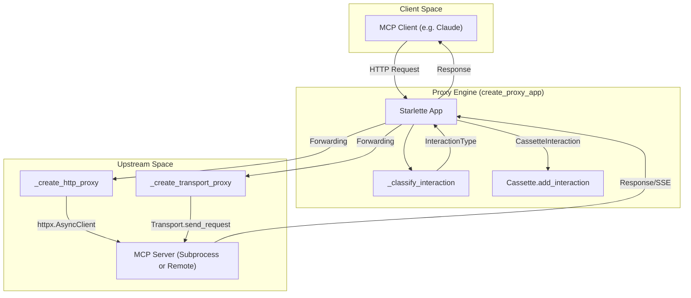
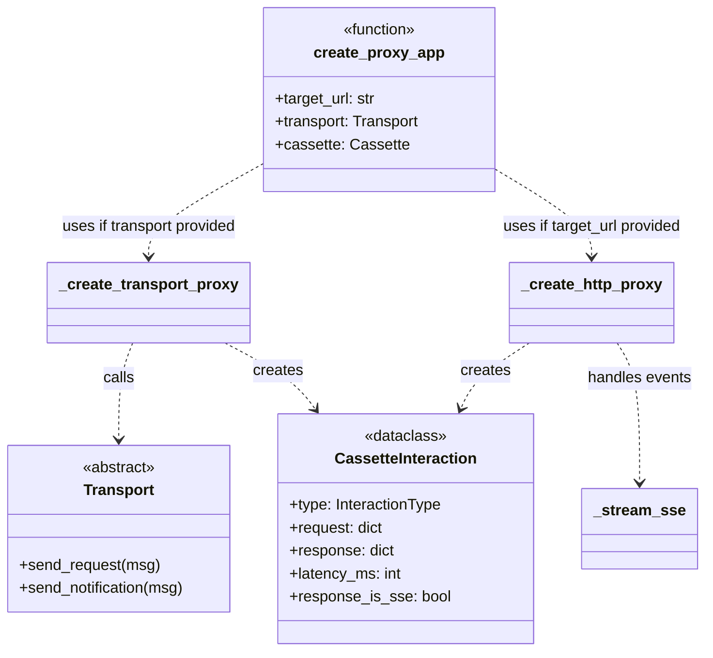

The **Proxy Engine** is the core recording component of `mcp-recorder`. It acts as a Starlette-based reverse proxy that intercepts traffic between an MCP client (e.g., Claude Desktop) and an MCP server. Its primary responsibility is to observe, classify, and persist every JSON-RPC interaction into a `Cassette` while maintaining low-latency forwarding.

### Architecture Overview

The proxy is constructed via `create_proxy_app` [[src/mcp_recorder/proxy.py:92-116]](). It supports two operational modes depending on the target server's communication style:

1.  **HTTP Mode**: Forwards requests to a remote MCP server via `httpx`.
2.  **Transport Mode**: Delegates to a `Transport` implementation (like `StdioTransport`) to communicate with subprocess-based servers.

#### Interaction Flow Diagram
This diagram illustrates how `create_proxy_app` orchestrates the data flow between the client and the upstream target.

**Sources:** [[src/mcp_recorder/proxy.py:92-116]](), [[src/mcp_recorder/proxy.py:123-128]](), [[src/mcp_recorder/proxy.py:223-228]]()

---

### Interaction Classification

Every incoming request is categorized using `_classify_interaction` [[src/mcp_recorder/proxy.py:83-90]](). This determines how the interaction is stored in the `Cassette`.

| Interaction Type | Criteria | Persistence Behavior |
| :--- | :--- | :--- |
| `LIFECYCLE` | HTTP `GET` or `DELETE` | Recorded with status code, often skipped in Transport mode [[src/mcp_recorder/proxy.py:148-155]](). |
| `NOTIFICATION` | JSON body without an `"id"` field | Recorded as a one-way message; proxy returns `202 Accepted` [[src/mcp_recorder/proxy.py:159-179]](). |
| `JSONRPC_REQUEST` | JSON body containing an `"id"` field | Recorded with both request and response bodies [[src/mcp_recorder/proxy.py:182-205]](). |

**Sources:** [[src/mcp_recorder/proxy.py:83-90]](), [[src/mcp_recorder/_types.py:15-20]]()

---

### Transport-Based Recording (`_create_transport_proxy`)

When recording a subprocess-based server (e.g., via `stdio`), the proxy uses a `Transport` instance. Unlike standard HTTP proxying, the proxy must translate incoming HTTP requests into the transport's internal protocol (usually JSON-RPC over pipes).

*   **Latency Measurement**: The proxy captures `time.monotonic()` before and after the `transport.send_request` call to calculate `latency_ms` [[src/mcp_recorder/proxy.py:157-192]]().
*   **Request Handling**:
    *   **Notifications**: Dispatched via `transport.send_notification` [[src/mcp_recorder/proxy.py:161]]().
    *   **Requests**: Dispatched via `transport.send_request`, which waits for a response future [[src/mcp_recorder/proxy.py:183]]().

**Sources:** [[src/mcp_recorder/proxy.py:123-219]]()

---

### HTTP-Based Recording (`_create_http_proxy`)

In HTTP mode, the proxy acts as a transparent bridge using `httpx.AsyncClient` [[src/mcp_recorder/proxy.py:223]]().

#### Header Filtering
To prevent protocol interference, the proxy filters **Hop-by-Hop** headers using `_forward_headers` [[src/mcp_recorder/proxy.py:45-56]]().
*   **Filtered Headers**: `connection`, `keep-alive`, `proxy-authenticate`, `proxy-authorization`, `te`, `trailers`, `transfer-encoding`, `upgrade` [[src/mcp_recorder/proxy.py:31-42]]().
*   **Host Rewriting**: The `Host` header is explicitly rewritten to match the `target_url` to avoid rejection by upstream servers [[src/mcp_recorder/proxy.py:52-54]]().

#### SSE Stream Capture
MCP often uses Server-Sent Events (SSE) for server-to-client notifications. The proxy handles this via `_stream_sse` [[src/mcp_recorder/proxy.py:284-319]]().

1.  **Detection**: If the upstream response has `content-type: text/event-stream`, the proxy switches to streaming mode [[src/mcp_recorder/proxy.py:263-265]]().
2.  **Parsing**: It iterates over the line-based stream, using `_parse_sse_data` to extract JSON payloads from `data:` lines [[src/mcp_recorder/proxy.py:69-80]]().
3.  **Persistence**: Each individual SSE event is recorded as a `NOTIFICATION` interaction within the `Cassette` [[src/mcp_recorder/proxy.py:301-315]]().

**Sources:** [[src/mcp_recorder/proxy.py:223-319]](), [[src/mcp_recorder/proxy.py:31-42]]()

---

### Data Structures & Mapping

The following diagram maps the logical recording components to the specific classes and methods in the source code.

**Sources:** [[src/mcp_recorder/proxy.py:92]](), [[src/mcp_recorder/_types.py:38]](), [[src/mcp_recorder/transport.py:16]]()

### Summary of Key Functions

| Function | Role |
| :--- | :--- |
| `create_proxy_app` | Entry point for building the Starlette application [[src/mcp_recorder/proxy.py:92]](). |
| `_forward_headers` | Sanitizes headers for upstream forwarding [[src/mcp_recorder/proxy.py:45]](). |
| `_classify_interaction` | Determines if a message is a Request, Notification, or Lifecycle event [[src/mcp_recorder/proxy.py:83]](). |
| `_stream_sse` | Generator that yields SSE chunks while logging them to the cassette [[src/mcp_recorder/proxy.py:284]](). |
| `_parse_json` | Safe utility for decoding request/response bodies [[src/mcp_recorder/proxy.py:59]](). |

**Sources:** [[src/mcp_recorder/proxy.py:1-319]]()