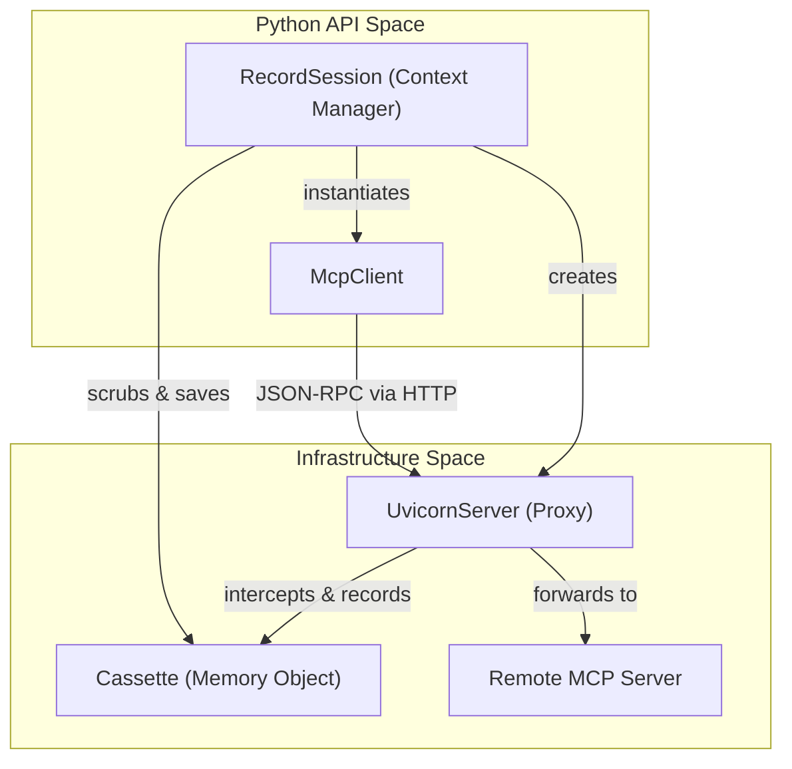
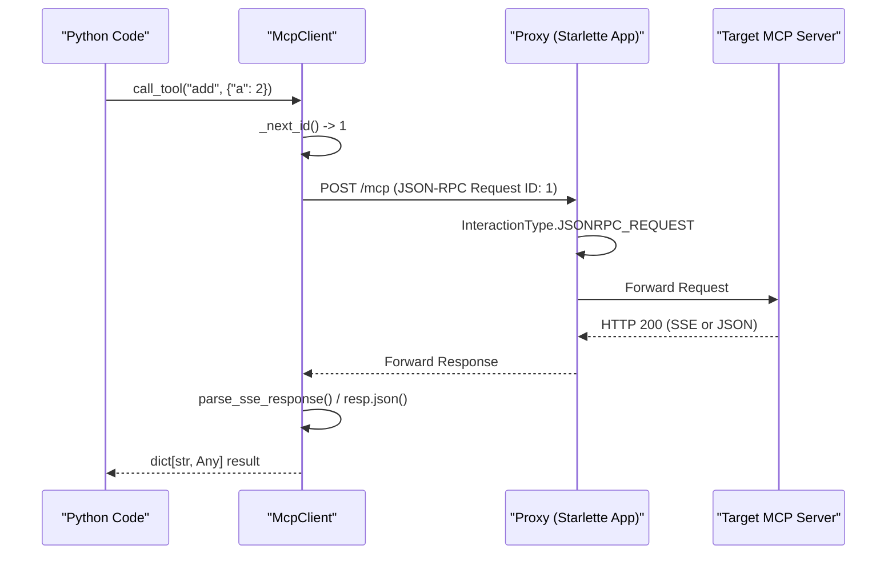
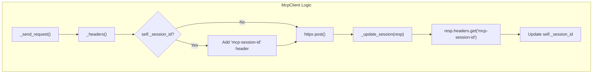
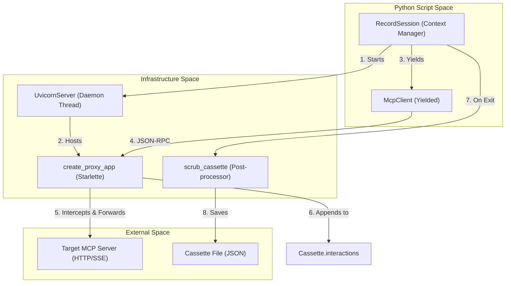
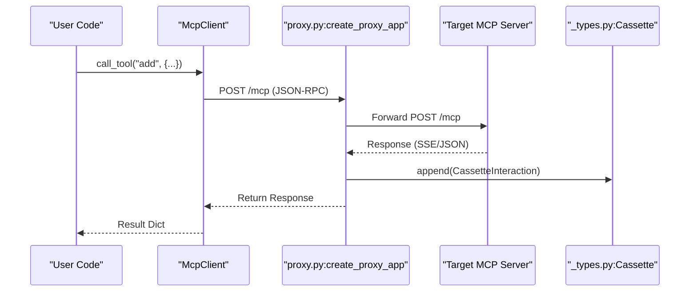

The `mcp-recorder` package provides a programmatic Python interface for interacting with Model Context Protocol (MCP) servers while capturing or replaying those interactions. This API is centered around two primary classes: `McpClient` for protocol communication and `RecordSession` for automated lifecycle management of recording proxies.

## Overview

The programmatic interface allows developers to integrate MCP recording directly into their test suites or automation scripts without relying solely on the CLI.

- **`McpClient`**: A lightweight, asynchronous client that implements the JSON-RPC 2.0 lifecycle over HTTP/SSE. It abstracts away session management and SSE parsing.
- **`RecordSession`**: An asynchronous context manager that orchestrates the recording infrastructure. It manages the proxy server, performs the initial handshake, and handles cassette persistence and scrubbing.

### System Mapping: API to Code Entities

The following diagram bridges the high-level API concepts to their specific implementations within the `mcp-recorder` codebase.

| Natural Language Concept | Code Entity | File Reference |
| :--- | :--- | :--- |
| **MCP Client** | `McpClient` | [src/mcp_recorder/mcp_client.py:25-30]() |
| **Recording Context** | `RecordSession` | [src/mcp_recorder/mcp_client.py:156-170]() |
| **Handshake Logic** | `initialize()` | [src/mcp_recorder/mcp_client.py:111-122]() |
| **Interaction Capture** | `create_proxy_app` | [src/mcp_recorder/mcp_client.py:19-19]() |
| **Data Persistence** | `save_cassette` | [src/mcp_recorder/mcp_client.py:17-17]() |

**Sources:** [src/mcp_recorder/mcp_client.py:1-204](), [src/mcp_recorder/__init__.py:1-9]()

---

## Component Relationship

The `RecordSession` acts as a supervisor for both the `UvicornServer` (running the proxy) and the `McpClient`.



**Sources:** [src/mcp_recorder/mcp_client.py:156-204](), [src/mcp_recorder/proxy.py:1-20]()

---

## Core Components

### McpClient
The `McpClient` provides high-level methods for standard MCP operations such as `list_tools`, `call_tool`, `list_prompts`, and `read_resource`. It automatically handles the `mcp-session-id` header required for SSE transports and increments JSON-RPC request IDs.

For details on method signatures and SSE handling, see [McpClient](#4.1).

**Key Responsibilities:**
*   **Session Management**: Tracking and injecting `mcp-session-id` [src/mcp_recorder/mcp_client.py:53-66]().
*   **Request Routing**: Formatting JSON-RPC 2.0 envelopes [src/mcp_recorder/mcp_client.py:67-74]().
*   **Response Parsing**: Decoding `text/event-stream` results into JSON [src/mcp_recorder/mcp_client.py:83-93]().

### RecordSession
The `RecordSession` is the recommended way to record new cassettes programmatically. It automates the discovery of free ports, the startup of the proxy application, and the mandatory `initialize` handshake.

For details on port discovery, scrubbing configurations, and usage examples, see [RecordSession](#4.2).

**Key Responsibilities:**
*   **Proxy Orchestration**: Starting `create_proxy_app` within a `UvicornServer` [src/mcp_recorder/mcp_client.py:194-200]().
*   **Lifecycle Handshake**: Automatically calling `initialize()` upon entry [src/mcp_recorder/mcp_client.py:203-204]().
*   **Post-processing**: Applying `scrub_cassette` to remove sensitive data before writing to disk [src/mcp_recorder/mcp_client.py:20-20]().

---

## Summary Table

| Feature | McpClient | RecordSession |
| :--- | :--- | :--- |
| **Primary File** | `mcp_client.py` | `mcp_client.py` |
| **Interface** | Async Methods | Async Context Manager |
| **Transport** | HTTP/SSE | Proxy Interceptor |
| **State** | `_request_id`, `_session_id` | `_server`, `_cassette` |
| **Automatic Handshake** | No (manual `initialize`) | Yes (on `__aenter__`) |

**Sources:** [src/mcp_recorder/mcp_client.py:25-204]()

# McpClient


The `McpClient` class is a lightweight, asynchronous Model Context Protocol (MCP) client designed to drive interactions through the `mcp-recorder` proxy layer. It implements the JSON-RPC 2.0 protocol over HTTP/SSE, providing a high-level API for tool, prompt, and resource discovery and execution.

## Overview and Purpose

`McpClient` serves as the primary engine for generating traffic during recording sessions. It manages the complexities of the MCP handshake, request ID incrementing, session persistence via headers, and the parsing of Server-Sent Events (SSE).

### Key Responsibilities
*   **Session Management**: Tracking and injecting `mcp-session-id` headers for stateful HTTP interactions [[src/mcp_recorder/mcp_client.py:37-37](), [src/mcp_recorder/mcp_client.py:58-60]()].
*   **Request Orchestration**: Auto-incrementing JSON-RPC `id` fields for every request [[src/mcp_recorder/mcp_client.py:48-51]()].
*   **Protocol Compliance**: Implementing the `initialize` handshake and subsequent `notifications/initialized` signal [[src/mcp_recorder/mcp_client.py:111-122]()].
*   **Response Handling**: Transparently parsing both standard JSON-RPC responses and SSE streams [[src/mcp_recorder/mcp_client.py:83-90]()].

## Interaction Lifecycle

The following diagram illustrates how `McpClient` translates high-level Python calls into JSON-RPC over HTTP, and how the proxy intercepts these to populate the `Cassette`.

### Data Flow: Client to Proxy


**Sources:** [src/mcp_recorder/mcp_client.py:67-93](), [src/mcp_recorder/mcp_client.py:129-132](), [src/mcp_recorder/proxy.py:1-100]()

## Class Reference

### Constructor and Initialization

The client is initialized with a `base_url`. During the lifecycle, it maintains an internal `httpx.AsyncClient` [[src/mcp_recorder/mcp_client.py:32-37]()].

| Parameter | Type | Description |
| :--- | :--- | :--- |
| `base_url` | `str` | The root URL of the MCP server or proxy (e.g., `http://localhost:5555`). |
| `timeout` | `float` | The timeout for requests, defaulting to 120 seconds. |

### Protocol Handshake
The `initialize()` method is mandatory for starting an MCP session. It sends the `initialize` request with client capabilities and follows up with the `notifications/initialized` notification [[src/mcp_recorder/mcp_client.py:111-122]()].

### Request vs. Notification
*   **`_send_request(method, params)`**: Sends a JSON-RPC message with an `id`. It waits for a response and parses it using `parse_sse_response` if the `content-type` is `text/event-stream` [[src/mcp_recorder/mcp_client.py:67-93]()].
*   **`_send_notification(method, params)`**: Sends a JSON-RPC message without an `id`. It does not expect a data result, only a transport-level acknowledgement [[src/mcp_recorder/mcp_client.py:95-107]()].

## Session and Header Management

MCP over HTTP relies on the `mcp-session-id` header to maintain state across multiple POST requests. `McpClient` automates this by extracting the ID from server responses and re-injecting it into subsequent requests.

### Logic Flow for Session IDs


**Sources:** [src/mcp_recorder/mcp_client.py:53-66](), [src/mcp_recorder/mcp_client.py:81-81]()

## Supported MCP Methods

`McpClient` provides typed wrappers for the standard MCP capability groups:

### Tools
*   `list_tools()`: Requests `tools/list` [[src/mcp_recorder/mcp_client.py:126-127]()].
*   `call_tool(name, arguments)`: Requests `tools/call` with the specified arguments [[src/mcp_recorder/mcp_client.py:129-132]()].

### Prompts
*   `list_prompts()`: Requests `prompts/list` [[src/mcp_recorder/mcp_client.py:136-137]()].
*   `get_prompt(name, arguments)`: Requests `prompts/get` [[src/mcp_recorder/mcp_client.py:139-145]()].

### Resources
*   `list_resources()`: Requests `resources/list` [[src/mcp_recorder/mcp_client.py:149-150]()].
*   `read_resource(uri)`: Requests `resources/read` for a specific URI [[src/mcp_recorder/mcp_client.py:152-153]()].

## Implementation Details: SSE Parsing

When the server responds with `text/event-stream`, the client uses `parse_sse_response` from the utility module. This function processes the raw SSE stream to extract the final JSON-RPC result payload, which is then returned to the caller as a standard dictionary [[src/mcp_recorder/mcp_client.py:83-85](), [src/mcp_recorder/_utils.py:1-20]()].

**Sources:**
* `src/mcp_recorder/mcp_client.py:25-154` (Class definition and methods)
* `src/mcp_recorder/_utils.py` (SSE parsing logic)
* `src/mcp_recorder/proxy.py` (Proxy interception logic)

# RecordSession


The `RecordSession` class is an asynchronous context manager that provides a high-level Python API for recording Model Context Protocol (MCP) interactions. It automates the orchestration of the recording proxy, server lifecycle management, and cassette persistence, allowing developers to capture tool and resource interactions programmatically.

[src/mcp_recorder/mcp_client.py:156-170]()

## Overview and Lifecycle

`RecordSession` simplifies the recording process by wrapping the `create_proxy_app` and `UvicornServer` utilities. When entered, it discovers an available port, starts a background proxy server targeting a real MCP server, and provides an `McpClient` pre-configured to route all traffic through that proxy.

### Execution Flow

1.  **Initialization**: Creates a new `Cassette` object with metadata pointing to the `target` server [src/mcp_recorder/mcp_client.py:193-193]().
2.  **Proxy Startup**: Initializes the Starlette proxy application using `create_proxy_app` [src/mcp_recorder/mcp_client.py:194-196]().
3.  **Port Discovery**: Uses `find_free_port` to dynamically allocate an OS-assigned port [src/mcp_recorder/mcp_client.py:198-198]().
4.  **Server Launch**: Starts a `UvicornServer` in a daemon thread to host the proxy [src/mcp_recorder/mcp_client.py:199-200]().
5.  **Handshake**: Automatically performs the MCP `initialize` and `notifications/initialized` handshake via the proxy to ensure the session is ready for commands [src/mcp_recorder/mcp_client.py:203-203]().
6.  **Teardown**: Upon exiting the context, it stops the server, scrubs sensitive data from the captured interactions, and persists the results to disk [src/mcp_recorder/mcp_client.py:211-220]().

### Data Flow: Recording Architecture
The following diagram illustrates how `RecordSession` bridges the gap between the test code and the physical MCP server.

"Logic to Entity Mapping: Recording Pipeline"

Sources: [src/mcp_recorder/mcp_client.py:192-221](), [src/mcp_recorder/_utils.py:54-65](), [src/mcp_recorder/proxy.py:18-30]()

## Key Components

### UvicornServer Management
`RecordSession` utilizes the `UvicornServer` wrapper to manage the proxy's lifecycle. This wrapper runs Uvicorn in a `threading.Thread` and polls `self._server.started` to ensure the proxy is ready before the `McpClient` attempts the handshake.

[src/mcp_recorder/_utils.py:54-76]()

### Automatic Handshake
Unlike raw client usage, `RecordSession` ensures protocol compliance by calling `self._client.initialize()` immediately after the proxy starts. This populates the cassette with the mandatory `initialize` request/response pair and the `notifications/initialized` notification required by the MCP specification.

[src/mcp_recorder/mcp_client.py:203-203]()

### Scrubbing and Persistence
Before saving the cassette to the filesystem, `RecordSession` invokes `scrub_cassette`. This process:
1.  Applies redaction patterns to sensitive fields.
2.  Optionally redacts the server URL from metadata.
3.  Removes environment-specific variables defined in `redact_env`.

[src/mcp_recorder/mcp_client.py:212-218](), [src/mcp_recorder/scrubber.py:14-25]()

## Usage Example

The following example demonstrates recording a session against a local MCP server.

```python
from mcp_recorder.mcp_client import RecordSession

async def record_my_tools():
    # target: The real MCP server to proxy
    # output: Where to save the recorded interactions
    async with RecordSession(
        target="http://localhost:8000",
        output="cassettes/calculator.json",
        redact_patterns=(r"api_key=.*",)
    ) as client:
        # These calls are intercepted and recorded
        await client.list_tools()
        await client.call_tool("add", {"a": 10, "b": 20})

    # On exit, 'cassettes/calculator.json' is written and scrubbed
```
Sources: [src/mcp_recorder/mcp_client.py:162-170]()

## Sequence Diagram: Proxy Injection
This diagram shows the sequence of entities involved when a user calls a method on the `McpClient` yielded by `RecordSession`.

"Code Entity Interaction Sequence"

Sources: [src/mcp_recorder/mcp_client.py:67-93](), [src/mcp_recorder/proxy.py:50-85]()

## Configuration Parameters

| Parameter | Type | Description |
| :--- | :--- | :--- |
| `target` | `str` | The base URL of the upstream MCP server to record. |
| `output` | `str \| Path` | Path where the resulting JSON cassette will be saved. |
| `redact_server_url` | `bool` | If `True`, the `server_url` in metadata is replaced with a placeholder. |
| `redact_env` | `tuple[str, ...]` | List of environment variable names to scrub from the cassette. |
| `redact_patterns` | `tuple[str, ...]` | Regex patterns to find and replace with `[REDACTED]`. |
| `verbose` | `bool` | Enables detailed logging of proxy interceptions. |

Sources: [src/mcp_recorder/mcp_client.py:172-187]()