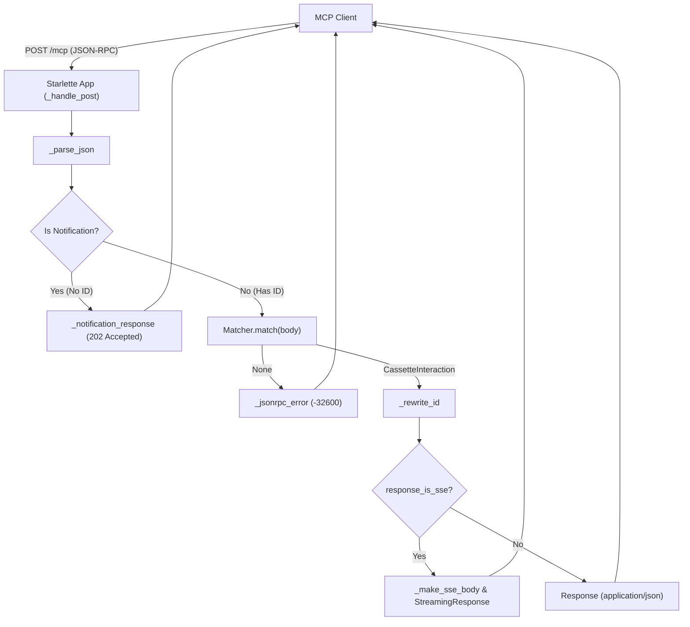
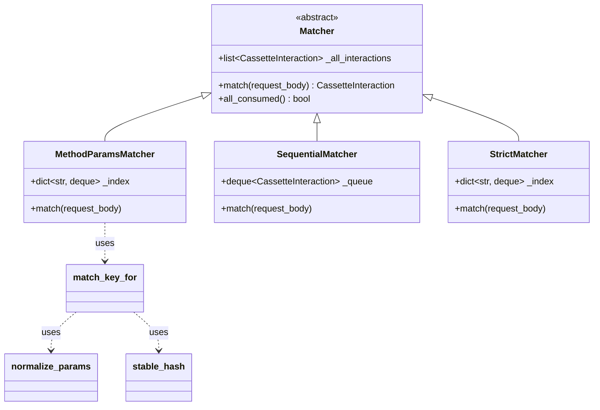

The Replay Engine is responsible for simulating an MCP server by serving recorded interactions from a `Cassette`. It uses a Starlette-based application to intercept incoming JSON-RPC requests and a pluggable `Matcher` system to determine which recorded response should be returned to the client.

## The Replay Application

The `create_replay_app` function constructs a Starlette web application that mimics the MCP SSE transport behavior [src/mcp_recorder/replayer.py:75-194](). It manages a unique `mcp-session-id` for each instantiation [src/mcp_recorder/replayer.py:77]() and routes traffic through three primary handlers:

*   **`_handle_post`**: The main entry point for JSON-RPC requests. It interacts with the `Matcher` to find and return recorded responses [src/mcp_recorder/replayer.py:80-156]().
*   **`_handle_get`**: Simulates the SSE event stream endpoint, providing a keep-alive stream that allows clients to maintain a connection [src/mcp_recorder/replayer.py:170-184]().
*   **`_handle_delete`**: Handles session teardown [src/mcp_recorder/replayer.py:158-168]().

### Data Flow: Replay Request Handling

The following diagram illustrates how an incoming request is processed, matched, and transformed into a response.

**Replay Request Processing Flow**

Sources: [src/mcp_recorder/replayer.py:80-156](), [src/mcp_recorder/replayer.py:32-37](), [src/mcp_recorder/replayer.py:49-53]()

## Matching Strategies

Matching is the process of finding a recorded `CassetteInteraction` that corresponds to an incoming `dict` request body. All matchers inherit from the `Matcher` base class [src/mcp_recorder/matcher.py:41-70]().

### Comparison of Matchers

| Strategy | Class | Logic | Use Case |
| :--- | :--- | :--- | :--- |
| `method_params` | `MethodParamsMatcher` | Matches on method name and stable hash of normalized params [src/mcp_recorder/matcher.py:71-93](). | **Default.** Best for most tests where ID or metadata might shift. |
| `sequential` | `SequentialMatcher` | Ignores body content; returns the next recorded request in order [src/mcp_recorder/matcher.py:96-111](). | Strict ordering tests or simple linear scripts. |
| `strict` | `StrictMatcher` | Matches on full body equality, including volatile `_meta` fields [src/mcp_recorder/matcher.py:113-141](). | High-fidelity verification where no fields should change. |

Sources: [src/mcp_recorder/matcher.py:71-141]()

### Normalization and Stable Hashing

To ensure robust matching, the engine uses normalization to strip volatile data.
*   **`normalize_params`**: Removes the `_meta` field from parameters, which often contains `progressToken` values that vary between runs [src/mcp_recorder/matcher.py:14-21]().
*   **`stable_hash`**: Creates a deterministic 16-character SHA-256 prefix of a JSON-serializable object [src/mcp_recorder/matcher.py:24-27]().
*   **`match_key_for`**: Generates a lookup key in the format `method::hash` [src/mcp_recorder/matcher.py:30-38]().

## ID Rewriting and SSE Wrapping

Because JSON-RPC clients often generate unique request IDs per session, the replayer must modify recorded responses to satisfy the client's expectations.

1.  **ID Rewriting**: The `_rewrite_id` function copies the recorded response and overwrites the `id` field with the `id` from the *current* request [src/mcp_recorder/replayer.py:32-37]().
2.  **SSE Response Wrapping**: If an interaction was originally captured via SSE (indicated by `response_is_sse`), the replayer wraps the JSON response in the `event: message\ndata: ...` format required by the SSE specification [src/mcp_recorder/replayer.py:49-53]().

## Error Handling and Misses

If the `Matcher` cannot find a corresponding interaction, the replayer returns a standard JSON-RPC error response:
*   **Status Code**: 200 OK (Standard for JSON-RPC errors over HTTP) [src/mcp_recorder/replayer.py:118]().
*   **Error Code**: `-32600` (Invalid Request / No Match) [src/mcp_recorder/replayer.py:115]().
*   **Logging**: The replayer logs the miss and the specific tool name if available [src/mcp_recorder/replayer.py:110-114]().

**Matcher Entity Association**

Sources: [src/mcp_recorder/matcher.py:41-141](), [src/mcp_recorder/matcher.py:14-38]()

## Integration with Uvicorn

The replay application is typically served using the `UvicornServer` utility, which wraps `uvicorn.Server` to run in a background daemon thread [src/mcp_recorder/_utils.py:54-81](). This allows the test suite or CLI to start the replay server, execute client requests against `server.url`, and then stop the server cleanly [tests/integration/test_replay.py:17-23]().

Sources: [src/mcp_recorder/_utils.py:54-81](), [tests/integration/test_replay.py:17-23]()