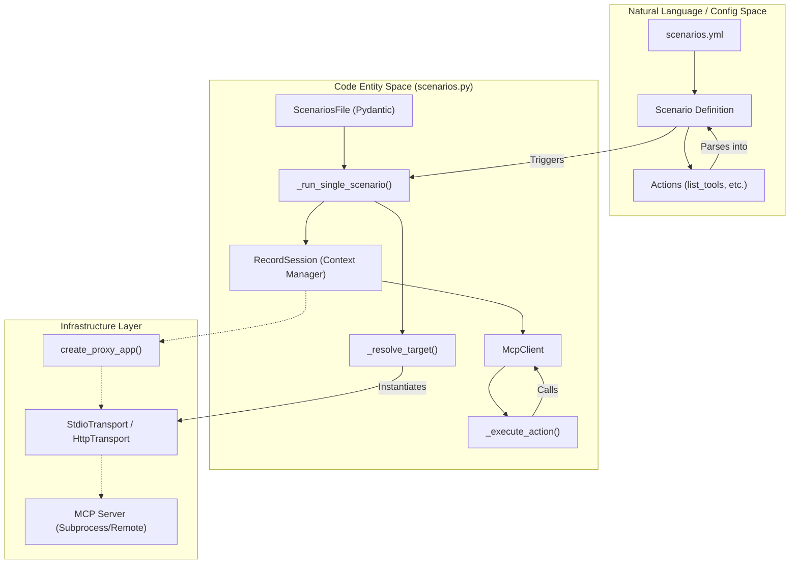
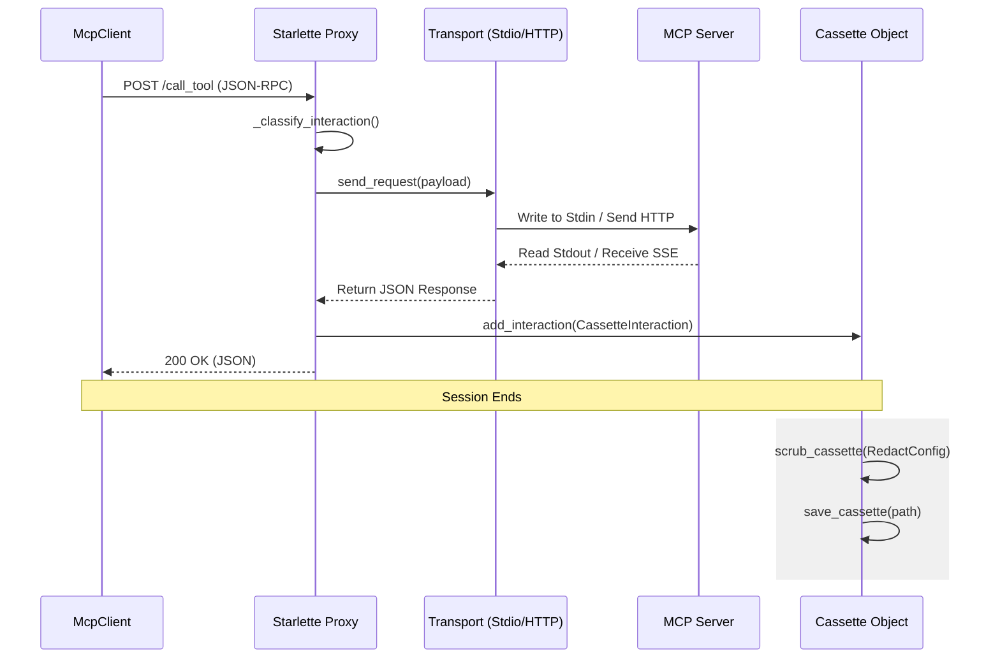

The Scenario Execution Pipeline is the core engine behind the `record-scenarios` command. It automates the end-to-end lifecycle of capturing Model Context Protocol (MCP) interactions based on a declarative `scenarios.yml` file. The pipeline handles target resolution (HTTP vs. Stdio), manages a local proxy server, dispatches actions via an internal client, and persists the resulting interactions into scrubbed cassettes.

## Execution Lifecycle Overview

When `run_scenarios` is invoked, it iterates through the defined scenarios, filtering by name if requested, and executes `_run_single_scenario` for each [src/mcp_recorder/scenarios.py:228-243]().

### Scenario Flow Diagram

The following diagram illustrates the transition from the YAML configuration space to the internal code entities and execution flow.

**Sources:** [src/mcp_recorder/scenarios.py:91-101](), [src/mcp_recorder/scenarios.py:186-226](), [src/mcp_recorder/scenarios.py:134-162]()

---

## 1. Target Resolution
The pipeline first determines the communication medium via `_resolve_target` [src/mcp_recorder/scenarios.py:169-183]().
*   **Stdio Targets**: If the `target` is a `StdioTargetConfig`, the system instantiates a `StdioTransport` using the provided command, arguments, and environment variables [src/mcp_recorder/scenarios.py:173-182]().
*   **HTTP Targets**: If the `target` is a string URL, it is treated as a remote SSE endpoint [src/mcp_recorder/scenarios.py:183-183]().

**Sources:** [src/mcp_recorder/scenarios.py:82-89](), [src/mcp_recorder/scenarios.py:169-183]()

## 2. Proxy Startup and Recording Session
The pipeline uses the `RecordSession` context manager to orchestrate the recording environment [src/mcp_recorder/scenarios.py:207-207]().
1.  **Port Discovery**: A free local port is found using `find_free_port` [src/mcp_recorder/_utils.py:108-115]().
2.  **Proxy Initialization**: `create_proxy_app` builds a Starlette application that intercepts traffic. If using Stdio, it uses `_create_transport_proxy`; if HTTP, it uses `_create_http_proxy` [src/mcp_recorder/proxy.py:92-115]().
3.  **Server Lifecycle**: An `UvicornServer` is started to host the proxy [src/mcp_recorder/_utils.py:68-105]().

**Sources:** [src/mcp_recorder/proxy.py:123-128](), [src/mcp_recorder/scenarios.py:207-210]()

## 3. McpClient Action Dispatch
Once the proxy is live, an `McpClient` is instantiated, pointing to the local proxy URL [src/mcp_recorder/scenarios.py:211-211]().
*   **Handshake**: The client automatically performs the `initialize` / `initialized` handshake [src/mcp_recorder/mcp_client.py:64-92]().
*   **Action Execution**: The pipeline iterates through the `actions` list in the scenario. Each action is dispatched via `_execute_action` [src/mcp_recorder/scenarios.py:134-162]().

### Supported Actions
| Action Type | Implementation |
| :--- | :--- |
| **Simple** | `list_tools`, `list_prompts`, `list_resources` [src/mcp_recorder/scenarios.py:129-129]() |
| **Parameterized** | `call_tool`, `get_prompt`, `read_resource` [src/mcp_recorder/scenarios.py:130-130]() |

**Sources:** [src/mcp_recorder/scenarios.py:134-162](), [src/mcp_recorder/mcp_client.py:94-149]()

## 4. Data Flow and Persistence
The following diagram details how data moves from the client through the proxy to the final cassette file.

**Sources:** [src/mcp_recorder/proxy.py:132-205](), [src/mcp_recorder/scenarios.py:218-224]()

## 5. Post-Processing and Scrubbing
After the `RecordSession` blocks complete, the pipeline performs two final steps:
1.  **Scrubbing**: The `scrub_cassette` function is called using the `RedactConfig` from the YAML file. This redacts environment variables, the server URL, and any custom regex patterns [src/mcp_recorder/scrubber.py:96-121]().
2.  **Persistence**: The resulting `Cassette` object is serialized to JSON and saved to the `output_path` [src/mcp_recorder/_utils.py:46-52]().

**Sources:** [src/mcp_recorder/scenarios.py:218-224](), [src/mcp_recorder/scrubber.py:96-121]()

## 6. Verbose Mode and Filtering
*   **Verbose Mode**: When enabled, the pipeline logs every interaction index, request method, path, and full JSON body to the console via the `mcp_recorder.proxy` logger [src/mcp_recorder/proxy.py:140-143]().
*   **Scenario Filtering**: The `run_scenarios` function accepts an optional `name_filter` (regex). Only scenarios whose keys match the regex are executed [src/mcp_recorder/scenarios.py:239-242]().

**Sources:** [src/mcp_recorder/scenarios.py:228-243](), [src/mcp_recorder/proxy.py:140-143]()