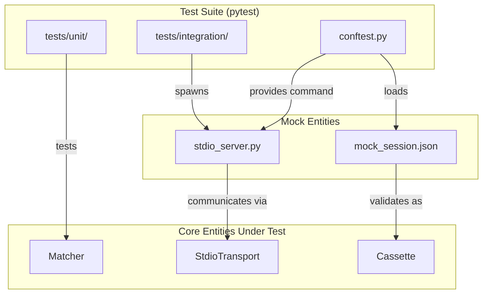
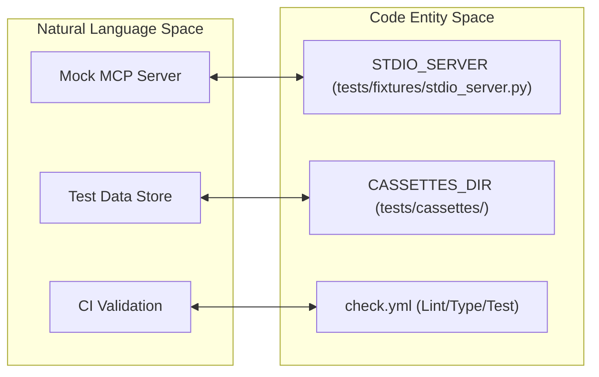

The `mcp-recorder` test suite is designed to ensure the reliability of the Model Context Protocol (MCP) recording, replaying, and verification workflows. The infrastructure is split between granular unit tests for core logic and end-to-end integration tests that exercise the transport layers and proxy servers.

### Test Organization

The codebase segregates tests into two primary directories to distinguish between logic isolation and system behavior:

| Category | Directory | Focus |
| :--- | :--- | :--- |
| **Unit Tests** | `tests/unit/` | Matcher logic, scrubbing patterns, CLI flag parsing, and transport state machines. |
| **Integration Tests** | `tests/integration/` | Full replay cycles, Stdio subprocess communication, and scenario execution. |

The test suite is executed via `pytest` as defined in the CI configuration [ .github/workflows/check.yml:61-62 ]().

For details, see [Unit Tests](#7.1).

### Shared Fixtures and Assets

Shared testing resources are managed in `tests/conftest.py`. This includes paths to serialized cassettes used for regression testing and utility fixtures for spawning test servers.

*   **`CASSETTES_DIR`**: The central repository for test data [ tests/conftest.py:12-18 ]().
*   **`mock_session_cassette`**: A fixture that loads a pre-recorded `Cassette` object from `mock_session.json` for testing replay and matching logic without requiring a live proxy [ tests/conftest.py:27-31 ]().
*   **`stdio_server_command`**: Provides the command list to execute the `stdio_server.py` fixture, which acts as a mock MCP server for subprocess transport testing [ tests/conftest.py:35-37 ]().

For details, see [Integration Tests and Fixtures](#7.2).

### Mock Server Infrastructure

To test the proxy and transport layers without external dependencies, the project utilizes two types of mock servers located in `tests/fixtures/`:

1.  **FastMCP Mock Server**: A high-level server used to simulate complex MCP tool and resource interactions.
2.  **Stdio Fixture Server**: A specialized script (`stdio_server.py`) used to validate the `StdioTransport` lifecycle, including stdin/stdout pipe handling and process termination [ tests/conftest.py:13-13 ]().

### CI Pipeline

The project uses GitHub Actions for continuous integration, ensuring code quality through three distinct stages:

#### 1. Quality Gates (Lint & Type Check)
The `check.yml` workflow runs `ruff` for formatting and linting [ .github/workflows/check.yml:26-30 ]() and `mypy` for strict type verification [ .github/workflows/check.yml:45-46 ]().

#### 2. Automated Testing
The `test` job executes the full suite across unit and integration modules using `uv` for dependency isolation [ .github/workflows/check.yml:48-62 ]().

#### 3. Release Pipeline
The `publish.yml` workflow automates PyPI releases. It performs version validation against `pyproject.toml` [ .github/workflows/publish.yml:19-28 ](), re-runs the full test suite [ .github/workflows/publish.yml:88-89 ](), and creates GitHub releases with generated notes [ .github/workflows/publish.yml:112-121 ]().

### Infrastructure Overview

The following diagram illustrates how the testing entities interact during a test run.

**Testing Entity Relationships**

**Sources:** [ tests/conftest.py:1-38 ](), [ .github/workflows/check.yml:1-63 ]()

### Code to Test Mapping

This diagram bridges the natural language concepts of "Mocking" and "Validation" to the specific code entities used in the infrastructure.

**Infrastructure Code Mapping**

**Sources:** [ tests/conftest.py:12-13 ](), [ .github/workflows/check.yml:12-63 ]()

---
- [Unit Tests](#7.1)
- [Integration Tests and Fixtures](#7.2)