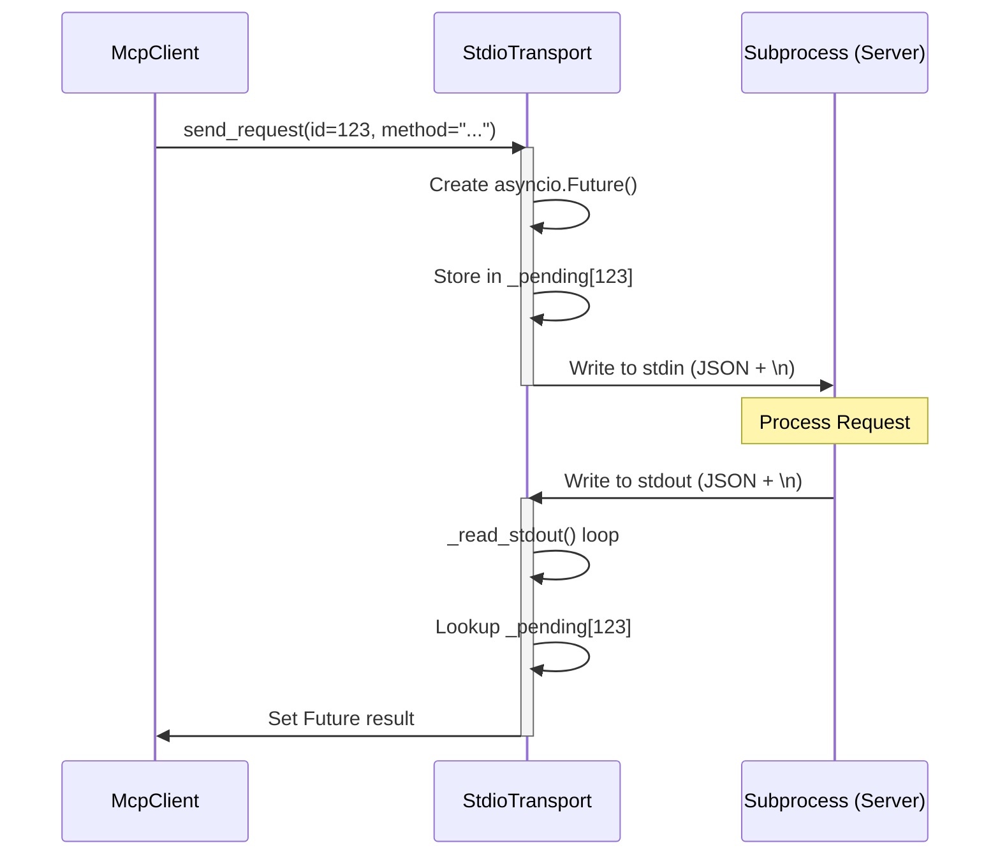
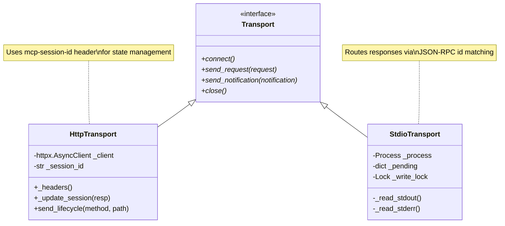

The Transport Layer provides a unified interface for communicating with Model Context Protocol (MCP) servers. It abstracts the underlying communication mechanism—whether it be asynchronous HTTP/SSE or subprocess-based Stdio—allowing higher-level components like the `McpClient` and `Verifier` to operate independently of the connection type [[src/mcp_recorder/transport.py:1-5]]().

## Transport Abstraction

All transport implementations inherit from the `Transport` abstract base class (ABC) [[src/mcp_recorder/transport.py:30-31]](). This class defines the lifecycle and messaging primitives required for JSON-RPC communication.

### Interface Definition
- `connect()`: Establishes the connection (e.g., spawning a subprocess or initializing an HTTP client) [[src/mcp_recorder/transport.py:33-35]]().
- `send_request(request)`: Sends a JSON-RPC request and returns the parsed response [[src/mcp_recorder/transport.py:37-39]]().
- `send_notification(notification)`: Sends a JSON-RPC notification where no response is expected [[src/mcp_recorder/transport.py:41-43]]().
- `close()`: Gracefully shuts down the transport and releases resources [[src/mcp_recorder/transport.py:45-47]]().

The base class also implements the `__aenter__` and `__aexit__` async context manager methods to ensure reliable connection management [[src/mcp_recorder/transport.py:49-54]]().

**Sources:**
- `src/mcp_recorder/transport.py:30-54`

---

## HttpTransport (SSE-based)

The `HttpTransport` class implements the MCP-over-HTTP specification using `httpx.AsyncClient` [[src/mcp_recorder/transport.py:62-69]](). It is designed to handle Server-Sent Events (SSE) and session management via custom headers.

### Session Management
MCP servers often require a session identifier to maintain state across multiple HTTP requests. `HttpTransport` manages this via the `mcp-session-id` header [[src/mcp_recorder/transport.py:88-90]]().
- **Header Injection**: Every request sent via `_headers()` includes the current `_session_id` if available [[src/mcp_recorder/transport.py:83-90]]().
- **Automatic Updates**: The `_update_session()` method extracts the `mcp-session-id` from every server response and updates the internal state [[src/mcp_recorder/transport.py:92-95]]().

### Request and Response Flow
When `send_request` is called, the transport:
1. Encodes the JSON-RPC dictionary into a POST body [[src/mcp_recorder/transport.py:99-100]]().
2. Checks the `content-type` of the response [[src/mcp_recorder/transport.py:103-104]]().
3. If the response is `text/event-stream`, it utilizes `parse_sse_response` to extract the JSON-RPC message [[src/mcp_recorder/transport.py:105]]().
4. Otherwise, it attempts to parse the response as standard JSON [[src/mcp_recorder/transport.py:106-107]]().

**Sources:**
- `src/mcp_recorder/transport.py:62-129`
- `src/mcp_recorder/_utils.py` (for `parse_sse_response`)

---

## StdioTransport (Subprocess-based)

The `StdioTransport` class facilitates communication with local MCP servers by spawning them as child processes and interacting via `stdin`, `stdout`, and `stderr` [[src/mcp_recorder/transport.py:136-142]]().

### Subprocess Lifecycle
- **Spawning**: During `connect()`, the transport uses `asyncio.create_subprocess_exec` with `PIPE` for all three standard streams [[src/mcp_recorder/transport.py:168-177]]().
- **Resource Limits**: To handle large MCP tool definitions, the `stdout` stream reader limit is increased to 10 MB (`_STREAM_READER_LIMIT`), exceeding the default 64 KB [[src/mcp_recorder/transport.py:27, 176]]().
- **Shutdown Sequence**: The `close()` method follows a strict sequence:
    1. Cancels all pending futures [[src/mcp_recorder/transport.py:193-196]]().
    2. Closes `stdin` to signal EOF to the server [[src/mcp_recorder/transport.py:202-203]]().
    3. Attempts a graceful wait for `_SUBPROCESS_SHUTDOWN_TIMEOUT` (5 seconds) [[src/mcp_recorder/transport.py:25, 206-208]]().
    4. Sends `SIGTERM` (or `SIGKILL` if necessary) to the process group if it fails to exit [[src/mcp_recorder/transport.py:211-224]]().

### Asyncio Future Routing
Since `stdout` is a single stream containing responses for multiple concurrent requests, `StdioTransport` implements an internal routing mechanism:
1. **Write Lock**: A `asyncio.Lock` ensures that JSON-RPC messages are written to `stdin` atomically as complete newline-delimited strings [[src/mcp_recorder/transport.py:159, 253-257]]().
2. **Pending Map**: A dictionary `_pending` maps JSON-RPC `id`s to `asyncio.Future` objects [[src/mcp_recorder/transport.py:158]]().
3. **Reader Task**: The `_read_stdout` background task continuously reads lines from the server. When a message arrives, it extracts the `id` and completes the corresponding future in the `_pending` map [[src/mcp_recorder/transport.py:269-281]]().

### Data Flow: Stdio Request/Response
Title: StdioTransport Message Routing

**Sources:**
- `src/mcp_recorder/transport.py:136-293`

---

## Class Relationship and Data Flow

The following diagram bridges the natural language concepts of "Requests" and "Connections" to the specific classes and methods implemented in `transport.py`.

Title: Transport Entity Mapping

### Timeout and Configuration Summary

| Parameter | Value | Description |
| :--- | :--- | :--- |
| `_REQUEST_TIMEOUT` | 120.0s | Default timeout for HTTP requests and JSON-RPC responses [[src/mcp_recorder/transport.py:26]](). |
| `_SUBPROCESS_SHUTDOWN_TIMEOUT` | 5.0s | Time allowed for a subprocess to exit after EOF/SIGTERM [[src/mcp_recorder/transport.py:25]](). |
| `_STREAM_READER_LIMIT` | 10 MB | Buffer size for `asyncio.StreamReader` to prevent overflows on large payloads [[src/mcp_recorder/transport.py:27]](). |

**Sources:**
- `src/mcp_recorder/transport.py:25-27`
- `src/mcp_recorder/transport.py:69-74`
- `src/mcp_recorder/transport.py:144-162`