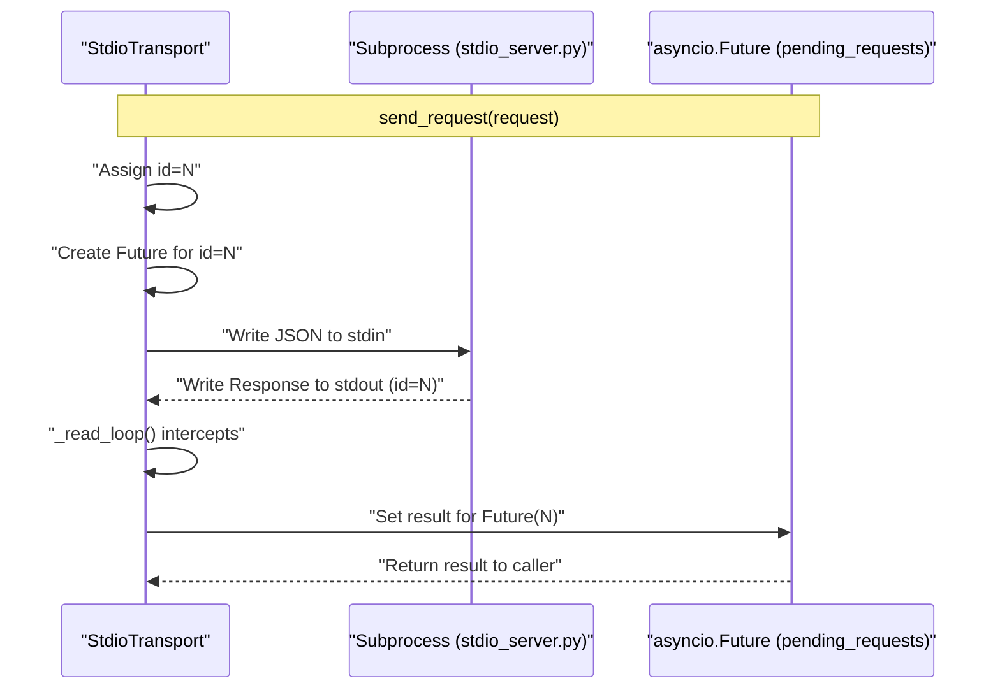
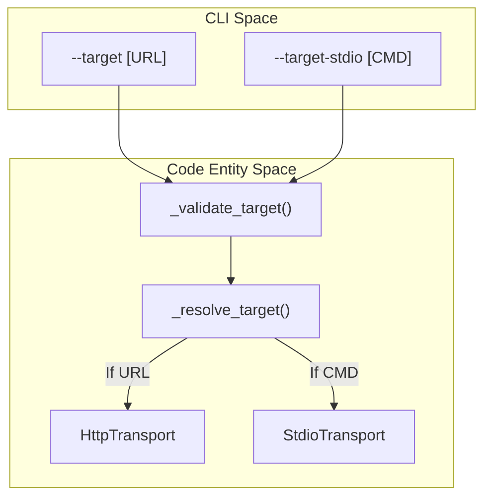

The `mcp-recorder` test suite is divided into unit tests and integration tests. The unit tests focus on isolating the core logic of individual subsystems—matching, scrubbing, verification, and transport—using mocks and in-memory data structures to ensure deterministic behavior.

## Matching Strategies (`test_matcher.py`)

The matcher engine is responsible for finding the correct recorded interaction to return during a replay session. Unit tests verify the three primary strategies: `MethodParamsMatcher`, `SequentialMatcher`, and `StrictMatcher`.

### Implementation Details
- **FIFO Consumption**: Tests ensure that if multiple identical requests (same method and parameters) exist in a cassette, they are consumed in a First-In-First-Out (FIFO) order [tests/unit/test_matcher.py:61-100]().
- **Metadata Normalization**: The `MethodParamsMatcher` is tested to ensure it ignores `_meta` fields (like `progressToken`) during matching to account for runtime variance, whereas `StrictMatcher` is verified to include them [tests/unit/test_matcher.py:101-117](), [tests/unit/test_matcher.py:187-200]().
- **Exhaustion Handling**: Tests verify that once all matching interactions are consumed, subsequent identical requests return `None`, triggering a match-miss error in the proxy [tests/unit/test_matcher.py:159-164]().

| Matcher Class | Matching Logic | Metadata Sensitivity |
| :--- | :--- | :--- |
| `MethodParamsMatcher` | Matches on JSON-RPC `method` and `params`. | Ignored |
| `SequentialMatcher` | Returns interactions in the exact order they appear. | N/A |
| `StrictMatcher` | Matches on `method` and `params` including `_meta`. | Sensitive |

**Sources:** [tests/unit/test_matcher.py:1-133]()

## Redaction and Scrubbing (`test_scrubber.py`)

The scrubber logic ensures that sensitive information (API keys, tokens) is removed from cassettes before they are persisted.

### Implementation Details
- **Environment Redaction**: Tests use `unittest.mock.patch.dict` to simulate environment variables and verify that values found in responses are replaced with `[REDACTED]` [tests/unit/test_scrubber.py:69-79]().
- **Structural Integrity**: A key requirement verified by tests is that the scrubber must never redact structural JSON-RPC keys like `jsonrpc`, `id`, or `method`, even if their values match a sensitive pattern [tests/unit/test_scrubber.py:146-171]().
- **Unidirectional Scrubbing**: Tests confirm that the scrubber warns if sensitive data is found in a **request** body but does not redact it, as modifying request bodies would break the deterministic matching required for replay [tests/unit/test_scrubber.py:105-119]().

**Sources:** [tests/unit/test_scrubber.py:1-171]()

## Verification and Diffing (`test_verifier.py`)

The verifier compares a fresh replay against a recorded cassette. The unit tests focus on the structural comparison engine.

### Volatile Field Stripping
The function `_strip_volatile` is tested for its ability to remove non-deterministic data before comparison [tests/unit/test_verifier.py:8-70]().
- **Field Stripping**: Removes keys at any depth (e.g., `timestamp`).
- **Path Stripping**: Uses JSONPath-like syntax (e.g., `$.result.metadata.id`) to remove specific fields without affecting identical keys elsewhere in the document.

### JSON-in-String Comparison
A specialized feature of `_deep_diff` is its ability to parse strings that contain JSON and compare them structurally rather than as raw strings.
- **Formatting Independence**: Tests verify that `{"a":1,"b":2}` matches `{"b": 2, "a": 1}` when embedded in a string [tests/unit/test_verifier.py:80-85]().
- **Nested Structures**: The logic recursively descends into strings within JSON objects to find nested structural differences [tests/unit/test_verifier.py:103-109]().

**Sources:** [tests/unit/test_verifier.py:1-121]()

## Transport Layer (`test_transport.py`)

Tests for the transport layer ensure that the communication bridge between the recorder and the MCP server (either via Stdio or HTTP) is robust.

### StdioTransport Lifecycle
The `StdioTransport` tests manage a real subprocess using a fixture server (`stdio_server.py`) to verify:
- **Process Management**: Correct spawning and termination of the subprocess [tests/unit/test_transport.py:47-79]().
- **ID Routing**: Ensuring that responses from the subprocess are correctly routed back to the awaiting `asyncio.Future` based on the JSON-RPC `id` [tests/unit/test_transport.py:98-109]().
- **Error Propagation**: Verifying that subprocess crashes result in `ConnectionError` or `TimeoutError` in the calling code [tests/unit/test_transport.py:151-159]().

### Transport Data Flow
The following diagram illustrates the data flow within `StdioTransport` as verified by the unit tests.

**Diagram: StdioTransport Message Routing**

**Sources:** [tests/unit/test_transport.py:1-178]()

## Scenario Configuration (`test_scenarios_env.py`, `test_scenarios_stdio.py`)

These modules test the parsing and interpolation of the `scenarios.yml` file used for batch recording.

### Environment Interpolation
The `_expand_env_vars` helper is tested for:
- **Substitution**: Replacing `${VAR}` with environment values [tests/unit/test_scenarios_env.py:30-37]().
- **Fallbacks**: Supporting `${VAR:-default}` syntax [tests/unit/test_scenarios_env.py:43-52]().
- **Recursive Expansion**: Walking through dictionaries and lists to expand values at any depth [tests/unit/test_scenarios_env.py:78-82]().

### Target Resolution
Tests for `_resolve_target` ensure that various target formats are correctly converted into `Transport` instances:
- **HTTP**: Strings starting with `http` result in `HttpTransport`.
- **Stdio**: Dictionaries containing `command` and `args` are parsed into `StdioTargetConfig` and then into `StdioTransport` [tests/unit/test_scenarios_stdio.py:24-34](), [tests/unit/test_scenarios_stdio.py:72-78]().

**Sources:** [tests/unit/test_scenarios_env.py:1-188](), [tests/unit/test_scenarios_stdio.py:1-78]()

## CLI and Proxy Integration (`test_cli_flags.py`, `test_proxy_transport.py`)

### CLI Flag Validation
Tests ensure that mutually exclusive flags (like `--target` and `--target-stdio`) are correctly caught by the `click` decorators and validation helpers [tests/unit/test_cli_flags.py:13-56]().

### Proxy Transport Logic
The `test_proxy_transport.py` module uses a `FakeTransport` to verify that the `create_proxy_app` correctly forwards requests from the Starlette app to the underlying transport [tests/unit/test_proxy_transport.py:19-42]().
- **Status Codes**: Verifies that successful notifications return `202 Accepted` [tests/unit/test_proxy_transport.py:106-121]().
- **Latency**: Ensures that `latency_ms` is calculated and recorded for each interaction [tests/unit/test_proxy_transport.py:133-144]().

**Diagram: CLI Target Validation to Transport Entity**

**Sources:** [tests/unit/test_cli_flags.py:1-85](), [tests/unit/test_proxy_transport.py:1-170]()