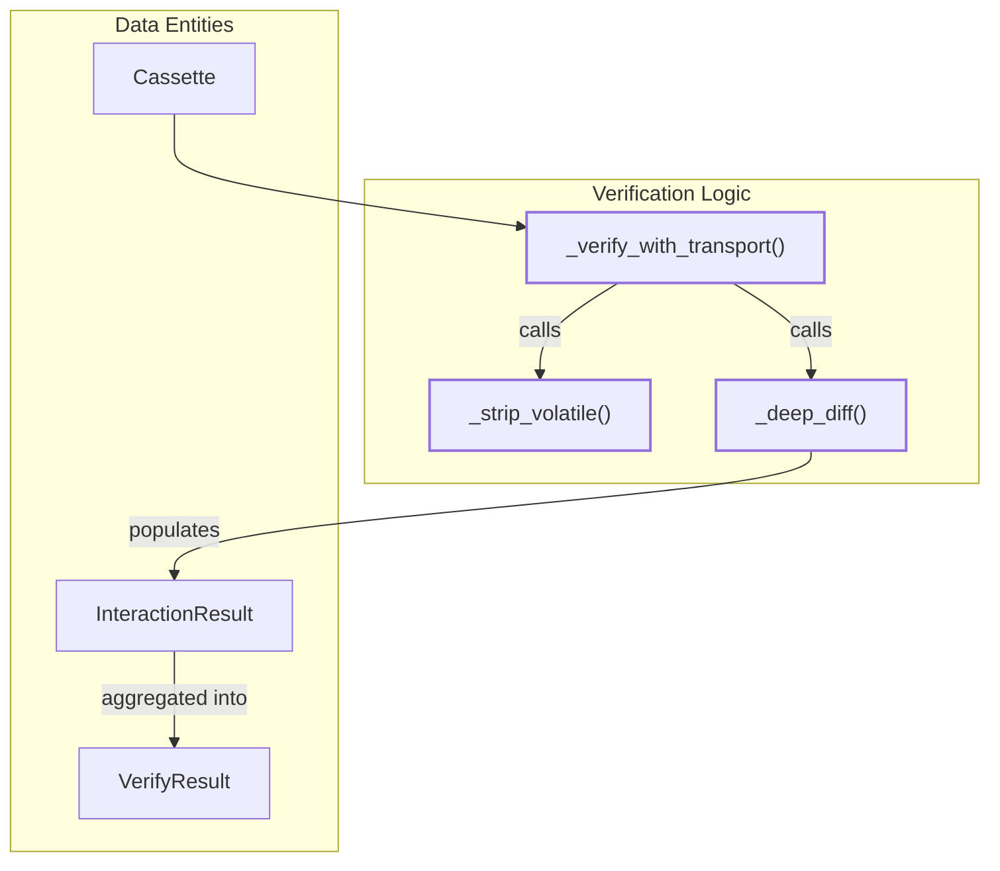
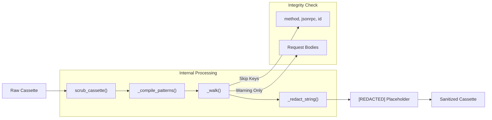

The verification and scrubbing systems ensure that recorded interactions remain accurate over time and safe for distribution. The **Verifier** executes recorded requests against a live server to detect regressions, while the **Scrubber** applies explicit redaction rules to remove sensitive data from cassettes without breaking replay integrity.

## Verification Pipeline

The verification engine, primarily implemented in `src/mcp_recorder/verifier.py`, automates the process of regression testing by replaying a `Cassette` against a live target. It uses a `Transport` to communicate with the server and performs a structural comparison between the recorded (expected) response and the live (actual) response.

### Verification Flow

The core loop resides in `_verify_with_transport` [src/mcp_recorder/verifier.py:126-132](). It iterates through all interactions in a cassette, handling different `InteractionType` values:

1.  **LIFECYCLE**: Handled via `transport.send_lifecycle` if supported by the transport (e.g., `HttpTransport`) [src/mcp_recorder/verifier.py:142-154]().
2.  **NOTIFICATION**: Dispatched via `transport.send_notification`. Since notifications do not have responses, they are marked as passed if the transport does not raise an error [src/mcp_recorder/verifier.py:166-183]().
3.  **JSONRPC_REQUEST**: Dispatched via `transport.send_request`. The resulting response is then passed to the comparison logic [src/mcp_recorder/verifier.py:186-210]().

### Structural Comparison and Volatility

To avoid false positives, the verifier must ignore fields that naturally change between sessions.

*   **`_strip_volatile`**: Recursively removes keys defined in `_VOLATILE_KEYS` (like `id` and `_meta`) [src/mcp_recorder/verifier.py:19-19](), as well as user-provided `ignore_fields` and `ignore_paths` [src/mcp_recorder/verifier.py:44-71]().
*   **`_deep_diff`**: Generates a human-readable list of differences. It supports **JSON-in-string comparison**; if two strings are encountered that contain valid JSON (common in MCP tool outputs), it parses and diffs them structurally rather than as raw strings [src/mcp_recorder/verifier.py:108-117]().

### Logic Entity Map: Verification

This diagram maps the natural language concepts of "Regression Testing" to the specific code entities in the verifier.

**Sources:** [src/mcp_recorder/verifier.py:22-42](), [src/mcp_recorder/verifier.py:44-71](), [src/mcp_recorder/verifier.py:74-123](), [src/mcp_recorder/verifier.py:126-132]()

---

## Scrubbing System

The scrubber, located in `src/mcp_recorder/scrubber.py`, provides a mechanism to sanitize cassettes before they are committed to version control. It follows a strict "no auto-detection" policy to prevent accidental data loss.

### Redaction Rules

Redaction is governed by `scrub_cassette` [src/mcp_recorder/scrubber.py:86-92]() and supports three primary modes:

1.  **URL Path Redaction**: `_redact_url_path` strips the path and query from the `server_url` in metadata, replacing it with `[REDACTED]` while preserving the scheme and host [src/mcp_recorder/scrubber.py:27-32]().
2.  **Environment Variables**: `_compile_patterns` fetches values for specified env vars and escapes them for regex matching [src/mcp_recorder/scrubber.py:43-52]().
3.  **Regex Patterns**: Custom regex strings provided by the user [src/mcp_recorder/scrubber.py:53-59]().

### Integrity Constraints

A critical design principle of `mcp-recorder` is that **request bodies are never modified** [src/mcp_recorder/scrubber.py:8-8](). Modifying a request would break the `Matcher` during replay or verification, as the server would receive different input than what was recorded.

The scrubber:
*   Redacts matching strings in **Metadata**.
*   Redacts matching strings in **Response Bodies** via the `_walk` function [src/mcp_recorder/scrubber.py:69-84]().
*   **Warns** the user if a sensitive pattern is found in a request body but does not change it [src/mcp_recorder/scrubber.py:128-142]().

### Scrubbing Data Flow

This diagram illustrates how data is transformed from a "Raw Cassette" to a "Sanitized Cassette" using the internal scrubbing functions.

**Sources:** [src/mcp_recorder/scrubber.py:24-24](), [src/mcp_recorder/scrubber.py:35-59](), [src/mcp_recorder/scrubber.py:69-84](), [src/mcp_recorder/scrubber.py:86-100](), [src/mcp_recorder/scrubber.py:128-142]()

---

## Summary of Key Components

| Component | Function/Class | Description |
| :--- | :--- | :--- |
| **Volatile Keys** | `_VOLATILE_KEYS` | Set containing `id` and `_meta`, always ignored during verification [src/mcp_recorder/verifier.py:19](). |
| **Deep Diff** | `_deep_diff` | Structural comparison engine that handles nested JSON and JSON-in-strings [src/mcp_recorder/verifier.py:74](). |
| **Placeholder** | `_PLACEHOLDER` | The string `[REDACTED]` used to replace sensitive info [src/mcp_recorder/scrubber.py:24](). |
| **Recursive Walker** | `_walk` | Navigates JSON structures to apply redaction while skipping protocol-critical keys [src/mcp_recorder/scrubber.py:69](). |
| **Interaction Result** | `InteractionResult` | Data class storing the pass/fail status and diff for a single exchange [src/mcp_recorder/verifier.py:22](). |

**Sources:** [src/mcp_recorder/verifier.py:19-42](), [src/mcp_recorder/verifier.py:74-82](), [src/mcp_recorder/scrubber.py:24-24](), [src/mcp_recorder/scrubber.py:69-78]()