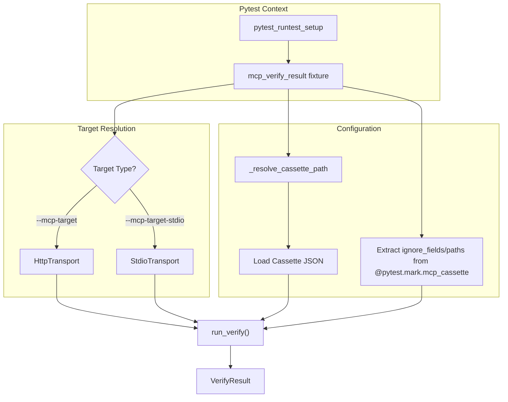
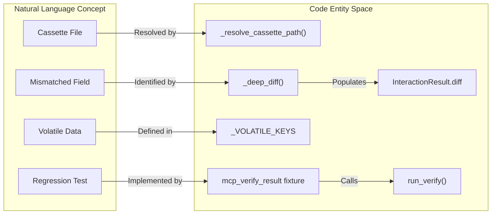
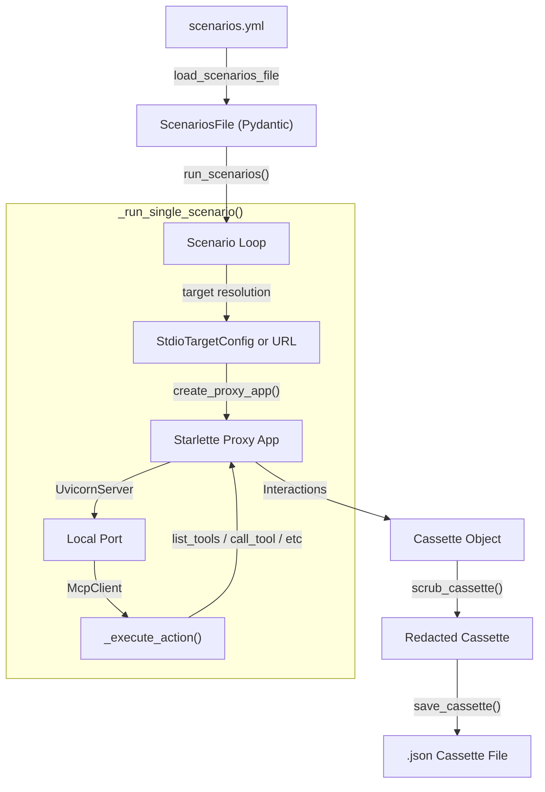
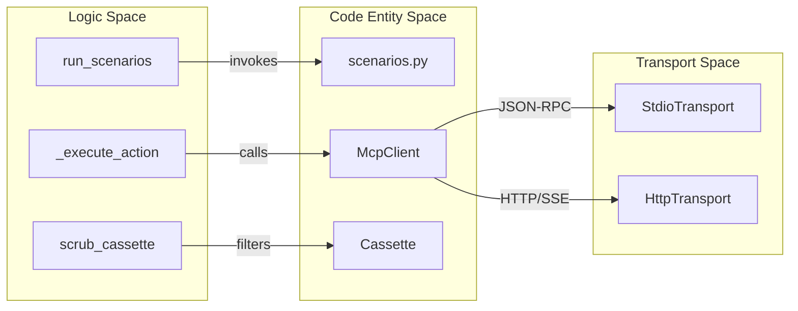
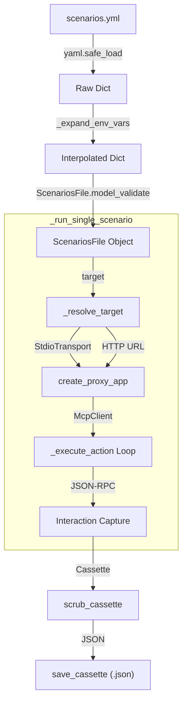
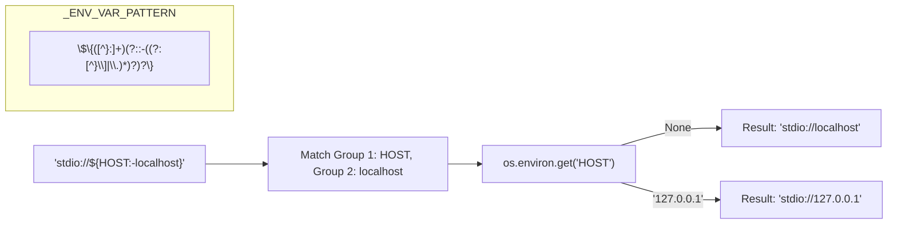

The `mcp_verify_result` fixture is a specialized `pytest` tool designed for server-side regression testing. It allows developers to validate that a live MCP server implementation (either via HTTP or Stdio) behaves identically to a previously recorded session captured in a JSON cassette.

## Purpose and Scope

The primary goal of `mcp_verify_result` is to provide a programmatic way to execute the "Verify" workflow within a standard `pytest` suite [src/mcp_recorder/pytest_plugin.py:155-165](). Unlike the `mcp_replay_url` fixture, which mocks a server for a client to talk to, `mcp_verify_result` acts as the client itself. It reads the requests from a cassette, sends them to a target server, and compares the live responses against the recorded ones using a deep-diffing engine [src/mcp_recorder/verifier.py:126-132]().

## Target Resolution

The fixture determines which server to test against based on CLI options passed to `pytest`. These options are registered in the `pytest_addoption` hook [src/mcp_recorder/pytest_plugin.py:35-68]().

| Option | Description | Usage |
| :--- | :--- | :--- |
| `--mcp-target` | URL of a live MCP server (SSE/HTTP). | `pytest --mcp-target http://localhost:8000/mcp` |
| `--mcp-target-stdio` | Command to spawn a Stdio-based MCP server. | `pytest --mcp-target-stdio "python server.py"` |
| `--mcp-target-env` | Environment variables for the stdio subprocess. | `--mcp-target-env "DEBUG=1"` |

The fixture enforces that exactly one target type is provided; it will fail the test if both or neither are specified [src/mcp_recorder/pytest_plugin.py:172-175]().

### Data Flow: Fixture to Verifier

The following diagram illustrates how the fixture resolves the cassette and initializes the verification pipeline.

**Verification Setup Flow**

**Sources:** [src/mcp_recorder/pytest_plugin.py:155-223](), [src/mcp_recorder/verifier.py:126-132]()

## StdioTransport Setup

When `--mcp-target-stdio` is used, the fixture initializes a `StdioTransport` [src/mcp_recorder/pytest_plugin.py:201-201]().
1. It uses `shlex.split` to parse the command string into a executable and arguments [src/mcp_recorder/pytest_plugin.py:195-195]().
2. It parses `--mcp-target-env` strings (e.g., `KEY=VALUE`) into a dictionary [src/mcp_recorder/pytest_plugin.py:197-200]().
3. The `StdioTransport` manages the subprocess lifecycle, opening `stdin` and `stdout` pipes for JSON-RPC communication during the verification loop.

**Sources:** [src/mcp_recorder/pytest_plugin.py:194-201](), [src/mcp_recorder/transport.py]()

## The Verification Pipeline

The core logic resides in `run_verify`, which delegates to `_verify_with_transport` [src/mcp_recorder/verifier.py:126-132](). The pipeline follows these steps:

1.  **Transport Connection**: The transport is opened (starting the subprocess or connecting to the URL) [src/mcp_recorder/verifier.py:136-136]().
2.  **Interaction Loop**: The verifier iterates through every interaction in the `Cassette`.
3.  **Dispatch**:
    *   **Notifications**: Sent via `transport.send_notification`. These are marked "passed" if no exception occurs [src/mcp_recorder/verifier.py:166-183]().
    *   **Requests**: Sent via `transport.send_request`. The verifier waits for the server's response [src/mcp_recorder/verifier.py:185-200]().
4.  **Comparison**:
    *   **Volatile Stripping**: The verifier calls `_strip_volatile` to remove keys that naturally change between sessions, such as JSON-RPC `id` or `_meta` fields [src/mcp_recorder/verifier.py:19-20](), [src/mcp_recorder/verifier.py:44-71]().
    *   **User Ignores**: Any fields or paths specified in the `@pytest.mark.mcp_cassette` marker are also stripped [src/mcp_recorder/verifier.py:59-63]().
    *   **Deep Diff**: `_deep_diff` compares the remaining JSON structures, producing human-readable error messages if a mismatch is found [src/mcp_recorder/verifier.py:74-123]().

### VerifyResult Structure

The fixture returns a `VerifyResult` object, which provides a summary of the test run [src/mcp_recorder/verifier.py:35-41]().

| Attribute | Type | Description |
| :--- | :--- | :--- |
| `total` | `int` | Total number of interactions processed. |
| `passed` | `int` | Number of interactions where the response matched. |
| `failed` | `int` | Number of interactions with mismatches or errors. |
| `results` | `list[InteractionResult]` | Detailed breakdown of every interaction, including `diff` strings for failures [src/mcp_recorder/verifier.py:23-32]().

**Sources:** [src/mcp_recorder/verifier.py:22-41](), [src/mcp_recorder/verifier.py:126-220]()

## Writing Regression Tests

To use the fixture, a test must be decorated with `@pytest.mark.mcp_cassette`. This marker points to the recorded interaction data and optionally configures the comparison engine.

### Example Usage

```python
import pytest

@pytest.mark.mcp_cassette(
    "cassettes/weather_api.json",
    ignore_fields=["timestamp"],
    ignore_paths=["$.result.metadata.latency"]
)
def test_weather_server_regression(mcp_verify_result):
    # The fixture has already executed all requests against the target
    assert mcp_verify_result.failed == 0, f"Mismatches found: {mcp_verify_result.results}"
```

### Entity Mapping: NL to Code

This diagram maps the natural language concepts of "Verification" to the specific classes and functions in the codebase.

**Verification Entity Mapping**

**Sources:** [src/mcp_recorder/pytest_plugin.py:89-111](), [src/mcp_recorder/verifier.py:19-20](), [src/mcp_recorder/verifier.py:23-32](), [src/mcp_recorder/verifier.py:74-76]()

## Handling JSON-in-String Comparison

MCP tools often return data where a JSON object is serialized as a string within a `text` field. The `_deep_diff` function includes a specialized handler that attempts to `json.loads()` string values if they appear to be structural JSON [src/mcp_recorder/verifier.py:108-117](). If successful, it performs a structural comparison instead of a literal string comparison, preventing false negatives caused by insignificant whitespace changes in the server's output [src/mcp_recorder/verifier.py:115-115]().

**Sources:** [src/mcp_recorder/verifier.py:105-123]()

# Scenario System


The Scenario System in `mcp-recorder` provides a declarative, YAML-driven approach to batch recording MCP server interactions. Instead of manually starting a proxy and performing actions through a client, developers can define a series of "scenarios" in a `scenarios.yml` file. This system is ideal for generating consistent test data, documenting server behavior, and creating regression suites.

The primary entry point for this system is the `record-scenarios` CLI command, which orchestrates the lifecycle of multiple recordings in a single execution [src/mcp_recorder/cli.py:162-181]().

## System Overview

The system operates by parsing a configuration file into a `ScenariosFile` model, resolving the target (either a remote HTTP server or a local Stdio subprocess), and then iterating through defined scenarios. For each scenario, it spawns a temporary proxy, executes a sequence of MCP actions using an internal `McpClient`, and persists the resulting `Cassette`.

### High-Level Interaction Flow

The following diagram illustrates how the `run_scenarios` pipeline bridges the YAML definitions to the functional code entities:

"Scenario Execution Flow"

Sources: [src/mcp_recorder/scenarios.py:169-232](), [src/mcp_recorder/cli.py:182-200]()

## Configuration Components

The system relies on several Pydantic models to validate and structure the recording process:

| Component | Code Entity | Purpose |
| :--- | :--- | :--- |
| **Target** | `StdioTargetConfig` | Defines how to spawn a local MCP server (command, args, env, cwd) [src/mcp_recorder/scenarios.py:82-89](). |
| **Redaction** | `RedactConfig` | Specifies global scrubbing rules for all scenarios in the file [src/mcp_recorder/scenarios.py:76-80](). |
| **Scenario** | `Scenario` | A named group containing a description and a list of actions [src/mcp_recorder/scenarios.py:91-93](). |
| **Actions** | `_execute_action` | The logic mapping YAML strings/dicts to `McpClient` methods [src/mcp_recorder/scenarios.py:134-163](). |

### Environment Variable Interpolation
The system supports dynamic configuration using `${VAR:-default}` syntax. This allows sensitive information (like API keys) to be injected at runtime without being hardcoded in the YAML file. The `_expand_env_vars` function recursively processes the entire YAML structure before validation [src/mcp_recorder/scenarios.py:34-54]().

## Execution Pipeline

When `run_scenarios` is called, it follows a strict lifecycle for every scenario:

1.  **Resolution**: The `_resolve_target` helper determines if the target is a URL or a `StdioTransport` [src/mcp_recorder/scenarios.py:169-183]().
2.  **Proxy Setup**: A `create_proxy_app` instance is created and wrapped in a `UvicornServer` on a dynamically found free port [src/mcp_recorder/scenarios.py:203-217]().
3.  **Client Dispatch**: An `McpClient` connects to the local proxy and iterates through the `actions` list (e.g., `call_tool`, `list_resources`) [src/mcp_recorder/scenarios.py:219-224]().
4.  **Post-Processing**: Once actions complete, the proxy is stopped. The captured interactions are passed through `scrub_cassette` using the `RedactConfig` defined in the file [src/mcp_recorder/scenarios.py:226-228]().
5.  **Persistence**: The final `Cassette` is saved to the specified output directory [src/mcp_recorder/scenarios.py:229-230]().

"Pipeline Entity Mapping"

Sources: [src/mcp_recorder/scenarios.py:1-22](), [src/mcp_recorder/mcp_client.py:1-20](), [src/mcp_recorder/transport.py:1-30]()

***

## Detailed Documentation

For specific details on implementation and usage, refer to the child pages:

*   **[scenarios.yml Schema Reference](#6.1)**: Detailed reference for every field in the scenarios.yml configuration, including `StdioTargetConfig`, `RedactConfig`, and the supported action types.
*   **[Scenario Execution Pipeline](#6.2)**: Explains the internal lifecycle of `_run_single_scenario`, including target resolution, proxy startup, and cassette persistence.

# scenarios.yml Schema Reference


The `scenarios.yml` file defines a batch of automated interactions to be recorded against an Model Context Protocol (MCP) server. It allows developers to specify a target server, redaction rules, and a sequence of JSON-RPC actions (tools, prompts, resources) to execute.

This configuration is primarily consumed by the `record-scenarios` command [src/mcp_recorder/scenarios.py:1-22]().

## Schema Overview

The configuration uses a versioned YAML schema validated via Pydantic models in `src/mcp_recorder/scenarios.py`.

| Field | Type | Description |
| :--- | :--- | :--- |
| `schema_version` | `str` | Must be `"1.0"`. Major version must match `SCENARIOS_FORMAT_VERSION` [src/mcp_recorder/scenarios.py:24](). |
| `target` | `str` \| `StdioTargetConfig` | The MCP server to record. Can be an HTTP URL or a subprocess configuration. |
| `redact` | `RedactConfig` | (Optional) Rules for scrubbing sensitive data from the resulting cassettes. |
| `scenarios` | `dict[str, Scenario]` | A map of scenario IDs to their respective action sequences. |

### Data Flow: Scenario Execution
The following diagram illustrates how `ScenariosFile` is parsed and executed by `_run_single_scenario`.

**Scenario Execution Pipeline**

**Sources:** [src/mcp_recorder/scenarios.py:134-210](), [src/mcp_recorder/scenarios.py:34-54]()

---

## Field Definitions

### `target`
The `target` field defines how `mcp-recorder` connects to the MCP server.

#### HTTP Target
A simple string representing the SSE endpoint of an MCP server.
```yaml
target: "https://mcp.example.com/sse"
```

#### Stdio Target (`StdioTargetConfig`)
Used for local servers running as subprocesses.
```yaml
target:
  command: "uv"
  args: ["run", "my-server.py"]
  env:
    DEBUG: "true"
    API_KEY: "${MY_API_KEY}"
  cwd: "./server"
```
*   **command**: The executable to run [src/mcp_recorder/scenarios.py:85]().
*   **args**: List of command-line arguments [src/mcp_recorder/scenarios.py:86]().
*   **env**: Dictionary of environment variables for the subprocess [src/mcp_recorder/scenarios.py:87]().
*   **cwd**: Working directory for the process [src/mcp_recorder/scenarios.py:88]().

### `redact` (`RedactConfig`)
Defines the scrubbing behavior applied to the `Cassette` before it is saved to disk.

| Field | Default | Description |
| :--- | :--- | :--- |
| `server_url` | `true` | If true, replaces the server URL in metadata with `REDACTED` [src/mcp_recorder/scenarios.py:77](). |
| `env` | `[]` | List of environment variable names whose values should be scrubbed [src/mcp_recorder/scenarios.py:78](). |
| `patterns` | `[]` | List of regex patterns to find and replace with `REDACTED` [src/mcp_recorder/scenarios.py:79](). |

### `scenarios` (`Scenario`)
Each entry in the `scenarios` map generates a separate cassette file named `{scenario_id}.json`.

```yaml
scenarios:
  get_weather_report:
    description: "Fetches weather for London"
    actions:
      - list_tools
      - call_tool:
          name: "get_weather"
          arguments:
            city: "London"
```

**Sources:** [src/mcp_recorder/scenarios.py:62-101]()

---

## Supported Action Types

Actions are executed sequentially via `_execute_action` [src/mcp_recorder/scenarios.py:134-163]().

### Simple Actions (Strings)
These actions take no arguments and are defined as simple strings in the `actions` list.
*   `list_tools`: Calls `client.list_tools()` [src/mcp_recorder/scenarios.py:129]().
*   `list_prompts`: Calls `client.list_prompts()` [src/mcp_recorder/scenarios.py:129]().
*   `list_resources`: Calls `client.list_resources()` [src/mcp_recorder/scenarios.py:129]().

### Parameterized Actions (Dicts)
These require specific keys and arguments.

#### `call_tool`
Executes an MCP tool.
*   **name**: The tool name.
*   **arguments**: Key-value pairs passed to the tool.
*   *Implementation*: `ToolCallAction` [src/mcp_recorder/scenarios.py:62-64]().

#### `get_prompt`
Retrieves a specific prompt.
*   **name**: The prompt name.
*   **arguments**: Arguments for prompt templates.
*   *Implementation*: `PromptGetAction` [src/mcp_recorder/scenarios.py:67-69]().

#### `read_resource`
Reads a resource via URI.
*   **uri**: The resource URI (e.g., `file:///logs/app.log`).
*   *Implementation*: `ResourceReadAction` [src/mcp_recorder/scenarios.py:72-73]().

---

## Environment Variable Interpolation

The `scenarios.yml` supports dynamic value injection using the `${VAR}` syntax. This is processed by `_expand_env_vars` [src/mcp_recorder/scenarios.py:34-54]() before Pydantic validation.

### Syntax
1.  **Required Variable**: `${API_KEY}`
    *   Throws `ValueError` if `API_KEY` is not set in the environment [src/mcp_recorder/scenarios.py:42-46]().
2.  **Variable with Default**: `${PORT:-8080}`
    *   Uses `8080` if `PORT` is unset [src/mcp_recorder/scenarios.py:47]().

**Interpolation Logic**

**Sources:** [src/mcp_recorder/scenarios.py:31-49]()

---

## Implementation Details

### Target Resolution
The `_resolve_target` function determines whether to instantiate a `StdioTransport` or use a direct HTTP URL [src/mcp_recorder/scenarios.py:169-184]().

*   If `target` is a `StdioTargetConfig`, a `StdioTransport` is created using the provided `command`, `args`, and `env` [src/mcp_recorder/scenarios.py:176-181]().
*   The `server_url` in the cassette metadata is prefixed with `stdio://` for display purposes if a subprocess is used [src/mcp_recorder/scenarios.py:175]().

### Scenario Runner Loop
The `run_scenarios` function iterates through the `scenarios` dictionary in the YAML file [src/mcp_recorder/scenarios.py:228-251](). For each scenario:
1.  It checks if a filter is applied (via CLI).
2.  It calls `_run_single_scenario`.
3.  It starts a `UvicornServer` hosting a proxy app [src/mcp_recorder/scenarios.py:207-208]().
4.  It initializes an `McpClient` pointing to the proxy [src/mcp_recorder/scenarios.py:212]().
5.  It iterates through the `actions` list, calling `_execute_action` for each [src/mcp_recorder/scenarios.py:216-217]().
6.  Finally, it scrubs and saves the resulting `Cassette` [src/mcp_recorder/scenarios.py:220-222]().

**Sources:** [src/mcp_recorder/scenarios.py:186-225](), [src/mcp_recorder/scenarios.py:228-251]()