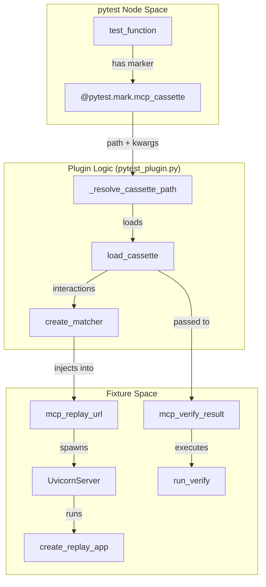
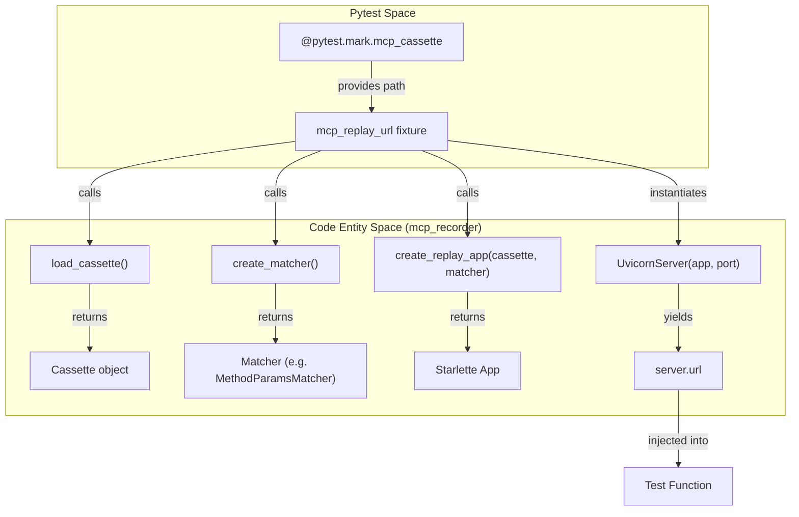
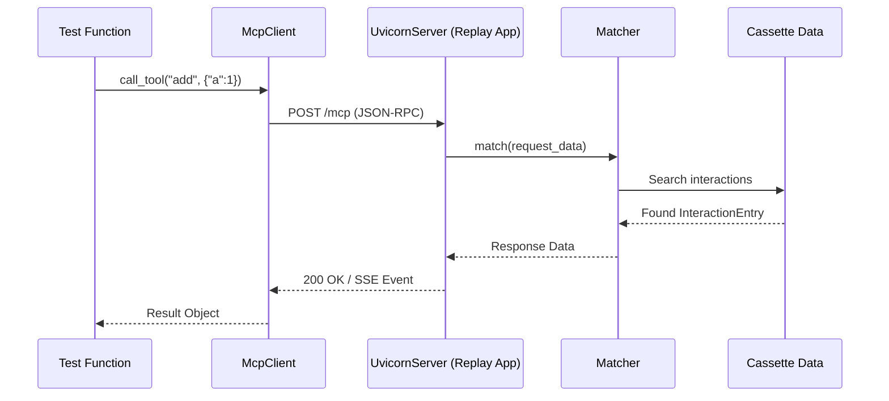

The `mcp-recorder` package includes a built-in pytest plugin that simplifies the integration of MCP interaction testing into standard Python test suites. It registers itself via the `pytest11` entry point [pyproject.toml:40-41]() and provides specialized fixtures for replaying recorded sessions and verifying server behavior against "golden" cassettes.

## Plugin Registration and CLI Options

The plugin adds several CLI options to `pytest` to control how cassettes are used during test execution. These options allow developers to toggle between replaying existing data and verifying live servers without modifying test code.

| Option | Default | Description |
| :--- | :--- | :--- |
| `--mcp-record-mode` | `replay` | Sets the behavior for `mcp_replay_url`. Choices: `replay`, `record`, `auto` [src/mcp_recorder/pytest_plugin.py:38-46](). |
| `--mcp-target` | `None` | The live MCP server URL (SSE) for verification [src/mcp_recorder/pytest_plugin.py:48-51](). |
| `--mcp-target-stdio` | `None` | Command to spawn a stdio-based MCP server for verification [src/mcp_recorder/pytest_plugin.py:53-56](). |
| `--mcp-target-env` | `[]` | Environment variables for the stdio subprocess (repeatable `KEY=VALUE`) [src/mcp_recorder/pytest_plugin.py:58-62](). |
| `--mcp-match` | `method_params` | Default matching strategy for replaying interactions [src/mcp_recorder/pytest_plugin.py:64-68](). |

**Sources:**
- [pyproject.toml:40-41]()
- [src/mcp_recorder/pytest_plugin.py:35-68]()

## The `@pytest.mark.mcp_cassette` Marker

The `mcp_cassette` marker is the primary mechanism for binding a specific JSON cassette file to a test function. It is required whenever using the `mcp_replay_url` or `mcp_verify_result` fixtures [src/mcp_recorder/pytest_plugin.py:76-82]().

The marker accepts the following arguments:
1.  **Path (positional):** The path to the cassette file, relative to the test file [src/mcp_recorder/pytest_plugin.py:98-105]().
2.  **`match` (keyword):** Overrides the global `--mcp-match` strategy for this specific test [src/mcp_recorder/pytest_plugin.py:99-111]().
3.  **`ignore_fields` / `ignore_paths` (keyword):** Lists of fields or JSON paths to exclude during verification [src/mcp_recorder/pytest_plugin.py:183-192]().

**Sources:**
- [src/mcp_recorder/pytest_plugin.py:76-82]()
- [src/mcp_recorder/pytest_plugin.py:89-112]()

## Fixture Overview

The plugin provides two high-level fixtures that handle the lifecycle of MCP transports and servers.

### `mcp_replay_url`
This fixture is used for **client-side testing**. It resolves the cassette path from the marker, initializes a `Matcher` [src/mcp_recorder/pytest_plugin.py:141](), and starts a background `UvicornServer` running a replay application [src/mcp_recorder/pytest_plugin.py:142-146](). It yields a local URL (e.g., `http://127.0.0.1:54321/mcp`) that your MCP client can connect to.

For details on port isolation and matcher strategies, see [mcp_replay_url Fixture](#5.1).

### `mcp_verify_result`
This fixture is used for **server-side regression testing**. It reads a cassette and executes those same requests against a live target defined by `--mcp-target` or `--mcp-target-stdio` [src/mcp_recorder/pytest_plugin.py:168-176](). It returns a `VerifyResult` object containing the diffs between the recorded responses and the live responses [src/mcp_recorder/pytest_plugin.py:155]().

For details on StdioTransport setup and result structures, see [mcp_verify_result Fixture](#5.2).

**Sources:**
- [src/mcp_recorder/pytest_plugin.py:120-152]()
- [src/mcp_recorder/pytest_plugin.py:155-202]()

## System Flow: Marker to Fixture

The following diagram illustrates how the `pytest_plugin` resolves metadata from markers to initialize the recording/replay machinery.

### Plugin Resolution Logic

**Sources:**
- [src/mcp_recorder/pytest_plugin.py:89-112]()
- [src/mcp_recorder/pytest_plugin.py:120-152]()
- [src/mcp_recorder/pytest_plugin.py:155-202]()

### Entity Mapping: CLI to Code

This table maps CLI flags to the internal code entities they configure within the plugin.

| CLI Flag | Code Entity | File Reference |
| :--- | :--- | :--- |
| `--mcp-match` | `Matcher` / `create_matcher` | [src/mcp_recorder/matcher.py:22-22]() |
| `--mcp-target-stdio` | `StdioTransport` | [src/mcp_recorder/transport.py:24-24]() |
| `--mcp-record-mode` | `pytest_plugin.mcp_replay_url` | [src/mcp_recorder/pytest_plugin.py:133-133]() |
| `ignore_fields` | `VerifyResult` / `run_verify` | [src/mcp_recorder/verifier.py:25-25]() |

**Sources:**
- [src/mcp_recorder/pytest_plugin.py:35-68]()
- [src/mcp_recorder/pytest_plugin.py:155-202]()

## Child Pages
- [mcp_replay_url Fixture](#5.1) — Detailed lifecycle of the replay server and client-side testing.
- [mcp_verify_result Fixture](#5.2) — Detailed regression testing using Stdio and HTTP targets.

# mcp_replay_url Fixture


The `mcp_replay_url` fixture is a core component of the `mcp-recorder` pytest plugin, designed to facilitate client-side integration testing by serving recorded MCP interactions from a cassette file. It abstracts the complexity of starting a local replay server, managing port isolation, and initializing the matching engine.

## Purpose and Scope

The fixture allows developers to write tests against a stable, replayed version of an MCP server. Instead of connecting to a live (and potentially non-deterministic) server, the test client connects to a local Uvicorn instance managed by the fixture. This server uses a `Matcher` to identify the correct recorded response for each incoming JSON-RPC request based on the contents of a specified cassette.

### Key Capabilities
- **Cassette Resolution**: Automatically locates cassette files relative to the test file using the `@pytest.mark.mcp_cassette` marker [src/mcp_recorder/pytest_plugin.py:89-111]().
- **Lifecycle Management**: Starts a `UvicornServer` in a daemon thread before the test begins and shuts it down immediately after [src/mcp_recorder/pytest_plugin.py:145-151]().
- **Port Isolation**: Uses `find_free_port` to ensure that multiple tests can run concurrently without port collisions [src/mcp_recorder/pytest_plugin.py:144-145]().
- **Strategy Injection**: Supports multiple matching strategies (e.g., `method_params`, `sequential`, `strict`) configurable via markers or CLI flags [src/mcp_recorder/pytest_plugin.py:64-68]().

## Data Flow and Implementation

The fixture follows a structured initialization sequence to transform a static JSON cassette into a functional HTTP/SSE endpoint.

### Initialization Sequence

1.  **Marker Parsing**: The fixture retrieves the `mcp_cassette` marker from the test node to determine the file path and matching strategy [src/mcp_recorder/pytest_plugin.py:91-100]().
2.  **Cassette Loading**: The JSON file is loaded into a `Cassette` model via `load_cassette` [src/mcp_recorder/pytest_plugin.py:140-140]().
3.  **Matcher Setup**: A `Matcher` instance is created using `create_matcher`, populated with the interactions from the cassette [src/mcp_recorder/pytest_plugin.py:141-141]().
4.  **App Creation**: `create_replay_app` builds a Starlette application that routes incoming MCP requests to the matcher [src/mcp_recorder/pytest_plugin.py:142-142]().
5.  **Server Startup**: The app is wrapped in a `UvicornServer` and started on a dynamically allocated port [src/mcp_recorder/pytest_plugin.py:144-146]().

### Code Entity Relationship: Fixture to Replayer

The following diagram illustrates how the pytest fixture interacts with the internal replayer components.

"Fixture to Replayer Mapping"

Sources: [src/mcp_recorder/pytest_plugin.py:119-152](), [src/mcp_recorder/_utils.py:41-44](), [src/mcp_recorder/replayer.py:1-20]()

## UvicornServer Lifecycle

The `UvicornServer` class in `src/mcp_recorder/_utils.py` manages the background thread execution of the replay application. It ensures that the server is fully "ready" before the test logic executes by polling the `_server.started` flag [src/mcp_recorder/_utils.py:69-72]().

| Method | Action | Implementation Detail |
| :--- | :--- | :--- |
| `__init__` | Configures Uvicorn | Sets `host="127.0.0.1"`, `log_level="warning"`, and `daemon=True` for the thread [src/mcp_recorder/_utils.py:60-64](). |
| `start` | Launches Thread | Starts the thread and blocks until `_server.started` is true or timeout is reached [src/mcp_recorder/_utils.py:66-72](). |
| `stop` | Signals Exit | Sets `should_exit = True` and joins the thread [src/mcp_recorder/_utils.py:74-76](). |
| `url` | Returns Endpoint | Formats the URL as `http://127.0.0.1:{port}/mcp` [src/mcp_recorder/_utils.py:78-80](). |

Sources: [src/mcp_recorder/_utils.py:54-81]()

## Writing Replay Tests

To use the fixture, a test must be decorated with the `@pytest.mark.mcp_cassette` marker. The fixture then provides a string URL that can be passed to an MCP client.

### Interaction Flow: Test to Cassette

This diagram shows the runtime flow of a request being matched against the cassette during a test execution.

"Replay Request Flow"

Sources: [src/mcp_recorder/pytest_plugin.py:120-130](), [tests/integration/test_replay.py:27-45]()

### Example Usage

```python
import pytest
from fastmcp import Client

@pytest.mark.mcp_cassette("cassettes/calculator.json", match="method_params")
async def test_calculator_replay(mcp_replay_url):
    # The fixture starts the server and provides the URL
    async with Client(mcp_replay_url) as client:
        # This call is matched against the 'add' interaction in calculator.json
        result = await client.call_tool("add", {"a": 10, "b": 5})
        assert result.content[0].text == "15"
```
Sources: [src/mcp_recorder/pytest_plugin.py:5-10](), [tests/integration/test_replay.py:32-34]()

## Configuration and Overrides

The fixture's behavior can be influenced by both the marker arguments and global pytest CLI options.

1.  **Match Strategy**: Resolved in order of precedence:
    - `match` argument in `@pytest.mark.mcp_cassette(..., match="strict")` [src/mcp_recorder/pytest_plugin.py:99-99]().
    - `--mcp-match` CLI option (defaults to `method_params`) [src/mcp_recorder/pytest_plugin.py:108-109]().
2.  **Record Mode**: The `--mcp-record-mode` flag affects the fixture:
    - `replay` (default): Fails if the cassette is missing [src/mcp_recorder/pytest_plugin.py:137-138]().
    - `auto`: Skips the test if the cassette is missing instead of failing [src/mcp_recorder/pytest_plugin.py:134-135]().

Sources: [src/mcp_recorder/pytest_plugin.py:35-68](), [src/mcp_recorder/pytest_plugin.py:89-111]()