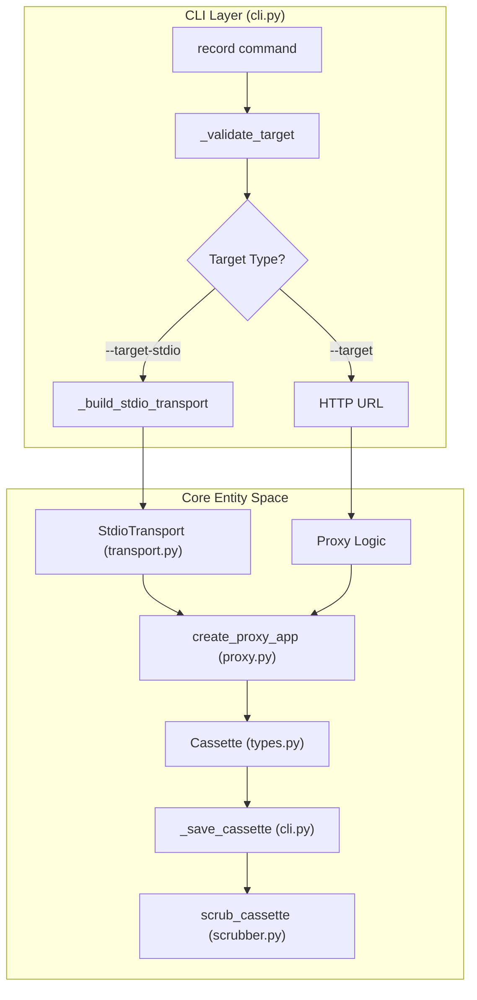
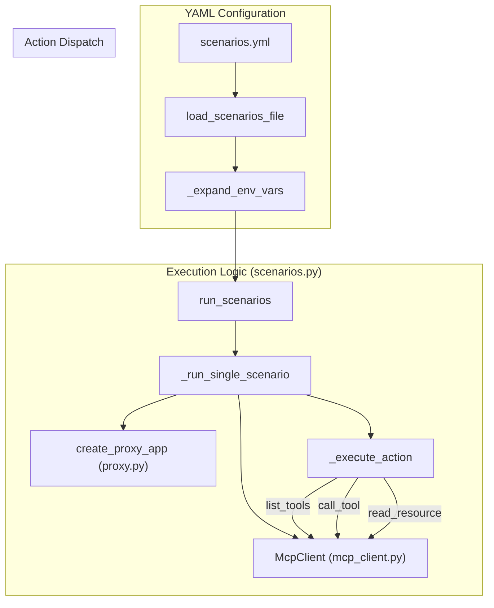

The `record` and `record-scenarios` commands provide the primary mechanisms for capturing Model Context Protocol (MCP) interactions into **cassette** files. While `record` acts as a live proxy for interactive use, `record-scenarios` enables batch, automated recording based on a declarative configuration file.

## The record Command

The `record` command initializes a local proxy server that sits between an MCP client (like Claude Desktop) and a target MCP server. It intercepts all JSON-RPC traffic, timestamps it, and persists it to a JSON cassette.

### Proxy Lifecycle and Data Flow

When `record` is invoked, it builds a proxy application using `create_proxy_app` [src/mcp_recorder/cli.py:131-138](). This application is a Starlette-based ASGI app that manages the connection to the backend target.

1.  **Initialization**: The command validates that exactly one target type is provided (`--target` for HTTP/SSE or `--target-stdio` for subprocesses) [src/mcp_recorder/cli.py:70-76]().
2.  **Transport Selection**:
    *   **HTTP**: Uses a direct URL to a remote SSE server.
    *   **Stdio**: Spawns a subprocess using `StdioTransport` [src/mcp_recorder/cli.py:58-67]().
3.  **Execution**: The proxy runs via `uvicorn.run` [src/mcp_recorder/cli.py:149](). It remains active until a `KeyboardInterrupt` (Ctrl+C) is received.
4.  **Persistence**: On shutdown, the `cassette` object is processed by the scrubber and saved to disk [src/mcp_recorder/cli.py:153-159]().

### Entity Association: Record Proxy

The following diagram shows how CLI concepts map to internal transport and proxy classes.

"Record Command Logic"

Sources: [src/mcp_recorder/cli.py:83-160](), [src/mcp_recorder/proxy.py:17-18](), [src/mcp_recorder/transport.py:20-21]()

### CLI Flags

| Flag | Description |
| :--- | :--- |
| `--target` | URL of a remote MCP server using SSE transport [src/mcp_recorder/cli.py:84](). |
| `--target-stdio` | Command string to launch a local MCP server via stdin/stdout [src/mcp_recorder/cli.py:85](). |
| `--target-env` | `KEY=VALUE` pairs passed to the stdio subprocess [src/mcp_recorder/cli.py:86-90](). |
| `--output` | Filename for the resulting JSON cassette (default: `recording.json`) [src/mcp_recorder/cli.py:92](). |
| `--redact-env` | Redacts values of specified environment variables from the cassette [src/mcp_recorder/cli.py:101-104](). |
| `--redact-patterns` | Regex patterns to replace with `[REDACTED]` in the output [src/mcp_recorder/cli.py:106-109](). |

Sources: [src/mcp_recorder/cli.py:83-120]()

---

## The record-scenarios Command

The `record-scenarios` command automates the recording process by executing a list of predefined actions against a target server. This is ideal for CI/CD and regression suite generation.

### scenarios.yml Schema

The configuration file uses a structured YAML format defined by Pydantic models in `src/mcp_recorder/scenarios.py`.

*   **`schema_version`**: Must match the major version of `SCENARIOS_FORMAT_VERSION` (currently "1.0") [src/mcp_recorder/scenarios.py:24, 97]().
*   **`target`**: Can be a simple URL string or a `StdioTargetConfig` object containing `command`, `args`, and `env` [src/mcp_recorder/scenarios.py:82-89]().
*   **`redact`**: A `RedactConfig` block for cassette scrubbing [src/mcp_recorder/scenarios.py:76-80]().
*   **`scenarios`**: A dictionary where keys are scenario names and values contain a `description` and a list of `actions` [src/mcp_recorder/scenarios.py:91-94]().

### Environment Variable Interpolation

The loader supports dynamic values using `${VAR}` or `${VAR:-default}` syntax [src/mcp_recorder/scenarios.py:30-31](). The `_expand_env_vars` function recursively traverses the YAML object to resolve these placeholders before validation [src/mcp_recorder/scenarios.py:34-54]().

### Execution Pipeline (`run_scenarios`)

When the command runs, it invokes `run_scenarios` [src/mcp_recorder/scenarios.py:228](), which follows this sequence:

1.  **Target Resolution**: `_resolve_target` determines if the target is HTTP or Stdio [src/mcp_recorder/scenarios.py:169-183]().
2.  **Batch Processing**: Iterates through scenarios, filtering by the `--scenario` flag if provided [src/mcp_recorder/scenarios.py:239-245]().
3.  **Scenario Lifecycle (`_run_single_scenario`)**:
    *   Finds a free local port [src/mcp_recorder/scenarios.py:207]().
    *   Starts a `UvicornServer` hosting the `create_proxy_app` [src/mcp_recorder/scenarios.py:208-209]().
    *   Instantiates an `McpClient` pointed at the local proxy [src/mcp_recorder/scenarios.py:211]().
    *   Performs the `initialize` handshake [src/mcp_recorder/scenarios.py:212]().
    *   Dispatches actions via `_execute_action` [src/mcp_recorder/scenarios.py:134-163]().
    *   Shuts down the proxy, scrubs the cassette, and saves it [src/mcp_recorder/scenarios.py:216-224]().

### Entity Association: Scenario Execution

"Scenario Batch Processing"

Sources: [src/mcp_recorder/scenarios.py:34-54](), [src/mcp_recorder/scenarios.py:134-163](), [src/mcp_recorder/scenarios.py:186-225](), [src/mcp_recorder/mcp_client.py:25-26]()

### Supported Actions

The system supports both simple and parameterized MCP actions:
*   **Simple**: `list_tools`, `list_prompts`, `list_resources` [src/mcp_recorder/scenarios.py:129]().
*   **Parameterized**:
    *   `call_tool`: Requires `name` and `arguments` [src/mcp_recorder/scenarios.py:62-64]().
    *   `get_prompt`: Requires `name` and `arguments` [src/mcp_recorder/scenarios.py:67-69]().
    *   `read_resource`: Requires `uri` [src/mcp_recorder/scenarios.py:72-73]().

Sources: [src/mcp_recorder/scenarios.py:1-260](), [src/mcp_recorder/cli.py:162-202]()