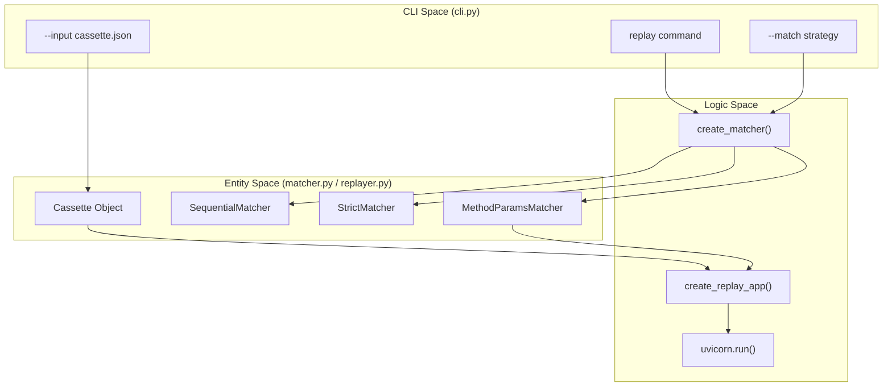
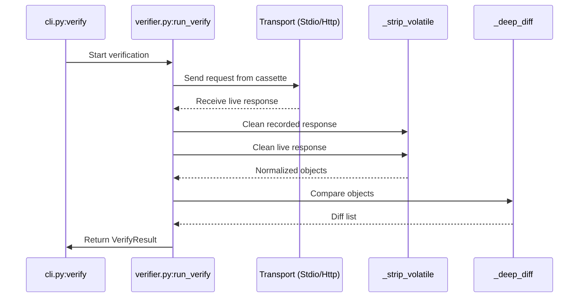

This section documents the CLI commands used for re-executing captured interactions, validating server regressions, and examining cassette contents. These commands form the core of the `mcp-recorder` workflow after a recording has been established.

## replay Command

The `replay` command starts a local HTTP server that acts as a mock for the original MCP server. It serves responses from a JSON cassette file based on incoming requests.

### Replay Lifecycle and Data Flow

When `replay` is invoked, the system initializes a `Matcher` based on the selected strategy and wraps it in a Starlette application via `create_replay_app` [src/mcp_recorder/cli.py:233-238]().

1.  **Matcher Initialization**: The `create_matcher` function selects an engine (e.g., `MethodParamsMatcher`) to determine how incoming requests map to stored interactions [src/mcp_recorder/matcher.py:228-243]().
2.  **Uvicorn Server**: The app is served via `uvicorn.run` on the specified `--port` [src/mcp_recorder/cli.py:252]().
3.  **Interaction Consumption**: As requests arrive, the replayer identifies the matching interaction. If the matcher is stateful (like `SequentialMatcher`), it "consumes" the interaction, preventing it from being reused unless the server is restarted.
4.  **SSE Simulation**: For MCP-over-HTTP, the replayer simulates the Server-Sent Events (SSE) stream, including the `mcp-session-id` header [src/mcp_recorder/replayer.py:91-105]().

### Command Options

| Option | Description |
| :--- | :--- |
| `--input` | Path to the cassette JSON file (default: `recording.json`) [src/mcp_recorder/cli.py:221](). |
| `--port` | The local port where the mock server will listen (default: `5555`) [src/mcp_recorder/cli.py:220](). |
| `--match` | Matching strategy: `method-params` (default), `sequential`, or `strict` [src/mcp_recorder/cli.py:222](). |

### Replay Architecture

The following diagram illustrates how the `replay` command maps CLI inputs to the internal Replay Engine.

**Replay System Mapping**

**Sources:** [src/mcp_recorder/cli.py:216-255](), [src/mcp_recorder/matcher.py:228-243]()

---

## verify Command

The `verify` command performs regression testing by replaying all requests in a cassette against a **live** target server (either HTTP or Stdio) and comparing the new responses against the recorded ones.

### The Verification Pipeline

The `run_verify` function orchestrates the process [src/mcp_recorder/verifier.py:222-261]():

1.  **Transport Setup**: Connects to the target using `HttpTransport` or `StdioTransport` [src/mcp_recorder/cli.py:298-312]().
2.  **Execution Loop**: Iterates through `Cassette.interactions`. For each `JSONRPC_REQUEST`, it sends the request to the live server [src/mcp_recorder/verifier.py:186-200]().
3.  **Normalization**: Both the recorded and live responses are passed through `_strip_volatile`. This removes fields that naturally change between sessions, such as `id` and `_meta` [src/mcp_recorder/verifier.py:44-71]().
4.  **Deep Diff**: The `_deep_diff` function compares the two JSON structures. It includes special logic to parse strings as JSON if they appear to be serialized objects (common in MCP tool outputs) [src/mcp_recorder/verifier.py:74-123]().
5.  **Reporting**: Outputs a summary of passed/failed interactions. If a failure occurs, it prints a human-readable diff [src/mcp_recorder/cli.py:321-332]().

### Verification Flow

**Verification Data Flow**

**Sources:** [src/mcp_recorder/verifier.py:126-219](), [src/mcp_recorder/verifier.py:222-261]()

### Command Options

| Option | Description |
| :--- | :--- |
| `--target` / `--target-stdio` | The live server to test against (Mutually Exclusive) [src/mcp_recorder/cli.py:266-267](). |
| `--input` | The cassette to use as the source of truth [src/mcp_recorder/cli.py:265](). |
| `--ignore-fields` | Global key names to ignore during comparison (e.g., `timestamp`) [src/mcp_recorder/cli.py:273](). |
| `--ignore-paths` | Exact dot-paths to ignore (e.g., `$.result.content[0].text`) [src/mcp_recorder/cli.py:277](). |
| `--update` | If verification fails, overwrite the cassette with the new responses [src/mcp_recorder/cli.py:283](). |

---

## inspect Command

The `inspect` command provides a high-level overview of a cassette file without executing any network or subprocess operations. It is primarily used for debugging and auditing.

### Displayed Metadata

The command extracts and prints the following from the `CassetteMetadata` object [src/mcp_recorder/cli.py:353-369]():
*   **Version**: The schema version of the cassette.
*   **Recorded At**: Timestamp of the recording.
*   **Server URL**: The original target URL or stdio command.
*   **Transport Type**: `http` or `stdio`.
*   **Interaction Counts**: A breakdown of interactions by type:
    *   `JSONRPC_REQUEST`
    *   `NOTIFICATION`
    *   `LIFECYCLE`

### Scrubbing Warnings
During inspection, if the cassette was processed by the `scrubber`, the `inspect` output will reflect the redacted state. The `scrubber.py` module ensures that while response bodies and metadata are redacted, request bodies remain untouched to maintain replay integrity [src/mcp_recorder/scrubber.py:8-9](). If sensitive data is detected in request bodies during a recording session, a warning is logged suggesting manual review [src/mcp_recorder/scrubber.py:136-142]().

**Sources:** [src/mcp_recorder/cli.py:343-372](), [src/mcp_recorder/_types.py:75-84](), [src/mcp_recorder/scrubber.py:86-100]()