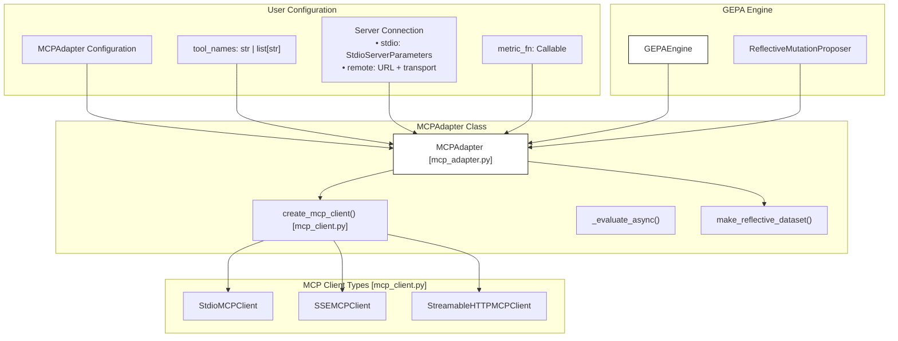
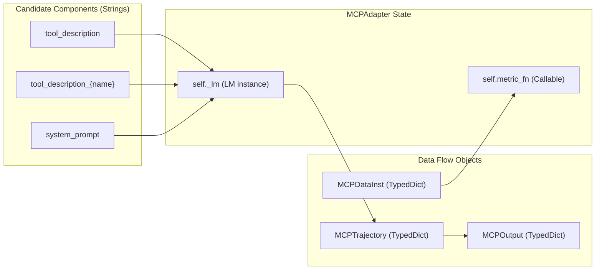

result = optimize(
    seed_candidate={"program": seed_program},
    trainset=train_data,
    valset=val_data,
    adapter=adapter,
    max_metric_calls=2000,
)
```
Sources: [src/gepa/adapters/dspy_full_program_adapter/README.md:10-35](), [tests/test_dspy_full_program_adapter.py:120-130]()

## Implementation Safety and Robustness

- **Syntax Errors**: The adapter catches `SyntaxError` during the `compile` phase and returns a `failure_score` (default 0.0) with the traceback as feedback [src/gepa/adapters/dspy_full_program_adapter/full_program_adapter.py:47-55]().
- **Runtime Errors**: Errors during `exec` or program instantiation are caught and reported back to the proposer [src/gepa/adapters/dspy_full_program_adapter/full_program_adapter.py:57-63]().
- **Output Integrity**: Even on build failure, `evaluate()` ensures that `outputs` is a list of the correct length (filled with `None`) to prevent downstream crashes in the optimization engine [tests/test_dspy_full_program_adapter.py:59-71]().

Sources: [src/gepa/adapters/dspy_full_program_adapter/full_program_adapter.py:42-81](), [tests/test_dspy_full_program_adapter.py:55-110]()

# MCP Adapter


## Purpose and Scope

The `MCPAdapter` enables GEPA to optimize Model Context Protocol (MCP) server configurations, specifically tool descriptions and system prompts for tool-using agents. This adapter connects GEPA's optimization loop to MCP servers running locally (via stdio) or remotely (via SSE/StreamableHTTP), allowing automatic improvement of how agents interact with tools.

The adapter handles the complexities of bridging GEPA's synchronous optimization loop with the asynchronous nature of the MCP SDK by utilizing `asyncio.run()` for each evaluation batch [src/gepa/adapters/mcp_adapter/mcp_adapter.py:189-206]().

**Sources:** [src/gepa/adapters/mcp_adapter/mcp_adapter.py:4-10](), [src/gepa/adapters/mcp_adapter/README.md:1-12]()

---

## What is MCP?

The Model Context Protocol (MCP) is a standardized protocol for connecting AI assistants to external tools and data sources. MCP servers expose tools (functions) that agents can invoke, with each tool having:

- **Name**: Unique identifier for the tool.
- **Description**: Natural language explanation of what the tool does.
- **Parameters**: JSON Schema defining arguments the tool accepts.

`MCPAdapter` optimizes these descriptions and the overall system instructions to improve an agent's tool selection accuracy and parameter generation.

**Sources:** [src/gepa/adapters/mcp_adapter/README.md:7-12](), [src/gepa/examples/mcp_adapter/mcp_optimization_example.py:5-12]()

---

## Adapter Architecture

The `MCPAdapter` manages the lifecycle of MCP client connections, executes a two-pass LLM workflow, and computes metrics.



**Diagram: MCPAdapter Architecture**

**Sources:** [src/gepa/adapters/mcp_adapter/mcp_adapter.py:94-147](), [src/gepa/adapters/mcp_adapter/mcp_client.py:1-13]()

---

## Component Mapping: Code Entity Space

The following diagram maps the natural language components optimized by GEPA to the internal code structures of the `MCPAdapter`.



**Diagram: MCPAdapter Code Entity Mapping**

**Sources:** [src/gepa/adapters/mcp_adapter/mcp_adapter.py:34-88](), [src/gepa/adapters/mcp_adapter/mcp_adapter.py:94-129]()

---

## Server Connection Modes

The adapter uses a factory pattern via `create_mcp_client` to instantiate the appropriate transport [src/gepa/adapters/mcp_adapter/mcp_client.py:231-260]().

### Local stdio Servers
For servers running as local subprocesses.
- **Code Entity**: `StdioMCPClient` [src/gepa/adapters/mcp_adapter/mcp_client.py:66-73]()
- **Parameters**: `StdioServerParameters` (command and args).

### Remote Servers
For servers accessible via network.
- **Code Entity**: `SSEMCPClient` (Server-Sent Events) or `StreamableHTTPMCPClient` [src/gepa/adapters/mcp_adapter/mcp_client.py:129-140]().
- **Parameters**: `remote_url`, `remote_transport`, and optional `remote_headers`.

---

## Two-Pass Workflow

To ensure high-quality tool usage, the `MCPAdapter` implements an optional two-pass execution logic [src/gepa/adapters/mcp_adapter/README.md:168-180]():

1.  **Pass 1 (Tool Selection)**: The `task_model` receives the user query and system prompt (including tool descriptions). It decides whether to call a tool or respond directly.
2.  **Pass 2 (Response Generation)**: If a tool was called, the model receives the tool's output and generates the final user-facing response.

This workflow is controlled by the `enable_two_pass` boolean in the constructor [src/gepa/adapters/mcp_adapter/mcp_adapter.py:145]().

---

## Data Structures

### Dataset Item (`MCPDataInst`)
| Field | Type | Description |
| :--- | :--- | :--- |
| `user_query` | `str` | The input question for the agent [src/gepa/adapters/mcp_adapter/mcp_adapter.py:45]() |
| `tool_arguments` | `dict` | Expected arguments (for validation) [src/gepa/adapters/mcp_adapter/mcp_adapter.py:46]() |
| `reference_answer` | `str \| None` | Ground truth for scoring [src/gepa/adapters/mcp_adapter/mcp_adapter.py:47]() |

### Execution Trace (`MCPTrajectory`)
Captures the full state for reflection, including `tool_description_used`, `tool_response`, and `model_first_pass_output` [src/gepa/adapters/mcp_adapter/mcp_adapter.py:51-70]().

---

## Component Optimization Patterns

`MCPAdapter` supports three main optimization targets based on the keys provided in the `seed_candidate`:

1.  **Global Tool Description**: Key `tool_description`. Used when optimizing a single tool [src/gepa/adapters/mcp_adapter/README.md:203-206]().
2.  **Multi-Tool Descriptions**: Keys following the pattern `tool_description_{tool_name}`. GEPA will mutate each tool's description independently [src/gepa/adapters/mcp_adapter/README.md:209-213]().
3.  **System Prompt**: Key `system_prompt`. Optimizes the overall instructions given to the agent [src/gepa/adapters/mcp_adapter/README.md:225-228]().

---

## Usage Example

### Local Optimization with Multi-Tool Support

```python
from gepa.adapters.mcp_adapter import MCPAdapter
from mcp import StdioServerParameters
import gepa

# Define local server
server_params = StdioServerParameters(
    command="python",
    args=["my_server.py"],
)

# Initialize Adapter
adapter = MCPAdapter(
    tool_names=["read_file", "list_files"],
    task_model="gpt-4o-mini",
    metric_fn=lambda item, output: 1.0 if item["reference_answer"] in output else 0.0,
    server_params=server_params
)

# Optimize
result = gepa.optimize(
    seed_candidate={
        "tool_description_read_file": "Reads a file.",
        "tool_description_list_files": "Lists files."
    },
    trainset=my_dataset,
    adapter=adapter,
    reflection_lm="gpt-4o"
)
```

**Sources:** [src/gepa/adapters/mcp_adapter/mcp_adapter.py:109-129](), [src/gepa/adapters/mcp_adapter/README.md:47-89]()

---

## Implementation Details

### Client Factory
The `create_mcp_client` function handles the logic for choosing the correct `BaseMCPClient` implementation based on the provided configuration [src/gepa/adapters/mcp_adapter/mcp_client.py:231-260]().

### Reflection Dataset Generation
The `make_reflective_dataset` method converts `MCPTrajectory` objects into a format suitable for the `InstructionProposalSignature` [src/gepa/strategies/instruction_proposal.py:12-29](). It includes raw tool responses and model thoughts in the `<side_info>` block to allow the reflection LM to identify why a tool was or was not selected correctly [src/gepa/strategies/instruction_proposal.py:45-95]().

### Instruction Proposal Logic
The `InstructionProposalSignature` [src/gepa/strategies/instruction_proposal.py:12-32]() handles the rendering of these reflective datasets into prompts for the reflection LM. It specifically extracts instructions from Markdown code blocks in the LM output [src/gepa/strategies/instruction_proposal.py:125-153]().

**Sources:** [src/gepa/adapters/mcp_adapter/mcp_adapter.py:94-95](), [src/gepa/strategies/instruction_proposal.py:12-153](), [tests/test_instruction_proposal.py:9-103]()