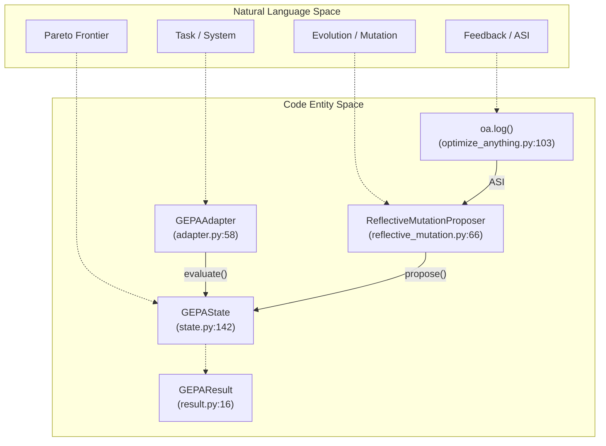
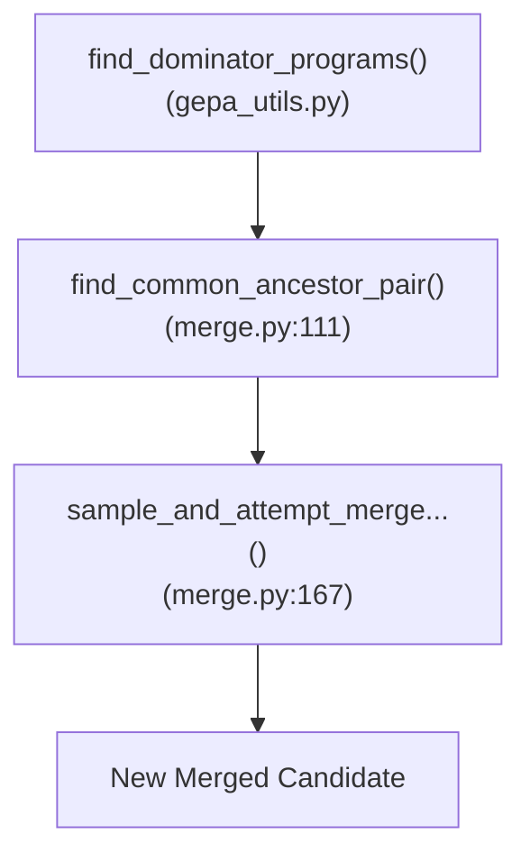
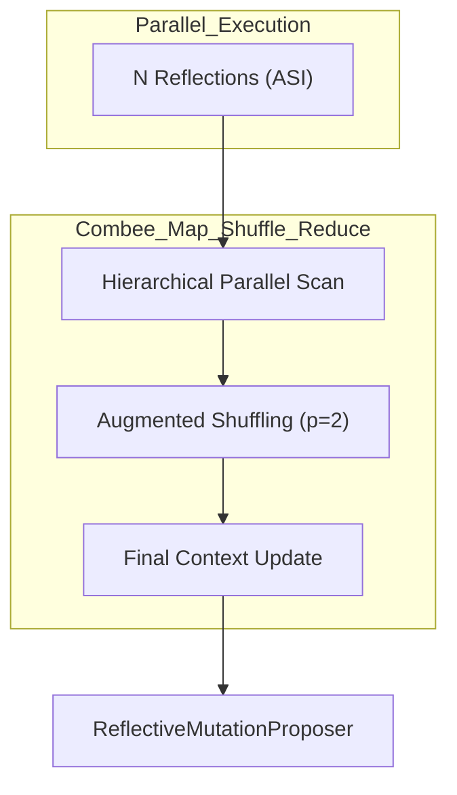
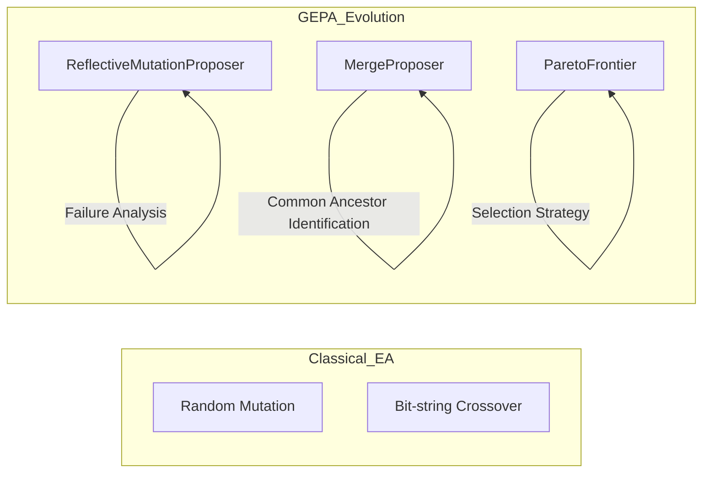

This page provides comprehensive API documentation for GEPA, including detailed signatures, parameters, and return types for all public classes and functions. For conceptual explanations of how these components work together, see [Core Concepts](#3). For practical usage examples, see [Examples and Use Cases](#7).

---

## Overview

The GEPA API is organized into several layers:

1.  **Primary Entry Points**: [`gepa.optimize()`](#core-entry-point-gepaoptimize) and [`gepa.optimize_anything()`](#optimize-anything-api) - High-level functions for starting optimization.
2.  **Adapter Protocol**: [`GEPAAdapter`](#gepaadapter-protocol) - Interface for integrating custom systems.
3.  **Core Engine**: [`GEPAEngine`](#gepaengine) and [`GEPAState`](#gepastate) - Internal optimization orchestration and persistence.
4.  **Results**: [`GEPAResult`](#geparesult) - Immutable snapshot of optimization outcomes.
5.  **Supporting Infrastructure**: Data loaders, evaluators, callbacks, and stop conditions.

---

## Core Entry Point: `gepa.optimize()`

### Function Signature

```python
def optimize(
    seed_candidate: dict[str, str],
    trainset: list[DataInst] | DataLoader[DataId, DataInst],
    valset: list[DataInst] | DataLoader[DataId, DataInst] | None = None,
    adapter: GEPAAdapter[DataInst, Trajectory, RolloutOutput] | None = None,
    task_lm: str | ChatCompletionCallable | None = None,
    evaluator: Evaluator | None = None,
    # Reflection configuration
    reflection_lm: LanguageModel | str | None = None,
    candidate_selection_strategy: CandidateSelector | Literal["pareto", "current_best", "epsilon_greedy", "top_k_pareto"] = "pareto",
    frontier_type: FrontierType = "instance",
    skip_perfect_score: bool = True,
    batch_sampler: BatchSampler | Literal["epoch_shuffled"] = "epoch_shuffled",
    reflection_minibatch_size: int | None = None,
    perfect_score: float = 1.0,
    reflection_prompt_template: str | dict[str, str] | None = None,
    custom_candidate_proposer: ProposalFn | None = None,
    # Component selection
    module_selector: ReflectionComponentSelector | str = "round_robin",
    # Merge configuration
    use_merge: bool = False,
    max_merge_invocations: int = 5,
    merge_val_overlap_floor: int = 5,
    # Budget and stop conditions
    max_metric_calls: int | None = None,
    max_reflection_cost: float | None = None,
    stop_callbacks: StopperProtocol | Sequence[StopperProtocol] | None = None,
    # Logging and callbacks
    logger: LoggerProtocol | None = None,
    run_dir: str | None = None,
    callbacks: list[GEPACallback] | None = None,
    use_wandb: bool = False,
    use_mlflow: bool = False,
    track_best_outputs: bool = True,
    display_progress_bar: bool = False,
    cache_evaluation: bool = False,
    # Reproducibility
    seed: int = 0,
    raise_on_exception: bool = True,
    val_evaluation_policy: EvaluationPolicy[DataId, DataInst] | Literal["full_eval"] | None = None,
    acceptance_criterion: AcceptanceCriterion | Literal["strict_improvement", "improvement_or_equal"] = "strict_improvement",
) -> GEPAResult[RolloutOutput, DataId]
```
[src/gepa/api.py:43-96]()

### Core Parameters

| Parameter | Type | Description |
| :--- | :--- | :--- |
| `seed_candidate` | `dict[str, str]` | Initial component mapping. Must contain at least one component. [src/gepa/api.py:44]() |
| `trainset` | `list` \| `DataLoader` | Training data for reflective updates. [src/gepa/api.py:45]() |
| `valset` | `list` \| `DataLoader` \| `None` | Validation data for tracking Pareto scores. [src/gepa/api.py:46]() |
| `adapter` | `GEPAAdapter` \| `None` | System integration adapter. [src/gepa/api.py:47]() |
| `task_lm` | `str` \| `Callable` \| `None` | Model for task execution (if using `DefaultAdapter`). [src/gepa/api.py:48]() |
| `evaluator` | `Evaluator` \| `None` | Custom evaluator for `DefaultAdapter`. [src/gepa/api.py:49]() |

### Reflection and Strategy Parameters

| Parameter | Type | Default | Description |
| :--- | :--- | :--- | :--- |
| `reflection_lm` | `LanguageModel` \| `str` | `None` | Model for proposing improved components. [src/gepa/api.py:51]() |
| `candidate_selection_strategy` | `CandidateSelector` \| `str` | `"pareto"` | Strategy for selecting candidates to mutate. [src/gepa/api.py:53]() |
| `frontier_type` | `FrontierType` | `"instance"` | Pareto tracking: `"instance"`, `"objective"`, `"hybrid"`, `"cartesian"`. [src/gepa/api.py:55]() |
| `acceptance_criterion` | `AcceptanceCriterion` \| `str` | `"strict_improvement"` | Gating for candidate promotion. [src/gepa/api.py:94]() |
| `max_reflection_cost` | `float` \| `None` | `None` | Budget limit in USD for reflection calls. [src/gepa/api.py:70]() |

**Sources**: [src/gepa/api.py:43-96](), [src/gepa/core/state.py:22-30]()

---

## Optimize Anything API

`optimize_anything` is a universal wrapper for optimizing arbitrary text artifacts (code, configs, prompts). It simplifies setup by automatically wrapping evaluators and handling Actionable Side Information (ASI).

### Core Workflow
```python
import gepa.optimize_anything as oa

def evaluate(candidate: str) -> float:
    score, diagnostic = run_candidate(candidate)
    oa.log("Diagnostic:", diagnostic)   # captured as ASI
    return score

result = oa.optimize_anything(
    seed_candidate="<initial code>",
    evaluator=evaluate,
    objective="Maximize performance",
)
```
[src/gepa/optimize_anything.py:16-68]()

### Configuration Hierarchy
`optimize_anything` uses a nested configuration system to control the engine and reflection behavior.

- `GEPAConfig`: Top-level container. [src/gepa/optimize_anything.py:101]()
- `EngineConfig`: Controls loop limits, parallelization, and merge behavior. [src/gepa/optimize_anything.py:101]()
- `ReflectionConfig`: Configures the reflection LM, prompt templates, and minibatch sizes. [src/gepa/optimize_anything.py:101]()
- `TrackingConfig`: Configures logging via WandB or MLflow. [src/gepa/optimize_anything.py:102]()

**Sources**: [src/gepa/optimize_anything.py:1-106](), [src/gepa/optimize_anything.py:124-150]()

---

## API Component Relationships

This diagram maps the natural language concepts of the optimization loop to the specific code entities in the GEPA framework.



**Sources**: [src/gepa/core/adapter.py:58](), [src/gepa/optimize_anything.py:103](), [src/gepa/proposer/reflective_mutation/reflective_mutation.py:66](), [src/gepa/core/state.py:142](), [src/gepa/core/result.py:16]()

---

## Core Types and Protocols

### `GEPAAdapter` Protocol
The primary interface for integrating GEPA with custom systems.

```python
class GEPAAdapter(Protocol[DataInst, Trajectory, RolloutOutput]):
    def evaluate(
        self,
        batch: list[DataInst],
        candidate: dict[str, str],
        capture_traces: bool = False,
    ) -> EvaluationBatch[Trajectory, RolloutOutput]:
        """Execute candidate on batch, returning outputs, scores, and optionally traces."""
        ...

    def make_reflective_dataset(
        self,
        candidate: dict[str, str],
        eval_batch: EvaluationBatch[Trajectory, RolloutOutput],
        components_to_update: list[str],
    ) -> Mapping[str, Sequence[Mapping[str, Any]]]:
        """Build reflective dataset (ASI) for instruction proposal."""
        ...
```
[src/gepa/core/adapter.py:58-112]()

### `EvaluationBatch` Dataclass
Container for evaluation results returned by `GEPAAdapter.evaluate()`.

| Attribute | Type | Description |
| :--- | :--- | :--- |
| `outputs` | `list[RolloutOutput]` | Per-example raw outputs. [src/gepa/core/adapter.py:20]() |
| `scores` | `list[float]` | Per-example numeric scores. [src/gepa/core/adapter.py:23]() |
| `trajectories` | `list[Trajectory]` \| `None` | Per-example traces for reflection. [src/gepa/core/adapter.py:26]() |
| `objective_scores` | `list[dict]` \| `None` | Multi-objective score breakdown. [src/gepa/core/adapter.py:29]() |

**Sources**: [src/gepa/core/adapter.py:15-35]()

---

## Core Engine Components

### `GEPAEngine`
Orchestrates the optimization loop using pluggable candidate proposers. It manages parallel proposals and coordinates between the adapter and the state.

```python
class GEPAEngine(Generic[DataId, DataInst, Trajectory, RolloutOutput]):
    def __init__(self, adapter, run_dir, valset, seed_candidate, ...):
        # Orchestration logic
        ...

    def run(self) -> GEPAState[RolloutOutput, DataId]:
        """Main optimization loop."""
        ...
```
[src/gepa/core/engine.py:51-134]()

### `GEPAState`
Internal persistent state of a GEPA optimization run. Tracks all explored candidates, Pareto frontiers, and evaluation budget. It also houses the `EvaluationCache`.

```python
class GEPAState(Generic[RolloutOutput, DataId]):
    program_candidates: list[dict[str, str]]
    pareto_front_valset: dict[DataId, float]
    total_num_evals: int
    # ...
```
[src/gepa/core/state.py:142-181]()

**Sources**: [src/gepa/core/engine.py:51-134](), [src/gepa/core/state.py:142-181]()

---

## Proposer System

GEPA uses two main proposer types to generate new candidates:

1.  **`ReflectiveMutationProposer`**: Leverages `reflection_lm` to mutate components based on textual feedback (ASI). It supports parallel execution via `prepare_proposal`, `execute_proposal`, and `apply_proposal_output`. [src/gepa/proposer/reflective_mutation/reflective_mutation.py:66-72]()
2.  **`MergeProposer`**: Identifies "dominator" programs on the Pareto frontier and merges them using common ancestor logic. [src/gepa/proposer/merge.py:210]()

### Merge Logic Flow
The `MergeProposer` attempts to combine the strengths of two successful candidates that diverged from a common ancestor.



**Sources**: [src/gepa/proposer/merge.py:111-178](), [src/gepa/proposer/merge.py:210](), [tests/proposer/test_merge.py:4-10]()

---

## Stopping Conditions

GEPA provides a flexible stopping system via `StopperProtocol`. Multiple stoppers can be combined using `CompositeStopper`.

| Stopper | Description |
| :--- | :--- |
| `MaxMetricCallsStopper` | Stops after a fixed number of evaluations. [src/gepa/utils/stop_condition.py:163]() |
| `TimeoutStopCondition` | Stops after a specified time duration. [src/gepa/utils/stop_condition.py:34]() |
| `ScoreThresholdStopper` | Stops once a target score is reached. [src/gepa/utils/stop_condition.py:64]() |
| `MaxReflectionCostStopper` | Stops based on cumulative USD cost of reflection LM. [src/gepa/utils/stop_condition.py:176]() |
| `NoImprovementStopper` | Stops after N iterations without improvement. [src/gepa/utils/stop_condition.py:83]() |
| `FileStopper` | Stops when a specific file exists on disk. [src/gepa/utils/stop_condition.py:46]() |
| `SignalStopper` | Stops when a system signal (SIGINT/SIGTERM) is received. [src/gepa/utils/stop_condition.py:114]() |

**Sources**: [src/gepa/utils/stop_condition.py:1-210]()

---

## Language Model Abstraction

### `LM` Class
A wrapper over LiteLLM that provides cost tracking, retry logic, and truncation detection. It implements the `LanguageModel` protocol.

```python
class LM:
    def __init__(self, model: str, temperature: float = None, ...):
        self.model = model
        self._total_cost = 0.0

    @property
    def total_cost(self) -> float:
        """Cumulative USD cost of all calls."""
        return self._total_cost
```
[src/gepa/lm.py:30-76]()

### `TrackingLM`
Wraps arbitrary callables (e.g., local models or mock functions) to estimate token usage and cost for non-LiteLLM interfaces.
[src/gepa/lm.py:190]()

**Sources**: [src/gepa/lm.py:30-190](), [tests/test_reflection_cost_tracking.py:13-174]()

---

## Evaluation Caching

The `EvaluationCache` prevents redundant calls to the `GEPAAdapter.evaluate()` method by hashing candidates and example IDs. It is stored within the `GEPAState`.

```python
@dataclass
class EvaluationCache(Generic[RolloutOutput, DataId]):
    def get(self, candidate, example_id):
        """Retrieve cached result."""
        ...
    def put(self, candidate, example_id, output, score, ...):
        """Store result."""
        ...
```
[src/gepa/core/state.py:46-64]()

**Sources**: [src/gepa/core/state.py:31-131]()

# Comparison with Other Methods


This document compares GEPA's optimization approach with other methods for improving AI systems, including reinforcement learning (RL), gradient-based optimization, traditional evolutionary algorithms, and manual prompt engineering. It explains the key technical differences, performance characteristics, and implementation details that distinguish GEPA.

For details on GEPA's core algorithm, see [Architecture Deep Dive](). For information on GEPA's key innovation of using execution traces, see [Actionable Side Information (ASI)]().

---

## High-Level Comparison

The table below summarizes the key characteristics distinguishing GEPA from other optimization methods:

| Characteristic | GEPA | RL (PPO/GRPO) | Gradient-Based | Evolutionary Algorithms | Manual Engineering |
|---|---|---|---|---|---|
| **Feedback Type** | Full execution traces (ASI) | Scalar rewards | Loss gradients | Scalar fitness scores | Human judgment |
| **Evaluations Needed** | 100-500 | 10,000-25,000+ | 1,000-1,000 | 1,000-10,000+ | 10-100 |
| **Model Access** | API-only (black-box) | Weights required | Weights required | API-only | API-only |
| **Interpretability** | High (readable traces) | Low (policy network) | Low (gradient paths) | Low (fitness landscape) | High (human understanding) |
| **Data Requirements** | 3-50 examples | 1,000+ examples | 100-1,000 examples | 50-500 examples | 1-10 examples |
| **Cost Efficiency** | **90x cheaper** (Databricks) | High compute cost | Medium compute cost | Medium compute cost | Zero compute cost |
| **Speed to Convergence** | **35x faster** than RL | Slow (hours-days) | Medium (minutes-hours) | Medium (minutes-hours) | Fast (minutes) but limited |

Sources: [README.md:31-49](), [docs/docs/index.md:17-22]()

---

## Performance Benchmarks

GEPA has demonstrated significant improvements across multiple production deployments and research benchmarks:

| Domain | Baseline | GEPA-Optimized | Improvement | Source |
|---|---|---|---|---|
| **Enterprise Agents (Databricks)** | Claude Opus 4.1 | Open-source + GEPA | **90x cost reduction** | [README.md:41]() |
| **AIME Math (2025)** | GPT-4.1 Mini: 46.6% | GPT-4.1 Mini + GEPA: 56.6% | **+10 pp** | [README.md:94]() |
| **MATH Benchmark** | DSPy CoT: 67% | DSPy Program + GEPA: 93% | **+26 pp** | [docs/docs/tutorials/index.md:11]() |
| **ARC-AGI Agent** | Initial: 32% | Evolved Architecture: 89% | **+57 pp** | [README.md:43]() |
| **Cloud Scheduling** | Expert heuristics | GEPA-discovered policy | **40.2% cost savings** | [README.md:44]() |
| **Jinja Coding Agent** | Base: 55% resolve | Auto-learned skills: 82% | **+27 pp** | [README.md:45]() |

**Speed Comparison**:
- **GEPA**: 100-500 evaluations to convergence.
- **RL (GRPO)**: 5,000-25,000+ evaluations.
- **Result**: **35x faster** than reinforcement learning [README.md:42]().

---

## Reinforcement Learning vs. GEPA

### Scalar Reward vs. Actionable Side Information (ASI)

Reinforcement Learning (RL) typically collapses complex system behavior into a single scalar reward. GEPA uses LLMs to *read* full execution traces—errors, logs, and reasoning—to diagnose *why* a candidate failed.

**Natural Language Space to Code Entity Space: RL vs GEPA Flow**


**Key Technical Differences:**
1. **Feedback Granularity**: RL uses `r = f(y)`. GEPA uses `Trajectory` objects containing `oa.log()` outputs [README.md:121-122]().
2. **Optimization Space**: RL optimizes continuous weights. GEPA optimizes discrete text parameters using `ReflectiveMutationProposer` [README.md:33-35]().
3. **Sample Efficiency**: GEPA converges in 100-500 calls because each "gradient step" (reflection) is highly informed by diagnostic feedback [README.md:33]().

Sources: [README.md:31-46](), [docs/docs/index.md:17-22]()

---

## Scaling GEPA: The Combee Framework

While traditional optimizers may struggle with large batch sizes, GEPA can be scaled using **Combee** to handle parallel agent traces without **context overload**.

**Combee Parallel Scaling Logic**



**Performance Impact of Scaling:**
- **Speedup**: Up to **17x speedup** in wall-clock training time compared to sequential processing [docs/docs/blog/posts/2026-04-09-gepa-at-scale-with-combee/index.md:51]().
- **Quality Retention**: Avoids the accuracy drop (e.g., 87% to 72%) seen in naive batch size increases by using a **hierarchical parallel scan** [docs/docs/blog/posts/2026-04-09-gepa-at-scale-with-combee/index.md:63-75]().

Sources: [docs/docs/blog/posts/2026-04-09-gepa-at-scale-with-combee/index.md:45-91]()

---

## Traditional Evolutionary Algorithms

GEPA (Genetic-Pareto) extends classical evolutionary strategies with LLM-based operators and multi-objective Pareto tracking.

**System-Aware Evolution Flow**



**Key Innovations in GEPA:**
1. **Informed Mutation**: Instead of random noise, `ReflectiveMutationProposer` uses an LLM to propose targeted fixes based on `Trajectory` data [README.md:142]().
2. **System-Aware Merge**: `MergeProposer` combines strengths of two Pareto-optimal candidates excelling on different tasks [README.md:145]().
3. **Pareto Frontier Management**: GEPA maintains frontier types to balance performance across different task subsets [README.md:139]().

Sources: [README.md:135-148](), [docs/docs/index.md:4-9]()

---

## Manual Prompt Engineering

Manual engineering relies on human intuition and a small number of test cases. GEPA automates this process, scaling to hundreds of evaluations.

| Aspect | Manual Engineering | GEPA |
|---|---|---|
| **Coverage** | 1-10 test cases | 100-500 test cases |
| **Reproducibility** | Low (expert dependent) | High (automated pipeline) |
| **Complexity** | Limited by human memory | Handles massive prompt evolution |
| **Insights** | Mental intuition | Actionable Side Information (ASI) logs |

**Example Evolution**: GEPA evolved GPT-4.1 Mini from 46.6% to 56.6% on AIME 2025 by analyzing failure traces over 150 evaluations [README.md:94]().

Sources: [README.md:67-94](), [docs/docs/tutorials/index.md:36]()

---

## Other Prompt Optimizers (OPRO, TextGrad, DSPy)

GEPA is integrated into the broader ecosystem, notably as `dspy.GEPA`.

### vs. OPRO (LLM as Optimizer)
OPRO uses score summaries. GEPA uses full `Trajectory` data (ASI) and `MergeProposer`. OPRO typically lacks the fine-grained diagnostic feedback loop provided by `oa.log()` [README.md:121-122]().

### vs. TextGrad
TextGrad uses a "gradient" metaphor for feedback. GEPA uses an evolutionary metaphor with population management, Pareto frontiers, and reflective mutation [README.md:33]().

### vs. DSPy Optimizers
GEPA is often the high-performance choice for complex programs. While `BootstrapFewShot` mines examples, `dspy.GEPA` evolves the instructions and logic themselves [README.md:96-109]().

Sources: [README.md:96-109](), [docs/docs/tutorials/index.md:33-41]()

---

## Decision Framework: When to Use GEPA

| Use GEPA When... | Use RL When... | Use Manual When... |
|---|---|---|
| **API-only models** (GPT-4, Claude) | **Weight access** is available | **Extremely scarce data** (<5 items) |
| **Expensive rollouts** (Slow agents) | **Cheap rollouts** (ms latency) | **Initial seed** creation |
| **Small-Medium data** (10-100 items) | **Large data** (10,000+ items) | **Simple tasks** |
| **Multi-objective** needs (Cost/Acc) | **Single scalar** reward | **Quick prototypes** |

**The "BetterTogether" Recipe**: A common production pattern is using GEPA for initial rapid optimization (API-only) followed by RL for final weight fine-tuning [README.md:33-46]().

Sources: [README.md:31-49](), [docs/docs/index.md:17-22]()