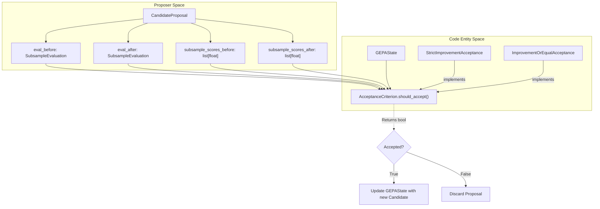
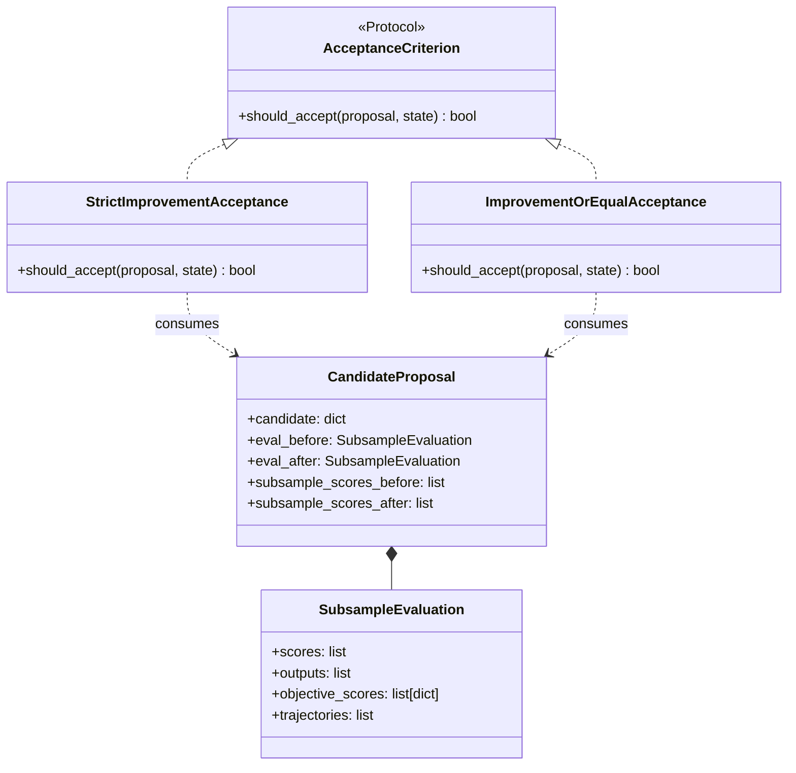

In each optimization iteration, GEPA proposes a new candidate and evaluates it against a minibatch of data. The **Acceptance Criterion** is the logic that gates whether this candidate is accepted into the global candidate pool or rejected [docs/docs/guides/acceptance-criterion.md:3-4](). This mechanism allows users to control the exploration-exploitation trade-off, handle multi-objective improvements, or implement custom safety and quality checks before a candidate is promoted.

## The Acceptance Protocol

All acceptance strategies must implement the `AcceptanceCriterion` protocol [src/gepa/strategies/acceptance.py:11-27](). This protocol defines a single method, `should_accept`, which receives the full context of the proposal and the current system state.

### Data Flow for Acceptance

The diagram below illustrates how evaluation data flows from the proposer into the acceptance logic to update the `GEPAState`.

**Acceptance Gating Logic**

Sources: [src/gepa/strategies/acceptance.py:11-36](), [src/gepa/strategies/acceptance.py:39-62](), [src/gepa/proposer/base.py:27-42]()

## Built-in Implementations

GEPA provides two primary built-in criteria for standard optimization tasks.

### Strict Improvement (Default)
The `StrictImprovementAcceptance` class requires the sum of scores on the current minibatch to be strictly greater than the sum of scores achieved by the parent candidate on that same minibatch [src/gepa/strategies/acceptance.py:39-48]().

*   **Logic**: `sum(new_scores) > sum(old_scores)`
*   **Usage**: Prevents the candidate pool from being flooded with lateral moves that do not provide measurable progress.

### Improvement or Equal
The `ImprovementOrEqualAcceptance` class allows candidates that maintain the same performance level as their parents [src/gepa/strategies/acceptance.py:51-61]().

*   **Logic**: `sum(new_scores) >= sum(old_scores)`
*   **Usage**: Useful for exploring diverse regions of the solution space where many candidates might achieve identical scores (e.g., binary pass/fail tasks) [docs/docs/guides/acceptance-criterion.md:20-22]().

Sources: [src/gepa/strategies/acceptance.py:39-62](), [docs/docs/guides/acceptance-criterion.md:9-29]()

## Configuration

Acceptance criteria can be configured via the `gepa.optimize` functional API or the `GEPAConfig` object.

### Functional API
```python
result = gepa.optimize(
    ...,
    acceptance_criterion="improvement_or_equal", # or a custom instance
)
```
Sources: [docs/docs/guides/acceptance-criterion.md:24-29]()

### Config Object
```python
from gepa.optimize_anything import GEPAConfig, EngineConfig

config = GEPAConfig(
    engine=EngineConfig(
        acceptance_criterion="improvement_or_equal",
    ),
)
```
Sources: [docs/docs/guides/acceptance-criterion.md:35-45]()

## Custom Acceptance Logic

For advanced use cases, you can implement the `AcceptanceCriterion` protocol. The `should_accept` method provides access to the following data via the `CandidateProposal` [src/gepa/strategies/acceptance.py:16-24]():

| Field | Type | Description |
| :--- | :--- | :--- |
| `eval_before` / `eval_after` | `SubsampleEvaluation` | Contains per-example `scores`, `outputs`, `objective_scores`, and `trajectories`. |
| `subsample_scores_before` | `list[float]` | Shorthand list of scalar scores for the parent on the minibatch. |
| `candidate` | `TextComponentDict` | The actual text/code of the proposed candidate. |
| `state` | `GEPAState` | Access to the Pareto frontier, iteration count, and previous validation scores. |

### Example: Multi-Objective Acceptance
If you want to accept a candidate if it improves on *any* single objective (e.g., accuracy OR speed), even if the aggregate score is lower [docs/docs/guides/acceptance-criterion.md:79-105]():

```python
class AnyObjectiveImproved:
    def should_accept(self, proposal: CandidateProposal, state: GEPAState) -> bool:
        if not (proposal.eval_before and proposal.eval_after):
            return False
        
        # Access multi-objective scores returned by the evaluator
        old_objs = proposal.eval_before.objective_scores # List[Dict[str, float]]
        new_objs = proposal.eval_after.objective_scores
        
        if old_objs is None or new_objs is None:
            return sum(proposal.subsample_scores_after or []) > sum(proposal.subsample_scores_before or [])

        # Collect all objective names
        objectives = set()
        for s in old_objs:
            objectives.update(s.keys())

        for obj in objectives:
            old_total = sum(s.get(obj, 0.0) for s in old_objs)
            new_total = sum(s.get(obj, 0.0) for s in new_objs)
            if new_total > old_total:
                return True
        return False
```
Sources: [docs/docs/guides/acceptance-criterion.md:79-105](), [tests/test_acceptance_criterion.py:101-138]()

### Example: Output-Based Filtering
You can reject candidates that produce invalid output formats, regardless of their score [tests/test_acceptance_criterion.py:142-160]():

```python
class RejectEmptyOutputs:
    def should_accept(self, proposal: CandidateProposal, state: GEPAState) -> bool:
        if proposal.eval_after is None:
            return False
        # Reject if any output in the minibatch is an empty string
        return all(output != "" for output in proposal.eval_after.outputs)
```
Sources: [tests/test_acceptance_criterion.py:142-160]()

## Internal Logic Comparison

The following diagram maps the implementation classes to their decision logic within the `gepa.strategies.acceptance` module.

**Acceptance Strategy Implementation Map**

Sources: [src/gepa/strategies/acceptance.py:11-62](), [src/gepa/proposer/base.py:27-42]()