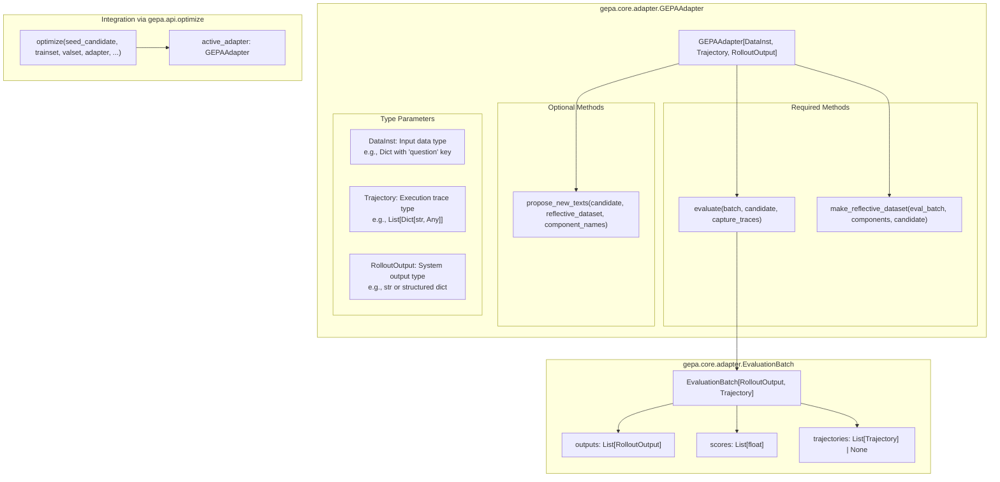
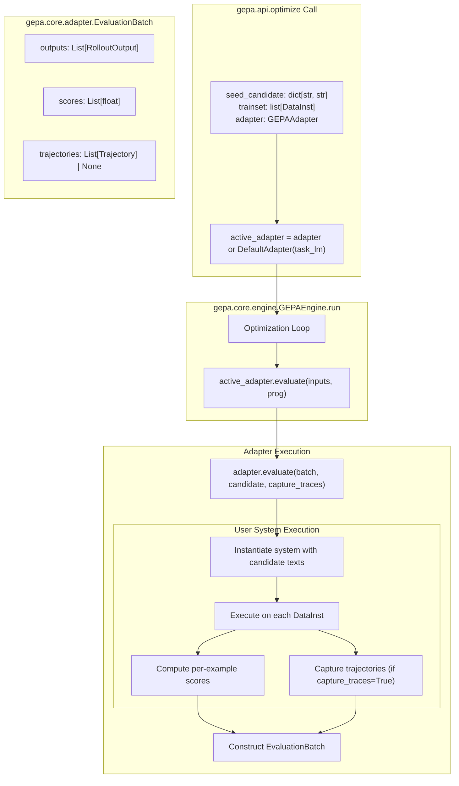
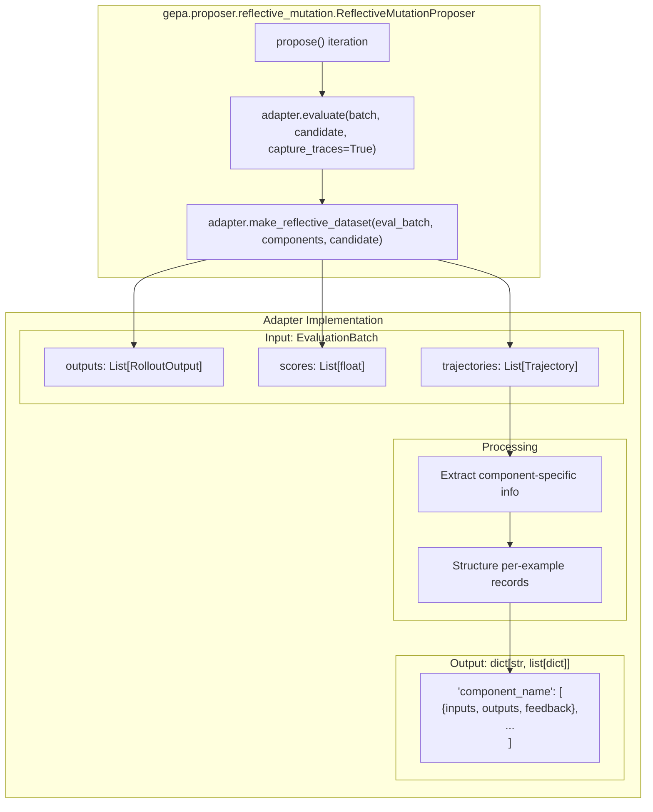
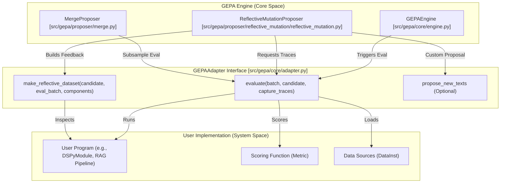
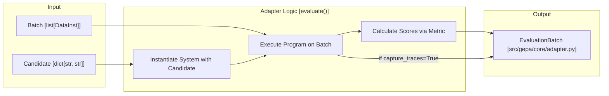
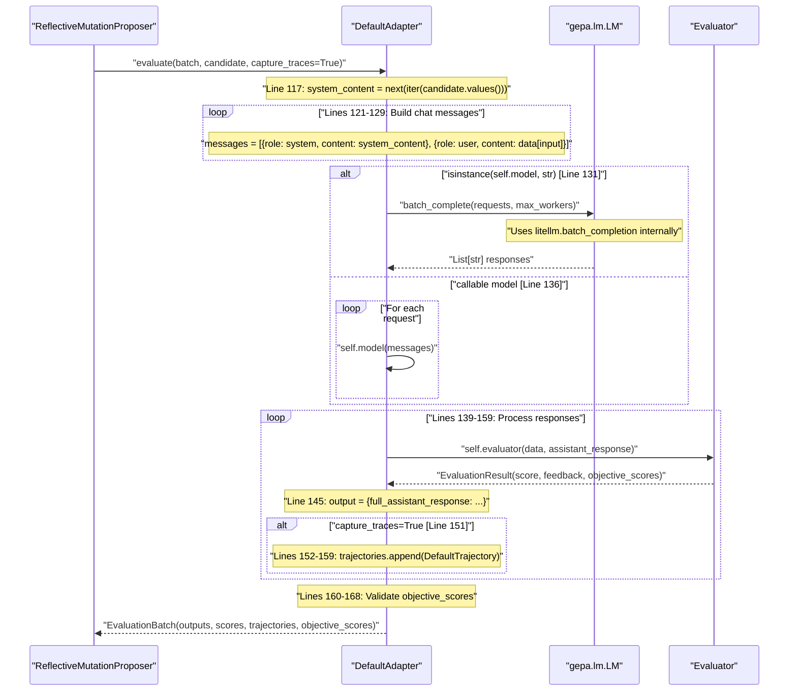
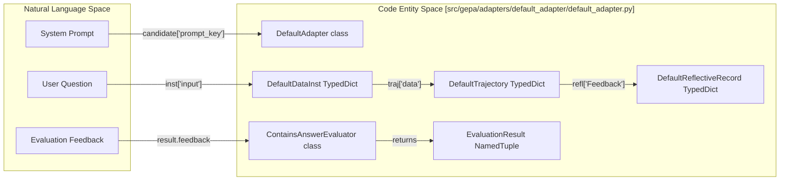

The Adapter System is GEPA's primary integration mechanism that enables the framework to optimize textual components in diverse external systems. The `GEPAAdapter` protocol defines a standardized interface for connecting GEPA's optimization engine with user-defined programs, whether they are simple LLM prompts, complex DSPy programs, RAG pipelines, or multi-turn agentic systems.

This page covers the core `GEPAAdapter` protocol, evaluation mechanisms, reflective dataset construction, and instruction proposal strategies. For specific adapter implementations, see the child pages listed below.

**Sources:** [src/gepa/core/adapter.py:49-172](), [src/gepa/api.py:1-349](), [src/gepa/adapters/README.md:1-13]()

## GEPAAdapter Protocol Definition

The `GEPAAdapter` protocol is a generic protocol parameterized by three user-defined types that remain opaque to GEPA's core engine. This design enables type-safe integration with arbitrary external systems.

### Protocol Type Parameters and Core Interface



**Sources:** [src/gepa/core/adapter.py:49-172](), [src/gepa/api.py:155-166](), [src/gepa/api.py:310-312]()

The protocol defines three responsibilities:

### Required: evaluate()

Executes a candidate program on a batch of data instances. Returns an `EvaluationBatch` containing per-example outputs, scores, and optional execution traces. For details, see [GEPAAdapter Interface](#5.1).

**Sources:** [src/gepa/core/adapter.py:97-135]()

### Required: make_reflective_dataset()

Transforms execution trajectories into JSON-serializable feedback for the reflection LM. Returns a dictionary mapping component names to lists of feedback records. For details, see [GEPAAdapter Interface](#5.1).

**Sources:** [src/gepa/core/adapter.py:137-169]()

### Optional: propose_new_texts()

Provides custom instruction proposal logic. If not implemented, GEPA uses the default reflective mutation proposer. For details, see [Creating Custom Adapters](#5.10).

**Sources:** [src/gepa/core/adapter.py:171](), [src/gepa/api.py:209-213]()

## Evaluation Flow and EvaluationBatch Structure

The evaluation system centers around the `EvaluationBatch` dataclass defined in [src/gepa/core/adapter.py:12-28](). This dataclass encapsulates all results from executing a candidate program on a batch of data.

### Evaluation Data Flow Through GEPA Engine



**Sources:** [src/gepa/api.py:155-166](), [src/gepa/core/adapter.py:12-28](), [src/gepa/core/adapter.py:97-135]()

## Reflective Dataset Construction

The `make_reflective_dataset()` method transforms execution traces into structured feedback that drives the reflective mutation process. This bridges system execution and LLM-based instruction refinement.

### Reflective Dataset Flow



**Sources:** [src/gepa/core/adapter.py:137-169]()

## Adapter Ecosystem

GEPA provides several built-in adapters for common use cases and framework integrations.

### Built-in Adapters

- **[GEPAAdapter Interface](#5.1)**: The base protocol for all adapters.
- **[DefaultAdapter](#5.2)**: Integrates GEPA into single-turn LLM environments for optimizing system prompts.
- **[OptimizeAnythingAdapter](#5.3)**: A universal adapter for optimizing arbitrary text artifacts like code or configs.
- **[DSPy Integration](#5.4)**: Optimizes signature instructions for [DSPy](https://dspy.ai/) modules.
- **[DSPy Full Program Evolution](#5.5)**: Deep integration for evolving entire DSPy programs, including tool modules and control flow.
- **[MCP Adapter](#5.6)**: Optimizes Model Context Protocol tool descriptions and system prompts.
- **[Generic RAG Adapter](#5.7)**: Optimizes prompt templates across different stages of a RAG pipeline (retrieval, reranking, synthesis).
- **[AnyMaths Adapter](#5.8)**: Specialized for mathematical problem-solving and reasoning tasks.
- **[Confidence Adapter](#5.9)**: Uses token-level logprobs to detect "lucky guesses" in classification tasks.

**Sources:** [src/gepa/adapters/README.md:1-13](), [src/gepa/adapters/generic_rag_adapter/rag_pipeline.py:9-92]()

### Integration with External Systems

The `GenericRAGAdapter` demonstrates how GEPA can interface with external infrastructure like vector stores through the `VectorStoreInterface` [src/gepa/adapters/generic_rag_adapter/vector_store_interface.py:8-35](). This allows the same optimization logic to be applied to systems backed by ChromaDB, Pinecone, or other retrieval backends. The `RAGPipeline` class [src/gepa/adapters/generic_rag_adapter/rag_pipeline.py:9-19]() orchestrates the flow from query reformulation to answer generation, allowing GEPA to optimize components at each stage.

**Sources:** [src/gepa/adapters/generic_rag_adapter/vector_store_interface.py:8-35](), [src/gepa/adapters/generic_rag_adapter/rag_pipeline.py:9-92]()

## Custom Adapters

For systems that do not fit the built-in patterns, users can implement the `GEPAAdapter` protocol. This requires defining custom types for `DataInst`, `Trajectory`, and `RolloutOutput` and implementing the evaluation and reflection logic. For a step-by-step guide, see **[Creating Custom Adapters](#5.10)**.

**Sources:** [src/gepa/core/adapter.py:49-172](), [docs/docs/guides/adapters.md:1-240]()

# GEPAAdapter Interface


The `GEPAAdapter` protocol is the primary integration point between the GEPA optimization engine and any external system. It defines a standardized contract that allows GEPA to optimize arbitrary text-parameterized systems—such as LLM prompts, DSPy programs, or configuration files—without requiring changes to the core engine.

---

## Protocol Definition

The `GEPAAdapter` protocol is defined in [src/gepa/core/adapter.py:59-181]() as a `Protocol[DataInst, Trajectory, RolloutOutput]`. It uses three generic type parameters that remain opaque to the GEPA engine but are essential for the adapter's internal logic.

### Core Responsibilities
An adapter implementation must handle three main tasks:
1.  **Program Evaluation**: Execute a candidate program on a batch of data and return performance metrics via the `evaluate` method [src/gepa/core/adapter.py:72-75]().
2.  **Reflective Dataset Construction**: Transform execution traces into structured feedback for the reflection LM via `make_reflective_dataset` [src/gepa/core/adapter.py:77-80]().
3.  **Instruction Proposal (Optional)**: Provide custom logic for generating new component texts, overriding the default LLM-based proposer via `propose_new_texts` [src/gepa/core/adapter.py:82-87]().

Sources: [src/gepa/core/adapter.py:59-181]()

---

## Architecture and Code Entity Mapping

The following diagram bridges the conceptual "Natural Language Space" (where prompts are optimized) to the "Code Entity Space" by showing how GEPA engine components interact with the `GEPAAdapter` methods.

**System Interaction Map**

Sources: [src/gepa/core/adapter.py:59-87](), [src/gepa/core/adapter.py:121-144]()

---

## Generic Type Parameters

The protocol is generic over three types that define the data flow within the adapter:

| Type Parameter | Code Reference | Description | Examples |
| :--- | :--- | :--- | :--- |
| `DataInst` | [src/gepa/core/adapter.py:11]() | The input data type for the task. | `dict`, `str`, `dspy.Example` |
| `Trajectory` | [src/gepa/core/adapter.py:10]() | Captured intermediate state or execution steps. | `list[dict]`, `TraceData`, `stdout` logs |
| `RolloutOutput` | [src/gepa/core/adapter.py:9]() | The raw output produced by the candidate program. | `str`, `Prediction` object |

Sources: [src/gepa/core/adapter.py:9-12](), [src/gepa/core/adapter.py:59-70]()

---

## Method: `evaluate()`

```python
def evaluate(
    self,
    batch: list[DataInst],
    candidate: dict[str, str],
    capture_traces: bool = False,
) -> EvaluationBatch[Trajectory, RolloutOutput]:
```

The `evaluate` method executes the program defined by the `candidate` mapping (component name → text) on a `batch` of inputs [src/gepa/core/adapter.py:121-133]().

### The `EvaluationBatch` Container
The result must be wrapped in an `EvaluationBatch` object [src/gepa/core/adapter.py:15-35]():
*   **`outputs`**: List of `RolloutOutput` (one per input) [src/gepa/core/adapter.py:31-31]().
*   **`scores`**: List of `float` (higher is better) [src/gepa/core/adapter.py:32-32]().
*   **`trajectories`**: Optional list of `Trajectory`. Must be provided if `capture_traces=True` [src/gepa/core/adapter.py:33-33]().
*   **`objective_scores`**: Optional list of dictionaries for multi-objective optimization (name -> score) [src/gepa/core/adapter.py:34-34]().

### Data Flow for Evaluation

Sources: [src/gepa/core/adapter.py:15-35](), [src/gepa/core/adapter.py:121-144]()

---

## Method: `make_reflective_dataset()`

```python
def make_reflective_dataset(
    self,
    candidate: dict[str, str],
    eval_batch: EvaluationBatch[Trajectory, RolloutOutput],
    components_to_update: list[str],
) -> Mapping[str, Sequence[Mapping[str, Any]]]:
```

This method converts raw `trajectories` and `outputs` into a "reflective dataset"—a JSON-serializable format that the reflection LM uses to understand why a candidate performed well or poorly [src/gepa/core/adapter.py:146-161]().

### Contract Requirements
*   **Structure**: Returns a mapping where keys are component names and values are lists of example records [src/gepa/core/adapter.py:77-80]().
*   **Record Schema**: Records are typically mappings of strings to any serializable data (e.g., input, output, trace feedback) [src/gepa/core/adapter.py:167-173]().
*   **Trace Usage**: The engine calls this when `capture_traces=True` was passed to `evaluate()` to build context for mutation [src/gepa/core/adapter.py:135-137]().

Sources: [src/gepa/core/adapter.py:146-178]()

---

## Optional Method: `propose_new_texts()`

Adapters can optionally implement a `propose_new_texts` method to override GEPA's default instruction proposal logic [src/gepa/core/adapter.py:82-87](). This is useful for:
*   **Coupled Updates**: Updating multiple components that depend on each other [src/gepa/core/adapter.py:51-51]().
*   **Custom Models**: Using a specific LLM or prompting strategy for the reflection step [src/gepa/core/adapter.py:49-50]().

The engine detects this method via the `ProposalFn` protocol [src/gepa/core/adapter.py:38-56]().

Sources: [src/gepa/core/adapter.py:38-56](), [src/gepa/core/adapter.py:82-87]()

---

## Adapter State Persistence

Adapters that maintain internal state (e.g., dynamic validation sets) can implement two optional methods for persistence during checkpointing [src/gepa/core/adapter.py:88-91]():

1.  **`get_adapter_state() -> dict[str, Any]`**: Returns a fresh dictionary of adapter-specific state to be snapshotted [src/gepa/core/adapter.py:92-95]().
2.  **`set_adapter_state(state: dict[str, Any]) -> None`**: Restores previously persisted state into the adapter upon resume [src/gepa/core/adapter.py:96-97]().

The engine detects these methods via duck typing and skips them if not implemented [src/gepa/core/adapter.py:99-101]().

Sources: [src/gepa/core/adapter.py:88-101](), [tests/test_state.py:118-158]()

---

## Implementation Constraints

*   **Scoring**: GEPA assumes higher scores are better. It uses `sum(scores)` for minibatch acceptance and `mean(scores)` for validation tracking [src/gepa/core/adapter.py:104-107]().
*   **Error Handling**: Adapters should not raise exceptions for individual example failures. Instead, they should return a valid `EvaluationBatch` with failure scores (e.g., 0.0) and include the error message in the `Trajectory` [src/gepa/core/adapter.py:112-115]().
*   **Exceptions**: Reserve exceptions for unrecoverable systemic failures (e.g., misconfigured program) [src/gepa/core/adapter.py:116-118]().

Sources: [src/gepa/core/adapter.py:102-119]()

# DefaultAdapter


The `DefaultAdapter` is the simplest concrete implementation of the [GEPAAdapter Interface](#5.1), designed for optimizing system prompts in single-turn LLM tasks. It enables GEPA to evolve textual instructions that guide a language model's behavior on straightforward question-answering or text generation tasks where each input produces a single output.

For optimizing multi-turn conversations, agent systems, or complex programs with control flow, see [DSPy Integration](#5.4), [DSPy Full Program Evolution](#5.5), or [Creating Custom Adapters](#5.10).

---

## Purpose and Scope

`DefaultAdapter` is a concrete implementation of the `GEPAAdapter` protocol for optimizing system prompts in single-turn LLM tasks. It provides a zero-configuration entry point for prompt optimization by handling:

- Execution of candidate system prompts via LiteLLM or custom callables [src/gepa/adapters/default_adapter/default_adapter.py:131-137]()
- Evaluation using configurable evaluators (default: `ContainsAnswerEvaluator`) [src/gepa/adapters/default_adapter/default_adapter.py:102]()
- Trajectory capture for reflective learning [src/gepa/adapters/default_adapter/default_adapter.py:151-159]()
- Reflective dataset construction for LLM-based prompt improvement [src/gepa/adapters/default_adapter/default_adapter.py:176-209]()

**Use DefaultAdapter when:**
- Optimizing a single system message for chat-based LLM APIs.
- Task requires one LLM invocation per input (QA, classification, generation).
- Input data has `input`, `answer`, and optionally `additional_context` fields.
- Simple string-matching or custom evaluation is sufficient.

**Sources:** [src/gepa/adapters/default_adapter/default_adapter.py:87-102]()

---

## Data Structures

### DefaultDataInst

The `DefaultDataInst` TypedDict defines the expected structure for input data instances:

```python
class DefaultDataInst(TypedDict):
    input: str
    additional_context: dict[str, str]
    answer: str
```

| Field | Type | Description |
|-------|------|-------------|
| `input` | `str` | The main input text (question, prompt, etc.) |
| `additional_context` | `dict[str, str]` | Optional metadata available during evaluation |
| `answer` | `str` | Expected answer for evaluation |

**Sources:** [src/gepa/adapters/default_adapter/default_adapter.py:11-14]()

### DefaultTrajectory

Trajectories capture execution traces when `capture_traces=True`:

```python
class DefaultTrajectory(TypedDict):
    data: DefaultDataInst
    full_assistant_response: str
    feedback: str
```

**Sources:** [src/gepa/adapters/default_adapter/default_adapter.py:23-27]()

### DefaultRolloutOutput

The output structure returned for each example:

```python
class DefaultRolloutOutput(TypedDict):
    full_assistant_response: str
```

**Sources:** [src/gepa/adapters/default_adapter/default_adapter.py:29-31]()

### DefaultReflectiveRecord

Structure of records in the reflective dataset:

```python
DefaultReflectiveRecord = TypedDict(
    "DefaultReflectiveRecord",
    {
        "Inputs": str,
        "Generated Outputs": str,
        "Feedback": str,
    },
)
```

**Sources:** [src/gepa/adapters/default_adapter/default_adapter.py:33-40]()

---

## Constructor and Configuration

### DefaultAdapter Constructor

```python
def __init__(
    self,
    model: str | ChatCompletionCallable,
    evaluator: Evaluator | None = None,
    max_litellm_workers: int = 10,
    litellm_batch_completion_kwargs: dict[str, Any] | None = None,
)
```

| Parameter | Type | Default | Description |
|-----------|------|---------|-------------|
| `model` | `str \| ChatCompletionCallable` | (required) | LiteLLM model string or custom callable |
| `evaluator` | `Evaluator \| None` | `ContainsAnswerEvaluator()` | Callable that returns `EvaluationResult` |
| `max_litellm_workers` | `int` | `10` | Parallel workers for LiteLLM |
| `litellm_batch_completion_kwargs` | `dict[str, Any] \| None` | `{}` | Kwargs for `litellm.batch_completion()` |

**Sources:** [src/gepa/adapters/default_adapter/default_adapter.py:88-102]()

---

## Evaluator System

### Evaluator Protocol

The `Evaluator` protocol defines the interface for scoring model responses. It returns an `EvaluationResult` which includes the score, textual feedback, and optional multi-objective scores.

```python
class Evaluator(Protocol):
    def __call__(self, data: DefaultDataInst, response: str) -> EvaluationResult:
        """
        Evaluates a response and returns a score, feedback, and optional objective scores.
        """
        ...
```

**Sources:** [src/gepa/adapters/default_adapter/default_adapter.py:55-60]()

### ContainsAnswerEvaluator

The default evaluator performs exact substring matching to determine correctness. If the `answer` string from the `DefaultDataInst` is found anywhere in the LLM's response, the score is 1.0; otherwise, it is `failure_score`.

```python
class ContainsAnswerEvaluator:
    def __init__(self, failure_score: float = 0.0):
        self.failure_score = failure_score

    def __call__(self, data: DefaultDataInst, response: str) -> EvaluationResult:
        is_correct = data["answer"] in response
        score = 1.0 if is_correct else self.failure_score
        # ... generates feedback message
```

**Sources:** [src/gepa/adapters/default_adapter/default_adapter.py:63-84]()

---

## evaluate() Method

The `evaluate()` method executes the candidate system prompt on a batch of data instances. It handles message construction, parallel LLM calls via `LM.batch_complete`, and scoring via the configured evaluator.

### Execution Flow



**Sources:** [src/gepa/adapters/default_adapter/default_adapter.py:106-174](), [src/gepa/lm.py:95-125]()

---

## make_reflective_dataset() Method

Constructs a reflective dataset from evaluation trajectories. This dataset is passed to the reflection LLM to generate improved instructions based on specific failures and successes.

### Implementation

```python
# Line 184: Enforce single component
assert len(components_to_update) == 1
comp = components_to_update[0]

# Line 187: Require trajectories
trajectories = eval_batch.trajectories
assert trajectories is not None

items: list[DefaultReflectiveRecord] = []

# Lines 192-200: Build reflective records
for traj in trajectories:
    d: DefaultReflectiveRecord = {
        "Inputs": traj["data"]["input"],
        "Generated Outputs": traj["full_assistant_response"],
        "Feedback": traj["feedback"],
    }
    items.append(d)

# Line 201: Map component to records
ret_d[comp] = items
```

**Sources:** [src/gepa/adapters/default_adapter/default_adapter.py:176-209]()

---

## Component Mapping

The following diagram maps the logical entities of the `DefaultAdapter` to their specific code definitions.



**Sources:** [src/gepa/adapters/default_adapter/default_adapter.py:11-102](), [src/gepa/adapters/default_adapter/default_adapter.py:176-209]()

---

## Usage Example: AIME Prompt Optimization

The `DefaultAdapter` is used in the AIME example to optimize a single system prompt for math problems.

```python
import gepa
from gepa.adapters.default_adapter.default_adapter import DefaultAdapter

# Initial seed candidate
seed_prompt = {
    "system_prompt": "You are a math expert. Solve the problem and put the answer in ### <answer> format."
}

# The engine uses DefaultAdapter by default if task_lm is provided
gepa_result = gepa.optimize(
    seed_candidate=seed_prompt,
    trainset=trainset,
    valset=valset,
    task_lm="openai/gpt-4o-mini",
    reflection_lm="openai/gpt-4o",
)
```

**Sources:** [src/gepa/adapters/default_adapter/default_adapter.py:87-102](), [src/gepa/optimize.py:13-64]()