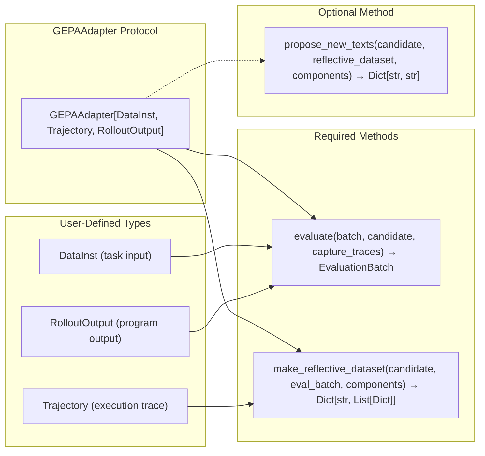
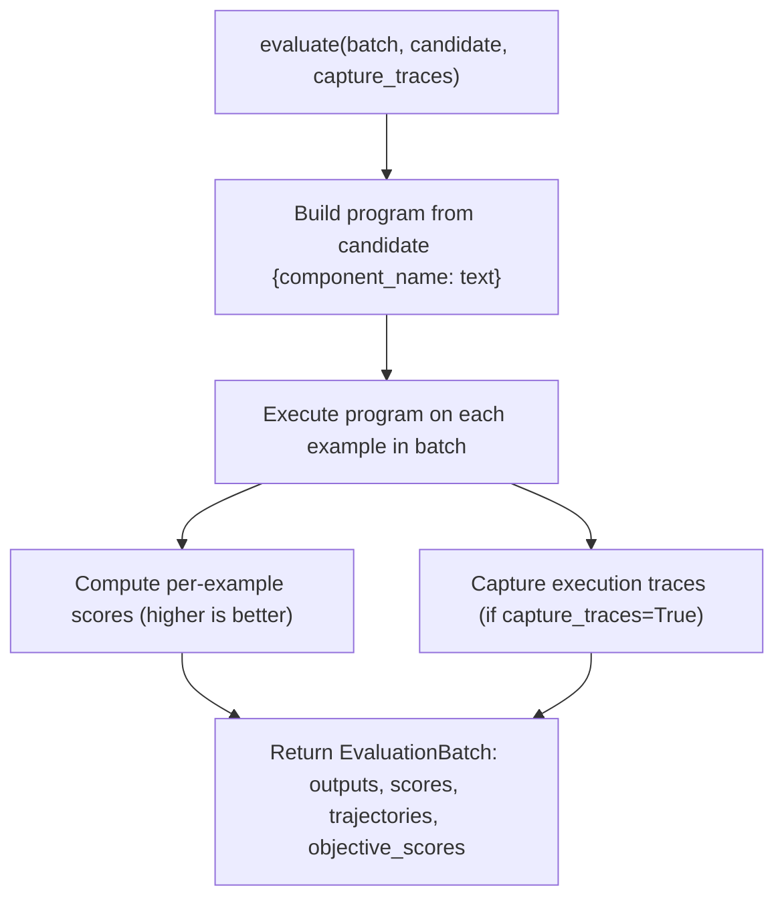
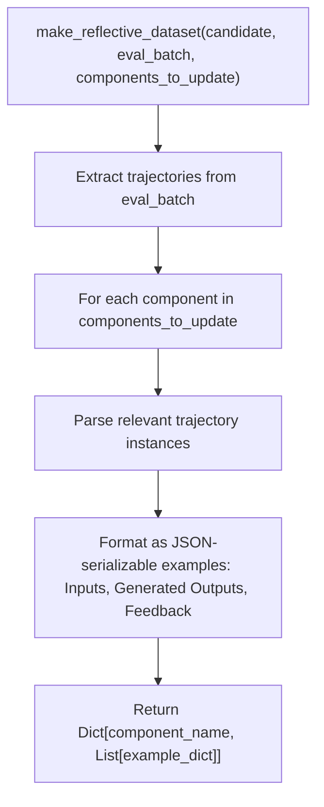
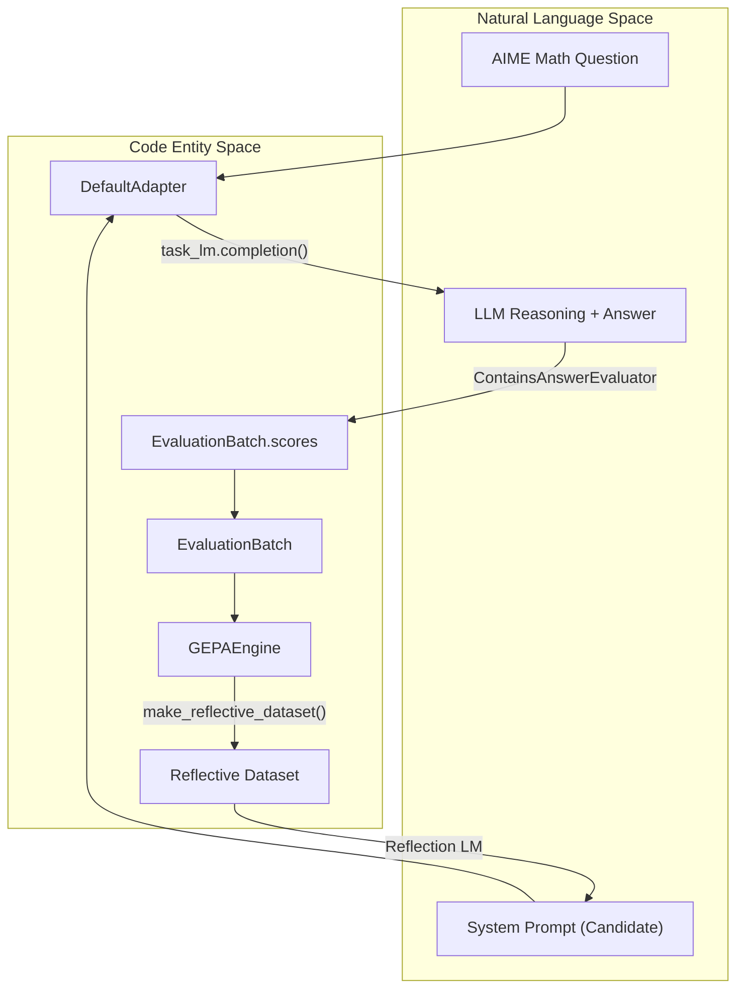

This page documents the **GEPAAdapter protocol** — the single integration point between GEPA's optimization engine and any system you want to optimize. The adapter pattern enables GEPA to optimize diverse systems (prompts, DSPy programs, MCP tools, arbitrary code, agent architectures) without modifying core engine logic.

**Scope**: This page covers the adapter interface contract, built-in adapter implementations, and guidelines for creating custom adapters.

---

## The Adapter Pattern in GEPA

Adapters bridge the GEPA optimization engine to domain-specific systems by translating between:

1. **System execution** → **evaluation metrics** (via `evaluate()`)
2. **Execution traces** → **reflective datasets** for LLM feedback (via `make_reflective_dataset()`)
3. **Reflection feedback** → **new candidate text** (optionally via `propose_new_texts()`)

The engine never directly interprets your system's inputs, outputs, or execution traces. Instead, it calls adapter methods and consumes standardized return types (`EvaluationBatch`, reflective dataset dictionaries), enabling universal optimization across domains. [[src/gepa/core/adapter.py:59-119]]()

**Key insight**: By implementing three methods, you plug any text-parameterized system into GEPA's evolutionary search loop. [[src/gepa/core/adapter.py:71-100]]()

---

## GEPAAdapter Protocol

The `GEPAAdapter` protocol is defined as a generic interface parameterized by three user-defined types: [[src/gepa/core/adapter.py:59-181]]()



**Sources**: [[src/gepa/core/adapter.py:58-181]]()

### Type Parameters

| Type Parameter | Purpose | Examples |
|----------------|---------|----------|
| `DataInst` | Input data format for a single evaluation example | `DefaultDataInst`, `DSPy.Example`, MCP task spec |
| `Trajectory` | Execution trace structure capturing intermediate states | `DefaultTrajectory`, `DSPyTrace`, ASI logs |
| `RolloutOutput` | Program output format | `DefaultRolloutOutput`, `DSPy.Prediction`, JSON results |

These types are opaque to GEPA — the engine never inspects them. They exist solely for your adapter to consume and produce. [[src/gepa/core/adapter.py:8-12]]()

**Sources**: [[src/gepa/core/adapter.py:8-12]]()

---

## The Three Adapter Responsibilities

### 1. Program Evaluation: `evaluate()`

```python
def evaluate(
    self,
    batch: list[DataInst],
    candidate: dict[str, str],
    capture_traces: bool = False,
) -> EvaluationBatch[Trajectory, RolloutOutput]
```

**Contract**: [[src/gepa/core/adapter.py:121-144]]()
- **Input**: A batch of task inputs (`DataInst`), a candidate program (dict mapping component names to text), and a flag indicating whether to capture execution traces.
- **Output**: `EvaluationBatch` with per-example outputs, scores, optional trajectories, and optional objective scores.
- **Semantics**: 
  - Scores are **higher-is-better** floats. [[src/gepa/core/adapter.py:104-107]]()
  - The engine uses `sum(scores)` for minibatch acceptance, `mean(scores)` for validation tracking.
  - When `capture_traces=True`, populate `trajectories` list (aligned with `outputs` and `scores`). [[src/gepa/core/adapter.py:134-137]]()
  - When `capture_traces=False`, set `trajectories=None` to save memory.

**Error Handling**: Never raise exceptions for individual example failures. Return a valid `EvaluationBatch` with failure scores (e.g., 0.0). Reserve exceptions for systemic failures (missing model, schema mismatch). [[src/gepa/core/adapter.py:112-118]]()



**Sources**: [[src/gepa/core/adapter.py:106-144]]()

---

### 2. Reflective Dataset Construction: `make_reflective_dataset()`

```python
def make_reflective_dataset(
    self,
    candidate: dict[str, str],
    eval_batch: EvaluationBatch[Trajectory, RolloutOutput],
    components_to_update: list[str],
) -> Mapping[str, Sequence[Mapping[str, Any]]]
```

**Contract**: [[src/gepa/core/adapter.py:146-178]]()
- **Input**: The evaluated candidate, the `EvaluationBatch` from `evaluate(..., capture_traces=True)`, and a list of component names to update.
- **Output**: A dict mapping each component name to a list of JSON-serializable example dicts.
- **Semantics**: Extract high-signal feedback from trajectories to guide LLM reflection. Each example should contain inputs, outputs, and diagnostic feedback.



**Sources**: [[src/gepa/core/adapter.py:146-178]]()

---

### 3. Custom Instruction Proposal (Optional): `propose_new_texts()`

```python
propose_new_texts: ProposalFn | None = None
```

**Contract**: [[src/gepa/core/adapter.py:38-56]]()
- **Input**: Current candidate, reflective dataset (from `make_reflective_dataset()`), components to update.
- **Output**: Dict mapping component names to new proposed text.
- **Semantics**: Override GEPA's default LLM-based proposal to implement domain-specific logic. [[src/gepa/core/adapter.py:82-87]]()

**Default behavior**: If `propose_new_texts` is `None`, GEPA uses `InstructionProposalSignature` to generate new text via the reflection LLM. [[src/gepa/core/adapter.py:82-84]]()

**Sources**: [[src/gepa/core/adapter.py:37-56]](), [[src/gepa/core/adapter.py:180]]()

---

## EvaluationBatch Structure

The `EvaluationBatch` dataclass standardizes evaluation results across all adapters: [[src/gepa/core/adapter.py:15-36]]()

```python
@dataclass
class EvaluationBatch(Generic[Trajectory, RolloutOutput]):
    outputs: list[RolloutOutput]
    scores: list[float]
    trajectories: list[Trajectory] | None = None
    objective_scores: list[dict[str, float]] | None = None
    num_metric_calls: int | None = None
```

| Field | Type | Required | Purpose |
|-------|------|----------|---------|
| `outputs` | `list[RolloutOutput]` | Yes | Per-example program outputs. [[src/gepa/core/adapter.py:31]]() |
| `scores` | `list[float]` | Yes | Per-example numeric scores (higher is better). [[src/gepa/core/adapter.py:32]]() |
| `trajectories` | `list[Trajectory] \| None` | Conditional | Must be provided when `capture_traces=True`. [[src/gepa/core/adapter.py:33]]() |
| `objective_scores` | `list[dict[str, float]] \| None` | Optional | Multi-objective metrics for Pareto tracking. [[src/gepa/core/adapter.py:34]]() |

**Sources**: [[src/gepa/core/adapter.py:15-36]]()

---

## Built-in Adapters

GEPA provides several specialized adapters: [[src/gepa/adapters/README.md:7-12]]()

- **DefaultAdapter**: Integrates GEPA into single-turn LLM environments for system prompt optimization. [[src/gepa/adapters/README.md:9]]()
- **DSPyAdapter**: Integrates GEPA into DSPy to optimize signature instructions. [[src/gepa/adapters/README.md:8]]()
- **AnyMathsAdapter**: Integrates with litellm and ollama for mathematical problem solving. [[src/gepa/adapters/README.md:10]]()

**Sources**: [[src/gepa/adapters/README.md:1-13]]()

---

## Integration Example: AIME Prompt Optimization

The following diagram illustrates how `DefaultAdapter` bridges the Natural Language space of mathematical problem solving to the Code Entity space of the `GEPAEngine`.



**Sources**: [[tests/test_aime_prompt_optimization/test_aime_prompt_optimize.py:25-50]](), [[src/gepa/core/adapter.py:15-36]]()

---

## State Persistence

Adapters can optionally persist internal state across resume boundaries by implementing: [[src/gepa/core/adapter.py:88-101]]()

- `get_adapter_state() -> dict[str, Any]`: Snapshots adapter state into checkpoints.
- `set_adapter_state(state: dict[str, Any]) -> None`: Restores state upon resumption.

The `GEPAState` class manages the serialization of these snapshots using either standard `pickle` or `cloudpickle`. [[tests/test_state.py:89-116]]()

**Sources**: [[src/gepa/core/adapter.py:88-101]](), [[tests/test_state.py:89-116]]()