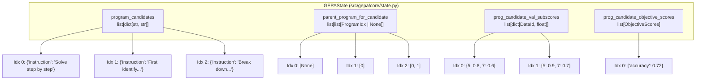

## Purpose and Scope

This page explains the fundamental data structures that GEPA optimizes: **candidates** and their constituent **text components**. These concepts form the core representation of any system being optimized by GEPA, whether it's a simple prompt, a multi-stage RAG pipeline, or a complex agentic system.

For information about how candidates are evaluated and scored, see [Adapters and System Integration](). For details on how GEPA tracks and persists candidate history, see [State Management and Persistence]().

---

## What is a Candidate?

A **candidate** is a concrete configuration of a system, represented as a dictionary mapping component names to text values:

```python
candidate: dict[str, str]
```

Each candidate represents a complete instantiation of the system being optimized. When GEPA evaluates a candidate, it passes this dictionary to the adapter, which uses the text values to configure the actual system components.

**Example - Simple prompt optimization:**
```python
seed_candidate = {
    "instruction": "Solve the following math problem step by step."
}
```

**Example - Multi-component RAG system:**
```python
seed_candidate = {
    "query_rewriter": "Rewrite the user query to be more specific...",
    "context_synthesis": "Synthesize the following passages into a coherent summary...",
    "answer_generator": "Based on the context, provide a detailed answer..."
}
```

**Example - DSPy program with multiple predictors:**
```python
seed_candidate = {
    "generate_query": "signature and docstring for query generation",
    "answer_question": "signature and docstring for answer generation"
}
```

Sources: [src/gepa/core/state.py:157](), [src/gepa/proposer/merge.py:9](), [src/gepa/core/result.py:41]()

---

## Text Components

**Text components** are the named parts of a system that GEPA optimizes. Each key in a candidate dictionary represents a text component, and its value is the text that configures that component.

### Component Naming

Component names (dictionary keys) identify which part of the system the text belongs to. The naming convention depends on the system being optimized:

| System Type | Example Component Names | What They Represent |
|------------|------------------------|---------------------|
| Single-turn LLM | `"instruction"`, `"prompt"` | The main prompt text |
| RAG System | `"query_rewriter"`, `"context_synthesis"`, `"answer_generator"` | Different stages of the pipeline |
| DSPy Program | `"generate_query"`, `"answer_question"` | Individual DSPy predictors/modules |
| Agent System | `"system_prompt"`, `"tool_use_instructions"` | System configuration and behavior rules |

The adapter implementation determines which component names are valid and how they map to the actual system. GEPA treats component names as opaque strings and relies on the adapter to interpret them.

Sources: [src/gepa/core/state.py:169](), [src/gepa/proposer/merge.py:159-162]()

### Component Values

Component values (dictionary values) contain the actual text that configures the system. These can be:

- **Prompts or instructions**: Natural language text guiding LLM behavior.
- **Signatures**: DSPy-style input/output specifications.
- **Templates**: Structured text with placeholders.
- **Code snippets**: For systems that optimize code.
- **Configuration strings**: Any text-based system parameter.

GEPA evolves these text values through reflection and mutation to improve system performance.

Sources: [src/gepa/core/state.py:157](), [src/gepa/proposer/reflective_mutation/base.py:23]()

---

## The Seed Candidate

Every GEPA optimization begins with a **seed candidate** - the initial configuration from which all evolution starts. The seed candidate is evaluated on the validation set at initialization and becomes program index 0 in the state's candidate pool.

**Index 0 is always the seed candidate** - initialized in `GEPAState.__init__` at [src/gepa/core/state.py:195-199]().

Sources: [src/gepa/core/state.py:195-199](), [src/gepa/core/result.py:61-62]()

---

## Candidate Representation in State

### Storage Structure

Candidates are stored as parallel arrays in `GEPAState`, where each index across all arrays represents the same candidate:

**Parallel Array Storage in GEPAState**



**Parallel Array Fields** (from [src/gepa/core/state.py:157-160]()):

| Field | Type | Content |
|-------|------|---------|
| `program_candidates` | `list[dict[str, str]]` | The candidate dictionaries themselves |
| `parent_program_for_candidate` | `list[list[ProgramIdx \| None]]` | Parent indices (None for seed) |
| `prog_candidate_val_subscores` | `list[dict[DataId, float]]` | Sparse validation scores per example |
| `prog_candidate_objective_scores` | `list[ObjectiveScores]` | Aggregated scores per objective |

Each candidate has a unique **program index** (`ProgramIdx`, defined at [src/gepa/core/state.py:18]()) that serves as its identifier throughout optimization. The index is immutable - candidate 0 is always the seed, candidate 1 is always the first evolved program, etc.

Sources: [src/gepa/core/state.py:157-160](), [src/gepa/core/state.py:18](), [src/gepa/core/state.py:195-206]()

### Component List Tracking

The `list_of_named_predictors` field (at [src/gepa/core/state.py:169]()) maintains the canonical list of component names:

```python
self.list_of_named_predictors = list(seed_candidate.keys())
```

This ensures consistent component tracking across all candidates. When a new candidate is created, it must contain the same component names (though values may differ).

Sources: [src/gepa/core/state.py:169](), [src/gepa/proposer/merge.py:159-162]()

---

## Candidate Immutability and Copying

Candidates follow an immutability pattern - they are never modified in place. When proposing a new candidate, GEPA creates copies:

**Merge Proposer** ([src/gepa/proposer/merge.py:155]()):
```python
new_program: Candidate = deepcopy(program_candidates[ancestor])